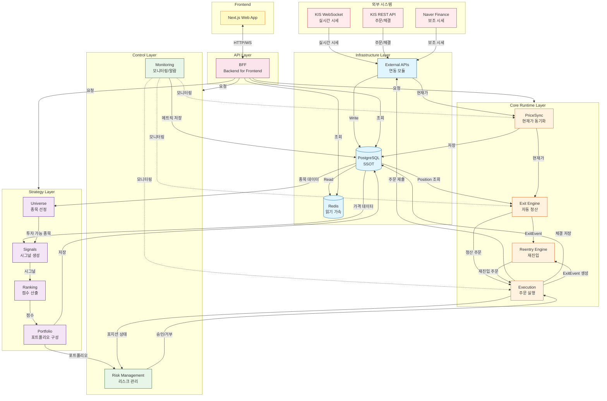
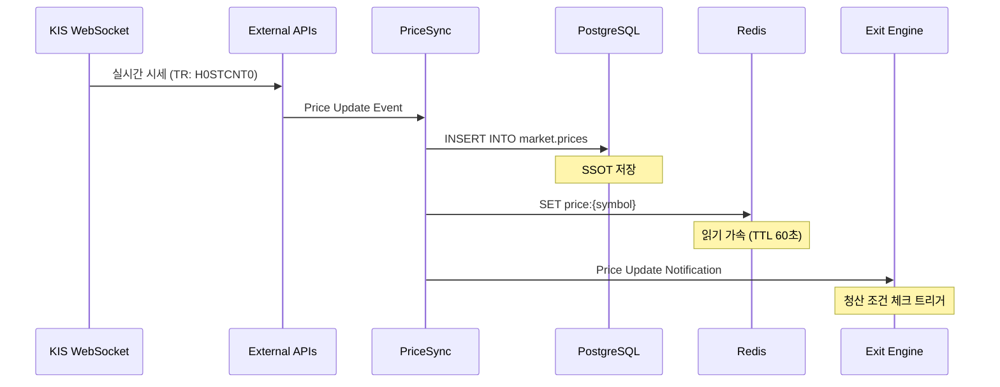
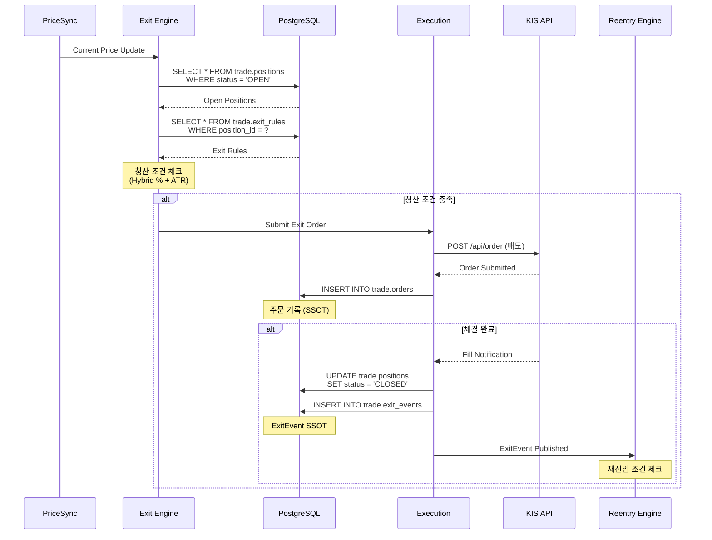
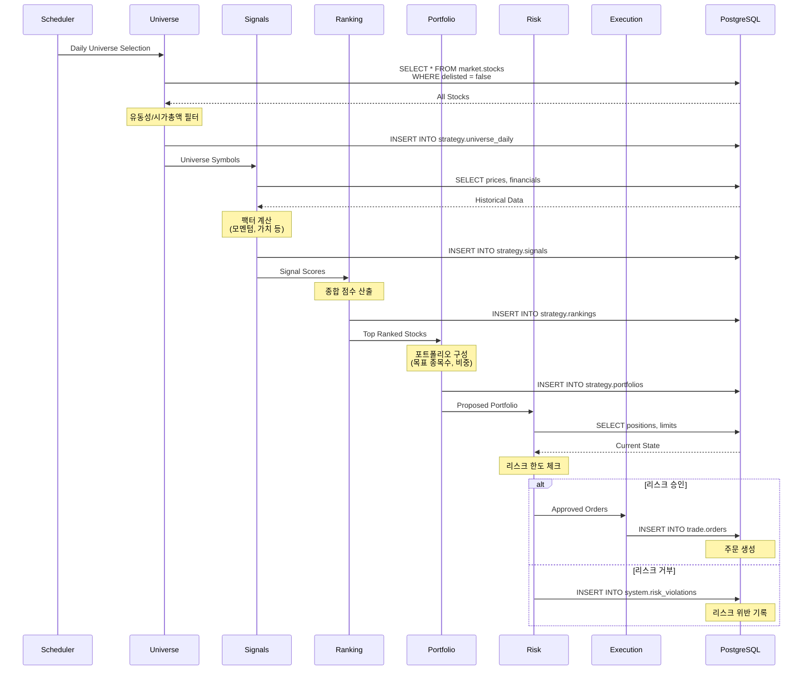

# 데이터 흐름 설계 (Data Flow Design)

> v14 시스템의 전체 데이터 흐름을 정의합니다.

**Last Updated**: 2026-01-14

---

## 📋 개요

이 문서는 **v14 시스템의 데이터 흐름 SSOT**입니다.

### 목적
- 전체 시스템의 데이터 흐름 시각화
- 각 레이어 간 데이터 전달 방식 정의
- SSOT(Single Source of Truth) 기준 명확화
- 데이터 정합성 보장 메커니즘

---

## 🌊 전체 시스템 데이터 흐름

### High-Level Overview



---

## 🔄 주요 데이터 흐름 시나리오

### 1. 실시간 시세 동기화 흐름



**SSOT**: PostgreSQL `market.prices`
- 모든 가격 데이터는 PostgreSQL에 먼저 저장
- Redis는 읽기 가속용 캐시 (TTL 60초)
- Cache miss 시 PostgreSQL에서 조회

---

### 2. 청산 실행 흐름 (Exit Flow)



**SSOT**:
- Position: `trade.positions`
- Exit Rule: `trade.exit_rules`
- Order: `trade.orders`
- ExitEvent: `trade.exit_events`

---

### 3. 재진입 실행 흐름 (Reentry Flow)

```mermaid
sequenceDiagram
    participant Exec as Execution
    participant Reentry as Reentry Engine
    participant DB as PostgreSQL
    participant KIS as KIS API

    Exec->>Reentry: ExitEvent<br/>(from trade.exit_events)

    Reentry->>DB: SELECT * FROM trade.reentry_rules<br/>WHERE symbol = ?
    DB-->>Reentry: Reentry Rules

    Reentry->>DB: SELECT * FROM trade.reentry_history<br/>WHERE symbol = ? AND date > ?
    DB-->>Reentry: Recent Reentry History

    Note over Reentry: 재진입 조건 체크<br/>(Control Gate 확인)

    alt 재진입 가능
        Reentry->>Exec: Submit Reentry Order
        Exec->>KIS: POST /api/order (매수)
        KIS-->>Exec: Order Submitted

        Exec->>DB: INSERT INTO trade.orders
        Exec->>DB: INSERT INTO trade.reentry_history
        Note over DB: 재진입 기록 (SSOT)
    else 재진입 불가
        Reentry->>DB: INSERT INTO trade.reentry_history<br/>(status = 'BLOCKED')
        Note over DB: 차단 사유 기록
    end
```



**SSOT**:
- Reentry Rule: `trade.reentry_rules`
- Reentry History: `trade.reentry_history`

---

### 4. 전략 실행 흐름 (Strategy Flow)



**SSOT**:
- Universe: `strategy.universe_daily`
- Signals: `strategy.signals`
- Rankings: `strategy.rankings`
- Portfolio: `strategy.portfolios`

---

## 💾 데이터 저장소 역할

### PostgreSQL (SSOT)

**역할**: 모든 데이터의 Single Source of Truth

**쓰기 전용 테이블** (Write-Only):
```
market.prices          # 가격 데이터
trade.orders           # 주문 기록
trade.executions       # 체결 내역
trade.exit_events      # 청산 이벤트
trade.reentry_history  # 재진입 기록
strategy.signals       # 시그널 데이터
system.logs            # 시스템 로그
```

**읽기/쓰기 테이블** (Read-Write):
```
market.stocks          # 종목 마스터
trade.positions        # 포지션 상태
trade.exit_rules       # 청산 규칙
trade.reentry_rules    # 재진입 규칙
strategy.portfolios    # 포트폴리오 구성
system.config          # 시스템 설정
```

**특징**:
- 모든 쓰기는 PostgreSQL에 먼저
- 트랜잭션 보장
- 감사 로그 (audit trail)
- 장기 보관 (무제한)

---

### Redis (Cache)

**역할**: 읽기 가속 (Read Acceleration)

**캐시 대상**:
```
price:{symbol}           # 현재가 (TTL: 60초)
position:{id}            # 포지션 상태 (TTL: 30초)
portfolio:{strategy_id}  # 포트폴리오 (TTL: 5분)
config:{key}             # 설정 (TTL: 10분)
```

**캐시 전략** (Cache-Aside Pattern):
```go
// 1. 캐시 조회
price, err := cache.Get(ctx, "price:"+symbol)
if err == redis.Nil {
    // 2. Cache Miss: DB 조회
    price, err = db.GetPrice(ctx, symbol)
    if err != nil {
        return nil, err
    }

    // 3. 캐시에 저장
    cache.Set(ctx, "price:"+symbol, price, 60*time.Second)
}

return price, nil
```

**주의사항**:
- ❌ Redis를 SSOT로 사용 금지
- ❌ Redis에만 쓰기 금지
- ✅ 항상 PostgreSQL이 SSOT
- ✅ Cache miss 시 PostgreSQL 조회
- ✅ TTL 설정 필수

---

## 🔐 데이터 정합성 보장

### 1. SSOT 원칙

```
모든 데이터는 PostgreSQL이 SSOT
    ↓
쓰기: PostgreSQL에 먼저
    ↓
읽기: Cache → (Miss) → PostgreSQL
    ↓
Cache는 보조 수단
```

### 2. 트랜잭션 관리

**단일 데이터베이스 트랜잭션**:
```go
// ✅ CORRECT - 단일 트랜잭션
tx, err := db.BeginTx(ctx, nil)
defer tx.Rollback()

// 1. Position 업데이트
err = tx.UpdatePosition(position)

// 2. ExitEvent 생성
err = tx.CreateExitEvent(exitEvent)

// 3. Order 생성
err = tx.CreateOrder(order)

// 모두 성공 시 커밋
tx.Commit()
```

**분산 트랜잭션 금지**:
```go
// ❌ 금지 - PostgreSQL + Redis 분산 트랜잭션
tx, _ := db.BeginTx(ctx, nil)
defer tx.Rollback()

tx.UpdatePosition(position)
cache.Set("position:"+id, position)  // 금지!

tx.Commit()

// 해결책: PostgreSQL 커밋 후 캐시 무효화
tx.Commit()
cache.Del("position:" + id)  // 다음 읽기 시 재로딩
```

### 3. 이벤트 기반 디커플링

**ExitEvent를 통한 디커플링**:
```
Exit Engine → ExitEvent (DB에 저장)
                ↓
Reentry Engine ← ExitEvent (DB에서 조회/구독)
```

**장점**:
- 모듈 간 직접 호출 없음
- DB가 이벤트 버스 역할
- 재처리 가능 (멱등성)
- 감사 로그 자동 생성

---

## 📊 데이터 흐름 최적화

### 1. 읽기 최적화

**Hot Data → Redis**:
- 현재가 (실시간 조회)
- 포지션 상태 (빈번한 조회)
- 설정 값 (반복 조회)

**Cold Data → PostgreSQL Only**:
- 과거 가격 데이터
- 과거 주문 내역
- 감사 로그

### 2. 쓰기 최적화

**Batch Insert**:
```go
// 시세 데이터 배치 저장
prices := []Price{...}  // 1000개

// PostgreSQL: Batch Insert
db.BatchInsert(ctx, "market.prices", prices)

// Redis: Pipeline
pipe := cache.Pipeline()
for _, price := range prices {
    pipe.Set(ctx, "price:"+price.Symbol, price, 60*time.Second)
}
pipe.Exec(ctx)
```

### 3. 네트워크 최적화

**Connection Pool**:
```go
// PostgreSQL Pool
pgConfig := &pgxpool.Config{
    MaxConns:          25,
    MinConns:          5,
    MaxConnLifetime:   1 * time.Hour,
    MaxConnIdleTime:   30 * time.Minute,
}

// Redis Pool
redisConfig := &redis.Options{
    PoolSize:     10,
    MinIdleConns: 5,
    PoolTimeout:  30 * time.Second,
}
```

---

## 🔍 데이터 흐름 모니터링

### 1. 메트릭 수집

**PostgreSQL**:
- 쿼리 응답 시간
- 커넥션 풀 사용률
- 트랜잭션 성공/실패율

**Redis**:
- Cache Hit Rate
- 평균 응답 시간
- 메모리 사용률

**External APIs**:
- API 호출 횟수
- 응답 시간
- 에러율

### 2. 알람 임계값

| 메트릭 | 경고 | 위험 |
|--------|------|------|
| DB 쿼리 응답 시간 | > 100ms | > 500ms |
| Cache Hit Rate | < 80% | < 50% |
| API 에러율 | > 1% | > 5% |
| DB 커넥션 사용률 | > 80% | > 95% |

---

## 🚨 장애 시나리오 및 대응

### Scenario 1: Redis 장애

**증상**: Cache 접근 불가

**영향**:
- 읽기 성능 저하
- PostgreSQL 부하 증가

**대응**:
1. Cache 호출 실패 시 PostgreSQL 직접 조회
2. Circuit Breaker로 Redis 격리
3. PostgreSQL 커넥션 풀 확장

**복구**:
- Redis 재시작 후 자동 복구 (TTL로 자동 재구축)

---

### Scenario 2: PostgreSQL 장애

**증상**: SSOT 접근 불가

**영향**:
- ❌ 모든 쓰기 차단 (시스템 정지)
- ✅ Redis에서 일부 읽기 가능 (TTL 내)

**대응**:
1. **즉시 알람** (P0)
2. PostgreSQL Standby로 자동 Failover
3. 쓰기 작업 큐잉 (메모리 버퍼)

**복구**:
- Master 복구 후 큐잉된 쓰기 재처리

---

### Scenario 3: KIS API 장애

**증상**: 외부 API 접근 불가

**영향**:
- 실시간 시세 중단
- 주문 제출 불가

**대응**:
1. **Fallback**: Naver Finance로 전환 (시세만)
2. Exit Engine 일시 정지
3. 수동 주문 모드 전환

**복구**:
- KIS API 복구 시 자동 재연결

---

## 📝 데이터 흐름 체크리스트

새로운 기능 추가 시 확인:

- [ ] PostgreSQL이 SSOT인가?
- [ ] 쓰기는 PostgreSQL에 먼저 하는가?
- [ ] Redis는 읽기 가속용으로만 사용하는가?
- [ ] TTL이 설정되어 있는가?
- [ ] Cache miss 시 PostgreSQL 조회하는가?
- [ ] 트랜잭션 범위가 적절한가?
- [ ] 이벤트 기반 디커플링을 고려했는가?
- [ ] 모니터링 메트릭이 추가되었는가?
- [ ] 장애 시나리오를 고려했는가?

---

## 🔍 참고 문서

- [시스템 아키텍처 개요](./system-overview.md)
- [모듈 의존성 맵](./module-dependencies.md)
- [데이터베이스 스키마](../database/schema.md)
- [아키텍처 개선안](./architecture-improvements.md)

---

**Version**: 1.0.0
**Last Updated**: 2026-01-14
