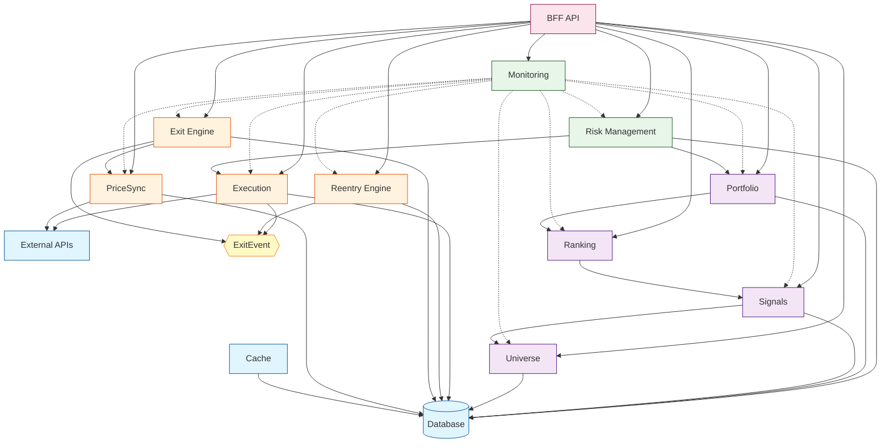

# 모듈 의존성 맵 (Module Dependencies Map)

> v14 모듈 간 의존 관계와 계층 구조를 정의합니다.

**Last Updated**: 2026-01-14

---

## 📋 개요

이 문서는 **모듈 간 의존성의 SSOT**입니다.

### 목적
- 모듈 독립 개발을 위한 명확한 의존성 정의
- 순환 참조 방지 및 검증
- 의존성 방향 강제 (하위 → 상위 금지)
- 레이어 간 경계 명확화

---

## 🏗️ 레이어 구조

```
┌─────────────────────────────────────────┐
│         API Layer (최상위)               │
│  - BFF (Backend for Frontend)           │
│  - Admin API                            │
└─────────────────────────────────────────┘
                   ↑
┌─────────────────────────────────────────┐
│         Control Layer                    │
│  - Risk Management                      │
│  - Monitoring (횡단 관심사)              │
└─────────────────────────────────────────┘
                   ↑
┌─────────────────────────────────────────┐
│         Strategy Layer                   │
│  - Universe → Signals → Ranking          │
│  - Portfolio                            │
└─────────────────────────────────────────┘
                   ↑
┌─────────────────────────────────────────┐
│         Core Runtime Layer               │
│  - PriceSync                            │
│  - Exit Engine ← ExitEvent → Reentry    │
│  - Execution                            │
└─────────────────────────────────────────┘
                   ↑
┌─────────────────────────────────────────┐
│         Infrastructure Layer (최하위)     │
│  - External APIs (KIS, Naver)           │
│  - Database (PostgreSQL)                │
│  - Cache (Redis)                        │
└─────────────────────────────────────────┘
```

**의존성 규칙**:
- ✅ 상위 레이어 → 하위 레이어 (인터페이스 통해서만)
- ❌ 하위 레이어 → 상위 레이어 (절대 금지)
- ❌ 같은 레이어 내 순환 참조 (금지)

---

## 📦 모듈별 의존성 상세

### Infrastructure Layer (의존성 없음)

#### external-apis
```yaml
id: infra.external-apis
depends_on: []  # 의존성 없음 (최하위)
provides:
  - KISClient
  - NaverClient
```

#### database
```yaml
id: infra.database
depends_on: []  # 의존성 없음 (최하위)
provides:
  - Repository interfaces (per domain)
  - Transaction manager
```

#### cache
```yaml
id: infra.cache
depends_on:
  - infra.database  # SSOT 읽기 전용
provides:
  - CacheService
note: "Cache는 읽기 가속용. SSOT는 항상 PostgreSQL."
```

---

### Core Runtime Layer

#### price-sync
```yaml
id: runtime.price-sync
depends_on:
  - infra.external-apis  # KIS WS/REST, Naver
  - infra.database       # 가격 데이터 저장
provides:
  - PriceSyncService
exported_interface: |
  type PriceSyncService interface {
      GetCurrentPrice(ctx context.Context, symbol string) (Price, error)
      Subscribe(ctx context.Context, symbols []string) error
      Unsubscribe(ctx context.Context, symbols []string) error
  }
```

#### exit-engine
```yaml
id: runtime.exit-engine
depends_on:
  - runtime.price-sync   # 현재가 조회
  - infra.database       # Position, ExitRule 조회
provides:
  - ExitEngineService
  - ExitEvent (이벤트)
exported_interface: |
  type ExitEngineService interface {
      CheckExitConditions(ctx context.Context) ([]ExitDecision, error)
      GetExitStatus(ctx context.Context, positionID string) (Status, error)
  }

  type ExitEvent struct {
      PositionID  string
      Symbol      string
      ExitPrice   decimal.Decimal
      ExitReason  string
      ExitAt      time.Time
  }
note: "ExitEvent는 Reentry Engine이 구독. 직접 호출 없음."
```

#### reentry-engine
```yaml
id: runtime.reentry-engine
depends_on:
  - runtime.exit-engine  # ExitEvent 구독 (이벤트 기반)
  - infra.database       # ReentryRule, ReentryHistory 조회
provides:
  - ReentryEngineService
exported_interface: |
  type ReentryEngineService interface {
      OnExitEvent(ctx context.Context, event ExitEvent) error
      GetReentryStatus(ctx context.Context, symbol string) (Status, error)
  }
note: "Exit Engine과 디커플링됨. ExitEvent SSOT 기반 동작."
```

#### execution
```yaml
id: runtime.execution
depends_on:
  - infra.external-apis  # KIS 주문 API
  - infra.database       # Order, Position 저장
provides:
  - ExecutionService
  - ExitEvent 생성 (체결 완료 시)
exported_interface: |
  type ExecutionService interface {
      SubmitOrder(ctx context.Context, order Order) (OrderID, error)
      GetOrderStatus(ctx context.Context, orderID string) (Status, error)
      CancelOrder(ctx context.Context, orderID string) error
  }
note: "ExitEvent 생성의 SSOT. 매도 체결 완료 시에만 ExitEvent 발행."
```

---

### Strategy Layer

#### universe
```yaml
id: strategy.universe
depends_on:
  - infra.database  # 종목 데이터 조회 (market.stocks, prices)
provides:
  - UniverseService
exported_interface: |
  type UniverseService interface {
      GetUniverse(ctx context.Context, date time.Time) ([]Symbol, error)
  }
```

#### signals
```yaml
id: strategy.signals
depends_on:
  - strategy.universe  # 투자 가능 종목
  - infra.database     # 가격, 재무 데이터 조회
provides:
  - SignalService
exported_interface: |
  type SignalService interface {
      GenerateSignals(ctx context.Context, symbols []string, date time.Time) ([]Signal, error)
  }
```

#### ranking
```yaml
id: strategy.ranking
depends_on:
  - strategy.signals  # 시그널 데이터
provides:
  - RankingService
exported_interface: |
  type RankingService interface {
      RankStocks(ctx context.Context, signals []Signal, date time.Time) ([]RankedStock, error)
  }
```

#### portfolio
```yaml
id: strategy.portfolio
depends_on:
  - strategy.ranking  # 종합 점수
  - infra.database    # 현재 포지션 조회
provides:
  - PortfolioService
exported_interface: |
  type PortfolioService interface {
      ConstructPortfolio(ctx context.Context, ranked []RankedStock, date time.Time) (Portfolio, error)
  }
```

---

### Control Layer

#### risk
```yaml
id: control.risk
depends_on:
  - strategy.portfolio   # 포트폴리오 구성
  - runtime.execution    # 현재 포지션 상태
  - infra.database       # 리스크 한도 조회
provides:
  - RiskService
exported_interface: |
  type RiskService interface {
      CheckRiskLimits(ctx context.Context, portfolio Portfolio) (RiskReport, error)
      ApproveOrder(ctx context.Context, order Order) (bool, error)
  }
```

#### monitoring
```yaml
id: control.monitoring
depends_on:
  - ALL_MODULES  # 횡단 관심사 (모든 모듈 모니터링)
provides:
  - MonitoringService
  - AlertService
  - LogService
exported_interface: |
  type MonitoringService interface {
      RecordMetric(ctx context.Context, metric Metric) error
      SendAlert(ctx context.Context, alert Alert) error
  }
note: "횡단 관심사 (Cross-Cutting Concern). 다른 모듈에 주입됨."
```

---

### API Layer

#### bff
```yaml
id: api.bff
depends_on:
  - runtime.price-sync
  - runtime.exit-engine
  - runtime.reentry-engine
  - runtime.execution
  - strategy.universe
  - strategy.signals
  - strategy.ranking
  - strategy.portfolio
  - control.risk
  - control.monitoring
provides:
  - HTTP REST API
  - GraphQL API (optional)
note: "최상위 레이어. 모든 서비스 레이어에 의존."
```

---

## 🔄 의존성 그래프 (Mermaid)



---

## 🚫 금지된 의존성 패턴

### ❌ Pattern 1: 하위 → 상위 의존
```go
// ❌ 금지: Infrastructure가 Runtime에 의존
package database

import "backend/internal/runtime/exit"  // 금지!

type Repository struct {
    exitEngine *exit.ExitEngine  // 하위가 상위 의존 - 금지!
}
```

### ❌ Pattern 2: 순환 참조
```go
// ❌ 금지: Exit ↔ Reentry 순환 참조
package exit

import "backend/internal/runtime/reentry"  // 금지!

type ExitEngine struct {
    reentry *reentry.ReentryEngine  // 순환 참조!
}

// reentry/engine.go
package reentry

import "backend/internal/runtime/exit"  // 금지!

type ReentryEngine struct {
    exit *exit.ExitEngine  // 순환 참조!
}
```

**해결책**: 이벤트 기반 디커플링
```go
// ✅ 허용: ExitEvent를 통한 디커플링
package exit

type ExitEngine struct {
    eventBus EventBus  // 이벤트 발행만
}

func (e *ExitEngine) ProcessExit() {
    e.eventBus.Publish(ExitEvent{...})  // 발행
}

// reentry/engine.go
package reentry

type ReentryEngine struct {
    eventBus EventBus  // 이벤트 구독만
}

func (r *ReentryEngine) OnExitEvent(event ExitEvent) {
    // 처리
}
```

### ❌ Pattern 3: 구체 타입 의존
```go
// ❌ 금지: 구체 타입에 의존
package exit

import "backend/internal/infra/external/kis"  // 금지!

type ExitEngine struct {
    kisClient *kis.KISClient  // 구체 타입 의존!
}
```

**해결책**: 인터페이스 의존
```go
// ✅ 허용: 인터페이스에 의존
package exit

type PriceProvider interface {  // 인터페이스 정의
    GetCurrentPrice(ctx context.Context, symbol string) (Price, error)
}

type ExitEngine struct {
    priceProvider PriceProvider  // 인터페이스 의존
}
```

---

## ✅ 의존성 검증 체크리스트

새 모듈 추가 또는 의존성 변경 시 **반드시** 확인:

- [ ] 의존성 방향이 올바른가? (상위 → 하위만 허용)
- [ ] 순환 참조가 없는가?
- [ ] 인터페이스를 통해 의존하는가? (구체 타입 금지)
- [ ] 이벤트 기반 디커플링이 필요한가?
- [ ] 레이어 경계를 넘지 않는가?
- [ ] 이 문서에 의존성이 명시되어 있는가?

---

## 🔧 의존성 주입 (Dependency Injection)

### 생성자 주입 (Constructor Injection)

```go
// ✅ RECOMMENDED - 생성자에서 의존성 주입
func NewExitEngine(
    priceSync PriceSyncService,  // 인터페이스
    repo Repository,              // 인터페이스
    logger Logger,                // 인터페이스
) *ExitEngine {
    return &ExitEngine{
        priceSync: priceSync,
        repo: repo,
        logger: logger,
    }
}
```

### Wire (Google)를 이용한 DI

```go
// wire.go
//go:build wireinject
// +build wireinject

package main

import "github.com/google/wire"

func InitializeExitEngine() (*ExitEngine, error) {
    wire.Build(
        // Providers
        NewKISClient,
        NewPriceSyncService,
        NewDatabaseRepository,
        NewExitEngine,
    )
    return &ExitEngine{}, nil
}
```

---

## 📝 의존성 변경 프로세스

1. **이 문서 업데이트**
   - 변경할 의존성을 먼저 이 문서에 명시

2. **순환 참조 검증**
   - Mermaid 다이어그램 업데이트
   - 순환 참조 발생 시 설계 재검토

3. **인터페이스 정의**
   - 의존할 모듈의 인터페이스 정의
   - 인터페이스 계약서 작성

4. **구현**
   - 인터페이스를 통해 의존성 주입

5. **검증**
   - 단위 테스트 (Mock 사용)
   - 통합 테스트

---

## 🔍 참고 문서

- [모듈 카탈로그](../modules/module-catalog.md)
- [모듈 개발 가이드](../modules/development-guide.md) (TODO)
- [시스템 아키텍처 개요](./system-overview.md)

---

**Version**: 1.0.0
**Last Updated**: 2026-01-14
