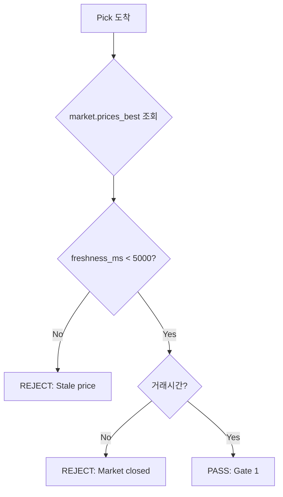
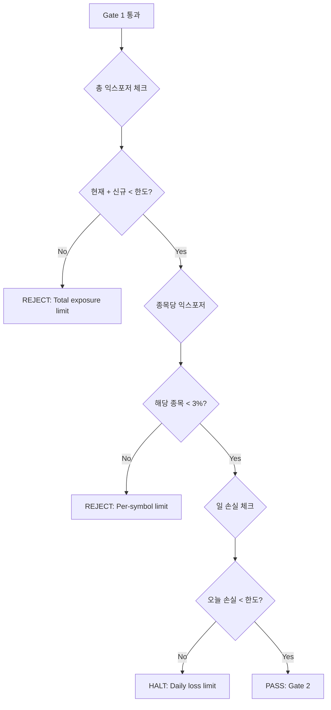
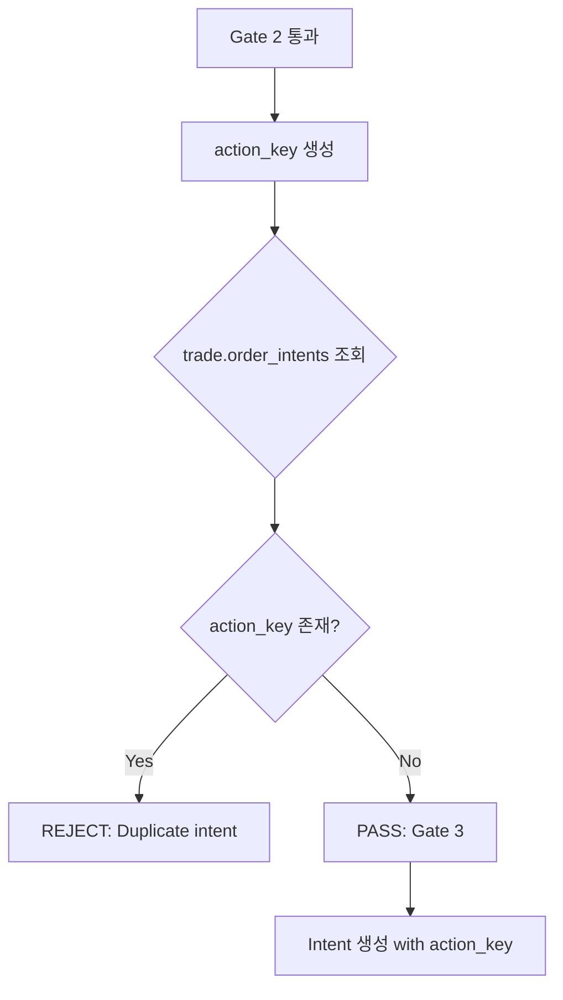
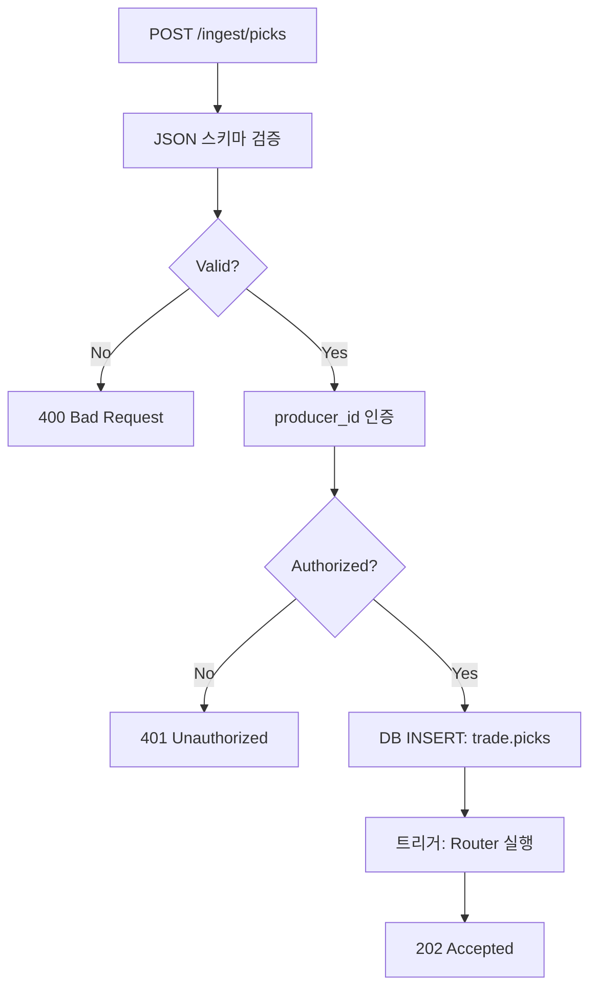
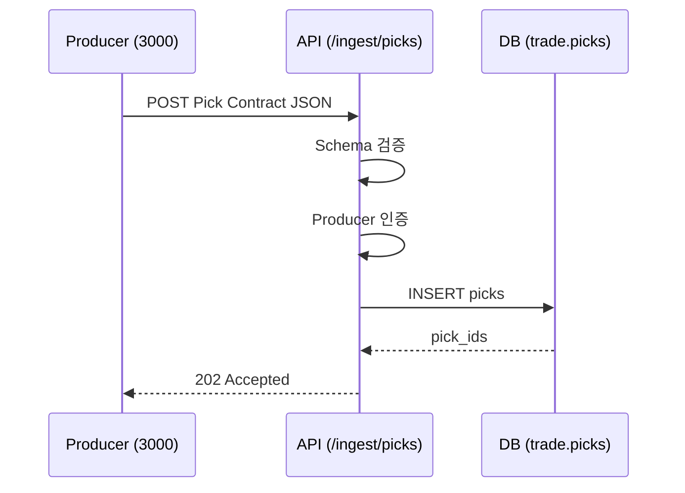
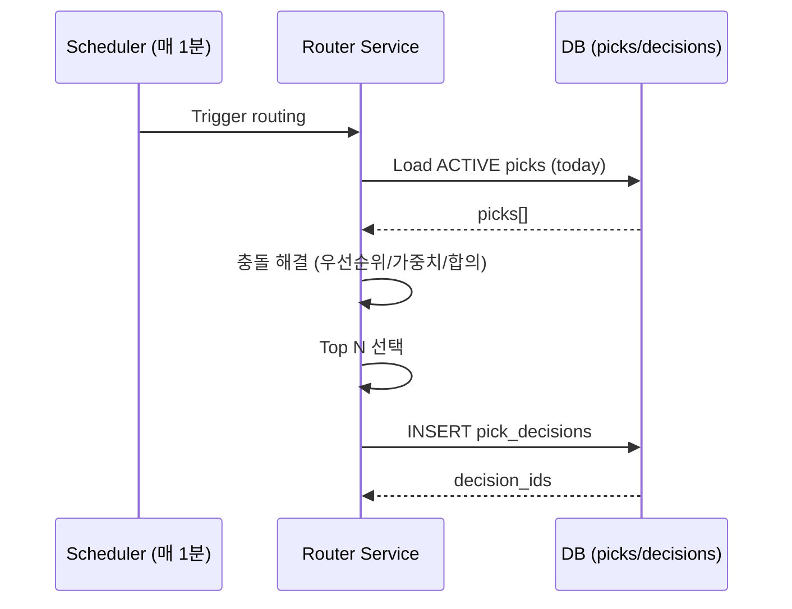
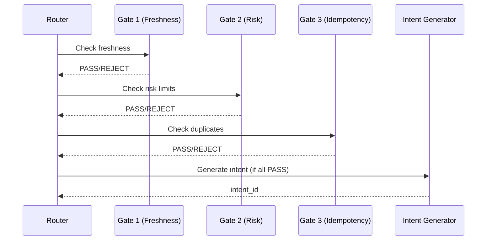
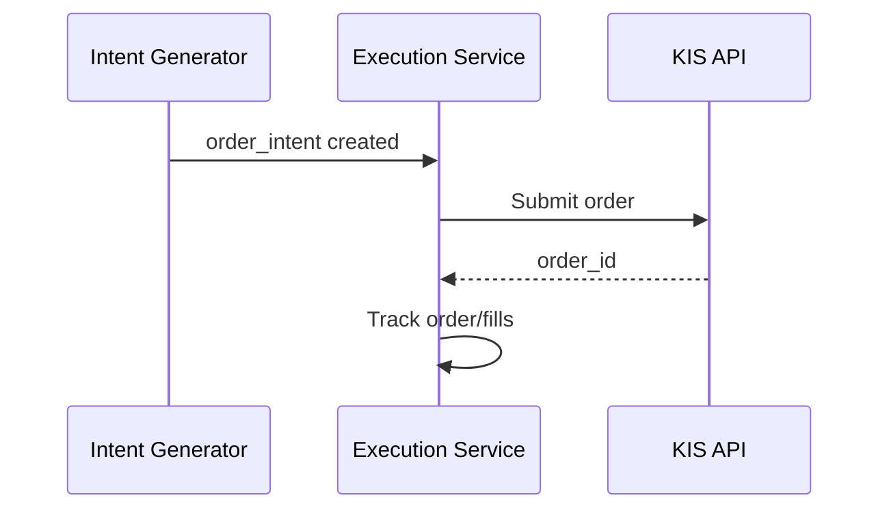

# Pick-to-Execution Pipeline 아키텍처

> 다중 선정 모듈 → 단일 실행 시스템 파이프라인

---

## 🎯 핵심 설계 원칙

**"선정은 플러그인, 실행은 코어"**

```
선정 모듈 (3000, 3001, 3002, ...) = 확장 가능, 교체 가능, 실험 가능
실행 시스템 (3099) = 안정적, 단일 진실원천, 금융 시스템 코어
```

**목표**:
- ✅ 신규 전략 추가 = 서버 하나 + JSON 출력만으로 즉시 연결
- ✅ 실행 시스템 한 번 안정화 = 영구 사용
- ✅ 선정 모듈 실패/변경이 전체 시스템에 영향 없음

---

## 📐 전체 아키텍처

```mermaid
flowchart TD
    subgraph Producers["종목 선정 모듈 (다수, 독립)"]
        P1[3000: Ranking/Factor]
        P2[3001: News/LLM]
        P3[3002: Event/Gap]
        P4[300N: Custom...]
    end

    subgraph Contract["표준 계약 (Pick Contract)"]
        C1[JSON Schema]
        C2[producer_id + run_id]
        C3[picks[] with score/confidence]
    end

    subgraph Core["3099 Execution Core (단일, SSOT)"]
        G1[G1: Data Freshness Gate]
        G2[G2: Risk Gate]
        G3[G3: Idempotency Gate]
        R[Router: 충돌 해결 + 통합]
        E[Intent Generator]
        X[KIS Sync: orders/fills/holdings]
    end

    subgraph DB["PostgreSQL SSOT"]
        T1[trade.picks]
        T2[trade.pick_decisions]
        T3[trade.order_intents]
        T4[trade.orders/fills]
    end

    P1 --> C1
    P2 --> C1
    P3 --> C1
    P4 --> C1

    C1 --> G1
    G1 --> G2
    G2 --> G3
    G3 --> R
    R --> E
    E --> X

    R --> T2
    E --> T3
    X --> T4
    C1 --> T1
```

---

## 🔌 Pick Contract (표준 입력)

### 스키마 정의

모든 선정 모듈은 **동일한 JSON 형식**으로 결과를 출력해야 합니다.

```json
{
  "producer_id": "3000",
  "producer_name": "Ranking-MomentumValue",
  "run_id": "20260113_153000_abc123",
  "asof_ts": "2026-01-13T15:30:00+09:00",
  "universe": ["KOSPI200"],
  "config": {
    "lookback_days": 20,
    "min_volume": 1000000,
    "model_version": "v2.3"
  },
  "picks": [
    {
      "symbol": "005930",
      "side": "LONG",
      "score": 85.3,
      "confidence": "HIGH",
      "rank": 1,
      "reasons": ["MOM_Z3.2", "VALUE_PB0.8", "NEWS_POS"],
      "metadata": {
        "current_price": 72300,
        "target_price": 78000,
        "stop_loss": 68000
      },
      "constraints": {
        "max_hold_days": 5,
        "no_reentry_days": 2,
        "min_position_size_pct": 0.5,
        "max_position_size_pct": 3.0
      }
    },
    {
      "symbol": "000660",
      "side": "LONG",
      "score": 78.1,
      "confidence": "MEDIUM",
      "rank": 2,
      "reasons": ["GAP_UP", "VOLUME_SURGE"],
      "metadata": {
        "current_price": 125000,
        "gap_pct": 5.2
      },
      "constraints": {
        "max_hold_days": 3
      }
    }
  ],
  "diagnostics": {
    "evaluated_symbols": 200,
    "passed_filters": 45,
    "final_picks": 2,
    "runtime_ms": 1234
  }
}
```

### 필드 정의

| 필드 | 타입 | 필수 | 설명 |
|------|------|------|------|
| **producer_id** | string | ✅ | 모듈 식별자 (예: "3000") |
| **producer_name** | string | ⬜ | 모듈 이름 (디버깅용) |
| **run_id** | string | ✅ | 실행 고유 ID (날짜+시각+seed) |
| **asof_ts** | ISO8601 | ✅ | 신호 기준 시각 (KST) |
| **universe** | string[] | ⬜ | 평가 대상 범위 |
| **config** | object | ⬜ | 실행 설정 (재현성) |
| **picks[]** | array | ✅ | 종목별 추천 리스트 |

#### picks[] 아이템

| 필드 | 타입 | 필수 | 설명 |
|------|------|------|------|
| **symbol** | string | ✅ | 종목 코드 |
| **side** | enum | ✅ | "LONG" (현재 매도는 미지원) |
| **score** | float | ✅ | 0~100 또는 z-score |
| **confidence** | enum | ✅ | "LOW" \| "MEDIUM" \| "HIGH" |
| **rank** | int | ⬜ | 순위 (1부터 시작) |
| **reasons[]** | string[] | ✅ | 선정 이유 (짧은 코드) |
| **metadata** | object | ⬜ | 추가 정보 (가격, 목표가 등) |
| **constraints** | object | ⬜ | 개별 제약 조건 |

---

## 🔄 Router (다중 선정 통합)

### 역할

여러 producer(3000/3001/3002)가 동시에 picks를 보낼 때:
1. **충돌 해결**: 동일 종목을 여러 모듈이 추천 시
2. **우선순위**: 어떤 모듈을 우선할 것인가
3. **Ensemble**: 점수를 합치는 방식
4. **Top N 선택**: 최종 진입 후보 선택

### 충돌 해결 전략

#### 전략 A: 우선순위 방식 (Priority-based)

```
우선순위: 3002(이벤트) > 3001(뉴스/LLM) > 3000(랭킹/팩터)
```

**로직**:
1. 동일 종목에 대해 여러 picks가 있으면
2. 우선순위가 높은 producer의 pick만 채택
3. 나머지는 무시 (로그 기록)

**구현**:
```sql
-- PostgreSQL 구현 예시
WITH ranked_picks AS (
    SELECT
        symbol,
        producer_id,
        score,
        confidence,
        CASE producer_id
            WHEN '3002' THEN 1  -- Event (최우선)
            WHEN '3001' THEN 2  -- News/LLM
            WHEN '3000' THEN 3  -- Ranking
            ELSE 99
        END AS priority,
        ROW_NUMBER() OVER (PARTITION BY symbol ORDER BY
            CASE producer_id
                WHEN '3002' THEN 1
                WHEN '3001' THEN 2
                WHEN '3000' THEN 3
                ELSE 99
            END
        ) AS rn
    FROM trade.picks
    WHERE run_date = CURRENT_DATE
      AND status = 'ACTIVE'
)
SELECT * FROM ranked_picks WHERE rn = 1;
```

#### 전략 B: 가중 평균 방식 (Weighted Ensemble)

```
최종 점수 = w0 * score_3000 + w1 * score_3001 + w2 * score_3002
```

**가중치 설정 예시**:
- 3000 (Ranking): 0.4
- 3001 (News/LLM): 0.3
- 3002 (Event): 0.3

**로직**:
1. 동일 종목에 대해 여러 picks가 있으면
2. 각 producer의 score를 가중 평균
3. confidence는 평균 또는 최대값
4. 최종 점수로 재정렬

**구현**:
```sql
WITH weighted_scores AS (
    SELECT
        symbol,
        SUM(
            CASE producer_id
                WHEN '3000' THEN score * 0.4
                WHEN '3001' THEN score * 0.3
                WHEN '3002' THEN score * 0.3
                ELSE 0
            END
        ) AS final_score,
        MAX(
            CASE confidence
                WHEN 'HIGH' THEN 3
                WHEN 'MEDIUM' THEN 2
                WHEN 'LOW' THEN 1
            END
        ) AS max_confidence,
        COUNT(*) AS producer_count
    FROM trade.picks
    WHERE run_date = CURRENT_DATE
      AND status = 'ACTIVE'
    GROUP BY symbol
)
SELECT
    symbol,
    final_score,
    CASE max_confidence
        WHEN 3 THEN 'HIGH'
        WHEN 2 THEN 'MEDIUM'
        ELSE 'LOW'
    END AS confidence,
    producer_count
FROM weighted_scores
ORDER BY final_score DESC;
```

#### 전략 C: 합의 방식 (Consensus)

```
2개 이상의 producer가 동시에 추천한 종목만 채택
```

**로직**:
1. 동일 종목을 N개 이상의 producer가 추천 시만 통과
2. 최종 점수는 평균 또는 최대값
3. 합의 강도에 따라 신뢰도 상승

**구현**:
```sql
WITH consensus AS (
    SELECT
        symbol,
        AVG(score) AS avg_score,
        COUNT(DISTINCT producer_id) AS consensus_count,
        ARRAY_AGG(DISTINCT producer_id) AS producers
    FROM trade.picks
    WHERE run_date = CURRENT_DATE
      AND status = 'ACTIVE'
    GROUP BY symbol
    HAVING COUNT(DISTINCT producer_id) >= 2  -- 최소 2개 합의
)
SELECT * FROM consensus
ORDER BY consensus_count DESC, avg_score DESC;
```

### Top N 선택

Router는 최종적으로 **상위 N개 종목만** 선택합니다.

**기준**:
- 최종 점수 상위 N개
- confidence >= MEDIUM 필터링
- 리스크 한도 내 (총 익스포저)

**예시**:
```sql
SELECT * FROM routed_picks
WHERE confidence IN ('HIGH', 'MEDIUM')
ORDER BY final_score DESC
LIMIT 10;  -- 하루 최대 10종목 진입
```

---

## 🚪 3중 Gate (안전장치)

Router를 통과한 picks도 **3개의 게이트를 반드시 통과**해야 실제 주문으로 전환됩니다.

### Gate 1: Data Freshness (가격 신선도)

**목적**: 오래된 가격 데이터로 주문 방지



**규칙**:
```sql
-- Freshness 체크
SELECT
    symbol,
    freshness_ms,
    is_stale,
    stale_reason
FROM market.prices_best
WHERE symbol = '005930';

-- PASS 조건:
-- 1. freshness_ms < 5000 (5초 이내)
-- 2. is_stale = false
-- 3. 현재 시각이 거래시간 (09:00~15:30)
```

**선택적 조건** (운영 정책에 따라):
- 호가 스프레드 < 1% (유동성)
- 거래대금 > 1억원 (당일)
- 거래정지 여부 체크

### Gate 2: Risk (리스크 한도)

**목적**: 과도한 익스포저 방지



**체크 항목**:

#### 2.1 총 익스포저 한도
```sql
SELECT
    SUM(qty * avg_price) AS total_exposure
FROM trade.positions
WHERE status = 'OPEN';

-- PASS 조건: total_exposure + new_order_value < 총자산 * 0.8
```

#### 2.2 종목당 익스포저 한도
```sql
SELECT
    symbol,
    qty * avg_price AS exposure
FROM trade.positions
WHERE symbol = '005930' AND status = 'OPEN';

-- PASS 조건: exposure + new_order_value < 총자산 * 0.03 (3%)
```

#### 2.3 일 손실 한도 (Circuit Breaker)
```sql
SELECT
    SUM(
        CASE
            WHEN status = 'CLOSED' THEN realized_pnl
            WHEN status = 'OPEN' THEN unrealized_pnl
        END
    ) AS today_pnl
FROM trade.positions
WHERE DATE(entry_ts) = CURRENT_DATE;

-- HALT 조건: today_pnl < -총자산 * 0.05 (5% 손실 시 중단)
```

#### 2.4 동일 종목 재진입 제한
```sql
SELECT
    COUNT(*) AS reentry_count,
    MAX(entry_ts) AS last_entry_ts
FROM trade.positions
WHERE symbol = '005930'
  AND DATE(entry_ts) = CURRENT_DATE;

-- PASS 조건:
-- 1. reentry_count < 3 (하루 최대 3회)
-- 2. last_entry_ts + 30분 < NOW (쿨다운)
```

#### 2.5 중복 포지션 방지
```sql
SELECT COUNT(*) FROM trade.positions
WHERE symbol = '005930'
  AND status = 'OPEN';

-- PASS 조건: COUNT = 0 (동일 종목 중복 보유 금지)
```

### Gate 3: Idempotency (멱등성)

**목적**: 중복 주문 절대 방지



**action_key 규칙**:
```
ENTRY:{trade_date}:{symbol}:{producer_id}:{run_id}

예시:
- ENTRY:20260113:005930:3000:20260113_153000_abc123
- ENTRY:20260113:000660:3001:20260113_153015_def456
```

**체크**:
```sql
-- Intent 중복 체크
SELECT COUNT(*) FROM trade.order_intents
WHERE action_key = 'ENTRY:20260113:005930:3000:20260113_153000_abc123';

-- PASS 조건: COUNT = 0
```

**UNIQUE 제약으로 DB 레벨 강제**:
```sql
CREATE UNIQUE INDEX uq_order_intents_action_key
ON trade.order_intents (action_key);
```

---

## 🗄️ 데이터 모델

Router는 다음 2개 테이블을 소유합니다:

### trade.picks (선정 결과 저장)

각 선정 모듈(producer)의 종목 추천 결과를 저장합니다.

**주요 컬럼**:
- `pick_id`: UUID 기본키
- `producer_id`: 선정 모듈 ID (예: "3000", "3001")
- `run_id`: 실행 고유 ID (날짜+시각+seed)
- `symbol`: 종목 코드
- `score`: 0~100 점수 또는 z-score
- `confidence`: LOW | MEDIUM | HIGH
- `reasons[]`: 선정 이유 코드 리스트 (예: ["MOM", "VALUE", "NEWS_POS"])
- `gate*_passed_ts`: 각 게이트 통과 시각
- `reject_reason`: 거부 사유 (gate 실패 시)

**인덱스**:
- `run_id + symbol` 중복 방지 (UNIQUE)
- 날짜별, producer별, 심볼별 조회 최적화

### trade.pick_decisions (Router 결과)

Router가 다중 picks를 통합한 최종 결정을 저장합니다.

**주요 컬럼**:
- `decision_id`: UUID 기본키
- `symbol`: 종목 코드
- `final_score`: 통합된 최종 점수
- `method`: PRIORITY | WEIGHTED | CONSENSUS (Router 알고리즘)
- `producer_count`: 해당 종목을 추천한 모듈 수
- `pick_ids[]`: 원본 picks 테이블 참조 (FK array)
- `gate*_result`: 각 게이트 통과 여부
- `final_decision`: PASS | REJECT
- `intent_id`: 생성된 order_intent FK (PASS 시)

**제약 조건**:
- `run_date + symbol` 중복 방지 (UNIQUE) - 하루에 동일 종목 하나의 decision만

**상세 스키마**: [schema.md](../database/schema.md#tradepicks) 참고

---

## 🌐 API 설계

### POST /api/ingest/picks

**목적**: 선정 모듈이 Pick Contract JSON을 제출하는 단일 엔드포인트

**요청**:
```http
POST /api/ingest/picks HTTP/1.1
Content-Type: application/json
X-Producer-ID: 3000
X-Producer-Secret: <secret>

{
  "producer_id": "3000",
  "run_id": "20260113_153000_abc123",
  ...
}
```

**응답**:
```json
{
  "status": "accepted",
  "pick_ids": [
    "a1b2c3d4-...",
    "e5f6g7h8-..."
  ],
  "ingested_count": 2,
  "rejected_count": 0,
  "errors": []
}
```

**처리 흐름**:


**에러 응답**:
```json
{
  "status": "rejected",
  "errors": [
    {
      "symbol": "005930",
      "reason": "Duplicate pick for run_id"
    }
  ]
}
```

---

## 🔄 전체 처리 흐름

### 1. Pick Ingestion (수집)



### 2. Router Execution (통합)



### 3. Gate Evaluation (검증)



### 4. Intent to Execution (실행)



---

## 🎛️ Router 설정 예시

### config.yaml

```yaml
router:
  # 전략 선택
  strategy: "weighted"  # priority | weighted | consensus

  # 우선순위 방식 (strategy=priority)
  priority:
    - producer_id: "3002"
      name: "Event"
      weight: 1
    - producer_id: "3001"
      name: "News/LLM"
      weight: 2
    - producer_id: "3000"
      name: "Ranking"
      weight: 3

  # 가중치 방식 (strategy=weighted)
  weights:
    "3000": 0.4  # Ranking
    "3001": 0.3  # News/LLM
    "3002": 0.3  # Event

  # 합의 방식 (strategy=consensus)
  consensus:
    min_producers: 2
    score_aggregation: "mean"  # mean | max | min

  # Top N 선택
  top_n: 10
  min_confidence: "MEDIUM"  # LOW | MEDIUM | HIGH

  # Gate 설정
  gates:
    freshness:
      max_age_ms: 5000
      check_trading_hours: true
    risk:
      max_total_exposure_pct: 80
      max_per_symbol_pct: 3
      max_daily_loss_pct: 5
      max_reentry_per_day: 3
      cooldown_minutes: 30
    idempotency:
      action_key_format: "ENTRY:{date}:{symbol}:{producer}:{run_id}"
```

---

## 🚀 신규 전략 추가 가이드

### Step 1: Producer 등록

```sql
INSERT INTO system.producers (
    producer_id,
    producer_name,
    description,
    contact,
    status
) VALUES (
    '3003',
    'Sentiment-Social',
    'SNS 감성 분석 기반 선정',
    'wonny@example.com',
    'ACTIVE'
);
```

### Step 2: 서버 띄우기

```bash
# Docker 예시
docker run -d \
  --name producer-3003 \
  -p 3003:3003 \
  -e PRODUCER_ID=3003 \
  -e API_ENDPOINT=http://3099:8080/api/ingest/picks \
  -e API_SECRET=<secret> \
  aegis/producer-sentiment:latest
```

### Step 3: Pick 전송

```python
import requests
import json
from datetime import datetime

def send_picks(picks):
    payload = {
        "producer_id": "3003",
        "run_id": f"{datetime.now().strftime('%Y%m%d_%H%M%S')}_3003",
        "asof_ts": datetime.now().isoformat(),
        "picks": picks
    }

    response = requests.post(
        "http://3099:8080/api/ingest/picks",
        json=payload,
        headers={
            "X-Producer-ID": "3003",
            "X-Producer-Secret": "<secret>"
        }
    )

    return response.json()

# 사용 예시
picks = [
    {
        "symbol": "035720",
        "side": "LONG",
        "score": 88.5,
        "confidence": "HIGH",
        "reasons": ["SOCIAL_BUZZ", "POSITIVE_SENTIMENT"]
    }
]

result = send_picks(picks)
print(result)
```

### Step 4: 완료! 🎉

- Router가 자동으로 picks를 수집
- 3중 Gate 통과 시 자동 실행
- 모니터링 대시보드에서 실시간 확인

---

## 📊 모니터링

### 핵심 메트릭

| 메트릭 | 설명 | 알람 임계값 |
|--------|------|-------------|
| `picks_ingested_total` | Producer별 picks 수집 건수 | - |
| `router_conflicts_total` | 충돌 발생 횟수 (동일 종목) | >10/일 |
| `gate1_reject_rate` | Freshness gate 거부율 | >20% |
| `gate2_reject_rate` | Risk gate 거부율 | >30% |
| `gate3_reject_rate` | Idempotency gate 거부율 | >5% |
| `intents_created_total` | 생성된 intent 수 | - |
| `router_latency_ms` | Router 처리 지연 | >500ms |

### Grafana 대시보드

```yaml
panels:
  - title: "Picks by Producer"
    query: sum by (producer_id) (rate(picks_ingested_total[5m]))

  - title: "Gate Rejection Rates"
    query: |
      rate(gate1_reject_total[5m]) / rate(gate1_checked_total[5m]),
      rate(gate2_reject_total[5m]) / rate(gate2_checked_total[5m]),
      rate(gate3_reject_total[5m]) / rate(gate3_checked_total[5m])

  - title: "Router Conflicts"
    query: sum(router_conflicts_total) by (symbol)

  - title: "Final Decisions"
    query: sum by (final_decision) (rate(pick_decisions_total[5m]))
```

---

## 🧪 테스트 시나리오

### 1. 단일 Producer 테스트

```bash
# 3000만 실행
curl -X POST http://3099:8080/api/ingest/picks \
  -H "Content-Type: application/json" \
  -d @test/3000_picks.json

# 검증
psql -c "SELECT * FROM trade.pick_decisions WHERE run_date = CURRENT_DATE;"
```

### 2. 충돌 테스트 (동일 종목)

```bash
# 3000, 3001, 3002가 모두 005930 추천
curl -X POST ... -d @test/3000_picks_005930.json
curl -X POST ... -d @test/3001_picks_005930.json
curl -X POST ... -d @test/3002_picks_005930.json

# Router 실행
curl -X POST http://3099:8080/api/router/run

# 검증: 우선순위에 따라 하나만 선택되었는지
psql -c "SELECT * FROM trade.pick_decisions WHERE symbol = '005930';"
```

### 3. Gate 거부 테스트

```bash
# Gate 1: Stale price
UPDATE market.prices_best SET updated_ts = NOW() - INTERVAL '10 seconds';

# Gate 2: Exposure over limit
INSERT INTO trade.positions (...) VALUES (...);  -- 익스포저 90% 도달

# Gate 3: Duplicate intent
INSERT INTO trade.order_intents (action_key) VALUES ('ENTRY:...');

# 검증
psql -c "SELECT gate1_result, gate2_result, gate3_result FROM trade.pick_decisions;"
```

---

## 🔗 관련 문서

- [execution-service.md](../modules/execution-service.md) - 주문 실행 및 KIS Sync
- [exit-engine.md](../modules/exit-engine.md) - 청산 전략
- [schema.md](../database/schema.md) - 데이터베이스 스키마
- [access-control.md](../database/access-control.md) - 권한 관리

---

**Version**: v14.0.0-design
**Last Updated**: 2026-01-13
