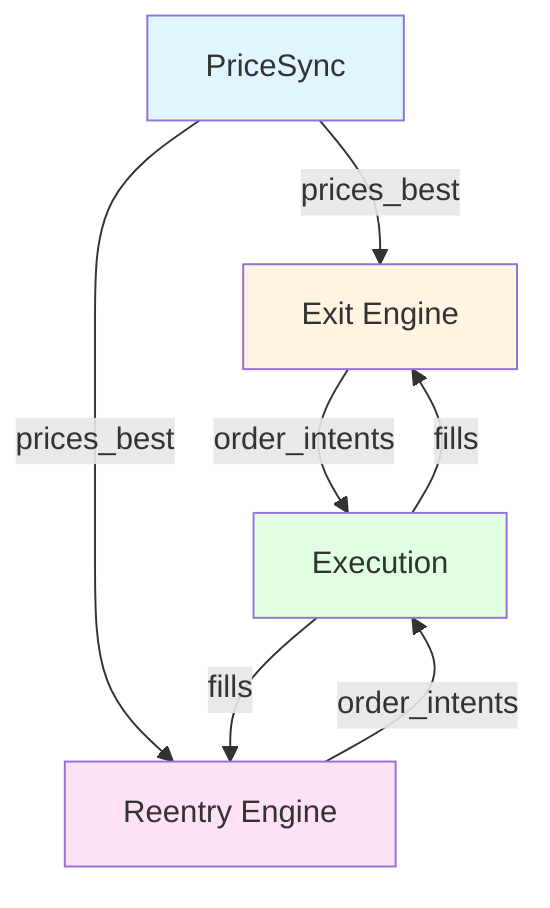
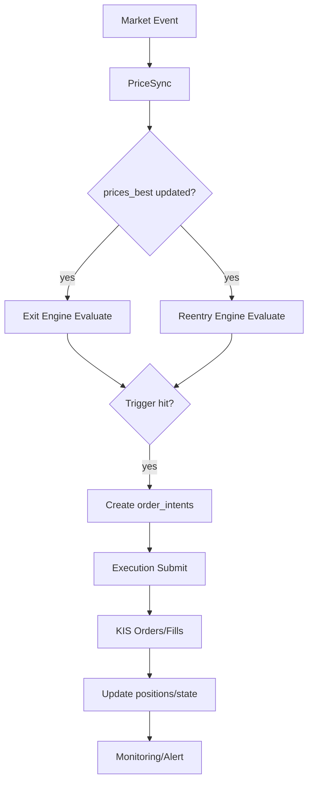

# 시스템 개요 (System Overview)

> Aegis v14 - 퀀트 트레이딩 시스템 전체 구조

---

## 📐 Runtime Map (SSOT)

```
┌──────────────────────────────────────────────────────────────┐
│                        Quant Runtime                          │
├──────────────────┬───────────────────────┬───────────────────┤
│ PriceSync         │ Strategy Engine       │ Execution Service  │
│ (WS/REST/Naver)   │ (Exit/Reentry/Risk)   │ (KIS Orders/Fills) │
└─────────┬────────┴──────────┬────────────┴─────────┬─────────┘
          │                   │                      │
          ▼                   ▼                      ▼
  market.prices_*      trade.positions_*        trade.orders_*
  market.freshness     trade.actions_*          trade.fills_*
          │                   │                      │
          └───────────────────┴──────────┬──────────┘
                                          ▼
                                   Monitoring/Alert
```

---

## 🎯 시스템 목표

### 1. 현재가 동기화 (PriceSync)
- KIS WebSocket (최우선, 40종목 제한)
- KIS REST API (커버리지 확장, 1000종목)
- Naver Backup (장애 백업)
- **목표**: 심볼별 "최선의 현재가" 제공 + 신선도 보장

### 2. 자동청산 (Exit Engine)
- 포지션별 상태 머신 기반
- 손절/익절/트레일링/시간청산
- **목표**: 안전하고 멱등적인 청산 실행

### 3. 청산 후 재진입 (Reentry Engine)
- 쿨다운/재진입 트리거/리스크 게이트
- 횟수 제한/포지션 사이징
- **목표**: "좋은 종목이면 다시 탄다"를 규칙화

---

## 🏛️ 아키텍처 원칙 (SSOT)

### 원칙 1: 단일 진실 원천 (Single Source of Truth)

**정의**: 모든 데이터/로직은 단 하나의 소유자가 있어야 한다.

| 책임 | 소유자 모듈 | 금지 |
|------|------------|------|
| 현재가 결정 | PriceSync | Strategy에서 가격 직접 계산 |
| 포지션 상태 | Exit Engine | 다른 모듈에서 상태 직접 변경 |
| 주문 제출 | Execution | Strategy에서 KIS 직접 호출 |
| 재진입 후보 | Reentry Engine | Exit에서 재진입 로직 |

**위반 예시 (금지):**

```
❌ Strategy에서 prices_ticks 직접 조회
❌ Exit Engine에서 주문 API 직접 호출
❌ PriceSync에서 포지션 상태 변경
❌ Execution에서 Exit 트리거 판단
```

**올바른 패턴:**

```
✅ Strategy는 prices_best만 조회
✅ Strategy는 order_intents만 생성
✅ Execution은 intents를 읽어 제출
✅ 각 모듈은 자신의 테이블만 쓰기
```

### 원칙 2: 모듈 독립성 (Module Independence)

**정의**: 각 모듈은 인터페이스를 통해서만 통신한다.



**의존성 방향 규칙:**

```
┌─────────────┐
│ Execution   │ (최상위)
└──────┬──────┘
       │
┌──────▼──────┐
│ Strategy    │ (중간)
│ Exit/Reentry│
└──────┬──────┘
       │
┌──────▼──────┐
│ PriceSync   │ (최하위)
└─────────────┘
```

**금지: 순환 참조**

```
❌ PriceSync → Exit → PriceSync
❌ Exit → Reentry → Exit
```

### 원칙 3: 멱등성 (Idempotency)

**정의**: 같은 조건에서 같은 주문은 1번만 발생한다.

**구현: action_key (UNIQUE 제약)**

```sql
-- order_intents 테이블
CREATE UNIQUE INDEX uq_order_intents_action_key
ON trade.order_intents (action_key);
```

**action_key 컨벤션:**

| 트리거 | action_key 패턴 | 예시 |
|--------|----------------|------|
| SL1 | `{position_id}:SL1` | `uuid-123:SL1` |
| TP2 | `{position_id}:TP2` | `uuid-123:TP2` |
| TRAIL | `{position_id}:TRAIL` | `uuid-123:TRAIL` |
| REENTRY | `{candidate_id}:ENTRY:{n}` | `uuid-456:ENTRY:1` |

### 원칙 4: Fail-Closed

**정의**: 불확실하면 거래를 중단한다.

| 상황 | 동작 |
|------|------|
| 가격 stale | 신규 진입 금지 |
| 주문 상태 불명 | 재제출 전 반드시 조회 |
| 포트 리스크 초과 | 모든 진입 차단 |
| DB 연결 장애 | 시스템 중단 |

---

## 🔄 런타임 루프 (Runtime Flow)

### 전체 흐름



### 루프 주기 (권장)

| 컴포넌트 | 주기 | 설명 |
|----------|------|------|
| **PriceSync WS** | 이벤트 기반 | 실시간 수신 |
| **PriceSync REST Tier0** | 1~3초 | 보유 종목 |
| **PriceSync REST Tier1** | 5~10초 | 관심 종목 |
| **PriceSync REST Tier2** | 30~120초 | 유니버스 |
| **Exit Engine** | 1~5초 | 보유 종목 중심 |
| **Reentry Engine** | 10~30초 | 후보 평가 |
| **Execution Reconcile** | 10~30초 | 주문/체결 동기화 |

---

## 🗂️ 데이터 소유권 (SSOT)

### Market Schema (PriceSync 소유)

| 테이블 | 소유자 | 읽기 허용 | 쓰기 허용 |
|--------|--------|----------|----------|
| `market.prices_ticks` | PriceSync | 전체 | PriceSync만 |
| `market.prices_best` | PriceSync | 전체 | PriceSync만 |
| `market.freshness` | PriceSync | 전체 | PriceSync만 |

### Trade Schema (Strategy/Execution 공유)

| 테이블 | 소유자 | 읽기 허용 | 쓰기 허용 |
|--------|--------|----------|----------|
| `trade.positions` | Exit | 전체 | Exit, Execution |
| `trade.position_state` | Exit | 전체 | Exit만 |
| `trade.reentry_candidates` | Reentry | 전체 | Reentry만 |
| `trade.order_intents` | - | 전체 | Exit, Reentry, Router |
| `trade.orders` | Execution | 전체 | Execution만 |
| `trade.fills` | Execution | 전체 | Execution만 |
| `trade.picks` | Router | 전체 | Router만 |
| `trade.pick_decisions` | Router | 전체 | Router만 |

**규칙:**
- 각 모듈은 자신의 테이블만 INSERT/UPDATE
- 다른 모듈 테이블은 READ ONLY
- 상태 변경은 반드시 소유자 모듈을 통해
- **상세한 SSOT 소유권**: [database/schema.md](../database/schema.md) 참조

---

## 🚨 핵심 불변 조건 (Invariants)

### I1. 멱등성 (Idempotency)
```
동일 포지션/동일 트리거는 order_intents 1개만 존재
→ DB UNIQUE(action_key)로 강제
```

### I2. 안전성 (Safety)
```
best price가 stale이면:
- 신규 진입: 금지
- 청산: 보수적 처리 (정책 선택)
```

### I3. 복구 가능성 (Recoverability)
```
프로세스 재시작 후:
- orders/fills 재조회로 상태 복구
- intent_id 기반 주문 매칭
```

### I4. 추적 가능성 (Traceability)
```
모든 결정은 기록:
- order_intents.reason_code
- decision_snapshots (선택)
```

---

## 🔍 모듈 인터페이스 (Public Contracts)

### PriceSync → Strategy

**제공:**
- `market.prices_best` (현재가)
- `market.freshness` (신선도)

**계약:**
- `prices_best`는 항상 최신(stale flag 포함)
- `freshness_ms`는 신뢰 가능

### Strategy → Execution

**제공:**
- `trade.order_intents` (주문 의도)

**계약:**
- `action_key`는 unique
- `intent_type`, `qty`, `order_type` 필수
- `status=NEW`로 생성

### Execution → Strategy

**제공:**
- `trade.fills` (체결)
- `trade.orders` (주문 상태)

**계약:**
- `fills`는 중복 없이 기록
- `orders.status`는 정확히 반영

---

## 📊 설계 완료 기준

- [ ] 각 모듈의 책임이 명확히 정의됨
- [ ] SSOT 소유권이 테이블별로 명시됨
- [ ] 모듈 간 인터페이스(계약)가 정의됨
- [ ] 의존성 방향이 명확하고 순환 없음
- [ ] 멱등성 규칙이 구체적으로 정의됨
- [ ] Fail-Closed 정책이 명시됨
- [ ] 런타임 루프 주기가 정의됨

---

## 🔗 관련 문서

- [data-flow.md](./data-flow.md) - 데이터 흐름 상세
- [modules/price-sync.md](../modules/price-sync.md) - PriceSync 설계
- [modules/exit-engine.md](../modules/exit-engine.md) - Exit Engine 설계
- [modules/reentry-engine.md](../modules/reentry-engine.md) - Reentry Engine 설계
- [database/schema.md](../database/schema.md) - DB 스키마

---

**Version**: v14.0.0-design
**Last Updated**: 2026-01-13
