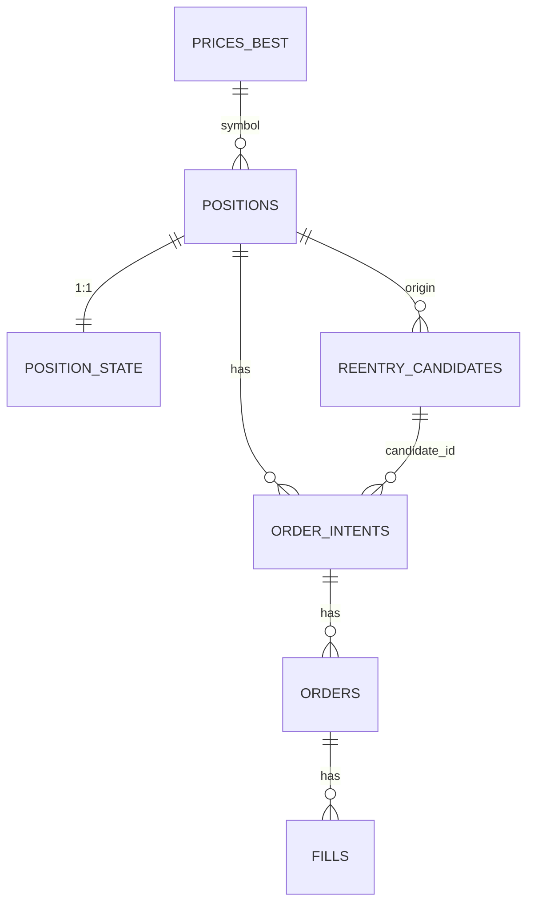

# 데이터베이스 스키마 설계

> PostgreSQL 전체 테이블 정의

---

## 📊 스키마 개요

### Schemas

```sql
CREATE SCHEMA IF NOT EXISTS market;   -- PriceSync 소유
CREATE SCHEMA IF NOT EXISTS trade;    -- Strategy/Execution 공유
CREATE SCHEMA IF NOT EXISTS system;   -- System/Process 관리
```

### SSOT 소유권

| Schema | 테이블 | 소유자 | 쓰기 허용 |
|--------|--------|--------|----------|
| market | stocks | DataSync | DataSync만 |
| market | prices_ticks | PriceSync | PriceSync만 |
| market | prices_best | PriceSync | PriceSync만 |
| market | freshness | PriceSync | PriceSync만 |
| market | sync_jobs | PriceSync | PriceSync만 |
| market | discrepancies | PriceSync | PriceSync만 |
| trade | positions | Exit | Exit, Execution |
| trade | position_state | Exit | Exit만 |
| trade | exit_control | Exit | Exit만 (단일 row) |
| trade | exit_profiles | Exit | Exit만 |
| trade | symbol_exit_overrides | Exit | Exit만 |
| trade | exit_events | Execution | Execution만 |
| trade | exit_signals | Exit | Exit만 |
| trade | reentry_candidates | Reentry | Reentry만 |
| trade | reentry_control | Reentry | Reentry만 (단일 row) |
| trade | order_intents | Strategy | Exit, Reentry, Router만 |
| trade | orders | Execution | Execution만 |
| trade | fills | Execution | Execution만 |
| trade | holdings | Execution | Execution만 |
| trade | picks | Router | Router만 |
| trade | pick_decisions | Router | Router만 |
| system | process_locks | System | 모든 모듈 (advisory lock) |

---

## 🗃️ Market Schema

### market.stocks (종목 마스터 - SSOT)

**목적**: 종목 기본 정보 및 거래 가능 여부 관리

**소유자**: DataSync (종목 정보 동기화 전담 모듈)

**FK 참조**: 모든 symbol 컬럼이 이 테이블을 참조해야 함

```sql
CREATE TABLE market.stocks (
    symbol        TEXT PRIMARY KEY,  -- 종목코드 (예: 005930, 069500) - 6자리 숫자
    name          TEXT        NOT NULL,     -- 종목명 (예: 삼성전자)
    market        TEXT        NOT NULL,     -- KOSPI | KOSDAQ | KONEX

    -- 종목 상태
    status        TEXT        NOT NULL DEFAULT 'ACTIVE',  -- ACTIVE | SUSPENDED | DELISTED
    listing_date  DATE,                     -- 상장일
    delisting_date DATE,                    -- 상장폐지일

    -- 메타 정보
    sector        TEXT,                     -- 섹터 (예: 전기전자)
    industry      TEXT,                     -- 업종 (예: 반도체)
    market_cap    BIGINT,                   -- 시가총액 (원)

    -- 거래 제약
    is_tradable   BOOLEAN     NOT NULL DEFAULT true,  -- 현재 거래 가능 여부
    trade_halt_reason TEXT,                -- 거래정지 사유

    -- 감사
    created_ts    TIMESTAMPTZ NOT NULL DEFAULT now(),
    updated_ts    TIMESTAMPTZ NOT NULL DEFAULT now(),

    CONSTRAINT chk_market CHECK (market IN ('KOSPI', 'KOSDAQ', 'KONEX')),
    CONSTRAINT chk_status CHECK (status IN ('ACTIVE', 'SUSPENDED', 'DELISTED')),
    CONSTRAINT chk_symbol_format CHECK (symbol ~ '^\d{6}$')  -- 6자리 숫자 검증
);

CREATE INDEX idx_stocks_market ON market.stocks (market);
CREATE INDEX idx_stocks_status ON market.stocks (status);
CREATE INDEX idx_stocks_tradable ON market.stocks (is_tradable) WHERE is_tradable = true;
CREATE INDEX idx_stocks_name ON market.stocks (name);  -- 종목명 검색용
```

**종목코드 표준**:
- 형식: 6자리 숫자 (`005930`, `069500`)
- KIS API와 동일 형식 사용
- 모든 주문/포지션/가격 데이터는 이 코드를 사용

**거래 가능 여부 규칙**:
- `is_tradable = false`: 거래정지, 상장폐지 등
- Exit Engine: HardStop 제외한 모든 청산 차단
- Router: 신규 진입 차단

**권한**:
- SELECT: aegis_trade, aegis_exec, aegis_router (읽기 전용)
- INSERT/UPDATE/DELETE: aegis_datasync만

---

### market.prices_ticks

**목적**: 원본 가격 이벤트 (감사/리플레이)

```sql
CREATE TABLE market.prices_ticks (
    ts            TIMESTAMPTZ NOT NULL,
    symbol        TEXT        NOT NULL,
    source        TEXT        NOT NULL,  -- KIS_WS | KIS_REST | NAVER
    last_price    NUMERIC     NOT NULL,
    bid           NUMERIC,
    ask           NUMERIC,
    volume        BIGINT,
    trade_value   NUMERIC,
    PRIMARY KEY (symbol, ts, source),
    FOREIGN KEY (symbol) REFERENCES market.stocks(symbol) ON DELETE CASCADE
);

CREATE INDEX idx_prices_ticks_ts ON market.prices_ticks (ts DESC);
CREATE INDEX idx_prices_ticks_symbol_ts ON market.prices_ticks (symbol, ts DESC);
```

### market.prices_best

**목적**: 심볼별 최선가 캐시 (전략 사용용)

```sql
CREATE TABLE market.prices_best (
    symbol        TEXT PRIMARY KEY,
    ts            TIMESTAMPTZ NOT NULL,
    source        TEXT        NOT NULL,
    last_price    NUMERIC     NOT NULL,
    bid           NUMERIC,
    ask           NUMERIC,
    freshness_ms  BIGINT      NOT NULL,
    quality_score INT         NOT NULL,
    updated_ts    TIMESTAMPTZ NOT NULL DEFAULT now(),
    FOREIGN KEY (symbol) REFERENCES market.stocks(symbol) ON DELETE CASCADE
);
```

### market.freshness

**목적**: 심볼별 신선도 메타

```sql
CREATE TABLE market.freshness (
    symbol         TEXT PRIMARY KEY,
    last_ws_ts     TIMESTAMPTZ,
    last_rest_ts   TIMESTAMPTZ,
    last_naver_ts  TIMESTAMPTZ,
    best_ts        TIMESTAMPTZ,
    is_stale       BOOLEAN     NOT NULL DEFAULT false,
    stale_reason   TEXT,
    updated_ts     TIMESTAMPTZ NOT NULL DEFAULT now(),
    FOREIGN KEY (symbol) REFERENCES market.stocks(symbol) ON DELETE CASCADE
);
```

### market.sync_jobs

**목적**: PostgreSQL 기반 job queue (FOR UPDATE SKIP LOCKED)

```sql
CREATE TABLE market.sync_jobs (
    id           SERIAL PRIMARY KEY,
    symbol       TEXT NOT NULL,
    source       TEXT NOT NULL,  -- KIS_REST | NAVER
    priority     INT NOT NULL,
    status       TEXT NOT NULL,  -- PENDING | RUNNING | DONE | FAILED
    worker_id    TEXT,
    attempts     INT NOT NULL DEFAULT 0,
    last_error   TEXT,
    created_ts   TIMESTAMPTZ NOT NULL DEFAULT now(),
    started_ts   TIMESTAMPTZ,
    completed_ts TIMESTAMPTZ,
    FOREIGN KEY (symbol) REFERENCES market.stocks(symbol) ON DELETE CASCADE
);

CREATE INDEX idx_sync_jobs_status_priority ON market.sync_jobs (status, priority DESC);
CREATE INDEX idx_sync_jobs_symbol ON market.sync_jobs (symbol);
```

### market.discrepancies

**목적**: KIS vs Naver 가격 차이 모니터링

```sql
CREATE TABLE market.discrepancies (
    id           SERIAL PRIMARY KEY,
    symbol       TEXT NOT NULL,
    ts           TIMESTAMPTZ NOT NULL,
    kis_price    BIGINT NOT NULL,
    naver_price  BIGINT NOT NULL,
    diff_pct     FLOAT NOT NULL,
    kis_source   TEXT NOT NULL,  -- KIS_WS | KIS_REST
    severity     TEXT NOT NULL,  -- LOW | MEDIUM | HIGH
    FOREIGN KEY (symbol) REFERENCES market.stocks(symbol) ON DELETE CASCADE
);

CREATE INDEX idx_discrepancies_symbol_ts ON market.discrepancies (symbol, ts DESC);
CREATE INDEX idx_discrepancies_severity ON market.discrepancies (severity, ts DESC);
```

---

## 🗃️ Trade Schema (Strategy/Execution)

### trade.positions

**목적**: 포지션 마스터

**컬럼별 소유권 (Column-Level SSOT)**:

| 컬럼 | 쓰기 권한 | 비고 |
|------|----------|------|
| position_id, account_id, symbol, side, entry_ts, strategy_id | Exit | 포지션 생성 시 |
| status, exit_mode, exit_profile_id | Exit | 전략 상태 관리 |
| qty, avg_price | Execution | 체결 동기화 (KIS holdings 기준) |
| version, updated_ts | 자동 트리거 | 낙관적 잠금 |

**규칙**:
- Exit: 포지션 전략 상태(status, exit_mode, exit_profile_id) 소유
- Execution: 실제 체결 수량/평단가(qty, avg_price) 소유
- 두 모듈은 서로의 컬럼을 변경하지 않음

```sql
CREATE TABLE trade.positions (
    position_id   UUID PRIMARY KEY,
    account_id    TEXT NOT NULL,
    symbol        TEXT NOT NULL,
    side          TEXT NOT NULL,  -- LONG
    qty           BIGINT NOT NULL,
    avg_price     NUMERIC NOT NULL,
    entry_ts      TIMESTAMPTZ NOT NULL,
    status        TEXT NOT NULL,  -- OPEN | CLOSING | CLOSED
    strategy_id   TEXT,
    exit_mode     TEXT NOT NULL DEFAULT 'DEFAULT',  -- DEFAULT | DISABLED | MANUAL_ONLY | PROFILE:<id>
    exit_profile_id TEXT,  -- NULL이면 resolver로 결정
    version       INT NOT NULL DEFAULT 1,  -- 낙관적 잠금 (평단가 변경 감지)
    updated_ts    TIMESTAMPTZ NOT NULL DEFAULT now(),
    FOREIGN KEY (symbol) REFERENCES market.stocks(symbol) ON DELETE RESTRICT
);

CREATE INDEX idx_positions_open ON trade.positions (account_id, status, symbol)
    WHERE status IN ('OPEN', 'CLOSING');

-- Version 자동 증가 트리거
CREATE OR REPLACE FUNCTION increment_position_version()
RETURNS TRIGGER AS $$
BEGIN
    IF NEW.avg_price != OLD.avg_price OR NEW.qty != OLD.qty THEN
        NEW.version = OLD.version + 1;
        NEW.updated_ts = NOW();
    END IF;
    RETURN NEW;
END;
$$ LANGUAGE plpgsql;

CREATE TRIGGER trg_positions_version
BEFORE UPDATE ON trade.positions
FOR EACH ROW
EXECUTE FUNCTION increment_position_version();
```

### trade.position_state

**목적**: Exit FSM 상태 (Exit 소유)

**중요**: `cooldown_until`은 제거됨 (Reentry가 reentry_candidates.cooldown_until 사용)

```sql
CREATE TABLE trade.position_state (
    position_id        UUID PRIMARY KEY REFERENCES trade.positions(position_id),
    phase              TEXT NOT NULL,
    hwm_price          NUMERIC,
    stop_floor_price   NUMERIC,
    atr                NUMERIC,
    last_eval_ts       TIMESTAMPTZ,
    updated_ts         TIMESTAMPTZ NOT NULL DEFAULT now()
);
```

### trade.reentry_candidates

**목적**: 재진입 후보 FSM (Reentry 소유)

```sql
CREATE TABLE trade.reentry_candidates (
    candidate_id        UUID PRIMARY KEY,
    exit_event_id       UUID NOT NULL UNIQUE REFERENCES trade.exit_events(exit_event_id),
    symbol              TEXT NOT NULL,
    origin_position_id  UUID NOT NULL,
    exit_reason_code    TEXT NOT NULL,
    exit_ts             TIMESTAMPTZ NOT NULL,
    exit_price          NUMERIC NOT NULL,
    exit_profile_id     TEXT,  -- 청산 시 적용된 profile
    cooldown_until      TIMESTAMPTZ NOT NULL,
    state               TEXT NOT NULL,  -- COOLDOWN | WATCHING | TRIGGERED | ENTERED | EXHAUSTED
    max_reentries       INT  NOT NULL DEFAULT 2,
    reentry_count       INT  NOT NULL DEFAULT 0,
    reentry_profile_id  TEXT,  -- 재진입 시 적용할 profile (NULL이면 resolver)
    last_eval_ts        TIMESTAMPTZ,
    updated_ts          TIMESTAMPTZ NOT NULL DEFAULT now(),
    FOREIGN KEY (symbol) REFERENCES market.stocks(symbol) ON DELETE RESTRICT
);

CREATE INDEX idx_reentry_state ON trade.reentry_candidates (state, cooldown_until);
CREATE INDEX idx_reentry_symbol ON trade.reentry_candidates (symbol, exit_ts DESC);
CREATE UNIQUE INDEX uq_reentry_exit_event ON trade.reentry_candidates (exit_event_id);
```

**중요**:
- `exit_event_id`: ExitEvent를 SSOT로 참조 (멱등성 보장)
- `exit_reason_code`: exit_event에서 복사 (SL1/TP/TRAIL 등)
- `exit_profile_id`: 청산 시 적용된 Exit 프로파일 (재진입 판단에 영향)

### trade.reentry_control

**목적**: Reentry Engine 전역 제어

```sql
CREATE TABLE trade.reentry_control (
    id                INT PRIMARY KEY DEFAULT 1,  -- 단일 row 강제
    mode              TEXT NOT NULL,  -- RUNNING | PAUSE_ENTRY | PAUSE_ALL
    reason            TEXT,
    updated_by        TEXT NOT NULL,
    updated_ts        TIMESTAMPTZ NOT NULL DEFAULT now(),
    CONSTRAINT chk_reentry_control_single_row CHECK (id = 1),
    CONSTRAINT chk_reentry_mode CHECK (mode IN ('RUNNING', 'PAUSE_ENTRY', 'PAUSE_ALL'))
);

-- 초기값 INSERT
INSERT INTO trade.reentry_control (id, mode, updated_by, reason)
VALUES (1, 'RUNNING', 'system', 'Initial setup')
ON CONFLICT (id) DO NOTHING;

CREATE INDEX idx_reentry_control_mode ON trade.reentry_control (mode);
```

**모드 설명**:
- `RUNNING`: 정상 동작 (기본)
- `PAUSE_ENTRY`: 후보 생성/평가는 하되 ENTRY intent 생성만 금지 (안전한 일시정지)
- `PAUSE_ALL`: 후보 생성/평가 자체도 중단
```

### trade.order_intents

**목적**: 주문 의도 (멱등성 핵심, Strategy 소유)

```sql
CREATE TABLE trade.order_intents (
    intent_id     UUID PRIMARY KEY,
    position_id   UUID,
    candidate_id  UUID,
    symbol        TEXT NOT NULL,
    intent_type   TEXT NOT NULL,  -- EXIT_PARTIAL | EXIT_FULL | ENTRY
    qty           BIGINT NOT NULL,
    order_type    TEXT NOT NULL,  -- MKT | LMT
    limit_price   NUMERIC,
    reason_code   TEXT NOT NULL,
    action_key    TEXT NOT NULL,  -- 멱등성 키
    status        TEXT NOT NULL DEFAULT 'NEW',
    created_ts    TIMESTAMPTZ NOT NULL DEFAULT now(),
    updated_ts    TIMESTAMPTZ NOT NULL DEFAULT now(),
    FOREIGN KEY (symbol) REFERENCES market.stocks(symbol) ON DELETE RESTRICT
);

CREATE UNIQUE INDEX uq_order_intents_action_key ON trade.order_intents (action_key);
CREATE INDEX idx_order_intents_status ON trade.order_intents (status, created_ts);
```

### trade.orders

**목적**: 브로커 주문 (Execution 소유)

```sql
CREATE TABLE trade.orders (
    order_id      TEXT PRIMARY KEY,  -- KIS 주문번호
    intent_id     UUID NOT NULL REFERENCES trade.order_intents(intent_id),
    submitted_ts  TIMESTAMPTZ NOT NULL DEFAULT now(),
    status        TEXT NOT NULL,
    raw           JSONB,
    updated_ts    TIMESTAMPTZ NOT NULL DEFAULT now()
);
```

### trade.fills

**목적**: 체결 내역 (Execution 소유)

```sql
CREATE TABLE trade.fills (
    fill_id       UUID PRIMARY KEY,
    order_id      TEXT NOT NULL REFERENCES trade.orders(order_id),
    ts            TIMESTAMPTZ NOT NULL,
    qty           BIGINT NOT NULL,
    price         NUMERIC NOT NULL,
    fee           NUMERIC,
    tax           NUMERIC
);

CREATE INDEX idx_fills_order_ts ON trade.fills (order_id, ts DESC);
```

### trade.exit_signals

**목적**: Exit 트리거 평가 기록 (디버깅/백테스트)

```sql
CREATE TABLE trade.exit_signals (
    signal_id         UUID PRIMARY KEY,
    position_id       UUID NOT NULL REFERENCES trade.positions(position_id),
    ts                TIMESTAMPTZ NOT NULL,
    rule_name         TEXT NOT NULL,  -- HARD_STOP | GAP_DOWN | SCALE_OUT | ATR_TRAIL | BREAK_EVEN | TIME_EXIT | MANUAL
    triggered         BOOLEAN NOT NULL,
    reason            TEXT,
    current_price     NUMERIC NOT NULL,
    hwm_price         NUMERIC,
    stop_floor_price  NUMERIC,
    current_pnl_pct   FLOAT NOT NULL,
    intent_id         UUID,  -- 생성된 intent (있으면)
    created_ts        TIMESTAMPTZ NOT NULL DEFAULT now()
);

CREATE INDEX idx_exit_signals_position_ts ON trade.exit_signals (position_id, ts DESC);
CREATE INDEX idx_exit_signals_rule ON trade.exit_signals (rule_name, triggered, ts DESC);
```

### trade.exit_control

**목적**: Exit Engine 전역 제어 (킬 스위치)

```sql
CREATE TABLE trade.exit_control (
    id                INT PRIMARY KEY DEFAULT 1,  -- 단일 row 강제
    mode              TEXT NOT NULL,  -- RUNNING | PAUSE_PROFIT | PAUSE_ALL | EMERGENCY_FLATTEN
    reason            TEXT,
    updated_by        TEXT NOT NULL,
    updated_ts        TIMESTAMPTZ NOT NULL DEFAULT now(),
    CONSTRAINT chk_exit_control_single_row CHECK (id = 1),
    CONSTRAINT chk_exit_mode CHECK (mode IN ('RUNNING', 'PAUSE_PROFIT', 'PAUSE_ALL', 'EMERGENCY_FLATTEN'))
);

-- 초기값 INSERT
INSERT INTO trade.exit_control (id, mode, updated_by, reason)
VALUES (1, 'RUNNING', 'system', 'Initial setup')
ON CONFLICT (id) DO NOTHING;

CREATE INDEX idx_exit_control_mode ON trade.exit_control (mode);
```

**모드 설명**:
- `RUNNING`: 정상 동작 (기본)
- `PAUSE_PROFIT`: 익절/트레일만 멈춤, 손절(SL)은 계속 (가장 안전한 일시정지)
- `PAUSE_ALL`: 모든 자동청산 멈춤 (단기 사용 권장)
- `EMERGENCY_FLATTEN`: 비상 전량 청산 (선택적 구현)

### trade.exit_profiles

**목적**: Exit 룰 프로파일 (재사용 가능한 설정 묶음)

```sql
CREATE TABLE trade.exit_profiles (
    profile_id    TEXT PRIMARY KEY,
    name          TEXT NOT NULL,
    description   TEXT,
    config        JSONB NOT NULL,  -- SL/TP/Trailing/TimeExit 전체 파라미터
    version       INT NOT NULL DEFAULT 1,
    is_active     BOOLEAN NOT NULL DEFAULT true,
    created_by    TEXT NOT NULL,
    created_ts    TIMESTAMPTZ NOT NULL DEFAULT now(),
    updated_ts    TIMESTAMPTZ NOT NULL DEFAULT now()
);

-- 기본 프로파일
INSERT INTO trade.exit_profiles (profile_id, name, description, config, created_by) VALUES
('default_v1', 'Default ATR Strategy', '기본 ATR 기반 손절/익절',
 '{"sl1_pct": -3.0, "sl2_pct": -8.0, "tp1_pct": 5.0, "tp2_pct": 10.0, "tp3_pct": 20.0, "atr_trail_enabled": true, "time_exit_hours": 168}'::jsonb,
 'system')
ON CONFLICT (profile_id) DO NOTHING;

CREATE INDEX idx_exit_profiles_active ON trade.exit_profiles (is_active, profile_id);
```

**config JSONB 스키마**:
```json
{
  "sl1_pct": -3.0,
  "sl2_pct": -8.0,
  "tp1_pct": 5.0,
  "tp1_qty_pct": 30.0,
  "tp2_pct": 10.0,
  "tp2_qty_pct": 30.0,
  "tp3_pct": 20.0,
  "tp3_qty_pct": 40.0,
  "atr_trail_enabled": true,
  "atr_trail_multiplier": 2.0,
  "break_even_trigger_pct": 2.0,
  "gap_down_threshold_pct": -5.0,
  "time_exit_hours": 168
}
```

### trade.symbol_exit_overrides

**목적**: 종목별 Exit 설정 오버라이드

```sql
CREATE TABLE trade.symbol_exit_overrides (
    symbol         TEXT PRIMARY KEY,
    profile_id     TEXT NOT NULL REFERENCES trade.exit_profiles(profile_id),
    enabled        BOOLEAN NOT NULL DEFAULT true,
    effective_from DATE NOT NULL DEFAULT CURRENT_DATE,
    reason         TEXT,
    created_by     TEXT NOT NULL,
    created_ts     TIMESTAMPTZ NOT NULL DEFAULT now(),
    updated_ts     TIMESTAMPTZ NOT NULL DEFAULT now(),
    FOREIGN KEY (symbol) REFERENCES market.stocks(symbol) ON DELETE RESTRICT
);

CREATE INDEX idx_symbol_overrides_profile ON trade.symbol_exit_overrides (profile_id);
CREATE INDEX idx_symbol_overrides_enabled ON trade.symbol_exit_overrides (enabled, effective_from);
```

### trade.exit_events

**목적**: 청산 확정 이벤트 (SSOT) - Execution이 생성

```sql
CREATE TABLE trade.exit_events (
    exit_event_id     UUID PRIMARY KEY DEFAULT gen_random_uuid(),
    position_id       UUID NOT NULL REFERENCES trade.positions(position_id),
    account_id        TEXT NOT NULL,
    symbol            TEXT NOT NULL,
    exit_ts           TIMESTAMPTZ NOT NULL,
    exit_qty          BIGINT NOT NULL,
    exit_avg_price    NUMERIC NOT NULL,
    exit_reason_code  TEXT NOT NULL,  -- SL1 | SL2 | TP1 | TP2 | TP3 | TRAIL | TIME | MANUAL | BROKER | UNKNOWN
    source            TEXT NOT NULL,  -- AUTO_EXIT | MANUAL | BROKER
    intent_id         UUID REFERENCES trade.order_intents(intent_id),
    exit_profile_id   TEXT,  -- 적용된 profile
    realized_pnl      NUMERIC,
    realized_pnl_pct  FLOAT,
    created_ts        TIMESTAMPTZ NOT NULL DEFAULT now(),
    FOREIGN KEY (symbol) REFERENCES market.stocks(symbol) ON DELETE RESTRICT
);

CREATE INDEX idx_exit_events_position ON trade.exit_events (position_id, exit_ts DESC);
CREATE INDEX idx_exit_events_symbol ON trade.exit_events (symbol, exit_ts DESC);
CREATE INDEX idx_exit_events_reason ON trade.exit_events (exit_reason_code, exit_ts DESC);
CREATE UNIQUE INDEX uq_exit_events_position_ts ON trade.exit_events (position_id, exit_ts);
```

**중요**:
- ExitEvent는 **holdings에서 qty=0 확정** 또는 **fills 누적 완료 확정** 시점에 Execution이 생성
- Exit Engine은 ExitEvent를 생성하지 않음 (order_intent만 생성)
- Reentry Engine의 입력 소스는 ExitEvent (SSOT)

### trade.holdings

**목적**: KIS 보유종목 현황 = 포지션 최종 진실 (Execution 소유)

```sql
CREATE TABLE trade.holdings (
    account_id    TEXT        NOT NULL,
    symbol        TEXT        NOT NULL,
    qty           BIGINT      NOT NULL,
    avg_price     NUMERIC     NOT NULL,
    current_price NUMERIC,
    pnl           NUMERIC,
    pnl_pct       FLOAT,
    updated_ts    TIMESTAMPTZ NOT NULL DEFAULT now(),
    raw           JSONB,
    PRIMARY KEY (account_id, symbol),
    FOREIGN KEY (symbol) REFERENCES market.stocks(symbol) ON DELETE RESTRICT
);
```

**중요**:
- `holdings`: KIS가 말하는 진실 (브로커 현황)
- `positions`: 내부 전략이 추적하는 포지션 (전략 현황)
- Mismatch 감지를 위해 **별도 관리** 필수

### trade.picks

**목적**: 선정 모듈(3000~)의 종목 추천 결과 저장 (Router 소유)

```sql
CREATE TABLE trade.picks (
    pick_id           UUID PRIMARY KEY DEFAULT gen_random_uuid(),
    producer_id       TEXT NOT NULL,
    producer_name     TEXT,
    run_id            TEXT NOT NULL,
    run_date          DATE NOT NULL,
    asof_ts           TIMESTAMPTZ NOT NULL,

    symbol            TEXT NOT NULL,
    side              TEXT NOT NULL,  -- LONG
    score             NUMERIC NOT NULL,
    confidence        TEXT NOT NULL,  -- LOW | MEDIUM | HIGH
    rank              INT,
    reasons           TEXT[],
    metadata          JSONB,
    constraints       JSONB,

    status            TEXT NOT NULL DEFAULT 'ACTIVE',  -- ACTIVE | SUPERSEDED | REJECTED
    gate1_passed_ts   TIMESTAMPTZ,
    gate2_passed_ts   TIMESTAMPTZ,
    gate3_passed_ts   TIMESTAMPTZ,
    reject_reason     TEXT,

    created_ts        TIMESTAMPTZ NOT NULL DEFAULT now(),
    updated_ts        TIMESTAMPTZ NOT NULL DEFAULT now(),
    FOREIGN KEY (symbol) REFERENCES market.stocks(symbol) ON DELETE RESTRICT
);

CREATE INDEX idx_picks_run ON trade.picks (run_date, producer_id, run_id);
CREATE INDEX idx_picks_symbol ON trade.picks (symbol, run_date DESC);
CREATE INDEX idx_picks_status ON trade.picks (status, run_date DESC);

-- run_id + symbol 중복 방지
CREATE UNIQUE INDEX uq_picks_run_symbol ON trade.picks (run_id, symbol);
```

**컬럼 설명**:
- `producer_id`: 선정 모듈 ID (예: "3000", "3001")
- `run_id`: 실행 고유 ID (날짜+시각+seed)
- `score`: 0~100 또는 z-score
- `confidence`: 신뢰도 (LOW/MEDIUM/HIGH)
- `reasons[]`: 선정 이유 코드 리스트 (예: ["MOM", "VALUE", "NEWS_POS"])
- `gate*_passed_ts`: 각 게이트 통과 시각
- `reject_reason`: 거부 사유 (gate 실패 시)

### trade.pick_decisions

**목적**: Router가 다중 picks를 통합한 최종 결정 (Router 소유)

```sql
CREATE TABLE trade.pick_decisions (
    decision_id       UUID PRIMARY KEY DEFAULT gen_random_uuid(),
    run_date          DATE NOT NULL,
    decision_ts       TIMESTAMPTZ NOT NULL DEFAULT now(),

    symbol            TEXT NOT NULL,
    final_score       NUMERIC NOT NULL,
    confidence        TEXT NOT NULL,
    method            TEXT NOT NULL,  -- PRIORITY | WEIGHTED | CONSENSUS

    -- 합의 정보
    producer_count    INT NOT NULL,
    producer_ids      TEXT[],
    pick_ids          UUID[],  -- 원본 picks 참조

    -- Router 메타
    router_version    TEXT NOT NULL,  -- 예: "v1.0-priority"
    config            JSONB,

    -- 게이트 결과
    gate1_result      TEXT,  -- PASS | REJECT
    gate2_result      TEXT,
    gate3_result      TEXT,
    final_decision    TEXT NOT NULL,  -- PASS | REJECT
    reject_reason     TEXT,

    -- Intent 생성
    intent_id         UUID REFERENCES trade.order_intents(intent_id),

    created_ts        TIMESTAMPTZ NOT NULL DEFAULT now(),
    FOREIGN KEY (symbol) REFERENCES market.stocks(symbol) ON DELETE RESTRICT
);

CREATE INDEX idx_decisions_date ON trade.pick_decisions (run_date DESC);
CREATE INDEX idx_decisions_symbol ON trade.pick_decisions (symbol, run_date DESC);
CREATE INDEX idx_decisions_final ON trade.pick_decisions (final_decision, run_date DESC);

-- 하루에 동일 종목 하나의 최종 decision만
CREATE UNIQUE INDEX uq_decisions_date_symbol ON trade.pick_decisions (run_date, symbol);
```

**컬럼 설명**:
- `method`: Router 통합 방식 (우선순위/가중치/합의)
- `producer_count`: 해당 종목을 추천한 모듈 수
- `pick_ids[]`: 원본 picks 테이블 참조
- `gate*_result`: 각 게이트 통과 여부
- `final_decision`: 최종 결정 (PASS → intent 생성)
- `intent_id`: 생성된 order_intent FK

---

## 🔑 멱등성 키 (action_key) 컨벤션

### Exit Engine

| 트리거 | action_key | 예시 |
|--------|-----------|------|
| SL1 | `{position_id}:SL1` | `a1b2c3-...:SL1` |
| SL2 | `{position_id}:SL2` | `a1b2c3-...:SL2` |
| TP1 | `{position_id}:TP1` | `a1b2c3-...:TP1` |
| TP2 | `{position_id}:TP2` | `a1b2c3-...:TP2` |
| TP3 | `{position_id}:TP3` | `a1b2c3-...:TP3` |
| TRAIL | `{position_id}:TRAIL` | `a1b2c3-...:TRAIL` |

### Reentry Engine

| 트리거 | action_key | 예시 |
|--------|-----------|------|
| 1차 재진입 | `{candidate_id}:ENTRY:1` | `d4e5f6-...:ENTRY:1` |
| 2차 재진입 | `{candidate_id}:ENTRY:2` | `d4e5f6-...:ENTRY:2` |

### Router (Pick-based Entry)

| 트리거 | action_key | 예시 |
|--------|-----------|------|
| Pick 기반 진입 | `ENTRY:{date}:{symbol}:{producer}:{run_id}` | `ENTRY:20260113:005930:3000:20260113_153000_abc123` |

**특징**:
- `date`: 거래일 (YYYYMMDD)
- `symbol`: 종목 코드
- `producer`: 선정 모듈 ID (3000, 3001, ...)
- `run_id`: 해당 실행의 고유 ID

**중복 방지**: 동일 날짜, 동일 종목, 동일 producer, 동일 run에서 중복 주문 절대 방지

---

## 🗃️ System Schema (Process 관리)

### system.process_locks

**목적**: Leader election 및 중복 실행 방지 (PostgreSQL Advisory Lock)

```sql
CREATE TABLE system.process_locks (
    lock_name    TEXT PRIMARY KEY,
    instance_id  TEXT NOT NULL,
    acquired_ts  TIMESTAMPTZ NOT NULL,
    heartbeat_ts TIMESTAMPTZ NOT NULL,
    host         TEXT NOT NULL,
    pid          INT NOT NULL
);

CREATE INDEX idx_process_locks_heartbeat ON system.process_locks (heartbeat_ts DESC);
```

**사용 방법:**

```go
// Advisory Lock 획득
SELECT pg_try_advisory_lock(1001);  // 1001 = exit_engine_leader

// Heartbeat 갱신 (5초마다)
UPDATE system.process_locks
SET heartbeat_ts = NOW()
WHERE lock_name = 'exit_engine_leader' AND instance_id = ?;

// Advisory Lock 해제
SELECT pg_advisory_unlock(1001);
```

**모니터링:**

```sql
-- Stale leader 감지 (15초 이상 heartbeat 없음)
SELECT
    lock_name,
    instance_id,
    host,
    pid,
    heartbeat_ts,
    EXTRACT(EPOCH FROM (NOW() - heartbeat_ts)) AS stale_seconds
FROM system.process_locks
WHERE EXTRACT(EPOCH FROM (NOW() - heartbeat_ts)) > 15;
```

---

## 📊 ERD



---

## 🔗 관련 문서

- [modules/price-sync.md](../modules/price-sync.md) - PriceSync 모듈
- [modules/exit-engine.md](../modules/exit-engine.md) - Exit Engine 모듈
- [modules/reentry-engine.md](../modules/reentry-engine.md) - Reentry Engine 모듈

---

**Version**: v14.0.0-design
**Last Updated**: 2026-01-13
