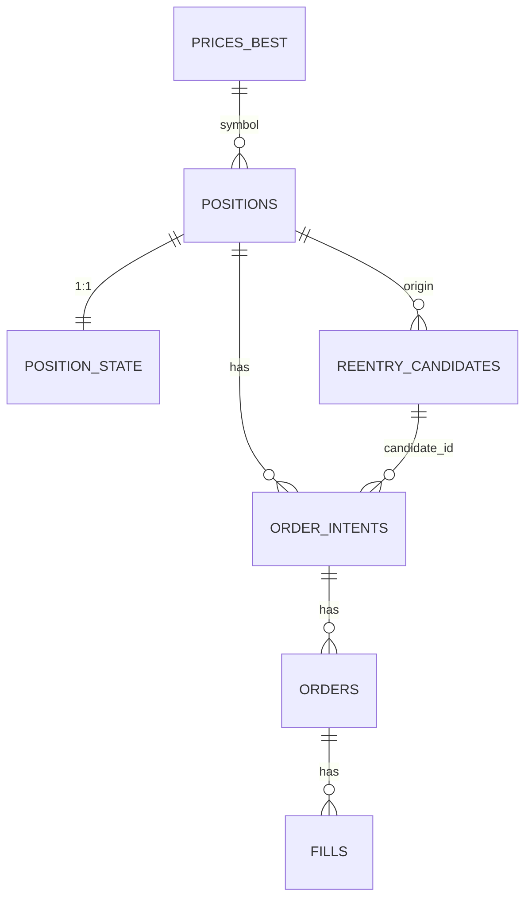

# 데이터베이스 스키마 설계

> PostgreSQL 전체 테이블 정의

---

## 📊 스키마 개요

### Schemas

```sql
CREATE SCHEMA IF NOT EXISTS market;   -- PriceSync 소유
CREATE SCHEMA IF NOT EXISTS trade;    -- Strategy/Execution 공유
CREATE SCHEMA IF NOT EXISTS system;   -- System/Process 관리
```

### SSOT 소유권

| Schema | 테이블 | 소유자 | 쓰기 허용 |
|--------|--------|--------|----------|
| market | prices_ticks | PriceSync | PriceSync만 |
| market | prices_best | PriceSync | PriceSync만 |
| market | freshness | PriceSync | PriceSync만 |
| market | sync_jobs | PriceSync | PriceSync만 |
| market | discrepancies | PriceSync | PriceSync만 |
| trade | positions | Exit | Exit, Execution |
| trade | position_state | Exit | Exit만 |
| trade | reentry_candidates | Reentry | Reentry만 |
| trade | order_intents | Strategy | Exit, Reentry만 |
| trade | orders | Execution | Execution만 |
| trade | fills | Execution | Execution만 |
| trade | exit_signals | Exit | Exit만 |
| system | process_locks | System | 모든 모듈 (advisory lock) |

---

## 🗃️ Market Schema (PriceSync)

### market.prices_ticks

**목적**: 원본 가격 이벤트 (감사/리플레이)

```sql
CREATE TABLE market.prices_ticks (
    ts            TIMESTAMPTZ NOT NULL,
    symbol        TEXT        NOT NULL,
    source        TEXT        NOT NULL,  -- KIS_WS | KIS_REST | NAVER
    last_price    NUMERIC     NOT NULL,
    bid           NUMERIC,
    ask           NUMERIC,
    volume        BIGINT,
    trade_value   NUMERIC,
    PRIMARY KEY (symbol, ts, source)
);

CREATE INDEX idx_prices_ticks_ts ON market.prices_ticks (ts DESC);
CREATE INDEX idx_prices_ticks_symbol_ts ON market.prices_ticks (symbol, ts DESC);
```

### market.prices_best

**목적**: 심볼별 최선가 캐시 (전략 사용용)

```sql
CREATE TABLE market.prices_best (
    symbol        TEXT PRIMARY KEY,
    ts            TIMESTAMPTZ NOT NULL,
    source        TEXT        NOT NULL,
    last_price    NUMERIC     NOT NULL,
    bid           NUMERIC,
    ask           NUMERIC,
    freshness_ms  BIGINT      NOT NULL,
    quality_score INT         NOT NULL,
    updated_ts    TIMESTAMPTZ NOT NULL DEFAULT now()
);
```

### market.freshness

**목적**: 심볼별 신선도 메타

```sql
CREATE TABLE market.freshness (
    symbol         TEXT PRIMARY KEY,
    last_ws_ts     TIMESTAMPTZ,
    last_rest_ts   TIMESTAMPTZ,
    last_naver_ts  TIMESTAMPTZ,
    best_ts        TIMESTAMPTZ,
    is_stale       BOOLEAN     NOT NULL DEFAULT false,
    stale_reason   TEXT,
    updated_ts     TIMESTAMPTZ NOT NULL DEFAULT now()
);
```

### market.sync_jobs

**목적**: PostgreSQL 기반 job queue (FOR UPDATE SKIP LOCKED)

```sql
CREATE TABLE market.sync_jobs (
    id           SERIAL PRIMARY KEY,
    symbol       TEXT NOT NULL,
    source       TEXT NOT NULL,  -- KIS_REST | NAVER
    priority     INT NOT NULL,
    status       TEXT NOT NULL,  -- PENDING | RUNNING | DONE | FAILED
    worker_id    TEXT,
    attempts     INT NOT NULL DEFAULT 0,
    last_error   TEXT,
    created_ts   TIMESTAMPTZ NOT NULL DEFAULT now(),
    started_ts   TIMESTAMPTZ,
    completed_ts TIMESTAMPTZ
);

CREATE INDEX idx_sync_jobs_status_priority ON market.sync_jobs (status, priority DESC);
CREATE INDEX idx_sync_jobs_symbol ON market.sync_jobs (symbol);
```

### market.discrepancies

**목적**: KIS vs Naver 가격 차이 모니터링

```sql
CREATE TABLE market.discrepancies (
    id           SERIAL PRIMARY KEY,
    symbol       TEXT NOT NULL,
    ts           TIMESTAMPTZ NOT NULL,
    kis_price    BIGINT NOT NULL,
    naver_price  BIGINT NOT NULL,
    diff_pct     FLOAT NOT NULL,
    kis_source   TEXT NOT NULL,  -- KIS_WS | KIS_REST
    severity     TEXT NOT NULL   -- LOW | MEDIUM | HIGH
);

CREATE INDEX idx_discrepancies_symbol_ts ON market.discrepancies (symbol, ts DESC);
CREATE INDEX idx_discrepancies_severity ON market.discrepancies (severity, ts DESC);
```

---

## 🗃️ Trade Schema (Strategy/Execution)

### trade.positions

**목적**: 포지션 마스터 (Exit 소유)

```sql
CREATE TABLE trade.positions (
    position_id   UUID PRIMARY KEY,
    account_id    TEXT NOT NULL,
    symbol        TEXT NOT NULL,
    side          TEXT NOT NULL,  -- LONG
    qty           BIGINT NOT NULL,
    avg_price     NUMERIC NOT NULL,
    entry_ts      TIMESTAMPTZ NOT NULL,
    status        TEXT NOT NULL,  -- OPEN | CLOSING | CLOSED
    strategy_id   TEXT,
    version       INT NOT NULL DEFAULT 1,  -- 낙관적 잠금 (평단가 변경 감지)
    updated_ts    TIMESTAMPTZ NOT NULL DEFAULT now()
);

CREATE INDEX idx_positions_open ON trade.positions (account_id, status, symbol)
    WHERE status IN ('OPEN', 'CLOSING');

-- Version 자동 증가 트리거
CREATE OR REPLACE FUNCTION increment_position_version()
RETURNS TRIGGER AS $$
BEGIN
    IF NEW.avg_price != OLD.avg_price OR NEW.qty != OLD.qty THEN
        NEW.version = OLD.version + 1;
        NEW.updated_ts = NOW();
    END IF;
    RETURN NEW;
END;
$$ LANGUAGE plpgsql;

CREATE TRIGGER trg_positions_version
BEFORE UPDATE ON trade.positions
FOR EACH ROW
EXECUTE FUNCTION increment_position_version();
```

### trade.position_state

**목적**: Exit FSM 상태 (Exit 소유)

```sql
CREATE TABLE trade.position_state (
    position_id        UUID PRIMARY KEY REFERENCES trade.positions(position_id),
    phase              TEXT NOT NULL,
    hwm_price          NUMERIC,
    stop_floor_price   NUMERIC,
    atr                NUMERIC,
    cooldown_until     TIMESTAMPTZ,
    last_eval_ts       TIMESTAMPTZ,
    updated_ts         TIMESTAMPTZ NOT NULL DEFAULT now()
);
```

### trade.reentry_candidates

**목적**: 재진입 후보 FSM (Reentry 소유)

```sql
CREATE TABLE trade.reentry_candidates (
    candidate_id        UUID PRIMARY KEY,
    symbol              TEXT NOT NULL,
    origin_position_id  UUID NOT NULL,
    exit_reason         TEXT NOT NULL,
    exit_ts             TIMESTAMPTZ NOT NULL,
    exit_price          NUMERIC NOT NULL,
    cooldown_until      TIMESTAMPTZ NOT NULL,
    state               TEXT NOT NULL,
    max_reentries       INT  NOT NULL DEFAULT 2,
    reentry_count       INT  NOT NULL DEFAULT 0,
    last_eval_ts        TIMESTAMPTZ,
    updated_ts          TIMESTAMPTZ NOT NULL DEFAULT now()
);

CREATE INDEX idx_reentry_state ON trade.reentry_candidates (state, cooldown_until);
```

### trade.order_intents

**목적**: 주문 의도 (멱등성 핵심, Strategy 소유)

```sql
CREATE TABLE trade.order_intents (
    intent_id     UUID PRIMARY KEY,
    position_id   UUID,
    candidate_id  UUID,
    symbol        TEXT NOT NULL,
    intent_type   TEXT NOT NULL,  -- EXIT_PARTIAL | EXIT_FULL | ENTRY
    qty           BIGINT NOT NULL,
    order_type    TEXT NOT NULL,  -- MKT | LMT
    limit_price   NUMERIC,
    reason_code   TEXT NOT NULL,
    action_key    TEXT NOT NULL,  -- 멱등성 키
    status        TEXT NOT NULL DEFAULT 'NEW',
    created_ts    TIMESTAMPTZ NOT NULL DEFAULT now(),
    updated_ts    TIMESTAMPTZ NOT NULL DEFAULT now()
);

CREATE UNIQUE INDEX uq_order_intents_action_key ON trade.order_intents (action_key);
CREATE INDEX idx_order_intents_status ON trade.order_intents (status, created_ts);
```

### trade.orders

**목적**: 브로커 주문 (Execution 소유)

```sql
CREATE TABLE trade.orders (
    order_id      TEXT PRIMARY KEY,  -- KIS 주문번호
    intent_id     UUID NOT NULL REFERENCES trade.order_intents(intent_id),
    submitted_ts  TIMESTAMPTZ NOT NULL DEFAULT now(),
    status        TEXT NOT NULL,
    raw           JSONB,
    updated_ts    TIMESTAMPTZ NOT NULL DEFAULT now()
);
```

### trade.fills

**목적**: 체결 내역 (Execution 소유)

```sql
CREATE TABLE trade.fills (
    fill_id       UUID PRIMARY KEY,
    order_id      TEXT NOT NULL REFERENCES trade.orders(order_id),
    ts            TIMESTAMPTZ NOT NULL,
    qty           BIGINT NOT NULL,
    price         NUMERIC NOT NULL,
    fee           NUMERIC,
    tax           NUMERIC
);

CREATE INDEX idx_fills_order_ts ON trade.fills (order_id, ts DESC);
```

### trade.exit_signals

**목적**: Exit 트리거 평가 기록 (디버깅/백테스트)

```sql
CREATE TABLE trade.exit_signals (
    signal_id         UUID PRIMARY KEY,
    position_id       UUID NOT NULL REFERENCES trade.positions(position_id),
    ts                TIMESTAMPTZ NOT NULL,
    rule_name         TEXT NOT NULL,  -- HARD_STOP | GAP_DOWN | SCALE_OUT | ATR_TRAIL | BREAK_EVEN | TIME_EXIT | MANUAL
    triggered         BOOLEAN NOT NULL,
    reason            TEXT,
    current_price     NUMERIC NOT NULL,
    hwm_price         NUMERIC,
    stop_floor_price  NUMERIC,
    current_pnl_pct   FLOAT NOT NULL,
    intent_id         UUID,  -- 생성된 intent (있으면)
    created_ts        TIMESTAMPTZ NOT NULL DEFAULT now()
);

CREATE INDEX idx_exit_signals_position_ts ON trade.exit_signals (position_id, ts DESC);
CREATE INDEX idx_exit_signals_rule ON trade.exit_signals (rule_name, triggered, ts DESC);
```

---

## 🔑 멱등성 키 (action_key) 컨벤션

### Exit Engine

| 트리거 | action_key | 예시 |
|--------|-----------|------|
| SL1 | `{position_id}:SL1` | `a1b2c3-...:SL1` |
| SL2 | `{position_id}:SL2` | `a1b2c3-...:SL2` |
| TP1 | `{position_id}:TP1` | `a1b2c3-...:TP1` |
| TP2 | `{position_id}:TP2` | `a1b2c3-...:TP2` |
| TP3 | `{position_id}:TP3` | `a1b2c3-...:TP3` |
| TRAIL | `{position_id}:TRAIL` | `a1b2c3-...:TRAIL` |

### Reentry Engine

| 트리거 | action_key | 예시 |
|--------|-----------|------|
| 1차 재진입 | `{candidate_id}:ENTRY:1` | `d4e5f6-...:ENTRY:1` |
| 2차 재진입 | `{candidate_id}:ENTRY:2` | `d4e5f6-...:ENTRY:2` |

---

## 🗃️ System Schema (Process 관리)

### system.process_locks

**목적**: Leader election 및 중복 실행 방지 (PostgreSQL Advisory Lock)

```sql
CREATE TABLE system.process_locks (
    lock_name    TEXT PRIMARY KEY,
    instance_id  TEXT NOT NULL,
    acquired_ts  TIMESTAMPTZ NOT NULL,
    heartbeat_ts TIMESTAMPTZ NOT NULL,
    host         TEXT NOT NULL,
    pid          INT NOT NULL
);

CREATE INDEX idx_process_locks_heartbeat ON system.process_locks (heartbeat_ts DESC);
```

**사용 방법:**

```go
// Advisory Lock 획득
SELECT pg_try_advisory_lock(1001);  // 1001 = exit_engine_leader

// Heartbeat 갱신 (5초마다)
UPDATE system.process_locks
SET heartbeat_ts = NOW()
WHERE lock_name = 'exit_engine_leader' AND instance_id = ?;

// Advisory Lock 해제
SELECT pg_advisory_unlock(1001);
```

**모니터링:**

```sql
-- Stale leader 감지 (15초 이상 heartbeat 없음)
SELECT
    lock_name,
    instance_id,
    host,
    pid,
    heartbeat_ts,
    EXTRACT(EPOCH FROM (NOW() - heartbeat_ts)) AS stale_seconds
FROM system.process_locks
WHERE EXTRACT(EPOCH FROM (NOW() - heartbeat_ts)) > 15;
```

---

## 📊 ERD



---

## 🔗 관련 문서

- [modules/price-sync.md](../modules/price-sync.md) - PriceSync 모듈
- [modules/exit-engine.md](../modules/exit-engine.md) - Exit Engine 모듈
- [modules/reentry-engine.md](../modules/reentry-engine.md) - Reentry Engine 모듈

---

**Version**: v14.0.0-design
**Last Updated**: 2026-01-13
