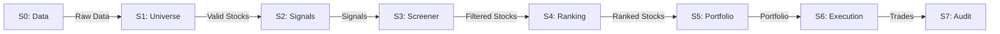

# Modules (모듈 설계)

이 폴더는 v14 시스템의 각 모듈별 상세 설계 문서를 포함합니다.

---

## 📋 모듈 목록

### 7단계 파이프라인 (S0-S7)

```
S0 → S1 → S2 → S3 → S4 → S5 → S6 → S7
```

| Stage | 모듈 | 문서 | 책임 |
|-------|------|------|------|
| S0 | Data Quality | `s0-data-quality.md` | 데이터 수집/검증 |
| S1 | Universe | `s1-universe.md` | 투자 가능 종목 선정 |
| S2 | Signals | `s2-signals.md` | 팩터/이벤트 시그널 생성 |
| S3 | Screener | `s3-screener.md` | 1차 필터링 (Hard Cut) |
| S4 | Ranking | `s4-ranking.md` | 종합 점수 산출 및 순위 |
| S5 | Portfolio | `s5-portfolio.md` | 포트폴리오 구성 |
| S6 | Execution | `s6-execution.md` | 주문 실행 및 청산 |
| S7 | Audit | `s7-audit.md` | 성과 분석 및 감사 |

### 지원 모듈

| 모듈 | 문서 | 책임 |
|------|------|------|
| External APIs | `external-apis.md` | KIS, DART, Naver 등 외부 API 연동 |
| Brain (Orchestrator) | `brain-orchestrator.md` | 전체 파이프라인 오케스트레이션 |

---

## 🎯 모듈 설계 원칙

### 1. 독립성 (Independence)
- 각 모듈은 독립적으로 테스트 가능
- 다른 모듈은 인터페이스를 통해서만 참조

### 2. 단일 책임 (Single Responsibility)
- 각 모듈은 하나의 명확한 책임만 가짐
- 책임 범위를 넘는 로직은 다른 모듈로 분리

### 3. 의존성 방향 (Dependency Direction)
```
S0 ← S1 ← S2 ← S3 ← S4 ← S5 ← S6 ← S7
(하위 레이어는 상위 레이어를 모름)
```

### 4. 인터페이스 우선 (Interface-First)
- 구현보다 인터페이스를 먼저 설계
- 모듈 간 계약을 명확히 정의

---

## 📝 모듈 설계 템플릿 사용법

각 모듈 문서는 다음 구조를 따라야 합니다:

```markdown
# [모듈명] 설계

## 개요
- 책임
- 위치
- 의존성

## 인터페이스 설계
- 외부 제공 인터페이스
- 내부 의존 인터페이스

## 데이터 모델
- 입력
- 출력

## 처리 흐름
1. 단계별 설명

## 에러 처리
| 에러 | 조건 | 처리 |

## 성능 고려사항
## 보안 고려사항
## 테스트 전략
```

자세한 템플릿은 [CLAUDE.md](../../CLAUDE.md)를 참고하세요.

---

## 🔄 모듈 간 데이터 흐름



---

## 🚀 작성 순서 (권장)

### Phase 1: 데이터 파이프라인 설계
1. `s0-data-quality.md`
2. `s1-universe.md`
3. `s2-signals.md`

### Phase 2: 선택 로직 설계
4. `s3-screener.md`
5. `s4-ranking.md`

### Phase 3: 실행 로직 설계
6. `s5-portfolio.md`
7. `s6-execution.md`

### Phase 4: 분석 및 지원 설계
8. `s7-audit.md`
9. `external-apis.md`
10. `brain-orchestrator.md`

---

## ✅ 설계 검증 체크리스트

각 모듈 설계 완료 시:

- [ ] 인터페이스가 명확하게 정의됨
- [ ] 의존성 방향이 올바름 (순환 참조 없음)
- [ ] 데이터 모델이 구체적임
- [ ] 에러 처리 전략이 정의됨
- [ ] 다른 모듈과 일관성 유지
- [ ] 구현 가능한 수준으로 구체적임

---

## 🔗 참고

- [CLAUDE.md](../../CLAUDE.md) - 모듈 설계 템플릿
- [architecture/](../architecture/) - 전체 아키텍처
- [database/](../database/) - DB 스키마
- v10/v13 모듈 설계 (참고용)
