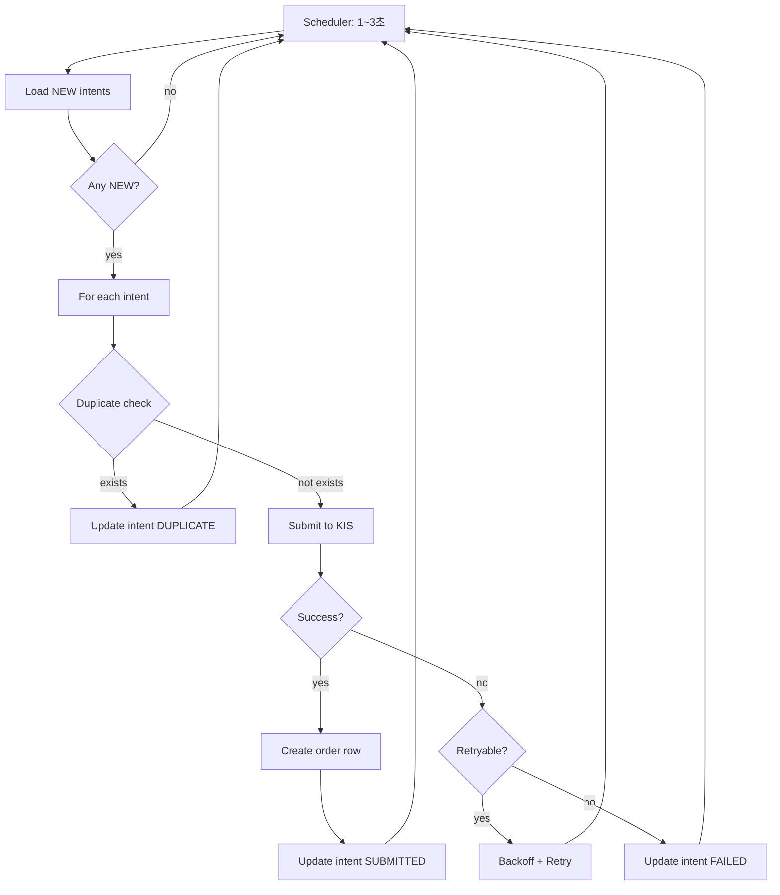
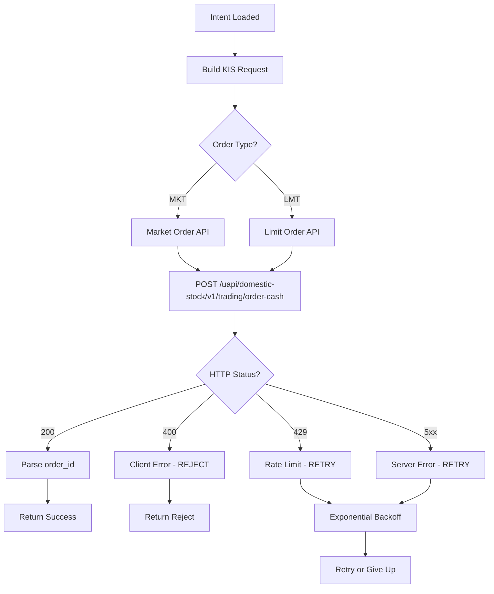
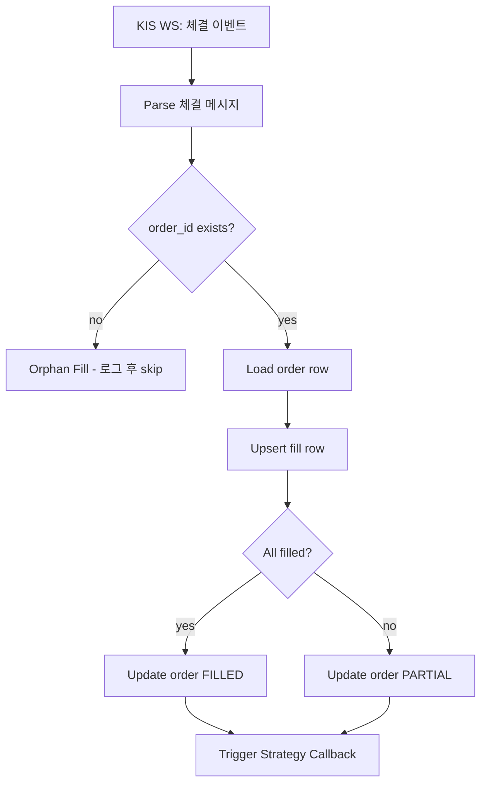
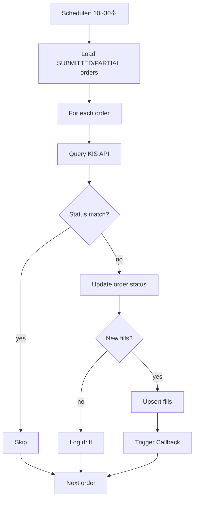

# Execution Service 모듈 설계

> 주문 제출 및 체결 관리

---

## 📐 Runtime Map (이 문서 범위)

```
┌──────────────────────────────────────────────────────────────┐
│                        Quant Runtime                          │
├──────────────────┬───────────────────────┬───────────────────┤
│ PriceSync         │ Strategy Engine       │ >>> Execution <<< │
│ (WS/REST/Naver)   │ (Exit/Reentry/Risk)   │ (KIS Orders/Fills) │
└─────────┬────────┴──────────┬────────────┴─────────┬─────────┘
          │                   │                      │
          ▼                   ▼                      ▼
  market.prices_*      trade.order_intents      trade.orders
  market.freshness                              trade.fills
                            │                        │
                            └────────────────────────┴──► Monitoring
```

---

## 🎯 모듈 책임 (SSOT)

### 이 모듈이 소유하는 것 (유일한 소유자)

✅ **데이터:**
- `trade.orders` - 브로커 주문 상태
- `trade.fills` - 체결 내역

✅ **로직:**
- order_intents → KIS API 주문 변환
- 주문 제출 및 추적
- 체결 수신 및 기록
- 주문 상태 동기화 (Reconciliation)
- 주문 실패 재시도

### 다른 모듈과의 경계

❌ **Execution이 하지 않는 것:**
- 주문 의도 생성 → Strategy (Exit/Reentry)
- 가격 결정 → PriceSync
- 포지션 상태 관리 → Exit Engine

❌ **Execution이 접근하지 않는 것:**
- `market.*` 테이블 쓰기 (읽기만)
- `trade.position_state` 쓰기 (읽기만)
- `trade.reentry_candidates` 쓰기 (읽기만)

✅ **Execution이 읽을 수 있는 것:**
- `trade.order_intents` (주문 의도)
- `market.prices_best` (주문 가격 참조용, 선택)

---

## 🔌 Public Interface

### 1. 외부 제공 인터페이스

#### Output: orders (주문 상태)

```sql
-- Strategy가 조회하는 주문 상태
SELECT
    order_id,      -- KIS 주문번호
    intent_id,     -- 원본 의도 ID
    status,        -- SUBMITTED | FILLED | PARTIAL | REJECTED | CANCELLED
    submitted_ts,  -- 제출 시각
    raw            -- KIS API 응답 원본 (JSONB)
FROM trade.orders
WHERE intent_id = ?;
```

**계약:**
- `order_id`는 KIS 주문번호 (PK)
- `intent_id`는 FK (order_intents)
- `status`는 항상 최신 상태 반영
- `raw`는 감사/디버깅용 원본 데이터

#### Output: fills (체결 내역)

```sql
-- Strategy가 조회하는 체결 내역
SELECT
    fill_id,    -- 체결 고유 ID
    order_id,   -- 주문 ID
    ts,         -- 체결 시각
    qty,        -- 체결 수량
    price,      -- 체결 가격
    fee,        -- 수수료
    tax         -- 세금
FROM trade.fills
WHERE order_id = ?
ORDER BY ts ASC;
```

**계약:**
- `fill_id`는 중복 없는 고유 ID
- `order_id` 기준으로 체결 내역 집계 가능
- `ts`는 KIS 체결 시각 (정확)

### 2. 외부 의존 인터페이스

#### Input: order_intents (주문 의도)

```sql
-- Execution이 모니터링하는 테이블
SELECT * FROM trade.order_intents
WHERE status = 'NEW'
ORDER BY created_ts ASC;
```

**계약:**
- Strategy가 생성한 `status=NEW` 의도만 처리
- `action_key` 중복 방지 보장됨 (UNIQUE)
- `intent_type`, `qty`, `order_type` 필수

---

## 📊 데이터 모델

### trade.orders (주문 상태)

| 컬럼 | 타입 | 제약 | 설명 |
|------|------|------|------|
| order_id | TEXT | PK | KIS 주문번호 |
| intent_id | UUID | FK NOT NULL | 원본 의도 ID |
| submitted_ts | TIMESTAMPTZ | NOT NULL | 제출 시각 |
| status | TEXT | NOT NULL | 주문 상태 |
| raw | JSONB | NULL | KIS API 응답 원본 |
| updated_ts | TIMESTAMPTZ | NOT NULL | 마지막 갱신 |

**주문 상태 (status):**
- `SUBMITTED` - 제출됨 (체결 대기)
- `PARTIAL` - 일부 체결
- `FILLED` - 전량 체결
- `REJECTED` - 거부됨
- `CANCELLED` - 취소됨
- `ERROR` - 에러 (조회 필요)

### trade.fills (체결 내역)

| 컬럼 | 타입 | 제약 | 설명 |
|------|------|------|------|
| fill_id | UUID | PK | 체결 고유 ID |
| order_id | TEXT | FK NOT NULL | 주문 ID |
| ts | TIMESTAMPTZ | NOT NULL | 체결 시각 |
| qty | BIGINT | NOT NULL | 체결 수량 |
| price | NUMERIC | NOT NULL | 체결 가격 |
| fee | NUMERIC | NULL | 수수료 |
| tax | NUMERIC | NULL | 세금 |

**인덱스:**
```sql
CREATE INDEX idx_fills_order_ts ON trade.fills (order_id, ts DESC);
```

---

## 🔄 처리 흐름

### 1. Intent Monitor Loop



**주기**: 1~3초 (보유 포지션 기준, 빠른 청산 필요)

### 2. Order Submission (KIS API)



**KIS API 매핑:**

| intent_type | KIS 주문 구분 | 매수/매도 |
|-------------|--------------|----------|
| ENTRY | 현금매수 | 매수 |
| EXIT_PARTIAL | 현금매도 | 매도 |
| EXIT_FULL | 현금매도 | 매도 |

**재시도 정책:**

| 에러 | 재시도 | Backoff | 최대 횟수 |
|------|--------|---------|----------|
| 429 Rate Limit | ✅ | Exponential (1s, 2s, 4s) | 3회 |
| 5xx Server Error | ✅ | Exponential (2s, 4s, 8s) | 3회 |
| 4xx Client Error | ❌ | - | 즉시 실패 |
| Timeout | ✅ | Linear (5s) | 2회 |

### 3. Fill Receiver (체결 수신)



**체결 이벤트 소스:**
- KIS WebSocket (실시간 체결)
- KIS REST 주문 조회 (Reconciliation)

**Orphan Fill 처리:**
- 체결 메시지의 order_id가 orders 테이블에 없는 경우
- 원인: 프로세스 재시작, 누락, 타이밍
- 대응: 로그 기록 후 Reconciliation에서 복구

### 4. Reconciliation (주문 동기화)



**목적:**
- WS 누락 대응
- 주문 상태 drift 해결
- 프로세스 재시작 후 복구

**주기**: 10~30초 (WS 정상 시), 5초 (WS 장애 시)

---

## 🚨 에러 처리

### 1. API 장애 (Timeout, 5xx)

**증상**: KIS API 응답 없음 또는 서버 에러

**대응:**
1. Exponential backoff (2s → 4s → 8s)
2. 3회 재시도 후 실패
3. intent 상태 = FAILED
4. 알람 발송 (Critical)

### 2. 주문 거부 (4xx)

**증상**: 잔고 부족, 호가 이탈, 거래 정지 종목

**대응:**
1. 재시도 없이 즉시 실패
2. intent 상태 = REJECTED
3. 거부 사유 기록 (raw JSONB)
4. Strategy에 통지 (Callback)

### 3. 중복 제출 방지

**문제**: 동일 intent가 여러 번 제출됨

**해결:**
```sql
-- orders 테이블에 UNIQUE 제약
CREATE UNIQUE INDEX uq_orders_intent_id ON trade.orders (intent_id);
```
- 제출 전 intent_id로 orders 조회
- 이미 존재하면 SKIP

### 4. Orphan Order

**문제**: orders 테이블에 없는 주문 체결

**원인:**
- 프로세스 재시작 중 체결
- orders INSERT 실패 후 체결
- 수동 주문 (비권장)

**대응:**
1. 체결 메시지 로그 기록
2. Reconciliation 시 orders 복구
3. 수동 주문은 별도 마킹

---

## 🔒 SSOT 규칙 (금지 패턴)

### ❌ 절대 금지

1. **Strategy에서 KIS API 직접 호출**
   ```
   ❌ Exit Engine에서 KIS 주문 API 호출
   ❌ Reentry Engine에서 KIS 주문 API 호출

   ✅ order_intents만 생성
   ```

2. **Execution에서 order_intents 생성**
   ```
   ❌ Execution에서 order_intents INSERT

   ✅ order_intents는 Strategy만 생성
   ```

3. **Execution에서 포지션 상태 변경**
   ```
   ❌ Execution에서 positions.status 직접 변경
   ❌ Execution에서 position_state 변경

   ✅ fills만 기록, 상태 변경은 Strategy 책임
   ```

### ✅ 허용된 패턴

1. **Execution → Strategy 통지**
   ```
   ✅ 체결 완료 시 Callback/Event
   ✅ Strategy가 fills 조회
   ✅ Strategy가 포지션 상태 갱신
   ```

2. **Reconciliation**
   ```
   ✅ orders/fills 정합성 유지
   ✅ KIS API 조회로 상태 동기화
   ✅ Orphan order 복구
   ```

---

## 🎲 주문 매핑 규칙

### Intent → KIS API 매핑

| intent_type | order_type | KIS API | 비고 |
|-------------|-----------|---------|------|
| ENTRY | MKT | 현금매수 시장가 | 재진입 |
| ENTRY | LMT | 현금매수 지정가 | 재진입 (지정가) |
| EXIT_PARTIAL | MKT | 현금매도 시장가 | TP1/TP2/TP3 |
| EXIT_FULL | MKT | 현금매도 시장가 | SL/TRAIL |

### 수량 계산

```
주문 수량 = intent.qty
※ Strategy에서 계산 완료된 수량 사용
```

### 가격 결정

| order_type | 가격 결정 |
|-----------|----------|
| MKT | 시장가 (가격 없음) |
| LMT | intent.limit_price 사용 |

---

## 📏 성능 고려사항

### 1. Intent Monitor 주기

**권장**: 1~3초

| 상황 | 주기 | 이유 |
|------|------|------|
| 보유 포지션 많음 | 1초 | 빠른 청산 필요 |
| 보유 포지션 적음 | 3초 | API 부하 감소 |
| KIS Rate Limit | 5초+ | 제한 회피 |

### 2. Reconciliation 주기

**권장**: 10~30초 (WS 정상), 5초 (WS 장애)

**최적화:**
- SUBMITTED/PARTIAL 주문만 조회
- Batch API 사용 (가능 시)
- 캐시로 중복 조회 방지

### 3. Fill 중복 방지

**문제**: 동일 체결이 WS + REST로 중복 수신

**해결:**
```sql
-- fill_id는 KIS 체결번호 기반 생성
-- 중복 INSERT 시 UPSERT로 처리
INSERT INTO trade.fills (fill_id, ...) VALUES (...)
ON CONFLICT (fill_id) DO NOTHING;
```

---

## 🧪 테스트 전략

### 1. 단위 테스트

- Intent → KIS Request 변환
- KIS Response → Order/Fill 파싱
- 에러 응답 처리
- 재시도 로직

### 2. 통합 테스트

- Intent 생성 → 주문 제출 → Fill 수신
- API 장애 시 재시도
- Orphan order 복구
- Reconciliation 정합성

### 3. E2E 테스트 (모의 거래)

- KIS 모의투자 API 사용
- 실제 주문/체결 시뮬레이션
- Rate Limit 테스트
- 장애 복구 시나리오

---

## 📊 설계 완료 기준

- [ ] 입력/출력 인터페이스 명확히 정의
- [ ] 데이터 모델 (orders, fills) 완성
- [ ] 주문 제출 흐름 정의
- [ ] 체결 수신 흐름 정의
- [ ] Reconciliation 정책 정의
- [ ] 에러 처리 시나리오 정의
- [ ] SSOT 규칙 (소유권/금지) 명시
- [ ] 성능 고려사항 검토

---

## 🔗 관련 문서

- [system-overview.md](../architecture/system-overview.md) - 전체 시스템
- [exit-engine.md](./exit-engine.md) - Exit Engine (Execution 사용자)
- [reentry-engine.md](./reentry-engine.md) - Reentry Engine (Execution 사용자)
- [schema.md](../database/schema.md) - DB 스키마

---

**Module Owner**: Execution Service
**Dependencies**: PriceSync (가격 참조, 선택), Strategy (order_intents)
**Version**: v14.0.0-design
**Last Updated**: 2026-01-13
