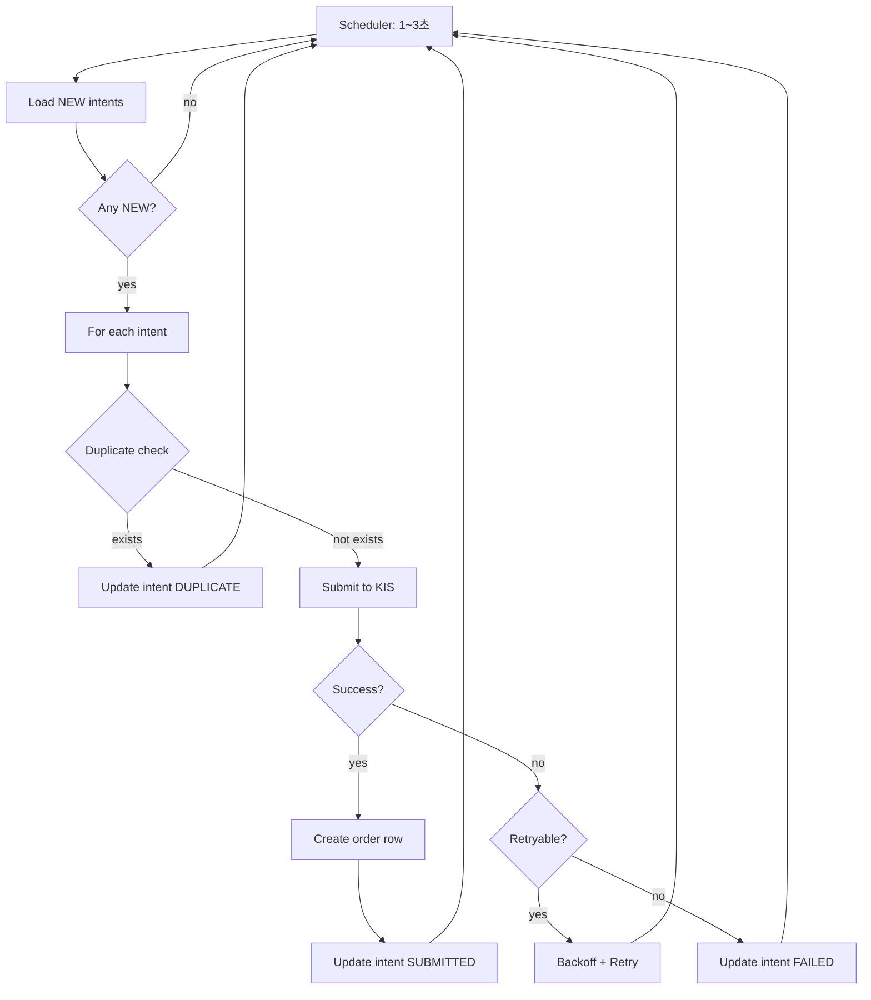
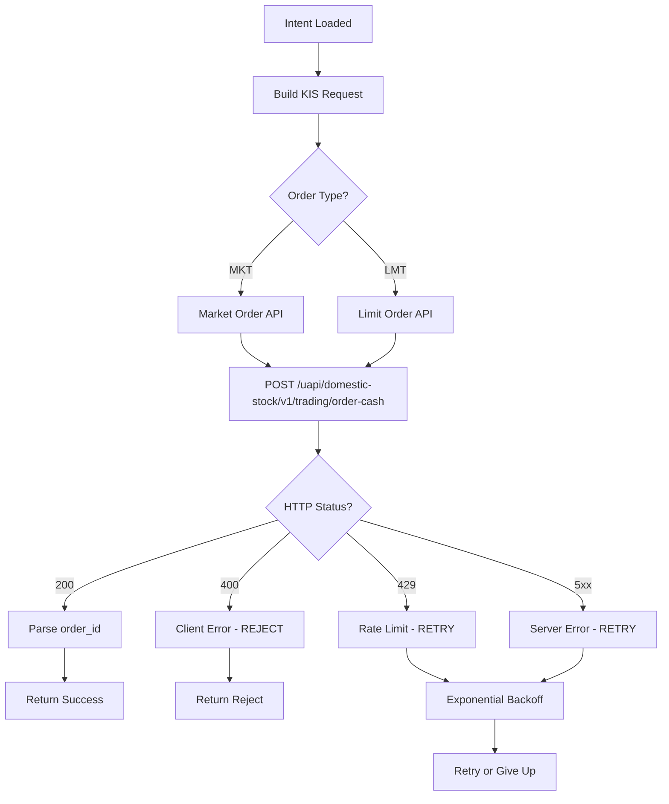
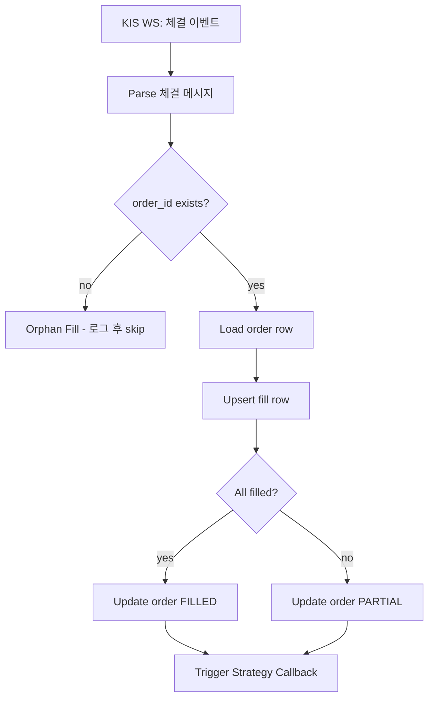
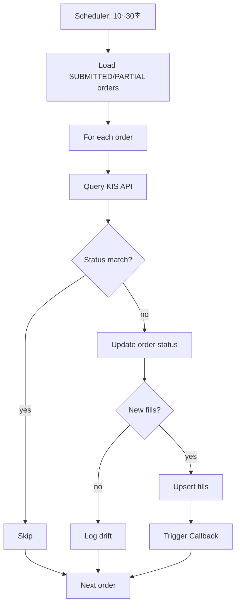
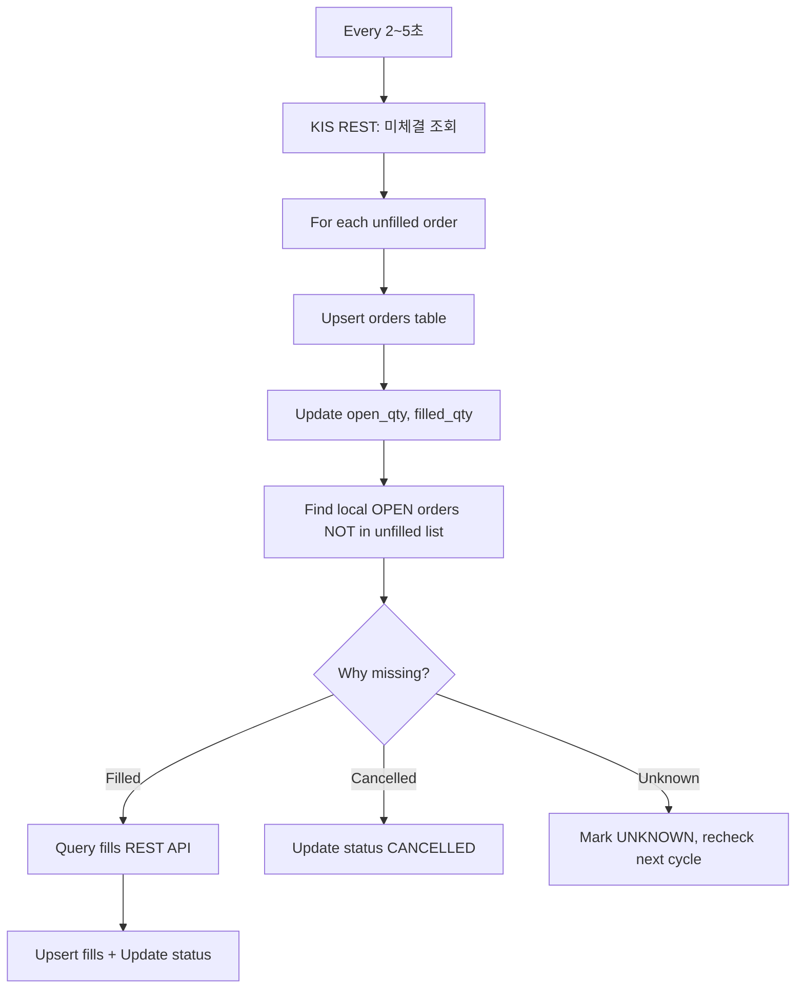
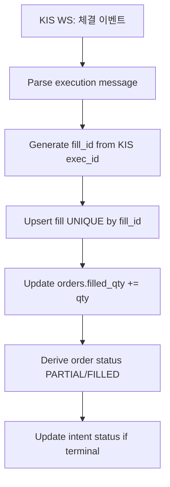
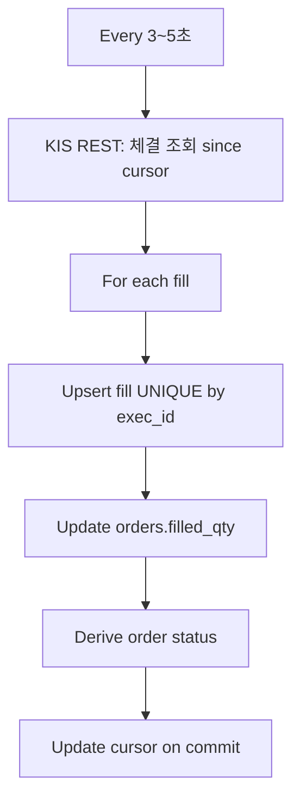
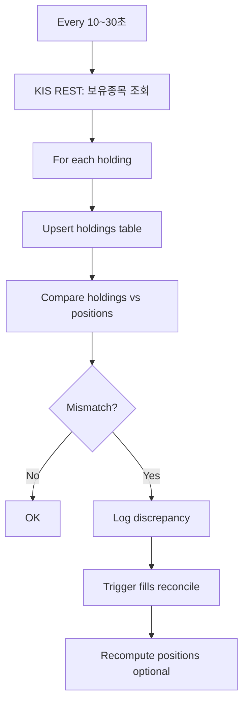
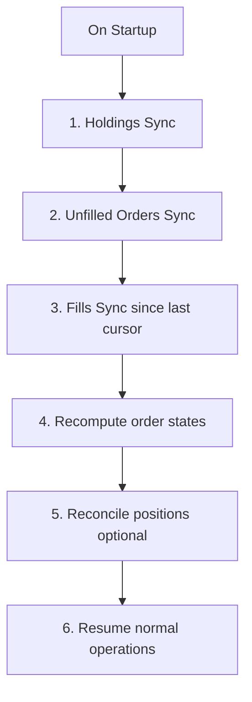

# Execution Service 모듈 설계

> 주문 제출 및 체결 관리

---

## 📐 Runtime Map (이 문서 범위)

```
┌──────────────────────────────────────────────────────────────┐
│                        Quant Runtime                          │
├──────────────────┬───────────────────────┬───────────────────┤
│ PriceSync         │ Strategy Engine       │ >>> Execution <<< │
│ (WS/REST/Naver)   │ (Exit/Reentry/Risk)   │ (KIS Orders/Fills) │
└─────────┬────────┴──────────┬────────────┴─────────┬─────────┘
          │                   │                      │
          ▼                   ▼                      ▼
  market.prices_*      trade.order_intents      trade.orders
  market.freshness                              trade.fills
                            │                        │
                            └────────────────────────┴──► Monitoring
```

---

## 🎯 모듈 책임 (SSOT)

### 이 모듈이 소유하는 것 (유일한 소유자)

✅ **데이터:**
- `trade.orders` - 브로커 주문 상태
- `trade.fills` - 체결 내역
- `trade.holdings` - 보유종목 (KIS 보유 현황)

✅ **로직:**
- order_intents → KIS API 주문 변환
- 주문 제출 및 추적
- 체결 수신 및 기록 (WS + REST)
- **미체결 조회 및 동기화** (Unfilled Orders)
- **부분체결 추적** (Partial Fills)
- **보유종목 동기화** (Holdings = 최종 진실)
- 주문 상태 동기화 (Reconciliation)
- 주문 실패 재시도
- **재시작 복구** (Bootstrap from KIS)

### 다른 모듈과의 경계

❌ **Execution이 하지 않는 것:**
- 주문 의도 생성 → Strategy (Exit/Reentry)
- 가격 결정 → PriceSync
- 포지션 상태 관리 → Exit Engine

❌ **Execution이 접근하지 않는 것:**
- `market.*` 테이블 쓰기 (읽기만)
- `trade.position_state` 쓰기 (읽기만)
- `trade.reentry_candidates` 쓰기 (읽기만)

✅ **Execution이 읽을 수 있는 것:**
- `trade.order_intents` (주문 의도)
- `market.prices_best` (주문 가격 참조용, 선택)

---

## 🔌 Public Interface

### 1. 외부 제공 인터페이스

#### Output: orders (주문 상태)

```sql
-- Strategy가 조회하는 주문 상태
SELECT
    order_id,      -- KIS 주문번호
    intent_id,     -- 원본 의도 ID
    status,        -- SUBMITTED | FILLED | PARTIAL | REJECTED | CANCELLED
    submitted_ts,  -- 제출 시각
    raw            -- KIS API 응답 원본 (JSONB)
FROM trade.orders
WHERE intent_id = ?;
```

**계약:**
- `order_id`는 KIS 주문번호 (PK)
- `intent_id`는 FK (order_intents)
- `status`는 항상 최신 상태 반영
- `raw`는 감사/디버깅용 원본 데이터

#### Output: fills (체결 내역)

```sql
-- Strategy가 조회하는 체결 내역
SELECT
    fill_id,    -- 체결 고유 ID
    order_id,   -- 주문 ID
    ts,         -- 체결 시각
    qty,        -- 체결 수량
    price,      -- 체결 가격
    fee,        -- 수수료
    tax         -- 세금
FROM trade.fills
WHERE order_id = ?
ORDER BY ts ASC;
```

**계약:**
- `fill_id`는 중복 없는 고유 ID
- `order_id` 기준으로 체결 내역 집계 가능
- `ts`는 KIS 체결 시각 (정확)

### 2. 외부 의존 인터페이스

#### Input: order_intents (주문 의도)

```sql
-- Execution이 모니터링하는 테이블
SELECT * FROM trade.order_intents
WHERE status = 'NEW'
ORDER BY created_ts ASC;
```

**계약:**
- Strategy가 생성한 `status=NEW` 의도만 처리
- `action_key` 중복 방지 보장됨 (UNIQUE)
- `intent_type`, `qty`, `order_type` 필수

---

## 📊 데이터 모델

### trade.orders (주문 상태)

| 컬럼 | 타입 | 제약 | 설명 |
|------|------|------|------|
| order_id | TEXT | PK | KIS 주문번호 |
| intent_id | UUID | FK NOT NULL | 원본 의도 ID |
| submitted_ts | TIMESTAMPTZ | NOT NULL | 제출 시각 |
| status | TEXT | NOT NULL | 주문 상태 |
| raw | JSONB | NULL | KIS API 응답 원본 |
| updated_ts | TIMESTAMPTZ | NOT NULL | 마지막 갱신 |

**주문 상태 (status):**
- `SUBMITTED` - 제출됨 (체결 대기)
- `PARTIAL` - 일부 체결
- `FILLED` - 전량 체결
- `REJECTED` - 거부됨
- `CANCELLED` - 취소됨
- `ERROR` - 에러 (조회 필요)

### trade.fills (체결 내역)

| 컬럼 | 타입 | 제약 | 설명 |
|------|------|------|------|
| fill_id | UUID | PK | 체결 고유 ID |
| order_id | TEXT | FK NOT NULL | 주문 ID |
| ts | TIMESTAMPTZ | NOT NULL | 체결 시각 |
| qty | BIGINT | NOT NULL | 체결 수량 |
| price | NUMERIC | NOT NULL | 체결 가격 |
| fee | NUMERIC | NULL | 수수료 |
| tax | NUMERIC | NULL | 세금 |

**인덱스:**
```sql
CREATE INDEX idx_fills_order_ts ON trade.fills (order_id, ts DESC);
```

### trade.holdings (보유종목)

**목적**: KIS 보유 현황 = 포지션 최종 진실

| 컬럼 | 타입 | 제약 | 설명 |
|------|------|------|------|
| account_id | TEXT | PK | 계좌번호 |
| symbol | TEXT | PK | 종목 코드 |
| qty | BIGINT | NOT NULL | 보유 수량 |
| avg_price | NUMERIC | NOT NULL | 평균 단가 |
| current_price | NUMERIC | NULL | 현재가 (참고용) |
| pnl | NUMERIC | NULL | 평가손익 |
| pnl_pct | FLOAT | NULL | 수익률 (%) |
| updated_ts | TIMESTAMPTZ | NOT NULL | 마지막 동기화 시각 |
| raw | JSONB | NULL | KIS API 원본 |

**복합 PK:**
```sql
PRIMARY KEY (account_id, symbol)
```

**중요**: holdings는 KIS REST API `/inquire-balance`로부터 동기화되며, **positions와 별도로 관리**됩니다.
- `holdings`: KIS가 말하는 진실 (브로커 현황)
- `positions`: 내부 전략이 추적하는 포지션 (전략 현황)

---

## 🔄 처리 흐름

### 1. Intent Monitor Loop



**주기**: 1~3초 (보유 포지션 기준, 빠른 청산 필요)

### 2. Order Submission (KIS API)



**KIS API 매핑:**

| intent_type | KIS 주문 구분 | 매수/매도 |
|-------------|--------------|----------|
| ENTRY | 현금매수 | 매수 |
| EXIT_PARTIAL | 현금매도 | 매도 |
| EXIT_FULL | 현금매도 | 매도 |

**재시도 정책:**

| 에러 | 재시도 | Backoff | 최대 횟수 |
|------|--------|---------|----------|
| 429 Rate Limit | ✅ | Exponential (1s, 2s, 4s) | 3회 |
| 5xx Server Error | ✅ | Exponential (2s, 4s, 8s) | 3회 |
| 4xx Client Error | ❌ | - | 즉시 실패 |
| Timeout | ✅ | Linear (5s) | 2회 |

### 3. Fill Receiver (체결 수신)



**체결 이벤트 소스:**
- KIS WebSocket (실시간 체결)
- KIS REST 주문 조회 (Reconciliation)

**Orphan Fill 처리:**
- 체결 메시지의 order_id가 orders 테이블에 없는 경우
- 원인: 프로세스 재시작, 누락, 타이밍
- 대응: 로그 기록 후 Reconciliation에서 복구

### 4. Reconciliation (주문 동기화)



**목적:**
- WS 누락 대응
- 주문 상태 drift 해결
- 프로세스 재시작 후 복구

**주기**: 10~30초 (WS 정상 시), 5초 (WS 장애 시)

---

## 🔄 KIS Sync 전략 (WebSocket + REST 결합)

### 핵심 원칙: Eventual Consistency with Strong Idempotency

KIS 주문/체결/보유 데이터는 **두 가지 소스**에서 수집됩니다:

| 소스 | 장점 | 단점 | 역할 |
|------|------|------|------|
| **WebSocket** | 저지연 (실시간) | 유실/중복 가능, 재연결 필요 | 빠른 반영 |
| **REST API** | 정확한 최종 상태 | 지연 (폴링 주기), Rate Limit | 정합성 보정 |

**설계 전략**:
1. **WS 우선**: 실시간 이벤트로 즉시 반영 (저지연)
2. **REST 보정**: 주기적으로 최종 상태 확인 및 교정
3. **멱등 처리**: 모든 쓰기는 UPSERT + Unique Key (중복 안전)
4. **재시작 안전**: Bootstrap 시 REST로 전체 상태 복구

---

### 5.1 주문 상태 Reducer (중요!)

주문의 **최종 상태**는 **orders.status + fills 집계**로 결정됩니다.

```go
func DeriveOrderStatus(order Order, fills []Fill) OrderStatus {
    totalFilled := sum(fills, func(f Fill) int64 { return f.Qty })
    openQty := order.Qty - totalFilled

    // 1. 전량 체결
    if totalFilled >= order.Qty {
        return FILLED
    }

    // 2. 부분 체결
    if totalFilled > 0 && openQty > 0 {
        return PARTIAL
    }

    // 3. 미체결
    if totalFilled == 0 {
        // 브로커 상태 그대로 반영
        if order.BrokerStatus == "CANCELLED" {
            return CANCELLED
        }
        if order.BrokerStatus == "REJECTED" {
            return REJECTED
        }
        return order.BrokerStatus  // SUBMITTED, ACK, OPEN
    }

    // 4. 부분 체결 + 취소 (CANCELLED_PARTIAL)
    if totalFilled > 0 && order.BrokerStatus == "CANCELLED" {
        return CANCELLED_PARTIAL
    }

    return UNKNOWN  // 이상 케이스
}
```

---

### 5.2 미체결 동기화 (Unfilled Orders)

**목적**: WS 이벤트 유실/지연 대응 → **열려있는 주문의 최종 진실 확보**



**KIS API**: `GET /uapi/domestic-stock/v1/trading/inquire-psbl-order` (미체결 조회)

**처리 로직**:

```go
func (s *ExecutionService) SyncUnfilledOrders(ctx context.Context) error {
    // 1. KIS 미체결 리스트 조회
    unfilledOrders, err := s.kisAdapter.GetUnfilledOrders(ctx)
    if err != nil {
        return fmt.Errorf("fetch unfilled failed: %w", err)
    }

    // 2. Upsert orders (멱등)
    for _, uo := range unfilledOrders {
        err := s.store.UpsertOrder(ctx, Order{
            OrderID:    uo.OrderID,
            IntentID:   s.findIntentID(uo.OrderID),  // 역참조
            Status:     "OPEN",
            OpenQty:    uo.OpenQty,
            FilledQty:  uo.FilledQty,
            UpdatedTs:  time.Now(),
            Raw:        uo.Raw,
        })
        if err != nil {
            log.Error("upsert unfilled order failed", "order_id", uo.OrderID, "error", err)
        }
    }

    // 3. Local OPEN 주문 중 unfilled 리스트에 없는 것 찾기
    localOpen, err := s.store.LoadOrders(ctx, OrderFilter{
        Status: []string{"SUBMITTED", "OPEN", "PARTIAL"},
    })
    if err != nil {
        return err
    }

    unfilledSet := makeSet(unfilledOrders, func(o Order) string { return o.OrderID })

    for _, lo := range localOpen {
        if !unfilledSet.Has(lo.OrderID) {
            // 미체결 리스트에 없음 → 체결 or 취소 확인
            fills, err := s.kisAdapter.GetFillsForOrder(ctx, lo.OrderID)
            if err != nil {
                log.Warn("query fills failed", "order_id", lo.OrderID, "error", err)
                continue
            }

            if len(fills) > 0 {
                // 체결됨 → fills 반영
                for _, f := range fills {
                    s.store.UpsertFill(ctx, f)
                }
                s.updateOrderStatus(ctx, lo.OrderID)
            } else {
                // 체결도 없음 → 취소 or UNKNOWN
                s.store.UpdateOrderStatus(ctx, lo.OrderID, "UNKNOWN")
                log.Warn("order missing in unfilled with no fills", "order_id", lo.OrderID)
            }
        }
    }

    return nil
}
```

**주기**:
- 활성 주문 존재: **2~5초**
- 활성 주문 없음: **10~30초**
- WS 단절 감지 시: **1~2초** (임시 승격)

---

### 5.3 체결 동기화 (Fills - 멱등성 필수!)

**목적**: 체결 이벤트 중복 수신 대응 → **Unique Key로 dedupe**

#### A. WebSocket 체결 (실시간)



**멱등성 키 (Critical!)**:

```sql
-- 방법 1: KIS 체결번호 (exec_id) 사용 (권장)
CREATE UNIQUE INDEX uq_fills_exec_id ON trade.fills (order_id, kis_exec_id);

-- 방법 2: 시각 + 순번
CREATE UNIQUE INDEX uq_fills_ts_seq ON trade.fills (order_id, ts, seq);

-- 방법 3: 가격 + 수량 + 시각 (충돌 가능성 높음, 비권장)
CREATE UNIQUE INDEX uq_fills_price_qty_ts ON trade.fills (order_id, price, qty, ts);
```

**Go 코드 (Upsert)**:

```go
func (s *ExecutionService) HandleWsFillEvent(ctx context.Context, event WsFillEvent) error {
    fill := Fill{
        FillID:    event.ExecID,  // KIS 체결번호를 그대로 사용
        OrderID:   event.OrderID,
        Ts:        event.Ts,
        Qty:       event.Qty,
        Price:     event.Price,
        Fee:       event.Fee,
        Tax:       event.Tax,
    }

    // Upsert (중복 시 무시)
    err := s.store.UpsertFill(ctx, fill)
    if err != nil {
        return fmt.Errorf("upsert fill failed: %w", err)
    }

    // Update order filled_qty
    err = s.store.IncrementFilledQty(ctx, event.OrderID, event.Qty)
    if err != nil {
        return err
    }

    // Derive status
    order, _ := s.store.LoadOrder(ctx, event.OrderID)
    fills, _ := s.store.LoadFills(ctx, event.OrderID)
    newStatus := DeriveOrderStatus(order, fills)

    s.store.UpdateOrderStatus(ctx, event.OrderID, newStatus)

    return nil
}
```

#### B. REST 체결 보정 (WS 유실 대응)



**KIS API**: `GET /uapi/domestic-stock/v1/trading/inquire-ccnl` (체결 내역)

**Cursor 관리 (정확히 한 번 처리)**:

```go
type FillCursor struct {
    LastTs  time.Time
    LastSeq int
}

func (s *ExecutionService) SyncFillsSinceCursor(ctx context.Context) error {
    cursor := s.loadCursor(ctx)  // DB에서 로드

    fills, err := s.kisAdapter.GetFillsSince(ctx, cursor.LastTs)
    if err != nil {
        return err
    }

    tx, err := s.db.BeginTx(ctx, nil)
    if err != nil {
        return err
    }
    defer tx.Rollback()

    newCursor := cursor
    for _, f := range fills {
        // Upsert fill
        err := s.store.UpsertFillTx(tx, f)
        if err != nil {
            return err
        }

        // Update cursor
        if f.Ts.After(newCursor.LastTs) {
            newCursor.LastTs = f.Ts
            newCursor.LastSeq = f.Seq
        }
    }

    // Cursor 저장 (commit 이후에만 반영)
    err = s.saveCursorTx(tx, newCursor)
    if err != nil {
        return err
    }

    return tx.Commit()
}
```

---

### 5.4 보유종목 동기화 (Holdings = 최종 진실)

**목적**: KIS 보유 현황 = 포지션의 **최종 진실** → Mismatch 감지 및 복구



**KIS API**: `GET /uapi/domestic-stock/v1/trading/inquire-balance` (잔고 조회)

**처리 로직**:

```go
func (s *ExecutionService) SyncHoldings(ctx context.Context) error {
    // 1. KIS 보유종목 조회
    holdings, err := s.kisAdapter.GetHoldings(ctx)
    if err != nil {
        return fmt.Errorf("fetch holdings failed: %w", err)
    }

    // 2. Upsert holdings
    for _, h := range holdings {
        err := s.store.UpsertHolding(ctx, Holding{
            AccountID:    h.AccountID,
            Symbol:       h.Symbol,
            Qty:          h.Qty,
            AvgPrice:     h.AvgPrice,
            CurrentPrice: h.CurrentPrice,
            Pnl:          h.Pnl,
            PnlPct:       h.PnlPct,
            UpdatedTs:    time.Now(),
            Raw:          h.Raw,
        })
        if err != nil {
            log.Error("upsert holding failed", "symbol", h.Symbol, "error", err)
        }
    }

    // 3. Mismatch 감지 (holdings vs positions)
    positions, err := s.store.LoadPositions(ctx, PositionFilter{
        Status: []string{"OPEN"},
    })
    if err != nil {
        return err
    }

    holdingsMap := makeMap(holdings, func(h Holding) string { return h.Symbol })

    for _, pos := range positions {
        holding, exists := holdingsMap[pos.Symbol]

        if !exists {
            // 포지션은 있는데 보유종목 없음 → 전량 청산됨?
            log.Warn("position without holding", "position_id", pos.PositionID, "symbol", pos.Symbol)
            s.alerter.Send(Alert{
                Level:   "WARNING",
                Message: "Position exists but holding is zero",
                Data:    map[string]interface{}{"position_id": pos.PositionID, "symbol": pos.Symbol},
            })
            continue
        }

        // 수량 불일치 확인
        if holding.Qty != pos.Qty {
            log.Warn("qty mismatch",
                "symbol", pos.Symbol,
                "position_qty", pos.Qty,
                "holding_qty", holding.Qty,
                "diff", holding.Qty-pos.Qty)

            // Fills reconcile 강제 실행
            s.reconcileFills(ctx, pos.PositionID)

            // 운영 정책에 따라 positions 재계산 (수동/자동)
            // s.recomputePosition(ctx, pos.PositionID, holding.Qty)
        }
    }

    return nil
}
```

**주기**:
- 장중: **10~30초** (계좌/부하에 따라)
- 장마감 후: **60~120초** 또는 1회 정리

---

### 5.5 재시작 복구 (Bootstrap)

**목적**: 프로세스 재시작 시 KIS로부터 전체 상태 복구



**Bootstrap 절차**:

```go
func (s *ExecutionService) Bootstrap(ctx context.Context) error {
    log.Info("Starting bootstrap from KIS...")

    // 1. Holdings Sync (최우선: 최종 진실)
    if err := s.SyncHoldings(ctx); err != nil {
        return fmt.Errorf("bootstrap holdings failed: %w", err)
    }
    log.Info("Holdings synced")

    // 2. Unfilled Orders Sync
    if err := s.SyncUnfilledOrders(ctx); err != nil {
        return fmt.Errorf("bootstrap unfilled failed: %w", err)
    }
    log.Info("Unfilled orders synced")

    // 3. Fills Sync (since 오늘 장 시작 or 최근 거래일)
    todayStart := time.Now().Truncate(24 * time.Hour)
    cursor := FillCursor{LastTs: todayStart}
    s.saveCursor(ctx, cursor)  // Reset cursor

    if err := s.SyncFillsSinceCursor(ctx); err != nil {
        return fmt.Errorf("bootstrap fills failed: %w", err)
    }
    log.Info("Fills synced")

    // 4. Recompute order states
    orders, err := s.store.LoadOrders(ctx, OrderFilter{
        Status: []string{"SUBMITTED", "OPEN", "PARTIAL"},
    })
    if err != nil {
        return err
    }

    for _, order := range orders {
        fills, _ := s.store.LoadFills(ctx, order.OrderID)
        newStatus := DeriveOrderStatus(order, fills)
        s.store.UpdateOrderStatus(ctx, order.OrderID, newStatus)
    }
    log.Info("Order states recomputed", "count", len(orders))

    // 5. Reconcile positions (optional, 운영 정책에 따라)
    // s.ReconcilePositionsFromHoldings(ctx)

    log.Info("Bootstrap completed successfully")
    return nil
}
```

**WS 재연결 시**:
- Bootstrap 전체 재실행 불필요
- Unfilled + Fills sync만 1회 실행
- 정상 주기로 복귀

---

### 5.6 동시성/트랜잭션 전략

**원칙**: `order_id` 단위 직렬화 (동일 주문에 대한 동시 쓰기 방지)

#### A. PostgreSQL Advisory Lock (권장)

```go
func (s *ExecutionService) ProcessFillWithLock(ctx context.Context, fill Fill) error {
    lockID := hashOrderID(fill.OrderID)  // order_id를 int64로 해시

    // Advisory lock 획득 (트랜잭션 종료 시 자동 해제)
    _, err := s.db.ExecContext(ctx, "SELECT pg_advisory_xact_lock($1)", lockID)
    if err != nil {
        return fmt.Errorf("acquire lock failed: %w", err)
    }

    tx, err := s.db.BeginTx(ctx, nil)
    if err != nil {
        return err
    }
    defer tx.Rollback()

    // 1. Upsert fill
    err = s.store.UpsertFillTx(tx, fill)
    if err != nil {
        return err
    }

    // 2. Update orders.filled_qty
    err = s.store.IncrementFilledQtyTx(tx, fill.OrderID, fill.Qty)
    if err != nil {
        return err
    }

    // 3. Derive status
    order, _ := s.store.LoadOrderTx(tx, fill.OrderID)
    fills, _ := s.store.LoadFillsTx(tx, fill.OrderID)
    newStatus := DeriveOrderStatus(order, fills)

    err = s.store.UpdateOrderStatusTx(tx, fill.OrderID, newStatus)
    if err != nil {
        return err
    }

    // 4. Update intent if terminal
    if newStatus.IsTerminal() {
        err = s.store.UpdateIntentStatusTx(tx, order.IntentID, "FILLED")
        if err != nil {
            return err
        }
    }

    return tx.Commit()
}
```

#### B. SELECT FOR UPDATE (대안)

```go
func (s *ExecutionService) ProcessFillWithRowLock(ctx context.Context, fill Fill) error {
    tx, err := s.db.BeginTx(ctx, nil)
    if err != nil {
        return err
    }
    defer tx.Rollback()

    // Row-level lock
    var order Order
    err = tx.QueryRowContext(ctx, `
        SELECT * FROM trade.orders
        WHERE order_id = $1
        FOR UPDATE
    `, fill.OrderID).Scan(&order)
    if err != nil {
        return err
    }

    // ... (동일한 처리)

    return tx.Commit()
}
```

---

## 🚨 에러 처리

### 1. API 장애 (Timeout, 5xx)

**증상**: KIS API 응답 없음 또는 서버 에러

**대응:**
1. Exponential backoff (2s → 4s → 8s)
2. 3회 재시도 후 실패
3. intent 상태 = FAILED
4. 알람 발송 (Critical)

### 2. 주문 거부 (4xx)

**증상**: 잔고 부족, 호가 이탈, 거래 정지 종목

**대응:**
1. 재시도 없이 즉시 실패
2. intent 상태 = REJECTED
3. 거부 사유 기록 (raw JSONB)
4. Strategy에 통지 (Callback)

### 3. 중복 제출 방지

**문제**: 동일 intent가 여러 번 제출됨

**해결:**
```sql
-- orders 테이블에 UNIQUE 제약
CREATE UNIQUE INDEX uq_orders_intent_id ON trade.orders (intent_id);
```
- 제출 전 intent_id로 orders 조회
- 이미 존재하면 SKIP

### 4. Orphan Order

**문제**: orders 테이블에 없는 주문 체결

**원인:**
- 프로세스 재시작 중 체결
- orders INSERT 실패 후 체결
- 수동 주문 (비권장)

**대응:**
1. 체결 메시지 로그 기록
2. Reconciliation 시 orders 복구
3. 수동 주문은 별도 마킹

---

## 🔒 SSOT 규칙 (금지 패턴)

### ❌ 절대 금지

1. **Strategy에서 KIS API 직접 호출**
   ```
   ❌ Exit Engine에서 KIS 주문 API 호출
   ❌ Reentry Engine에서 KIS 주문 API 호출

   ✅ order_intents만 생성
   ```

2. **Execution에서 order_intents 생성**
   ```
   ❌ Execution에서 order_intents INSERT

   ✅ order_intents는 Strategy만 생성
   ```

3. **Execution에서 포지션 상태 변경**
   ```
   ❌ Execution에서 positions.status 직접 변경
   ❌ Execution에서 position_state 변경

   ✅ fills만 기록, 상태 변경은 Strategy 책임
   ```

### ✅ 허용된 패턴

1. **Execution → Strategy 통지**
   ```
   ✅ 체결 완료 시 Callback/Event
   ✅ Strategy가 fills 조회
   ✅ Strategy가 포지션 상태 갱신
   ```

2. **Reconciliation**
   ```
   ✅ orders/fills 정합성 유지
   ✅ KIS API 조회로 상태 동기화
   ✅ Orphan order 복구
   ```

---

## 🎲 주문 매핑 규칙

### Intent → KIS API 매핑

| intent_type | order_type | KIS API | 비고 |
|-------------|-----------|---------|------|
| ENTRY | MKT | 현금매수 시장가 | 재진입 |
| ENTRY | LMT | 현금매수 지정가 | 재진입 (지정가) |
| EXIT_PARTIAL | MKT | 현금매도 시장가 | TP1/TP2/TP3 |
| EXIT_FULL | MKT | 현금매도 시장가 | SL/TRAIL |

### 수량 계산

```
주문 수량 = intent.qty
※ Strategy에서 계산 완료된 수량 사용
```

### 가격 결정

| order_type | 가격 결정 |
|-----------|----------|
| MKT | 시장가 (가격 없음) |
| LMT | intent.limit_price 사용 |

---

## 📏 성능 고려사항

### 1. Intent Monitor 주기

**권장**: 1~3초

| 상황 | 주기 | 이유 |
|------|------|------|
| 보유 포지션 많음 | 1초 | 빠른 청산 필요 |
| 보유 포지션 적음 | 3초 | API 부하 감소 |
| KIS Rate Limit | 5초+ | 제한 회피 |

### 2. Reconciliation 주기

**권장**: 10~30초 (WS 정상), 5초 (WS 장애)

**최적화:**
- SUBMITTED/PARTIAL 주문만 조회
- Batch API 사용 (가능 시)
- 캐시로 중복 조회 방지

### 3. Fill 중복 방지

**문제**: 동일 체결이 WS + REST로 중복 수신

**해결:**
```sql
-- fill_id는 KIS 체결번호 기반 생성
-- 중복 INSERT 시 UPSERT로 처리
INSERT INTO trade.fills (fill_id, ...) VALUES (...)
ON CONFLICT (fill_id) DO NOTHING;
```

---

## 📡 KIS API 레퍼런스

### 주문 제출

**엔드포인트**: `POST /uapi/domestic-stock/v1/trading/order-cash`

**요청**:
```json
{
  "CANO": "계좌번호",
  "ACNT_PRDT_CD": "01",
  "PDNO": "005930",
  "ORD_DVSN": "01",  // 00=시장가, 01=지정가
  "ORD_QTY": "10",
  "ORD_UNPR": "72000"
}
```

**응답**:
```json
{
  "rt_cd": "0",
  "msg_cd": "MCA00000",
  "msg1": "주문이 완료되었습니다.",
  "output": {
    "KRX_FWDG_ORD_ORGNO": "주문조직번호",
    "ODNO": "0000123456",  // 주문번호
    "ORD_TMD": "153025"
  }
}
```

### 미체결 조회

**엔드포인트**: `GET /uapi/domestic-stock/v1/trading/inquire-psbl-order`

**요청 파라미터**:
- `CANO`: 계좌번호
- `ACNT_PRDT_CD`: 계좌상품코드 (01)
- `CTX_AREA_FK100`: 연속조회키 (초기값 공백)
- `CTX_AREA_NK100`: 연속조회키 (초기값 공백)

**응답**:
```json
{
  "rt_cd": "0",
  "output1": [
    {
      "ORD_NO": "0000123456",
      "PDNO": "005930",
      "ORD_QTY": "10",
      "TOT_CCLD_QTY": "3",  // 체결 수량
      "PSBL_QTY": "7"       // 미체결 수량
    }
  ]
}
```

### 체결 내역 조회

**엔드포인트**: `GET /uapi/domestic-stock/v1/trading/inquire-ccnl`

**요청 파라미터**:
- `CANO`: 계좌번호
- `ACNT_PRDT_CD`: 계좌상품코드 (01)
- `INQR_STRT_DT`: 조회시작일자 (YYYYMMDD)
- `INQR_END_DT`: 조회종료일자 (YYYYMMDD)

**응답**:
```json
{
  "rt_cd": "0",
  "output1": [
    {
      "ORD_NO": "0000123456",
      "PDNO": "005930",
      "CCLD_QTY": "3",
      "CCLD_UNPR": "72300",
      "CCLD_DT": "20260113",
      "CCLD_TMD": "153030"
    }
  ]
}
```

### 보유종목 조회

**엔드포인트**: `GET /uapi/domestic-stock/v1/trading/inquire-balance`

**요청 파라미터**:
- `CANO`: 계좌번호
- `ACNT_PRDT_CD`: 계좌상품코드 (01)
- `AFHR_FLPR_YN`: 시간외단일가여부 (N)
- `INQR_DVSN`: 조회구분 (01=전체, 02=신용융자)

**응답**:
```json
{
  "rt_cd": "0",
  "output1": [
    {
      "PDNO": "005930",
      "HLDG_QTY": "100",
      "PCHS_AVG_PRIC": "72000",
      "PRPR": "72300",
      "EVLU_PFLS_AMT": "30000",
      "EVLU_PFLS_RT": "4.17"
    }
  ]
}
```

---

## 📊 모니터링 메트릭

### 1. KIS Sync 건강도

**핵심 메트릭**:

| 메트릭 | 임계값 | 알람 |
|--------|--------|------|
| `kis_ws_connection_status` | 0=단절 | Critical |
| `kis_ws_last_message_age_seconds` | >10초 | Warning |
| `kis_rest_api_error_rate` | >5% | Warning |
| `kis_rest_api_latency_p99_ms` | >2000ms | Warning |

**Prometheus 예시**:
```promql
# WS 연결 상태
kis_ws_connected{service="execution"} == 0

# WS 메시지 지연
(time() - kis_ws_last_message_timestamp{service="execution"}) > 10

# REST API 에러율
rate(kis_rest_errors_total{service="execution"}[5m])
  / rate(kis_rest_requests_total{service="execution"}[5m]) > 0.05
```

### 2. Sync 지연 (Lag)

**측정**:
```promql
# 미체결 sync 지연
execution_unfilled_sync_lag_seconds{service="execution"}

# 체결 sync 지연 (cursor 기준)
execution_fills_sync_lag_seconds{service="execution"}

# 보유종목 sync 지연
execution_holdings_sync_lag_seconds{service="execution"}
```

**알람 기준**:
- 미체결 lag > 30초 → Warning
- 체결 lag > 60초 → Warning
- 보유종목 lag > 120초 → Info

### 3. Mismatch 감지

**카운터**:
```promql
# Holdings vs Positions 수량 불일치
execution_holdings_position_mismatch_total{service="execution",symbol="005930"}

# Missing holdings (position 있는데 holding 없음)
execution_holdings_missing_total{service="execution"}

# Extra holdings (holding 있는데 position 없음)
execution_holdings_extra_total{service="execution"}
```

**알람 기준**:
- Mismatch 발생 시 → Warning (즉시 조사)
- 5분 이상 지속 시 → Critical

### 4. 체결 처리 성능

**레이턴시**:
```promql
# WS 체결 이벤트 → DB 저장 시간
histogram_quantile(0.99,
  rate(execution_fill_processing_duration_seconds_bucket[5m]))

# REST 체결 sync 주기
rate(execution_fills_synced_total[5m])
```

**알람 기준**:
- Fill processing p99 > 500ms → Warning
- Fill sync rate < 0.1/s (장중) → Warning

### 5. Bootstrap 복구

**게이지**:
```promql
# Bootstrap 진행 상태 (0=미실행, 1=진행중, 2=완료, 3=실패)
execution_bootstrap_status{service="execution"}

# Bootstrap 소요 시간
execution_bootstrap_duration_seconds{service="execution"}
```

**알람 기준**:
- Bootstrap 실패 (status=3) → Critical
- Bootstrap 시간 > 60초 → Warning

### 6. 대시보드 패널 구성

**Grafana 대시보드 예시**:

```yaml
panels:
  - title: "KIS WS 연결 상태"
    query: kis_ws_connected{service="execution"}

  - title: "미체결 주문 현황"
    query: sum by (symbol) (execution_unfilled_orders{status="OPEN"})

  - title: "Holdings vs Positions Mismatch"
    query: execution_holdings_position_mismatch_total

  - title: "체결 처리 지연 (p99)"
    query: histogram_quantile(0.99, execution_fill_processing_duration_seconds_bucket)

  - title: "REST API 에러율"
    query: rate(kis_rest_errors_total[5m]) / rate(kis_rest_requests_total[5m])
```

---

## 🧪 테스트 전략

### 1. 단위 테스트

- Intent → KIS Request 변환
- KIS Response → Order/Fill 파싱
- 에러 응답 처리
- 재시도 로직

### 2. 통합 테스트

- Intent 생성 → 주문 제출 → Fill 수신
- API 장애 시 재시도
- Orphan order 복구
- Reconciliation 정합성

### 3. E2E 테스트 (모의 거래)

- KIS 모의투자 API 사용
- 실제 주문/체결 시뮬레이션
- Rate Limit 테스트
- 장애 복구 시나리오

---

## 📊 설계 완료 기준

- [ ] 입력/출력 인터페이스 명확히 정의
- [ ] 데이터 모델 (orders, fills) 완성
- [ ] 주문 제출 흐름 정의
- [ ] 체결 수신 흐름 정의
- [ ] Reconciliation 정책 정의
- [ ] 에러 처리 시나리오 정의
- [ ] SSOT 규칙 (소유권/금지) 명시
- [ ] 성능 고려사항 검토

---

## 🔗 관련 문서

- [system-overview.md](../architecture/system-overview.md) - 전체 시스템
- [exit-engine.md](./exit-engine.md) - Exit Engine (Execution 사용자)
- [reentry-engine.md](./reentry-engine.md) - Reentry Engine (Execution 사용자)
- [schema.md](../database/schema.md) - DB 스키마

---

**Module Owner**: Execution Service
**Dependencies**: PriceSync (가격 참조, 선택), Strategy (order_intents)
**Version**: v14.0.0-design
**Last Updated**: 2026-01-13
