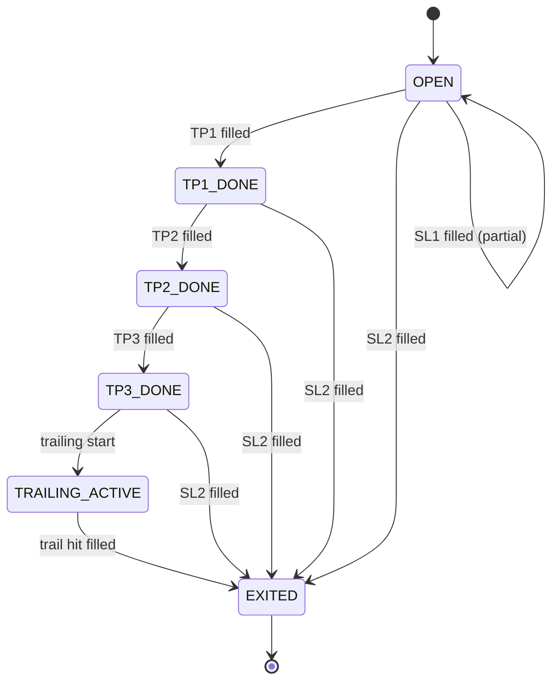
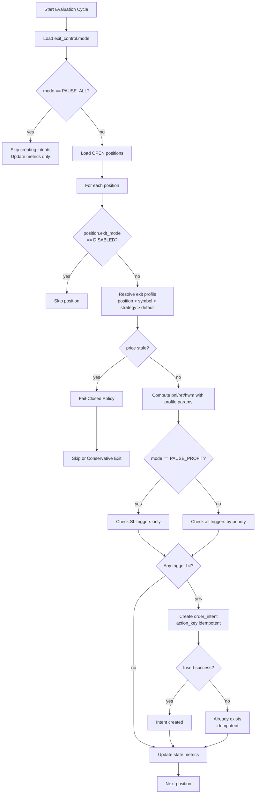
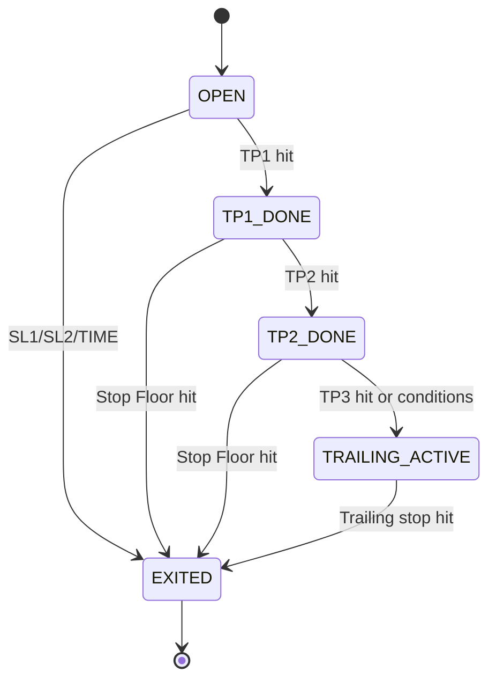

# Exit Engine 모듈 설계

> 자동청산 (손절/익절/트레일링/시간청산)

---

## 📐 Runtime Map (이 문서 범위)

```
┌──────────────────────────────────────────────────────────────┐
│                        Quant Runtime                          │
├──────────────────┬───────────────────────┬───────────────────┤
│ PriceSync         │ >>> Exit Engine <<<   │ Execution Service  │
│ (WS/REST/Naver)   │ (FSM + Idempotency)   │ (KIS Orders/Fills) │
└─────────┬────────┴──────────┬────────────┴─────────┬─────────┘
          │                   │                      │
          ▼                   ▼                      ▼
  market.prices_best     trade.positions_*        trade.orders_*
  market.freshness  ---> trade.position_state     trade.fills_*
                         trade.order_intents
          │                   │                      │
          └───────────────────┴──────────────────────┴──► Monitoring
```

---

## 🎯 모듈 책임 (SSOT)

### 이 모듈이 소유하는 것 (유일한 소유자)

✅ **데이터:**
- `trade.positions` (**컬럼 단위 소유**): `status`, `exit_mode`, `exit_profile_id` (전략 FSM 관련)
- `trade.position_state` - Exit FSM 상태
- `trade.exit_control` - 전역 제어 (킬 스위치)
- `trade.exit_profiles` - Exit 룰 프로파일
- `trade.symbol_exit_overrides` - 종목별 설정
- `trade.exit_signals` - 트리거 평가 기록
- `trade.order_intents` (EXIT_* 타입) - 청산 의도

✅ **로직:**
- Exit 상태 머신 (FSM) 전이
- 트리거 조건 판정 (SL/TP/TRAIL)
- HWM/StopFloor 계산
- 청산 주문 의도 생성 (멱등)
- **Profile Resolver** (position > symbol > strategy > default)
- **Control Gate** (전역 제어 체크)

### 다른 모듈과의 경계

❌ **Exit Engine이 하지 않는 것:**
- 현재가 결정 → PriceSync
- 주문 제출 → Execution
- **ExitEvent 생성** → Execution (holdings 확정 후)
- 재진입 판단 → Reentry Engine

❌ **Exit Engine이 접근하지 않는 것:**
- `market.*` 테이블 쓰기 (읽기만)
- `trade.orders/fills` 쓰기 (읽기만)
- `trade.exit_events` 쓰기 (읽기만) **← 중요: Execution만 생성**
- `trade.reentry_candidates` 쓰기 (읽기만)

✅ **Exit Engine이 읽을 수 있는 것:**
- `market.prices_best` (현재가)
- `market.freshness` (안전 게이트)
- `trade.fills` (체결 확인)
- `trade.exit_events` (참고용)

---

## 🔌 Public Interface

### 1. 외부 제공 인터페이스

#### Output: order_intents (청산 의도)

```sql
-- Execution이 읽어서 주문 제출
INSERT INTO trade.order_intents (
    intent_id,
    position_id,
    symbol,
    intent_type,    -- EXIT_PARTIAL | EXIT_FULL
    qty,
    order_type,     -- MKT | LMT
    limit_price,
    reason_code,    -- SL1 | SL2 | TP1 | TP2 | TP3 | TRAIL
    action_key,     -- {position_id}:{phase}:{reason_code} (UNIQUE)
    status          -- NEW
) VALUES (...);
```

**계약 (Contract):**
- `action_key`는 unique (멱등성 보장)
- `intent_type`은 EXIT_PARTIAL 또는 EXIT_FULL만
- `status=NEW`로 생성
- `qty`는 포지션 잔량 이하

#### ⚠️ Exit Engine은 ExitEvent를 생성하지 않음

**중요**: Exit Engine은 `trade.exit_events`를 생성하지 않습니다.

**ExitEvent 생성 책임**: **Execution Service**
- Execution이 KIS holdings를 reconcile할 때
- holdings에서 `qty=0` 확정 시점에 ExitEvent 생성
- 또는 fills 누적이 포지션을 완전 소진한 시점

**이유**:
- Exit Engine이 intent를 생성해도 실제 체결되지 않을 수 있음
- 수동 청산 / 브로커 직접 청산도 ExitEvent로 기록되어야 함
- **ExitEvent = 브로커 사실 기반 SSOT** (의도가 아닌 결과)

**Reentry 연결**:
- Reentry Engine은 ExitEvent를 입력으로 사용
- Exit Engine이 멈춰도(PAUSE), 수동 청산이 발생하면 ExitEvent가 생성되고 Reentry는 정상 동작

### 2. 외부 의존 인터페이스

#### Input: market.prices_best (PriceSync)

```sql
-- 현재가 조회
SELECT last_price FROM market.prices_best WHERE symbol = ?;
```

#### Input: market.freshness (PriceSync)

```sql
-- 안전 게이트
SELECT is_stale FROM market.freshness WHERE symbol = ?;
```

#### Input: trade.fills (Execution)

```sql
-- 체결 확인으로 상태 전이
SELECT qty, price FROM trade.fills
WHERE order_id IN (
    SELECT order_id FROM trade.orders WHERE intent_id = ?
);
```

---

## 📊 데이터 모델

### trade.positions (포지션 마스터)

**목적**: 보유 포지션 기본 정보

| 컬럼 | 타입 | 제약 | 설명 |
|------|------|------|------|
| position_id | UUID | PK | 포지션 고유 ID |
| account_id | TEXT | NOT NULL | 계좌 ID |
| symbol | TEXT | NOT NULL | 종목 코드 |
| side | TEXT | NOT NULL | LONG (숏은 추후) |
| qty | BIGINT | NOT NULL | 현재 수량 |
| avg_price | NUMERIC | NOT NULL | 평균 단가 |
| entry_ts | TIMESTAMPTZ | NOT NULL | 진입 시각 |
| status | TEXT | NOT NULL | OPEN/CLOSING/CLOSED |
| strategy_id | TEXT | NULL | 진입 전략 ID |
| updated_ts | TIMESTAMPTZ | NOT NULL | 마지막 갱신 |

**인덱스:**
```sql
INDEX idx_positions_open (account_id, status, symbol)
  WHERE status IN ('OPEN', 'CLOSING')
```

#### 📌 Column-Level SSOT (positions 공유 쓰기 책임)

trade.positions는 Exit Engine과 Execution Service가 **모두 쓰기 가능**하지만, 각 컬럼별 소유권은 명확히 구분됩니다.

| 컬럼 | 소유자 | 업데이트 시점 | 설명 |
|------|--------|-------------|------|
| **position_id** | Execution | 진입 시 (INSERT) | 생성 후 불변 |
| **account_id** | Execution | 진입 시 (INSERT) | 생성 후 불변 |
| **symbol** | Execution | 진입 시 (INSERT) | 생성 후 불변 |
| **side** | Execution | 진입 시 (INSERT) | 생성 후 불변 |
| **qty** | **Execution** | 체결 발생 시 | **브로커 사실 기준** (holdings reconcile) |
| **avg_price** | **Execution** | 체결 발생 시 | **브로커 사실 기준** (fills 누적 계산) |
| **entry_ts** | Execution | 진입 시 (INSERT) | 생성 후 불변 |
| **status** | **Exit Engine** | Exit FSM 전이 시 | **전략 상태 머신** (OPEN→CLOSING→CLOSED) |
| **exit_mode** | **Exit Engine** | 수동 설정 시 | Control Gate (ENABLED/DISABLED/MANUAL_ONLY) |
| **exit_profile_id** | **Exit Engine** | 수동 설정 시 | Profile Resolver (포지션별 오버라이드) |
| **strategy_id** | Execution | 진입 시 (INSERT) | 진입 전략 추적용 |
| **updated_ts** | 공유 | 각 업데이트 시 | 마지막 수정 시각 (trigger) |
| **version** | 공유 | 각 업데이트 시 | 낙관적 잠금 (trigger, 자동 증가) |

**중요 규칙**:

1. **Execution 소유 컬럼 (브로커 사실)**:
   - `qty`, `avg_price`는 **Execution만** 업데이트
   - KIS holdings reconcile로 실제 보유 현황 반영
   - Exit Engine은 이 값들을 **읽기 전용**으로 사용
   - **근거**: 브로커가 궁극적 진실 (수동 청산, 부분 체결 등 반영)

2. **Exit Engine 소유 컬럼 (전략 FSM)**:
   - `status`는 **Exit Engine만** 업데이트
   - Exit FSM에 따라 OPEN → CLOSING → CLOSED 전이
   - Execution은 이 값을 **읽기만** (예: holdings reconcile 시 참고)
   - **근거**: Exit 전략 로직이 청산 생애주기 소유

3. **Exit Engine 소유 컬럼 (제어 설정)**:
   - `exit_mode`, `exit_profile_id`는 **Exit Engine만** 업데이트
   - 운영자 또는 API를 통한 수동 설정
   - Execution은 읽지 않음 (Exit 전용 설정)

**위반 예시 (금지)**:
```
❌ Exit Engine에서 qty, avg_price 업데이트
❌ Execution에서 status, exit_mode 업데이트
❌ Exit Engine에서 reentry_candidates 생성 (Reentry만 생성)
❌ Exit Engine에서 exit_events 생성 (Execution만 생성)
```

**올바른 패턴**:
```sql
-- ✅ Execution: qty/avg_price 업데이트 (holdings reconcile)
UPDATE trade.positions
SET qty = $1, avg_price = $2, updated_ts = NOW()
WHERE position_id = $3 AND version = $4;

-- ✅ Exit Engine: status 업데이트 (FSM 전이)
UPDATE trade.positions
SET status = 'CLOSING', updated_ts = NOW()
WHERE position_id = $1 AND version = $2;

-- ✅ Exit Engine: exit_mode 설정 (수동 제어)
UPDATE trade.positions
SET exit_mode = 'DISABLED', updated_ts = NOW()
WHERE position_id = $1;
```

**Version 충돌 처리**:
- `qty`/`avg_price` 업데이트 중 Exit이 `status`를 변경하면 version 불일치
- 낙관적 잠금으로 감지 후 재시도 (각 모듈의 변경사항 병합)
- 최대 3회 재시도 후 실패 시 알람

---

### trade.position_state (Exit FSM 상태)

**목적**: 청산 상태 머신 유지

| 컬럼 | 타입 | 제약 | 설명 |
|------|------|------|------|
| position_id | UUID | PK, FK | 포지션 ID |
| phase | TEXT | NOT NULL | OPEN/TP1_DONE/TP2_DONE/TP3_DONE/TRAILING_ACTIVE/EXITED |
| hwm_price | NUMERIC | NULL | High-Water Mark (최고가) |
| stop_floor_price | NUMERIC | NULL | Stop Floor (손절 바닥) |
| atr | NUMERIC | NULL | ATR (일봉 기반, 캐시) |
| cooldown_until | TIMESTAMPTZ | NULL | 재진입 쿨다운 (Exit 후) |
| last_eval_ts | TIMESTAMPTZ | NULL | 마지막 평가 시각 |
| last_avg_price | NUMERIC | NULL | 마지막 평단가 (추가매수 감지용) |
| stop_floor_breach_ticks | INTEGER | NOT NULL DEFAULT 0 | StopFloor 연속 breach 카운터 |
| trailing_breach_ticks | INTEGER | NOT NULL DEFAULT 0 | Trailing 연속 breach 카운터 |
| updated_ts | TIMESTAMPTZ | NOT NULL | 마지막 갱신 |

**FSM 상태:**



---

## 🔄 처리 흐름

### 1. 평가 루프 (Evaluation Loop)



**주요 변경점**:
1. **Control Gate** (최상단): `exit_control.mode` 체크
2. **Position Skip**: `exit_mode=DISABLED`인 포지션 제외
3. **Profile Resolver**: 우선순위 기반 프로파일 결정
4. **Mode-based Filtering**: `PAUSE_PROFIT`이면 익절/트레일 차단

**Fail-Closed 정책 (stale 시):**

| 정책 | 설명 | 권장 |
|------|------|------|
| **보수** | stale이면 청산도 보류 | 초기 운영 |
| **리스크** | stale 지속(60s+) 시 강제 청산 | 안정화 후 |

### 2. 트리거 평가 우선순위 (Phase 기반)

**핵심 원칙**: 모든 Phase에서 안전장치(HARD_STOP, SL2)가 최우선으로 평가됩니다.

#### Phase별 트리거 평가 순서

**OPEN (초기 포지션):**
1. HARD_STOP (-3.0% 비상 손절) - 🚨 PAUSE_ALL 우회
2. SL2 (-10.0% 전량 손절)
3. SL1 (-5.0% 부분 손절)
4. CUSTOM_RULES (사용자 정의 조건)
5. TP1 (+5.0% 첫 익절)
6. TIME_EXIT (최대 보유 기간)

**TP1_DONE (첫 익절 완료):**
1. HARD_STOP
2. SL2
3. STOP_FLOOR (본전 방어선 돌파)
4. SL1
5. CUSTOM_RULES
6. TP2 (+10.0% 2단계 익절)
7. TIME_EXIT

**TP2_DONE (2단계 익절 완료):**
1. HARD_STOP
2. SL2
3. STOP_FLOOR
4. SL1
5. CUSTOM_RULES
6. TP3 (+15.0% 3단계 익절)
7. TIME_EXIT

**TP3_DONE (3단계 익절 완료):**
1. HARD_STOP
2. SL2
3. STOP_FLOOR
4. TRAILING 조건 충족 시 → TRAILING_ACTIVE 전이
5. TIME_EXIT

**TRAILING_ACTIVE (트레일링 중):**
1. HARD_STOP
2. SL2
3. TRAILING (HWM - ATR×K 돌파)
4. STOP_FLOOR (필요 시)
5. TIME_EXIT

**중요 사항:**
- 한 평가 사이클당 하나의 트리거만 실행
- Phase 전이 시 action_key 리셋으로 동일 트리거 재발동 가능
- HARD_STOP은 모든 Control Mode를 우회하여 항상 작동

### 3. 멱등성 구현 (Idempotency)

**action_key 컨벤션:**

형식: `{position_id}:{phase}:{reason_code}`

| 트리거 | action_key 패턴 | 예시 |
|--------|----------------|------|
| SL1 | `{position_id}:{phase}:SL1` | `a1b2c3-...:OPEN:SL1` |
| SL2 | `{position_id}:{phase}:SL2` | `a1b2c3-...:OPEN:SL2` |
| TP1 | `{position_id}:{phase}:TP1` | `a1b2c3-...:OPEN:TP1` |
| TP2 | `{position_id}:{phase}:TP2` | `a1b2c3-...:TP1_DONE:TP2` |
| TP3 | `{position_id}:{phase}:TP3` | `a1b2c3-...:TP2_DONE:TP3` |
| TRAIL | `{position_id}:{phase}:TRAIL` | `a1b2c3-...:TP3_DONE:TRAIL` |

**Phase 포함 이유:**
- 평단가 리셋 후 동일 트리거 재발동 가능
- 추가매수(2% 이상 평단가 변경) 시 Phase가 OPEN으로 리셋되어 새로운 action_key 생성
- 예: TP1 발동 → 추가매수 → Phase=OPEN → TP1 재발동 가능 (`...:OPEN:TP1`은 새 키)

**DB 강제:**

```sql
CREATE UNIQUE INDEX uq_order_intents_action_key
ON trade.order_intents (action_key);
```

**애플리케이션 처리:**

```
try {
    INSERT INTO trade.order_intents (action_key, ...) VALUES (...);
} catch (UniqueViolationError) {
    // 이미 존재 → 정상 흐름 (no-op)
}
```

### 4. 수량 계산 (부분 청산)

**규칙 (예시):**

| 트리거 | 수량 | 계산 |
|--------|------|------|
| SL1 | 50% | `ceil(remaining_qty * 0.5)` |
| SL2 | 100% | `remaining_qty` |
| TP1 | 25% | `ceil(original_qty * 0.25)` |
| TP2 | 25% | `ceil(original_qty * 0.25)` |
| TP3 | 20% | `ceil(original_qty * 0.20)` |
| TRAIL | 잔량 | `remaining_qty` |

**잔량 추적:**

```sql
-- 현재 잔량 계산
SELECT p.qty -
       COALESCE(SUM(f.qty), 0) AS remaining_qty
FROM trade.positions p
LEFT JOIN trade.order_intents i ON p.position_id = i.position_id
    AND i.intent_type LIKE 'EXIT_%'
LEFT JOIN trade.orders o ON i.intent_id = o.intent_id
LEFT JOIN trade.fills f ON o.order_id = f.order_id
WHERE p.position_id = ?
GROUP BY p.qty;
```


## 🎲 청산 룰 상세 설정

### 설정 구조 (ExitRulesConfig)

```go
type ExitRulesConfig struct {
    // 1. HARD_STOP (하드 손절)
    HardStopPercent    float64  // -3.0% (기본값)

    // 2. GAP_DOWN (갭 하락 손절)
    GapDownPercent     float64  // -3.0% (장 시작 시 갭 기준)
    GapDownCheckWindow int      // 30초 (장 시작 후 체크 시간)

    // 3. FIXED TP/SL (고정 익절/손절 - TP1/2/3, SL1/2)
    TP1Percent         float64  // +5.0% (1차 익절)
    TP2Percent         float64  // +10.0% (2차 익절)
    TP3Percent         float64  // +15.0% (3차 익절)
    SL1Percent         float64  // -5.0% (1차 손절)
    SL2Percent         float64  // -10.0% (2차 손절)

    // 4. ATR_TRAILING (ATR 기반 트레일링)
    ATRPeriod          int      // 14일 (ATR 계산 기간)
    ATRMultiplier      float64  // 2.0배
    TrailingATRMin     float64  // 5.0% (최소 트레일 거리)
    TrailingActivation float64  // 10.0% (트레일 시작 수익률)

    // 5. BREAK_EVEN (손익분기점 보호)
    BreakEvenTrigger   float64  // +3.0% (최고점 도달 조건)
    BreakEvenBuffer    float64  // +1.0% (보호 수익률)

    // 6. TIME_EXIT (시간 기반 청산)
    TimeExitDays1      int      // 8일 (1차 기준)
    TimeExitMinProfit1 float64  // +3.0% (1차 최소 수익)
    TimeExitDays2      int      // 15일 (2차 기준)
    TimeExitHWMStale   int      // 3일 (HWM 미갱신 기간)

    // 7. MANUAL (수동 청산)
    ManualEnabled      bool     // true (수동 청산 허용 여부)
}
```

### 1. HARD_STOP (하드 손절)

**목적**: 급격한 손실 방지

| 파라미터 | 기본값 | 설명 |
|----------|--------|------|
| HardStopPercent | -3.0% | 손절 수익률 |

**조건:**
```go
if current_pnl_pct <= config.HardStopPercent {
    create_intent("HARD_STOP", qty=remaining_qty, order_type="MKT")
}
```

**수량:** 잔량 100%
**주문 타입:** 시장가 (즉시 체결)

### 2. GAP_DOWN (갭 하락 손절)

**목적**: 장 시작 시 급락 대응

| 파라미터 | 기본값 | 설명 |
|----------|--------|------|
| GapDownPercent | -3.0% | 갭 하락 비율 |
| GapDownCheckWindow | 30초 | 장 시작 후 체크 시간 |

**조건:**
```go
if is_market_open() && time_since_open() <= config.GapDownCheckWindow {
    gap_pct := (current_price - prev_close) / prev_close
    if gap_pct <= config.GapDownPercent {
        create_intent("GAP_DOWN", qty=remaining_qty, order_type="MKT")
    }
}
```

**수량:** 잔량 100%
**주문 타입:** 시장가
**체크 시점:** 장 시작 후 30초 이내

### 3. ATR_TRAILING (ATR 기반 트레일링)

**목적**: 추세 유지하며 수익 최대화

| 파라미터 | 기본값 | 설명 |
|----------|--------|------|
| ATRPeriod | 14일 | ATR 계산 기간 |
| ATRMultiplier | 2.0배 | ATR 배수 |
| TrailingATRMin | 5.0% | 최소 트레일 거리 |
| TrailingActivation | 10.0% | 트레일 시작 수익률 |

**조건:**
```go
// 트레일링 활성화 조건
if current_pnl_pct >= config.TrailingActivation && phase != TRAILING_ACTIVE {
    phase = TRAILING_ACTIVE
    hwm_price = current_price
}

// 트레일링 체크 (TRAILING_ACTIVE 상태에서만)
if phase == TRAILING_ACTIVE {
    atr_distance := position_state.atr * config.ATRMultiplier
    min_distance := hwm_price * (config.TrailingATRMin / 100.0)

    trail_threshold := hwm_price - max(atr_distance, min_distance)

    if current_price <= trail_threshold {
        create_intent("ATR_TRAIL", qty=remaining_qty, order_type="MKT")
    }

    // HWM 갱신
    if current_price > hwm_price {
        hwm_price = current_price
        stop_floor_price = trail_threshold
    }
}
```

**수량:** 잔량 100%
**주문 타입:** 시장가
**최소 보호:** HWM 대비 5% 하락까지 허용

### 5. BREAK_EVEN (손익분기점 보호)

**목적**: 수익 나왔다가 손실 전환 방지

| 파라미터 | 기본값 | 설명 |
|----------|--------|------|
| BreakEvenTrigger | +3.0% | 최고점 도달 조건 |
| BreakEvenBuffer | +1.0% | 보호 수익률 |

**조건:**
```go
// HWM이 +3% 도달한 적 있으면
if hwm_pnl_pct >= config.BreakEvenTrigger {
    breakeven_threshold := avg_price * (1 + config.BreakEvenBuffer/100.0)

    if current_price <= breakeven_threshold {
        create_intent("BREAK_EVEN", qty=remaining_qty, order_type="MKT")
    }
}
```

**수량:** 잔량 100%
**주문 타입:** 시장가
**시나리오:** 최고점 +3% 도달 → 현재가 +1% 이하로 하락 시 청산

### 6. TIME_EXIT (시간 기반 청산)

**목적**: 장기 체류 방지

| 파라미터 | 기본값 | 설명 |
|----------|--------|------|
| TimeExitDays1 | 8일 | 1차 시간 기준 |
| TimeExitMinProfit1 | +3.0% | 1차 최소 수익 |
| TimeExitDays2 | 15일 | 2차 시간 기준 |
| TimeExitHWMStale | 3일 | HWM 미갱신 기간 |

**조건 1 (수익 부족):**
```go
holding_days := days_since(entry_ts)

if holding_days >= config.TimeExitDays1 && current_pnl_pct < config.TimeExitMinProfit1 {
    create_intent("TIME_EXIT_PROFIT", qty=remaining_qty, order_type="MKT")
}
```

**조건 2 (HWM 정체):**
```go
hwm_stale_days := days_since(last_hwm_update_ts)

if holding_days >= config.TimeExitDays2 && hwm_stale_days >= config.TimeExitHWMStale {
    create_intent("TIME_EXIT_STALE", qty=remaining_qty, order_type="MKT")
}
```

**수량:** 잔량 100%
**주문 타입:** 시장가
**시나리오:**
- 8일 보유 + 수익률 3% 미만 → 청산
- 15일 보유 + 최고점 3일간 미갱신 → 청산

### 7. MANUAL (수동 청산)

**목적**: 사용자 직접 개입

| 파라미터 | 기본값 | 설명 |
|----------|--------|------|
| ManualEnabled | true | 수동 청산 허용 |

**조건:**
```go
// API 또는 UI에서 사용자가 청산 요청
if user_requests_manual_exit(position_id, qty, reason) {
    if config.ManualEnabled {
        create_intent("MANUAL",
                     qty=min(qty, remaining_qty),
                     order_type=user_order_type,
                     limit_price=user_limit_price)
    }
}
```

**수량:** 사용자 지정 (잔량 이하)
**주문 타입:** 사용자 선택 (MKT/LMT)
**우선순위:** 자동 룰보다 낮음 (HARD_STOP, GAP_DOWN 우선)

### 8. CUSTOM_RULES (맞춤형 청산)

**목적**: 종목별/전략별 맞춤 수익률 기반 자동 청산

**개요:**
- 사용자가 수익률 조건과 청산 비율을 직접 정의
- 복수 규칙 설정 가능 (우선순위 순서대로 평가)
- 종목별 Exit Profile에 포함되어 관리
- 중복 실행 방지 (action_key 기반)

**데이터 구조:**
```go
type CustomExitRule struct {
    ID          string  `json:"id"`           // UUID (중복 실행 방지용)
    Enabled     bool    `json:"enabled"`      // On/Off 토글
    Condition   string  `json:"condition"`    // "profit_above" | "profit_below"
    Threshold   float64 `json:"threshold"`    // % 기준 (예: 7.0 = +7%)
    ExitPercent float64 `json:"exit_percent"` // 청산 비율 (예: 20.0 = 20%)
    Priority    int     `json:"priority"`     // 평가 순서 (0-indexed)
    Description string  `json:"description"`  // 선택적 메모
}

// ExitProfileConfig에 포함
type ExitProfileConfig struct {
    // ... 기존 필드들 (ATR, SL1-2, TP1-3, Trailing, TimeStop, HardStop)
    CustomRules []CustomExitRule `json:"custom_rules,omitempty"`
}
```

**평가 조건:**
```go
// Priority 3.5: Custom Rules (SL1과 TP1 사이에서 평가)
func evaluateCustomRules(profile *ExitProfile, pnlPct decimal.Decimal) *ExitTrigger {
    if len(profile.Config.CustomRules) == 0 {
        return nil
    }

    // 우선순위 오름차순 정렬
    rules := sortByPriority(profile.Config.CustomRules)

    for _, rule := range rules {
        if !rule.Enabled {
            continue
        }

        // 중복 실행 방지 체크 (action_key)
        actionKey := fmt.Sprintf("%s:CUSTOM:%s", positionID, rule.ID)
        if hasActiveIntent(positionID, actionKey) {
            continue  // 이미 실행된 규칙은 스킵
        }

        // 조건 평가
        triggered := false
        switch rule.Condition {
        case "profit_above":
            triggered = pnlPct >= rule.Threshold  // 예: 수익률 >= +7%
        case "profit_below":
            triggered = pnlPct <= rule.Threshold  // 예: 수익률 <= -3.4%
        }

        if triggered {
            // 청산 수량 계산
            qty := int64(float64(remainingQty) * rule.ExitPercent / 100.0)
            if qty < 1 { qty = 1 }
            if qty > remainingQty { qty = remainingQty }

            return &ExitTrigger{
                ReasonCode: "CUSTOM",
                Qty:        qty,
                OrderType:  "MKT",
            }
        }
    }
    return nil
}
```

**사용 예시:**
```json
{
  "custom_rules": [
    {
      "id": "rule-001",
      "enabled": true,
      "condition": "profit_above",
      "threshold": 7.0,
      "exit_percent": 20.0,
      "priority": 0,
      "description": "+7% 도달 시 20% 익절"
    },
    {
      "id": "rule-002",
      "enabled": true,
      "condition": "profit_above",
      "threshold": 13.0,
      "exit_percent": 50.0,
      "priority": 1,
      "description": "+13% 도달 시 50% 익절"
    },
    {
      "id": "rule-003",
      "enabled": true,
      "condition": "profit_below",
      "threshold": -3.4,
      "exit_percent": 70.0,
      "priority": 2,
      "description": "-3.4% 하락 시 70% 손절"
    }
  ]
}
```

**실행 시나리오:**

**시나리오 1: 상승장 (연속 익절)**
```
초기 포지션: 100주

Tick 1: 수익률 +8.0%
→ rule-001 트리거 (+7% 이상)
→ Intent 생성: 20주 매도 (20%)
→ 잔량: 80주

Tick 2: 수익률 +14.0%
→ rule-002 트리거 (+13% 이상)
→ Intent 생성: 50주 매도 (원본 100주의 50%)
→ 잔량: 30주

Tick 3: 수익률 +15.0%
→ rule-001, rule-002 이미 실행됨 (action_key 중복 방지)
→ 트리거 없음
```

**시나리오 2: 하락장 (손절)**
```
초기 포지션: 100주

Tick 1: 수익률 -3.5%
→ rule-003 트리거 (-3.4% 이하)
→ Intent 생성: 70주 매도 (70%)
→ 잔량: 30주

Tick 2: 수익률 -4.0%
→ rule-003 이미 실행됨 (중복 방지)
→ 다른 규칙 또는 HardStop 평가
```

**중복 실행 방지:**
- `action_key` 패턴: `{position_id}:CUSTOM:{rule_id}`
- 예: `"pos-123:CUSTOM:rule-001"`
- `trade.order_intents` 테이블에 이미 해당 action_key가 존재하면 스킵
- 한 번 트리거된 규칙은 포지션이 닫힐 때까지 재실행 안 됨

**평가 우선순위:**
- Priority 3.5 (SL1과 TP1 사이)
- SL1-2 (손절) 이후 평가 → 손절이 우선
- TP1-3 (익절) 이전 평가 → 사용자 규칙이 TP보다 우선

**장점:**
1. **유연성**: 종목 특성에 맞춘 맞춤형 전략
2. **간편함**: UI에서 드래그 앤 드롭으로 우선순위 조정
3. **재사용성**: Profile로 저장하여 여러 종목에 적용
4. **안전성**: 기본 안전장치(HardStop, SL)는 항상 우선

**UI 통합:**
- `SymbolOverrideDialog` 컴포넌트
- Tab 1: 기존 프로필 선택
- Tab 2: 맞춤 규칙 생성 (CustomRulesEditor)
- 규칙 추가/삭제/재정렬 (DnD)
- Exit Engine 토글 (종목별 활성화/비활성화)

---

### A. Exit Evaluator Loop (1~5초) - 핵심 평가

**목적**: **청산 트리거 판단 및 order_intents 생성 (최우선)**

**주기**: 1~5초 (보유 종목 기준, 손절 지연 최소화)

**⚠️ 중요**: 이 루프는 **intent 생성만** 수행하며, signal 기록은 하지 않음.

```go
func EvaluateExitTriggers(ctx context.Context) {
    ticker := time.NewTicker(3 * time.Second)  // 권장: 1~5초
    defer ticker.Stop()

    for {
        select {
        case <-ticker.C:
            positions := loadOpenPositions()

            for _, pos := range positions {
                // Control Gate 체크
                controlMode := loadExitControlMode()
                if controlMode == "PAUSE_ALL" {
                    // HardStop 제외 모든 평가 스킵
                    if !shouldEvaluateHardStop(pos) {
                        continue
                    }
                }

                // 현재가 조회
                price, err := priceSync.GetBestPrice(pos.Symbol)
                if err != nil || price.IsStale {
                    continue  // Fail-Closed
                }

                // Profile Resolver
                profile := resolveExitProfile(pos)
                if profile == nil {
                    continue
                }

                // 트리거 평가 (우선순위 순서)
                trigger := evaluateTriggersInPriority(pos, price, profile, controlMode)
                if trigger == nil {
                    continue  // 트리거 없음
                }

                // Intent 생성 (멱등)
                err := createIntent(pos.ID, trigger.Type, trigger.Qty, trigger.Reason)
                if err != nil {
                    log.Error("intent creation failed", "error", err)
                }
            }

        case <-ctx.Done():
            return
        }
    }
}
```

**특징**:
- **손절 지연 최소화**: 1~5초 주기로 SL1/SL2 평가
- **intent 생성만**: Signal 기록은 별도 루프에서 처리
- **Fail-Closed**: 가격 stale 시 평가 스킵
- **Control Gate**: PAUSE_ALL 시 HardStop만 평가

---

### B. Exit Signal Logger (60초) - 디버깅/백테스트

**목적**: **청산 트리거 평가 결과 기록 (intent 생성 없음)**

**주기**: 60초 (또는 샘플링)

**데이터베이스 테이블**: `trade.exit_signals`

Exit 트리거 평가 기록을 저장합니다. 각 룰(HARD_STOP, SL1/2, TP1/2/3, TRAILING 등)의 평가 결과와 트리거 여부를 기록하여 디버깅 및 백테스트에 활용합니다.

**상세 스키마**: [schema.md](../database/schema.md#tradeexit_signals) 참고

**⚠️ 중요**: 이 루프는 **기록만** 수행하며, **절대 intent를 생성하지 않음**.

```go
func LogExitSignals(ctx context.Context) {
    ticker := time.NewTicker(60 * time.Second)
    defer ticker.Stop()

    for {
        select {
        case <-ticker.C:
            positions := loadOpenPositions()

            for _, pos := range positions {
                price, err := priceSync.GetBestPrice(pos.Symbol)
                if err != nil {
                    continue
                }

                profile := resolveExitProfile(pos)
                if profile == nil {
                    continue
                }

                // 모든 rule 평가 (우선순위 순서)
                for _, rule := range exitRules {
                    triggered, reason, distance := rule.Check(pos, price, profile)

                    // Signal 기록만 (트리거 여부 무관)
                    insertExitSignal(ExitSignal{
                        PositionID:    pos.ID,
                        RuleName:      rule.Name,
                        IsTriggered:   triggered,
                        Reason:        reason,
                        Distance:      distance,  // 트리거까지 거리 (디버깅용)
                        Price:         price.Last,
                        EvaluatedAt:   time.Now(),
                    })

                    // ⚠️ 절대 intent를 생성하지 않음
                }
            }

        case <-ctx.Done():
            return
        }
    }
}
```

**이점**:
- 모든 평가 결과 추적 (디버깅)
- 트리거 직전 상황 분석 (distance 필드)
- 백테스트 데이터로 활용
- **평가 루프와 분리**: intent 생성 지연 없음

**주의**:
- 이 루프는 **기록 전용**이며, 실시간 청산 로직에 관여하지 않음
- Intent 생성은 **Exit Evaluator Loop (A)**에서만 수행

---

## 🚨 v10 사고 사례 및 교훈 (CRITICAL)

> **왜 이 안전장치들이 필요한가?** v10 실전 운영에서 발생한 실제 사고 사례입니다.

### 사고 1: 평단가 캐시 불일치로 조기 청산

**상황:**
1. 포지션 진입: 100주 @ 70,000원 (평단가: 70,000원)
2. 추가 매수: 50주 @ 75,000원 → **평단가: 71,667원으로 상승**
3. Exit Engine 평가: 인메모리 캐시에는 여전히 70,000원
4. 현재가: 72,500원
5. 손익률 계산 (캐시 기준): **(72,500 - 70,000) / 70,000 = +3.57%** ← 잘못됨
6. 실제 손익률 (DB 기준): (72,500 - 71,667) / 71,667 = +1.16%
7. **결과**: TP +3.0% 트리거 발동 → 조기 청산 (실제로는 +1.16%밖에 안됨)

**근본 원인:**
- Execution이 holdings reconcile로 평단가 업데이트
- Exit Engine은 인메모리 캐시만 참조 (DB 재조회 안함)
- 캐시 무효화 로직 없음

**v14 방어:**
```go
// ✅ Intent 생성 직전 DB 재확인 (강제)
snapshot := PositionSnapshot{AvgPrice: pos.AvgPrice, Version: pos.Version}

// 트리거 평가...
if shouldExit {
    // 🔒 DB에서 최신 평단가/버전 재조회
    var latestVersion int
    var latestAvgPrice decimal.Decimal
    e.db.QueryRow(ctx, `
        SELECT version, avg_price FROM trade.positions WHERE position_id = $1
    `, pos.PositionID).Scan(&latestVersion, &latestAvgPrice)

    // 🚨 버전 불일치 감지
    if latestVersion != snapshot.Version {
        log.Warn("평단가 변경 감지 - 재평가 필요",
            "old_avg_price", snapshot.AvgPrice,
            "new_avg_price", latestAvgPrice,
            "diff_pct", (latestAvgPrice - snapshot.AvgPrice) / snapshot.AvgPrice * 100)
        return ErrPositionChanged  // 다음 tick에서 재평가
    }

    // ✅ 버전 일치 → 최신 평단가로 Intent 생성
    createIntent(ctx, latestAvgPrice, latestVersion)
}
```

---

### 사고 2: 가격 캐시 Stale로 청산 실패

**상황:**
1. 포지션 진입: 100주 @ 100,000원
2. 현재가: 95,000원 (실제)
3. 가격 캐시: 99,500원 (5초 전 데이터, stale)
4. Exit Engine 평가 (캐시 기준): (99,500 - 100,000) / 100,000 = **-0.5%**
5. SL -3.0% 트리거 미충족
6. **실제 손익률**: (95,000 - 100,000) / 100,000 = **-5.0%** (SL 넘음!)
7. **결과**: 청산 실패 → 손실 확대

**근본 원인:**
- PriceSync가 가격을 업데이트했지만 캐시는 stale
- Exit Engine이 타임스탬프 검증 없이 캐시 사용
- freshness 체크 없음

**v14 방어:**
```go
// ✅ 가격 조회 시 타임스탬프 검증 필수
price, err := e.priceSync.GetBestPrice(ctx, pos.Symbol)
if err != nil {
    return nil, ErrPriceFetchFailed
}

// 🔒 Freshness 체크 (BLOCKER)
freshness, err := e.priceSync.GetFreshness(ctx, pos.Symbol)
if err != nil || freshness.IsStale {
    log.Warn("가격 stale - 평가 중단",
        "symbol", pos.Symbol,
        "last_update", freshness.BestTs,
        "age_seconds", time.Since(freshness.BestTs).Seconds())

    // 🚨 Fail-Closed: 의심스러우면 평가 보류
    e.recordStalePriceWarning(ctx, pos.PositionID, freshness)
    return nil, ErrStalePrice
}

// 🔒 타임스탬프 검증 (10초 임계값)
age := time.Since(price.BestTs)
if age > 10*time.Second {
    log.Warn("가격 너무 오래됨",
        "symbol", pos.Symbol,
        "age_seconds", age.Seconds())
    return nil, ErrStalePrice
}

// ✅ 신선한 가격으로 손익률 계산
pnlPct := (price.Bid - pos.AvgPrice) / pos.AvgPrice * 100
```

---

### 사고 3: 부분 체결 중 수량 불일치

**상황:**
1. 청산 Intent 생성: 100주 매도
2. 부분 체결: 50주 체결됨 (Execution이 positions.qty = 50 업데이트)
3. Exit Engine 재평가: 캐시에는 여전히 100주
4. 또 다시 100주 청산 Intent 생성
5. **결과**: 과다 청산 주문 (100주 추가 매도 → 숏 포지션 진입!)

**근본 원인:**
- Execution의 qty 업데이트가 캐시에 반영 안됨
- Exit Engine이 Pending Orders 차감 안함 (Available Qty 계산 없음)

**v14 방어 (P0 개선안):**
```go
// ✅ Available Qty 계산 (Locked Qty 차감)
func (e *ExitEngine) GetAvailableQty(ctx context.Context, positionID uuid.UUID) (int64, error) {
    // 1. DB에서 최신 포지션 수량 조회
    var currentQty int64
    var version int
    e.db.QueryRow(ctx, `
        SELECT qty, version FROM trade.positions WHERE position_id = $1
    `, positionID).Scan(&currentQty, &version)

    // 2. Pending/Submitted 상태 주문의 수량 합계 (Locked Qty)
    var lockedQty int64
    e.db.QueryRow(ctx, `
        SELECT COALESCE(SUM(qty - filled_qty), 0)
        FROM trade.orders
        WHERE position_id = $1
          AND status IN ('NEW', 'SUBMITTED', 'PARTIAL_FILLED')
    `, positionID).Scan(&lockedQty)

    // 3. 가용 수량 = 현재 수량 - 잠긴 수량
    availableQty := currentQty - lockedQty

    log.Debug("available qty 계산",
        "position_id", positionID,
        "current_qty", currentQty,
        "locked_qty", lockedQty,
        "available_qty", availableQty)

    return max(availableQty, 0), nil
}

// Intent 생성 시
availableQty, err := e.GetAvailableQty(ctx, pos.PositionID)
if availableQty <= 0 {
    log.Warn("가용 수량 없음 - Intent 생성 스킵",
        "position_id", pos.PositionID,
        "available_qty", availableQty)
    return nil  // 이미 청산 주문이 제출됨
}

// ✅ 가용 수량만큼만 Intent 생성
createIntent(ctx, pos.PositionID, min(targetQty, availableQty))
```

---

### 교훈 및 v14 강제 원칙

**원칙 1: 캐시는 SSOT가 아니다**
- ❌ 캐시를 "정답"처럼 믿고 의사결정 금지
- ✅ Intent 생성 직전 **반드시 DB 재확인**

**원칙 2: 버전 기반 낙관적 잠금**
- ❌ 평단가/수량은 언제든 변경 가능
- ✅ Version 불일치 감지 → 재평가

**원칙 3: 타임스탬프 기반 Freshness 검증**
- ❌ 타임스탬프 없는 가격 사용 금지
- ✅ best_ts 기반 stale 판정 (10초 임계값)

**원칙 4: Fail-Closed 정책**
- ❌ 의심스러운 상황에서 청산 강행 금지
- ✅ Stale/불일치 → 평가 보류 + 알람

**원칙 5: Locked Qty 차감**
- ❌ 포지션 수량 그대로 사용 금지
- ✅ Available Qty = Position Qty - Pending Orders Qty

---

## 🚨 에러 처리

### 1. 가격 Stale

**증상**: `market.freshness.is_stale = true`

**대응:**
- **보수**: 모든 트리거 평가 중단
- **리스크**: stale 60초 이상 지속 시 강제 청산 (정책 선택)

### 2. 체결 지연

**증상**: intent=ACK인데 fills 없음이 장시간

**대응:**
- 주기적 reconcile로 fills 재조회
- timeout 초과 시 알람

### 3. 부분 체결

**증상**: 주문 수량 < 체결 수량

**대응:**
- 잔량 기준으로 다음 트리거 재계산
- 부분 체결도 intent 상태 PARTIAL로 관리

---

## 🛡️ 운영 안정성 (v10 문제 해결)

### 1. 프로세스 중복 실행 방지

**v10 문제**: 메모리에 남아있거나 이전 프로세스가 kill되지 않아 중복 처리 발생

#### Leader Election (PostgreSQL Advisory Lock)

**목적**: 하나의 Exit Engine 인스턴스만 실행 보장

**데이터베이스 테이블**: `system.process_locks`

PostgreSQL Advisory Lock을 사용한 Leader Election을 위한 메타데이터 테이블입니다. 인스턴스 정보와 heartbeat를 기록하여 중복 실행을 방지합니다.

**상세 스키마**: [schema.md](../database/schema.md#systemprocess_locks) 참고

**Leader Election 구현:**

```go
const (
    LockName = "exit_engine_leader"
    LockID = 1001  // 고정 advisory lock ID
    HeartbeatInterval = 5 * time.Second
    HeartbeatTimeout = 15 * time.Second
)

func AcquireLeadership(ctx context.Context, db *pgxpool.Pool) (bool, error) {
    instanceID := fmt.Sprintf("%s-%d", hostname, os.Getpid())

    // 1. PostgreSQL Advisory Lock 시도
    var acquired bool
    err := db.QueryRow(ctx, "SELECT pg_try_advisory_lock($1)", LockID).Scan(&acquired)
    if err != nil || !acquired {
        return false, err
    }

    // 2. 메타데이터 기록
    _, err = db.Exec(ctx, `
        INSERT INTO system.process_locks (lock_name, instance_id, acquired_ts, heartbeat_ts, host, pid)
        VALUES ($1, $2, NOW(), NOW(), $3, $4)
        ON CONFLICT (lock_name) DO UPDATE
        SET instance_id = EXCLUDED.instance_id,
            acquired_ts = EXCLUDED.acquired_ts,
            heartbeat_ts = EXCLUDED.heartbeat_ts,
            host = EXCLUDED.host,
            pid = EXCLUDED.pid
    `, LockName, instanceID, hostname, os.Getpid())

    if err != nil {
        // Lock 획득 실패 시 advisory lock 해제
        db.Exec(ctx, "SELECT pg_advisory_unlock($1)", LockID)
        return false, err
    }

    // 3. Heartbeat 시작
    go maintainHeartbeat(ctx, db, instanceID)

    return true, nil
}

func maintainHeartbeat(ctx context.Context, db *pgxpool.Pool, instanceID string) {
    ticker := time.NewTicker(HeartbeatInterval)
    defer ticker.Stop()

    for {
        select {
        case <-ticker.C:
            _, err := db.Exec(ctx, `
                UPDATE system.process_locks
                SET heartbeat_ts = NOW()
                WHERE lock_name = $1 AND instance_id = $2
            `, LockName, instanceID)

            if err != nil {
                log.Error("heartbeat update failed", "error", err)
                // Advisory lock은 연결 종료 시 자동 해제됨
            }

        case <-ctx.Done():
            // Graceful shutdown
            releaseLeadership(db, instanceID)
            return
        }
    }
}

func releaseLeadership(db *pgxpool.Pool, instanceID string) {
    ctx := context.Background()

    // 1. Advisory lock 해제
    db.Exec(ctx, "SELECT pg_advisory_unlock($1)", LockID)

    // 2. 메타데이터 삭제
    db.Exec(ctx, "DELETE FROM system.process_locks WHERE lock_name = $1 AND instance_id = $2",
        LockName, instanceID)
}
```

**Stale Leader 감지 (다른 인스턴스가 실행):**

```go
func detectStaleLeader(ctx context.Context, db *pgxpool.Pool) {
    ticker := time.NewTicker(30 * time.Second)
    defer ticker.Stop()

    for {
        select {
        case <-ticker.C:
            var lastHeartbeat time.Time
            err := db.QueryRow(ctx, `
                SELECT heartbeat_ts FROM system.process_locks
                WHERE lock_name = $1
            `, LockName).Scan(&lastHeartbeat)

            if err == nil {
                staleDuration := time.Since(lastHeartbeat)
                if staleDuration > HeartbeatTimeout {
                    log.Warn("stale leader detected",
                        "last_heartbeat", lastHeartbeat,
                        "stale_duration", staleDuration)

                    // Advisory lock 강제 해제 (관리자 권한 필요)
                    // 또는 알람 발송 후 수동 개입
                }
            }

        case <-ctx.Done():
            return
        }
    }
}
```

#### Graceful Shutdown

**목적**: 평가 중인 작업 완료 후 종료

```go
func (e *ExitEngine) Run(ctx context.Context) error {
    // Leader election
    isLeader, err := AcquireLeadership(ctx, e.db)
    if err != nil || !isLeader {
        return fmt.Errorf("failed to acquire leadership: %w", err)
    }
    defer releaseLeadership(e.db, e.instanceID)

    // Evaluation loop
    ticker := time.NewTicker(5 * time.Second)
    defer ticker.Stop()

    // Graceful shutdown channel
    shutdownCh := make(chan os.Signal, 1)
    signal.Notify(shutdownCh, syscall.SIGINT, syscall.SIGTERM)

    for {
        select {
        case <-ticker.C:
            // 평가 작업 시작
            evalCtx, cancel := context.WithTimeout(ctx, 30*time.Second)
            e.evaluatePositions(evalCtx)
            cancel()

        case <-shutdownCh:
            log.Info("graceful shutdown initiated")

            // 진행 중인 평가 완료 대기 (최대 60초)
            shutdownCtx, cancel := context.WithTimeout(context.Background(), 60*time.Second)
            defer cancel()

            e.waitForInFlightEvaluations(shutdownCtx)

            log.Info("graceful shutdown completed")
            return nil

        case <-ctx.Done():
            return ctx.Err()
        }
    }
}

func (e *ExitEngine) waitForInFlightEvaluations(ctx context.Context) {
    e.wg.Wait()  // WaitGroup으로 진행 중인 평가 대기
}
```

#### 중복 실행 감지 알람

**모니터링:**

```sql
-- 중복 실행 감지 쿼리 (모니터링 도구에서 주기 실행)
SELECT
    lock_name,
    COUNT(*) AS instance_count,
    array_agg(instance_id) AS instances,
    array_agg(heartbeat_ts) AS heartbeats
FROM system.process_locks
WHERE lock_name = 'exit_engine_leader'
GROUP BY lock_name
HAVING COUNT(*) > 1;  -- 1개보다 많으면 중복 실행
```

---

### 2. 평단가 변경 감지 및 재계산

**v10 문제**: Exit 평가 중 추가 매수 발생 시 평단가 변경을 반영하지 못함

#### 낙관적 잠금 (Optimistic Locking)

**positions 테이블에 version 추가:**

```sql
ALTER TABLE trade.positions
ADD COLUMN version INT NOT NULL DEFAULT 1;

-- Version 증가 트리거
CREATE OR REPLACE FUNCTION increment_position_version()
RETURNS TRIGGER AS $$
BEGIN
    IF NEW.avg_price != OLD.avg_price OR NEW.qty != OLD.qty THEN
        NEW.version = OLD.version + 1;
        NEW.updated_ts = NOW();
    END IF;
    RETURN NEW;
END;
$$ LANGUAGE plpgsql;

CREATE TRIGGER trg_positions_version
BEFORE UPDATE ON trade.positions
FOR EACH ROW
EXECUTE FUNCTION increment_position_version();
```

#### Exit 평가 시 평단가 검증

**평가 시작 시 snapshot:**

```go
type PositionSnapshot struct {
    PositionID UUID
    Symbol     string
    Qty        int64
    AvgPrice   decimal.Decimal
    Version    int  // 낙관적 잠금
}

func (e *ExitEngine) evaluatePosition(ctx context.Context, pos Position) error {
    // 1. 평가 시작 시 snapshot
    snapshot := PositionSnapshot{
        PositionID: pos.PositionID,
        Symbol:     pos.Symbol,
        Qty:        pos.Qty,
        AvgPrice:   pos.AvgPrice,
        Version:    pos.Version,
    }

    // 2. 현재가 조회
    currentPrice, err := e.priceSync.GetBestPrice(ctx, pos.Symbol)
    if err != nil {
        return fmt.Errorf("price fetch failed: %w", err)
    }

    // 3. 트리거 평가 (snapshot 기준)
    trigger, qty := e.evaluateTriggers(snapshot, currentPrice)
    if trigger == nil {
        return nil  // 트리거 없음
    }

    // 4. Intent 생성 전 version 재확인
    var latestVersion int
    var latestAvgPrice decimal.Decimal
    var latestQty int64

    err = e.db.QueryRow(ctx, `
        SELECT version, avg_price, qty FROM trade.positions
        WHERE position_id = $1
    `, snapshot.PositionID).Scan(&latestVersion, &latestAvgPrice, &latestQty)

    if err != nil {
        return fmt.Errorf("version check failed: %w", err)
    }

    // 5. Version 변경 감지
    if latestVersion != snapshot.Version {
        log.Warn("position changed during evaluation",
            "position_id", snapshot.PositionID,
            "old_version", snapshot.Version,
            "new_version", latestVersion,
            "old_avg_price", snapshot.AvgPrice,
            "new_avg_price", latestAvgPrice)

        // 변경된 포지션으로 재평가
        updatedPos := Position{
            PositionID: snapshot.PositionID,
            Symbol:     snapshot.Symbol,
            Qty:        latestQty,
            AvgPrice:   latestAvgPrice,
            Version:    latestVersion,
        }

        return e.evaluatePosition(ctx, updatedPos)  // 재귀 (최대 3회)
    }

    // 6. Intent 생성 (version 일치)
    err = e.createIntent(ctx, snapshot, trigger, qty)
    if err != nil {
        return fmt.Errorf("intent creation failed: %w", err)
    }

    return nil
}
```

#### 재평가 제한 (무한 루프 방지)

```go
func (e *ExitEngine) evaluatePositionWithRetry(ctx context.Context, pos Position, attempt int) error {
    const maxAttempts = 3

    if attempt >= maxAttempts {
        log.Error("max evaluation attempts reached",
            "position_id", pos.PositionID,
            "attempts", attempt)
        return fmt.Errorf("evaluation abandoned after %d attempts", maxAttempts)
    }

    err := e.evaluatePosition(ctx, pos)
    if errors.Is(err, ErrPositionChanged) {
        // Version 변경 감지 시 재시도
        return e.evaluatePositionWithRetry(ctx, pos, attempt+1)
    }

    return err
}
```

#### 평단가 변경 알람

```go
func (e *ExitEngine) alertAvgPriceChange(old, new PositionSnapshot) {
    priceDiff := new.AvgPrice.Sub(old.AvgPrice)
    priceDiffPct := priceDiff.Div(old.AvgPrice).Mul(decimal.NewFromInt(100))

    if priceDiffPct.Abs().GreaterThan(decimal.NewFromFloat(1.0)) {
        // 1% 이상 변경 시 알람
        e.alerter.Send(Alert{
            Level:   "WARNING",
            Message: "Avg price changed significantly during exit evaluation",
            Data: map[string]interface{}{
                "position_id":     new.PositionID,
                "symbol":          new.Symbol,
                "old_avg_price":   old.AvgPrice,
                "new_avg_price":   new.AvgPrice,
                "diff_pct":        priceDiffPct,
                "old_version":     old.Version,
                "new_version":     new.Version,
            },
        })
    }
}
```

#### 추가매수 vs 부분체결 구분 로직

**v14 개선**: 평단가 변경 시 추가매수와 부분체결/정정을 구분하여 처리

**문제점:**
- 기존: 평단가가 조금이라도 변경되면 무조건 Phase=OPEN으로 리셋
- 부작용: TP1 체결 후 부분청산 시 StopFloor 등 보호 로직 손실

**해결 방안:**
```go
// evaluator.go: evaluatePosition()
const additionalBuyThreshold = 0.02  // 2%
const partialFillThreshold = 0.005   // 0.5%

if state.LastAvgPrice != nil {
    diff := pos.AvgPrice.Sub(*state.LastAvgPrice).Abs()
    threshold := state.LastAvgPrice.Mul(decimal.NewFromFloat(partialFillThreshold))

    if diff.GreaterThan(threshold) {
        additionalBuyThreshold := state.LastAvgPrice.Mul(decimal.NewFromFloat(additionalBuyThreshold))

        if diff.GreaterThan(additionalBuyThreshold) {
            // 2% 이상 → 추가매수 → OPEN 리셋
            log.Warn().Msg("추가매수 감지 → Exit State OPEN 리셋")
            err := s.stateRepo.ResetStateToOpen(ctx, pos.PositionID, pos.AvgPrice)
        } else {
            // 0.5~2% → 부분체결/정정 → State 유지, LastAvgPrice만 업데이트
            log.Debug().Msg("평단가 미세 변동 → State 유지")
            err := s.stateRepo.UpdateLastAvgPrice(ctx, pos.PositionID, pos.AvgPrice)
        }
    }
}
```

**기준:**
| 평단가 변경폭 | 판단 | 처리 |
|--------------|------|------|
| < 0.5% | 무시 | 변경 없음 |
| 0.5% ~ 2% | 부분체결/정정 | LastAvgPrice만 업데이트, Phase 유지 |
| ≥ 2% | 추가매수 | Phase=OPEN 리셋, 모든 트리거 재평가 |

**효과:**
- TP1 체결 후 일부 물량 매도 → StopFloor 유지 ✅
- 실제 추가매수 발생 → 새로운 Exit 사이클 시작 ✅

---

### 3. Price Sync 장애 대응 (Fail-Safe)

**v10 문제**: Price sync가 되지 않아 청산 평가 불가

#### Fail-Closed 정책 (보수적 청산 중단)

**원칙**: 가격 신뢰 불가 시 청산 중단 (손실 방지)

```go
func (e *ExitEngine) evaluatePositions(ctx context.Context) {
    positions := e.loadOpenPositions(ctx)

    for _, pos := range positions {
        // 1. 가격 신선도 체크 (BLOCKER)
        freshness, err := e.priceSync.GetFreshness(ctx, pos.Symbol)
        if err != nil {
            log.Error("freshness check failed", "symbol", pos.Symbol, "error", err)
            continue  // 평가 건너뛰기
        }

        if freshness.IsStale {
            log.Warn("price stale, skipping evaluation",
                "symbol", pos.Symbol,
                "reason", freshness.StaleReason,
                "stale_duration", time.Since(freshness.BestTs))

            // Stale 경고 기록
            e.recordStalePriceWarning(ctx, pos.PositionID, freshness)
            continue  // 평가 건너뛰기
        }

        // 2. 현재가 조회
        currentPrice, err := e.priceSync.GetBestPrice(ctx, pos.Symbol)
        if err != nil {
            log.Error("price fetch failed", "symbol", pos.Symbol, "error", err)
            continue  // 평가 건너뛰기
        }

        // 3. 트리거 평가 진행
        e.evaluatePosition(ctx, pos, currentPrice)
    }
}
```

#### Emergency Exit (강제 청산 조건)

**극단적 상황에서만 활성화 (관리자 승인 필요):**

```go
type EmergencyExitConfig struct {
    Enabled          bool
    StaleThreshold   time.Duration  // 60초 (기본값)
    LossThreshold    float64        // -5.0% (손실 임계값)
    ManualApproval   bool           // true (관리자 승인 필수)
}

func (e *ExitEngine) checkEmergencyExit(ctx context.Context, pos Position, freshness Freshness) bool {
    if !e.emergencyConfig.Enabled {
        return false
    }

    staleDuration := time.Since(freshness.BestTs)

    // 조건 1: Stale 지속 시간 초과
    if staleDuration < e.emergencyConfig.StaleThreshold {
        return false
    }

    // 조건 2: 손실 상태 (보수적 청산)
    lastKnownPrice := freshness.LastPrice
    pnlPct := (lastKnownPrice - pos.AvgPrice) / pos.AvgPrice * 100

    if pnlPct > e.emergencyConfig.LossThreshold {
        return false  // 이익 상태면 청산 안 함
    }

    // 조건 3: 수동 승인 확인
    if e.emergencyConfig.ManualApproval {
        approved := e.checkManualApproval(ctx, pos.PositionID)
        if !approved {
            log.Warn("emergency exit requires manual approval",
                "position_id", pos.PositionID,
                "stale_duration", staleDuration,
                "pnl_pct", pnlPct)
            return false
        }
    }

    log.Error("EMERGENCY EXIT triggered",
        "position_id", pos.PositionID,
        "symbol", pos.Symbol,
        "stale_duration", staleDuration,
        "pnl_pct", pnlPct)

    return true
}
```

#### Price Sync 장애 알람 (즉시 통보)

```sql
-- 알람 조건 체크 (모니터링 도구에서 1분마다 실행)
SELECT
    symbol,
    is_stale,
    stale_reason,
    EXTRACT(EPOCH FROM (NOW() - best_ts)) AS stale_seconds,
    last_ws_ts,
    last_rest_ts,
    last_naver_ts
FROM market.freshness
WHERE is_stale = true
  AND EXTRACT(EPOCH FROM (NOW() - best_ts)) > 30  -- 30초 이상 stale
ORDER BY best_ts ASC;
```

**알람 트리거:**

```go
func (e *ExitEngine) monitorPriceSyncHealth(ctx context.Context) {
    ticker := time.NewTicker(30 * time.Second)
    defer ticker.Stop()

    for {
        select {
        case <-ticker.C:
            var staleSymbols []StalePriceInfo
            rows, err := e.db.Query(ctx, `
                SELECT symbol, stale_reason, best_ts
                FROM market.freshness
                WHERE is_stale = true
                  AND EXTRACT(EPOCH FROM (NOW() - best_ts)) > 30
            `)
            if err != nil {
                log.Error("price health check failed", "error", err)
                continue
            }

            for rows.Next() {
                var info StalePriceInfo
                rows.Scan(&info.Symbol, &info.Reason, &info.LastTs)
                staleSymbols = append(staleSymbols, info)
            }
            rows.Close()

            if len(staleSymbols) > 0 {
                e.alerter.Send(Alert{
                    Level:   "CRITICAL",
                    Message: fmt.Sprintf("Price sync stale for %d symbols", len(staleSymbols)),
                    Data: map[string]interface{}{
                        "stale_symbols": staleSymbols,
                        "count":         len(staleSymbols),
                    },
                })
            }

        case <-ctx.Done():
            return
        }
    }
}
```

---

## 🔒 SSOT 규칙 (금지 패턴)

### ❌ 절대 금지

1. **Exit Engine에서 현재가 계산**
   ```
   ❌ Exit에서 prices_ticks 집계
   ❌ Exit에서 best price 재계산

   ✅ prices_best만 조회
   ```

2. **Exit Engine에서 주문 API 직접 호출**
   ```
   ❌ Exit에서 KIS API 직접 호출
   ❌ Exit에서 orders 테이블 직접 쓰기

   ✅ order_intents만 생성
   ```

3. **Exit Engine에서 재진입 로직**
   ```
   ❌ Exit에서 재진입 판단
   ❌ Exit에서 reentry_candidates 상태 변경
   ❌ Exit에서 reentry_candidates 생성

   ✅ Exit는 order_intents (EXIT_*) 만 생성
   ✅ Reentry는 exit_events를 소비해서 candidates 생성
   ```

### ✅ 허용된 패턴

1. **PriceSync 데이터 읽기**
   ```sql
   SELECT last_price FROM market.prices_best WHERE symbol = ?;
   SELECT is_stale FROM market.freshness WHERE symbol = ?;
   ```

2. **Execution 데이터 읽기 (체결 확인)**
   ```sql
   SELECT * FROM trade.fills WHERE order_id = ?;
   SELECT status FROM trade.orders WHERE intent_id = ?;
   ```

3. **ExitEvent 읽기 (참고용)**
   ```sql
   -- Exit Engine은 exit_events를 읽기만 가능 (생성은 Execution)
   SELECT * FROM trade.exit_events WHERE position_id = ?;
   ```

---

## 📏 성능 고려사항

### 1. 평가 주기 최적화

**초기**: 1~5초 (보유 종목만)
**최적화**: 10~30초 (안정화 후)

### 2. 인덱스 최적화

```sql
-- 빠른 OPEN 포지션 조회
CREATE INDEX idx_positions_open
ON trade.positions (account_id, status, symbol)
WHERE status = 'OPEN';

-- 빠른 intent 중복 체크
CREATE UNIQUE INDEX uq_order_intents_action_key
ON trade.order_intents (action_key);
```

### 3. ATR 캐시

**문제**: 매 평가마다 ATR 계산은 비효율

**해결**:
- 일봉 기반 ATR을 별도 테이블에 캐시
- 1일 1회 또는 장 종료 후 재계산
- position_state에 복사하여 사용

---

## 🎛️ Control Gate (전역 제어)

### exit_control 모드

Exit Engine은 평가 루프 최상단에서 `trade.exit_control.mode`를 체크합니다.

```sql
SELECT mode FROM trade.exit_control WHERE id = 1;
```

| 모드 | 손절(SL) | 익절/트레일(TP/TRAIL) | 설명 |
|------|----------|---------------------|------|
| `RUNNING` | ✅ 허용 | ✅ 허용 | 정상 동작 (기본) |
| `PAUSE_PROFIT` | ✅ 허용 | ❌ 차단 | 익절/트레일만 멈춤 (가장 안전한 일시정지) |
| `PAUSE_ALL` | ❌ 차단 | ❌ 차단 | 모든 자동청산 멈춤 (단기 사용 권장) |
| `EMERGENCY_FLATTEN` | ✅ 강제 | ✅ 강제 | 비상 전량 청산 (선택적 구현) |

### 운영 시나리오

**시나리오 1: 장중 급변동 → 익절만 일시정지**
```sql
UPDATE trade.exit_control
SET mode = 'PAUSE_PROFIT', reason = '장중 급변동으로 익절 보류', updated_by = 'operator'
WHERE id = 1;
```
- 손절은 계속 작동 (안전)
- 익절/트레일링만 멈춤
- 수동으로 RUNNING 복귀 시까지 유지

**시나리오 2: 긴급 전체 정지**
```sql
UPDATE trade.exit_control
SET mode = 'PAUSE_ALL', reason = '시스템 점검', updated_by = 'operator'
WHERE id = 1;
```
- 모든 자동청산 intent 생성 중단
- Execution reconcile은 계속 동작 (보유 현황 추적)
- 수동 청산은 가능 (브로커 직접)

### 안전장치 (권장)

**HardStop은 항상 허용 (선택적 구현)**:
```
PAUSE_ALL 모드에서도 다음은 허용:
- 계좌 일손실 한도 도달 (-5% 등)
- 종목 재앙적 손실 (-20% 등)
→ 이 경우 mode를 무시하고 강제 청산
```

---

## 🔀 Profile Resolver (설정 우선순위)

Exit 룰(SL/TP/Trailing 파라미터)을 결정하는 우선순위:

### 1. 우선순위 체계

```
포지션 오버라이드 (position.exit_profile_id)
    ↓ (NULL이면)
종목 오버라이드 (symbol_exit_overrides.profile_id)
    ↓ (없으면)
전략 오버라이드 (strategy_id → profile mapping)
    ↓ (없으면)
기본 프로파일 (default_v1)
```

### 2. Resolver 구현 (Go 의사코드)

```go
func ResolveExitProfile(ctx context.Context, pos Position) (*ExitProfile, error) {
    // 1. Position 오버라이드
    if pos.ExitMode == "DISABLED" {
        return nil, ErrExitDisabled
    }
    if pos.ExitMode == "MANUAL_ONLY" {
        return nil, ErrManualOnly
    }
    if pos.ExitProfileID != "" {
        return loadProfile(pos.ExitProfileID)
    }

    // 2. Symbol 오버라이드
    override, err := loadSymbolOverride(pos.Symbol)
    if err == nil && override.Enabled {
        return loadProfile(override.ProfileID)
    }

    // 3. Strategy 오버라이드 (미구현 시 skip)
    // if strategyProfile := getStrategyProfile(pos.StrategyID); strategyProfile != "" {
    //     return loadProfile(strategyProfile)
    // }

    // 4. Default
    return loadProfile("default_v1")
}
```

### 3. 종목별 설정 예시

**고베타 종목 (빡빡한 손절)**:
```sql
INSERT INTO trade.symbol_exit_overrides (symbol, profile_id, reason, created_by)
VALUES ('373220', 'high_beta_tight_sl', 'LG에너지솔루션 - 변동성 높음', 'operator');
```

**저유동 종목 (보수적 익절)**:
```sql
INSERT INTO trade.symbol_exit_overrides (symbol, profile_id, reason, created_by)
VALUES ('900110', 'low_vol_conservative', '저유동 - 유리한 타이밍에만 익절', 'operator');
```

### 4. 프로파일 예시

**default_v1 (기본 ATR 전략)**:
```json
{
  "sl1_pct": -3.0,
  "sl2_pct": -8.0,
  "tp1_pct": 5.0,
  "tp1_qty_pct": 30.0,
  "tp2_pct": 10.0,
  "tp2_qty_pct": 30.0,
  "tp3_pct": 20.0,
  "tp3_qty_pct": 40.0,
  "atr_trail_enabled": true,
  "atr_trail_multiplier": 2.0,
  "time_exit_hours": 168
}
```

**high_beta_tight_sl (고베타 빡빡한 손절)**:
```json
{
  "sl1_pct": -2.0,
  "sl2_pct": -5.0,
  "tp1_pct": 3.0,
  "tp1_qty_pct": 50.0,
  "atr_trail_enabled": false,
  "time_exit_hours": 72
}
```

---

## 🌐 운영 API

Exit Engine 제어 및 프로파일 관리를 위한 REST API.

### 1. Control Management

#### GET /api/v1/exit/control
현재 Exit 제어 모드 조회

**Response**:
```json
{
  "mode": "RUNNING",
  "reason": null,
  "updated_by": "system",
  "updated_ts": "2026-01-13T10:00:00+09:00"
}
```

#### POST /api/v1/exit/control
Exit 제어 모드 변경

**Request**:
```json
{
  "mode": "PAUSE_PROFIT",
  "reason": "장중 급변동으로 익절 보류",
  "updated_by": "operator_wonny"
}
```

**Response**: 200 OK

**Validation**:
- `mode` ∈ {RUNNING, PAUSE_PROFIT, PAUSE_ALL, EMERGENCY_FLATTEN}
- `updated_by` 필수 (감사 추적)

### 2. Profile Management

#### GET /api/v1/exit/profiles
모든 Exit 프로파일 조회

**Query**:
- `active_only=true`: is_active=true만

**Response**:
```json
{
  "profiles": [
    {
      "profile_id": "default_v1",
      "name": "Default ATR Strategy",
      "config": { "sl1_pct": -3.0, ... },
      "is_active": true
    }
  ]
}
```

#### POST /api/v1/exit/profiles
새 프로파일 생성 / 수정

**Request**:
```json
{
  "profile_id": "custom_v1",
  "name": "Custom Strategy",
  "description": "테스트용 커스텀 전략",
  "config": {
    "sl1_pct": -2.5,
    "tp1_pct": 4.0
  },
  "created_by": "operator_wonny"
}
```

### 3. Symbol Override Management

#### GET /api/v1/exit/overrides/{symbol}
종목별 오버라이드 조회

**Response**:
```json
{
  "symbol": "373220",
  "profile_id": "high_beta_tight_sl",
  "enabled": true,
  "effective_from": "2026-01-13",
  "reason": "LG에너지솔루션 - 변동성 높음"
}
```

#### POST /api/v1/exit/overrides/{symbol}
종목별 오버라이드 설정

**Request**:
```json
{
  "profile_id": "high_beta_tight_sl",
  "reason": "고베타 종목",
  "created_by": "operator_wonny"
}
```

#### DELETE /api/v1/exit/overrides/{symbol}
종목별 오버라이드 제거 (기본값으로 복귀)

---

## 📏 Exit 표준 룰 (Hybrid % + ATR Profile)

### 핵심 개념

Exit Engine은 단순한 고정 퍼센트 규칙(-3%, -5%, +7%, +10%)이 아닙니다.

**Exit Engine = (트리거 집합) + (상태 머신) + (제어 플레인) + (실행 안전)**

이 섹션에서는 **Base % + ATR 동적 스케일링** 하이브리드 접근을 표준으로 정의합니다.

### 1. 기본 원칙

**Base % (기본 임계값)**
- SL1 = -3%, SL2 = -5%
- TP1 = +7%, TP2 = +10%, TP3 = +16%

**ATR% 기반 동적 조정**
- 종목별 ATR(14일) %에 따라 임계값을 자동 스케일링
- 저변동 종목 → 더 타이트한 Exit
- 고변동 종목 → 더 넓은 Exit (휩쏘 방지)

**Clamp (최소/최대 제한)**
- 조정된 값이 과도하게 벗어나지 않도록 min/max 적용

### 2. ATR 기반 Factor 계산

```python
# 종목별 ATR% 계산
ATR = ATR(14, 일봉)  # 전일 종가 기준
ATR_pct = ATR / entry_price

# Factor 계산 (기준값 대비 배수)
ATR_ref = 0.02  # 2% (기준 변동성)
factor = ATR_pct / ATR_ref

# Factor 제한
factor_min = 0.7
factor_max = 1.6
factor = clamp(factor, factor_min, factor_max)

# 임계값 조정
SL1_pct = clamp(base_sl1 * factor, sl1_min, sl1_max)
SL2_pct = clamp(base_sl2 * factor, sl2_min, sl2_max)
TP1_pct = clamp(base_tp1 * factor, tp1_min, tp1_max)
TP2_pct = clamp(base_tp2 * factor, tp2_min, tp2_max)
TP3_pct = clamp(base_tp3 * factor, tp3_min, tp3_max)
```

**예시**:
- 저변동 우량주 (ATR% = 1.0%): factor = 0.5 → 0.7 (clamp) → SL1 = 3% * 0.7 = 2.1%
- 중변동 (ATR% = 2.0%): factor = 1.0 → SL1 = 3% * 1.0 = 3.0%
- 고변동 테마주 (ATR% = 4.0%): factor = 2.0 → 1.6 (clamp) → SL1 = 3% * 1.6 = 4.8%

### 3. 표준 Exit 상태 머신



**부분 청산 비중 (권장)**:

| 트리거 | 청산 비중 | intent_type | 설명 |
|--------|----------|-------------|------|
| SL1 | 50% | EXIT_PARTIAL | 1차 손절 (방어) |
| SL2 | 100% (잔여) | EXIT_FULL | 2차 손절 (전량 정리) |
| TP1 | 25% | EXIT_PARTIAL | 1차 익절 → Stop Floor 활성 |
| TP2 | 25% | EXIT_PARTIAL | 2차 익절 |
| TP3 | 20% | EXIT_PARTIAL | 3차 익절 → Trailing 시작 |
| TRAIL | 100% (잔여) | EXIT_FULL | Trailing stop 트리거 |
| TIME | 100% (잔여) | EXIT_FULL | 시간 청산 |

### 4. Stop Floor (본전 방어)

**TP1 체결 후 자동 활성화**:

```python
# TP1 체결 후
stop_floor_price = entry_price * (1 + be_profit_pct)

# 권장값
be_profit_pct = 0.006  # 0.6% (수수료+α 커버)

# 평가
if price <= stop_floor_price:
    create_intent(EXIT_FULL, reason="STOP_FLOOR")
```

**의미**:
- TP1로 25% 익절 확보 후, 남은 75%를 "본전+α"로 방어
- 급락 시에도 최소한 손해 없도록 보장

### 5. Trailing Stop (수익 극대화)

**TRAILING_ACTIVE 상태에서만 평가**:

```python
# HWM(최고가) 갱신
if price > HWM:
    HWM = price
    HWM_ts = now()

# Trailing gap 계산 (동적)
pct_trail = 0.04  # 4% (기본)
ATR_k = 2.0
trail_gap_pct = max(pct_trail, ATR_k * ATR_pct)

# 트리거
trail_trigger_price = HWM * (1 - trail_gap_pct)
if price <= trail_trigger_price:
    create_intent(EXIT_FULL, reason="TRAIL")
```

**특징**:
- 저변동 종목: pct_trail = 4%가 바닥 (타이트)
- 고변동 종목: ATR_k * ATR_pct가 더 커서 자동으로 갭 확대 (휩쏘 방지)

### 6. Time Stop (시간 청산)

**2단계 정책**:

#### A. 최대 보유 기간 초과
```python
hold_days = (now - entry_ts).days

if hold_days >= max_hold_days:
    create_intent(EXIT_FULL, reason="TIME_MAX_HOLD")
```

#### B. 모멘텀 미발생 청산 (선택)
```python
if hold_days >= no_momentum_days and max_profit_pct < no_momentum_profit:
    create_intent(EXIT_FULL, reason="TIME_NO_MOMENTUM")
```

**권장값**:
- max_hold_days = 10
- no_momentum_days = 3
- no_momentum_profit = 0.02 (2%)

**예시**: 3일 동안 최고 수익이 +2% 미만이면 "기대 모멘텀 부재"로 정리

### 7. HardStop (비상 손절)

**PAUSE_ALL 모드에서도 허용되는 강력한 손절**:

```python
# HardStop은 Control Gate를 우회
if mode == "PAUSE_ALL" and hardstop_always_on:
    # SL2급 손절은 계속 평가
    if ret <= hardstop_pct:
        create_intent(EXIT_FULL, reason="HARDSTOP")
```

**권장값**:
- hardstop_pct = -7% ~ -10%
- hardstop_always_on = true (기본)

**목적**:
- 계좌 보호
- 시스템 일시 정지 중에도 치명적 손실 방지

### 8. 표준 프로파일 3종

#### A. default_hybrid_v1 (기본)

```yaml
profile_id: default_hybrid_v1
name: Default Hybrid Profile
description: Base % + ATR 동적 조정 (표준)

atr:
  ref: 0.02           # 2%
  factor_min: 0.7
  factor_max: 1.6

triggers:
  sl1:
    base_pct: -0.03   # -3%
    min_pct: -0.02    # -2%
    max_pct: -0.06    # -6%
    qty_pct: 0.50     # 50%

  sl2:
    base_pct: -0.05   # -5%
    min_pct: -0.035   # -3.5%
    max_pct: -0.10    # -10%
    qty_pct: 1.00     # 잔여 전량

  tp1:
    base_pct: 0.07    # +7%
    min_pct: 0.05     # +5%
    max_pct: 0.12     # +12%
    qty_pct: 0.25     # 25%
    stop_floor_profit: 0.006  # 0.6%

  tp2:
    base_pct: 0.10    # +10%
    min_pct: 0.08     # +8%
    max_pct: 0.18     # +18%
    qty_pct: 0.25     # 25%

  tp3:
    base_pct: 0.16    # +16%
    min_pct: 0.12     # +12%
    max_pct: 0.25     # +25%
    qty_pct: 0.20     # 20%
    start_trailing: true

trailing:
  pct_trail: 0.04     # 4%
  atr_k: 2.0

time_stop:
  max_hold_days: 10
  no_momentum_days: 3
  no_momentum_profit: 0.02

hardstop:
  enabled: true
  pct: -0.10          # -10%
```

#### B. high_beta (고변동 종목용)

**테마주, 급등주, 고베타 종목에 적용**

```yaml
profile_id: high_beta
name: High Beta Profile
description: 변동성 큰 종목용 (넓은 SL, 넓은 Trail)

atr:
  ref: 0.03           # 3% (기준 변동성 ↑)
  factor_min: 0.8
  factor_max: 1.8     # factor 범위 확대

triggers:
  sl1:
    base_pct: -0.04   # -4% (base도 ↑)
    min_pct: -0.025
    max_pct: -0.08    # max도 ↑
    qty_pct: 0.50

  sl2:
    base_pct: -0.06
    min_pct: -0.045
    max_pct: -0.12
    qty_pct: 1.00

  tp1:
    base_pct: 0.08
    min_pct: 0.06
    max_pct: 0.12     # TP는 너무 멀지 않게 유지
    qty_pct: 0.30     # 30% (조금 더 많이)
    stop_floor_profit: 0.008

  # ... TP2, TP3 similar

trailing:
  pct_trail: 0.05     # 5% (넓게)
  atr_k: 2.3          # ATR 배수 ↑

time_stop:
  max_hold_days: 7    # 짧게 (테마는 빠르게)
  no_momentum_days: 2
  no_momentum_profit: 0.03
```

#### C. low_vol (저변동 우량주용)

**대형 우량주, 저변동 종목에 적용**

```yaml
profile_id: low_vol
name: Low Volatility Profile
description: 저변동 우량주용 (타이트한 SL, 타이트한 Trail)

atr:
  ref: 0.015          # 1.5% (기준 ↓)
  factor_min: 0.6     # factor 최소 ↓
  factor_max: 1.3

triggers:
  sl1:
    base_pct: -0.025  # -2.5%
    min_pct: -0.015   # -1.5% (매우 타이트)
    max_pct: -0.05
    qty_pct: 0.40     # 40% (조금 적게)

  sl2:
    base_pct: -0.04
    min_pct: -0.03
    max_pct: -0.08
    qty_pct: 1.00

  tp1:
    base_pct: 0.06
    min_pct: 0.04
    max_pct: 0.10
    qty_pct: 0.25
    stop_floor_profit: 0.005

  # ... TP2, TP3 similar

trailing:
  pct_trail: 0.03     # 3% (타이트)
  atr_k: 1.8          # ATR 배수 ↓

time_stop:
  max_hold_days: 15   # 길게 (우량주는 천천히)
  no_momentum_days: 5
  no_momentum_profit: 0.015
```

### 9. 프로파일 선택 (Profile Resolver)

**v14 완전 구현**: 3단계 우선순위 기반 프로파일 로드

```go
// backend/internal/service/exit/profile_resolver.go
func (s *Service) resolveExitProfile(ctx context.Context, pos *exit.Position) *exit.ExitProfile {
    // 1. Position override (최우선)
    if pos.ExitProfileID != nil && *pos.ExitProfileID != "" {
        profile, err := s.profileRepo.GetProfile(ctx, *pos.ExitProfileID)
        if err == nil && profile != nil && profile.IsActive {
            log.Debug().Str("profile_id", profile.ProfileID).Msg("Using position override profile")
            return profile
        }
        log.Warn().Err(err).Str("profile_id", *pos.ExitProfileID).
            Msg("Failed to load position profile, fallback to next priority")
    }

    // 2. Symbol override
    override, err := s.symbolOverrideRepo.GetOverride(ctx, pos.Symbol)
    if err == nil && override != nil && override.Enabled {
        profile, err := s.profileRepo.GetProfile(ctx, override.ProfileID)
        if err == nil && profile != nil && profile.IsActive {
            log.Debug().Str("profile_id", profile.ProfileID).Str("symbol", pos.Symbol).
                Msg("Using symbol override profile")
            return profile
        }
    }

    // 3. Default
    log.Debug().Str("symbol", pos.Symbol).Msg("Using default profile")
    return s.defaultProfile
}
```

**우선순위 (높음 → 낮음):**
```
1. Position.exit_profile_id (포지션별 강제 설정) - 최우선
2. symbol_exit_overrides (종목별 설정)
3. default profile (기본값)
```

**특징:**
- Position 레벨 설정이 Symbol 설정을 오버라이드
- 각 단계에서 profile 로드 실패 시 다음 우선순위로 폴백
- is_active=false인 프로파일은 자동 스킵

**종목별 오버라이드 예시**:
```sql
-- 삼성전자: 저변동 프로파일
INSERT INTO trade.symbol_exit_overrides (symbol, profile_id, reason)
VALUES ('005930', 'low_vol', '대형 우량주');

-- LG에너지솔루션: 고변동 프로파일
INSERT INTO trade.symbol_exit_overrides (symbol, profile_id, reason)
VALUES ('373220', 'high_beta', '고베타 2차전지 테마');
```

### 10. 설정 예시 (YAML)

```yaml
# Exit Control
exit_control:
  mode: RUNNING           # RUNNING | PAUSE_PROFIT | PAUSE_ALL
  hardstop_always_on: true
  reason: null

# Exit Profiles (3종 표준 + 커스텀)
exit_profiles:
  default_hybrid_v1:
    # (위 8.A 참조)

  high_beta:
    # (위 8.B 참조)

  low_vol:
    # (위 8.C 참조)

  custom_conservative_v1:
    # 사용자 정의 프로파일
    atr:
      ref: 0.02
      factor_min: 0.5
      factor_max: 1.2
    # ...

# Symbol Overrides
symbol_overrides:
  "005930": low_vol           # 삼성전자
  "373220": high_beta         # LG에너지솔루션
  "012450": high_beta         # 한화에어로스페이스
  "207940": custom_conservative_v1  # 삼성바이오로직스
```

### 11. 실시간 갱신 (LISTEN/NOTIFY)

프로파일/오버라이드 변경 시 Exit Engine에 즉시 반영:

```sql
-- 변경 이벤트 발행
NOTIFY exit_config_changed, '{"type": "profile", "profile_id": "custom_v1"}';
NOTIFY exit_config_changed, '{"type": "control", "mode": "PAUSE_PROFIT"}';
```

Exit Engine은 LISTEN으로 이벤트를 받아 메모리 캐시 갱신.

---

## 🧪 테스트 전략

### 1. 단위 테스트

- 트리거 조건 판정 (SL/TP/TRAIL)
- 멱등성 (동일 트리거 2회 평가 시 intent 1개)
- 수량 계산 (부분 청산)
- FSM 상태 전이

### 2. 통합 테스트

- PriceSync stale → 평가 중단
- Execution fills → 상태 전이 확인
- 여러 트리거 동시 충족 시 우선순위

### 3. E2E 테스트

- 실제 포지션 진입 → 청산 전체 흐름
- WS 단절 → REST fallback → 청산 계속
- 부분 체결 → 잔량 기준 다음 트리거

---

## 📊 설계 완료 기준

- [x] 입력/출력 인터페이스 명확히 정의
- [x] 데이터 모델 (positions/state/control/profiles/overrides) 완성
- [x] Exit FSM 상태 전이 정의
- [x] **Exit 표준 룰 정의 (Hybrid % + ATR)**
- [x] **ATR 기반 동적 조정 로직**
- [x] **Stop Floor + Trailing 상세**
- [x] **Time Stop (최대 보유 + 모멘텀 미발생)**
- [x] **HardStop (비상 손절, PAUSE_ALL 우회)**
- [x] **표준 프로파일 3종 (default_hybrid_v1, high_beta, low_vol)**
- [x] 트리거 우선순위 정의
- [x] 멱등성 규칙 (action_key) 정의
- [x] 수량 계산 로직 정의
- [x] Fail-Closed 정책 정의
- [x] SSOT 규칙 (소유권/금지) 명시
- [x] Control Gate + Profile System 완료
- [x] ExitEvent 생성 책임 제거 (Execution으로 이동)
- [x] 에러 처리 시나리오 정의

---

## 🔗 관련 문서

### 설계 문서
- [architecture/system-overview.md](../architecture/system-overview.md) - 전체 시스템
- [price-sync.md](./price-sync.md) - PriceSync (Exit 의존)
- [reentry-engine.md](./reentry-engine.md) - Reentry Engine
- [database/schema.md](../database/schema.md) - DB 스키마

### 운영 가이드
- [operations/exit-engine-playbook.md](../operations/exit-engine-playbook.md) - **Exit Engine 운영 플레이북**
  - If-Then 시나리오별 대응 절차
  - 손실/수익 상황별 조치 가이드
  - 숫자 조정 규칙 (과도한 튜닝 방지)
  - 긴급 상황 매뉴얼 (3단계)
  - 모니터링 지표 및 롤백 절차

---

**Module Owner**: Exit Engine
**Dependencies**: PriceSync (읽기), Execution (읽기)
**Consumers**: Execution (order_intents 소비)
**Important Change**: Exit Engine은 더 이상 reentry_candidates를 생성하지 않음. Execution이 exit_events를 생성하고, Reentry는 그것을 소비함.
**Version**: v14.0.0
**Last Updated**: 2026-01-15
