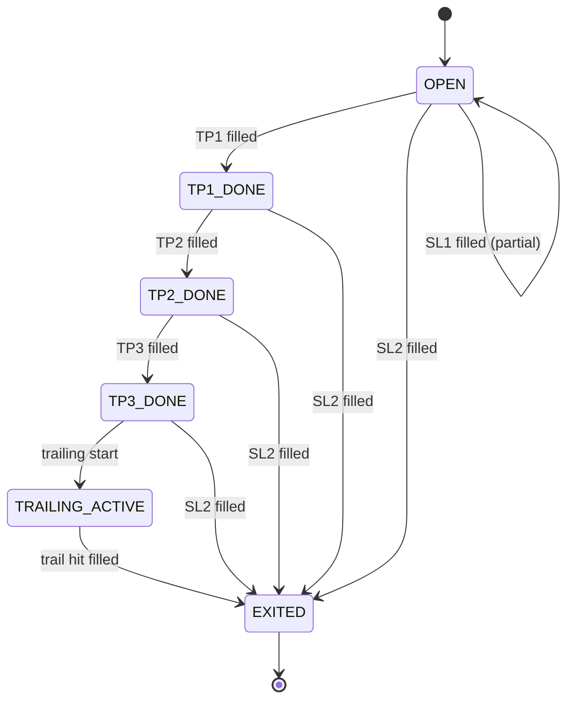
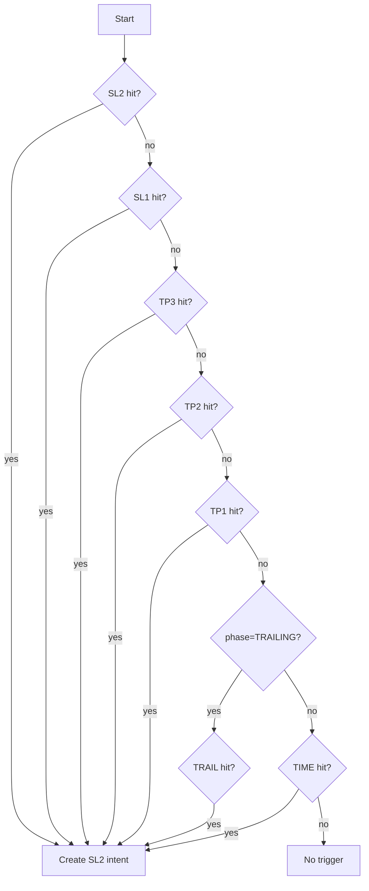

# Exit Engine 모듈 설계

> 자동청산 (손절/익절/트레일링/시간청산)

---

## 📐 Runtime Map (이 문서 범위)

```
┌──────────────────────────────────────────────────────────────┐
│                        Quant Runtime                          │
├──────────────────┬───────────────────────┬───────────────────┤
│ PriceSync         │ >>> Exit Engine <<<   │ Execution Service  │
│ (WS/REST/Naver)   │ (FSM + Idempotency)   │ (KIS Orders/Fills) │
└─────────┬────────┴──────────┬────────────┴─────────┬─────────┘
          │                   │                      │
          ▼                   ▼                      ▼
  market.prices_best     trade.positions_*        trade.orders_*
  market.freshness  ---> trade.position_state     trade.fills_*
                         trade.order_intents
          │                   │                      │
          └───────────────────┴──────────────────────┴──► Monitoring
```

---

## 🎯 모듈 책임 (SSOT)

### 이 모듈이 소유하는 것 (유일한 소유자)

✅ **데이터:**
- `trade.positions` - 포지션 마스터
- `trade.position_state` - Exit FSM 상태
- `trade.order_intents` (EXIT_* 타입) - 청산 의도

✅ **로직:**
- Exit 상태 머신 (FSM) 전이
- 트리거 조건 판정 (SL/TP/TRAIL)
- HWM/StopFloor 계산
- 청산 주문 의도 생성 (멱등)

### 다른 모듈과의 경계

❌ **Exit Engine이 하지 않는 것:**
- 현재가 결정 → PriceSync
- 주문 제출 → Execution
- 재진입 판단 → Reentry Engine

❌ **Exit Engine이 접근하지 않는 것:**
- `market.*` 테이블 쓰기 (읽기만)
- `trade.orders/fills` 쓰기 (읽기만)
- `trade.reentry_candidates` 쓰기 (읽기만)

✅ **Exit Engine이 읽을 수 있는 것:**
- `market.prices_best` (현재가)
- `market.freshness` (안전 게이트)
- `trade.fills` (체결 확인)

---

## 🔌 Public Interface

### 1. 외부 제공 인터페이스

#### Output: order_intents (청산 의도)

```sql
-- Execution이 읽어서 주문 제출
INSERT INTO trade.order_intents (
    intent_id,
    position_id,
    symbol,
    intent_type,    -- EXIT_PARTIAL | EXIT_FULL
    qty,
    order_type,     -- MKT | LMT
    limit_price,
    reason_code,    -- SL1 | SL2 | TP1 | TP2 | TP3 | TRAIL
    action_key,     -- {position_id}:SL1 (UNIQUE)
    status          -- NEW
) VALUES (...);
```

**계약 (Contract):**
- `action_key`는 unique (멱등성 보장)
- `intent_type`은 EXIT_PARTIAL 또는 EXIT_FULL만
- `status=NEW`로 생성
- `qty`는 포지션 잔량 이하

#### Output: reentry_candidates (재진입 후보 생성)

```sql
-- Reentry Engine이 읽어서 후보 관리
INSERT INTO trade.reentry_candidates (
    candidate_id,
    symbol,
    origin_position_id,
    exit_reason,        -- SL1 | SL2 | TRAIL | TP | TIME
    exit_ts,
    exit_price,
    cooldown_until,     -- exit_ts + cooldown_period
    state,              -- COOLDOWN
    max_reentries,
    reentry_count
) VALUES (...);
```

**계약:**
- 포지션이 CLOSED로 확정될 때만 생성
- `cooldown_until`은 반드시 미래 시각
- `state=COOLDOWN`로 시작

### 2. 외부 의존 인터페이스

#### Input: market.prices_best (PriceSync)

```sql
-- 현재가 조회
SELECT last_price FROM market.prices_best WHERE symbol = ?;
```

#### Input: market.freshness (PriceSync)

```sql
-- 안전 게이트
SELECT is_stale FROM market.freshness WHERE symbol = ?;
```

#### Input: trade.fills (Execution)

```sql
-- 체결 확인으로 상태 전이
SELECT qty, price FROM trade.fills
WHERE order_id IN (
    SELECT order_id FROM trade.orders WHERE intent_id = ?
);
```

---

## 📊 데이터 모델

### trade.positions (포지션 마스터)

**목적**: 보유 포지션 기본 정보

| 컬럼 | 타입 | 제약 | 설명 |
|------|------|------|------|
| position_id | UUID | PK | 포지션 고유 ID |
| account_id | TEXT | NOT NULL | 계좌 ID |
| symbol | TEXT | NOT NULL | 종목 코드 |
| side | TEXT | NOT NULL | LONG (숏은 추후) |
| qty | BIGINT | NOT NULL | 현재 수량 |
| avg_price | NUMERIC | NOT NULL | 평균 단가 |
| entry_ts | TIMESTAMPTZ | NOT NULL | 진입 시각 |
| status | TEXT | NOT NULL | OPEN/CLOSING/CLOSED |
| strategy_id | TEXT | NULL | 진입 전략 ID |
| updated_ts | TIMESTAMPTZ | NOT NULL | 마지막 갱신 |

**인덱스:**
```sql
INDEX idx_positions_open (account_id, status, symbol)
  WHERE status IN ('OPEN', 'CLOSING')
```

### trade.position_state (Exit FSM 상태)

**목적**: 청산 상태 머신 유지

| 컬럼 | 타입 | 제약 | 설명 |
|------|------|------|------|
| position_id | UUID | PK, FK | 포지션 ID |
| phase | TEXT | NOT NULL | OPEN/TP1_DONE/TP2_DONE/TP3_DONE/TRAILING_ACTIVE/EXITED |
| hwm_price | NUMERIC | NULL | High-Water Mark (최고가) |
| stop_floor_price | NUMERIC | NULL | Stop Floor (손절 바닥) |
| atr | NUMERIC | NULL | ATR (일봉 기반, 캐시) |
| cooldown_until | TIMESTAMPTZ | NULL | 재진입 쿨다운 (Exit 후) |
| last_eval_ts | TIMESTAMPTZ | NULL | 마지막 평가 시각 |
| updated_ts | TIMESTAMPTZ | NOT NULL | 마지막 갱신 |

**FSM 상태:**



---

## 🔄 처리 흐름

### 1. 평가 루프 (Evaluation Loop)

```mermaid
flowchart TD
    A[Load OPEN positions] --> B[For each position]
    B --> C{price stale?}
    C -->|yes| D[Fail-Closed Policy]
    D --> X[Skip or Conservative Exit]
    C -->|no| E[Compute pnl/ret/hwm]
    E --> F[Check triggers by priority]
    F --> G{Any trigger hit?}
    G -->|no| H[Update state metrics]
    G -->|yes| I[Create order_intent]
    I --> J{Insert success?}
    J -->|yes| K[Intent created]
    J -->|no| L[Already exists (idempotent)]
    K --> H
    L --> H
```

**Fail-Closed 정책 (stale 시):**

| 정책 | 설명 | 권장 |
|------|------|------|
| **보수** | stale이면 청산도 보류 | 초기 운영 |
| **리스크** | stale 지속(60s+) 시 강제 청산 | 안정화 후 |

### 2. 트리거 우선순위

**우선순위 (높음 → 낮음):**

```
1. SL2 (전량 손절) - 가장 위험
2. SL1 (부분 손절)
3. TP3 (익절 3단계)
4. TP2 (익절 2단계)
5. TP1 (익절 1단계)
6. TRAIL (트레일링, TRAILING_ACTIVE 상태에서만)
7. TIME EXIT (최대 보유기간)
```

**트리거 체크 순서:**



### 3. 멱등성 구현 (Idempotency)

**action_key 컨벤션:**

| 트리거 | action_key 패턴 | 예시 |
|--------|----------------|------|
| SL1 | `{position_id}:SL1` | `a1b2c3-...:SL1` |
| SL2 | `{position_id}:SL2` | `a1b2c3-...:SL2` |
| TP1 | `{position_id}:TP1` | `a1b2c3-...:TP1` |
| TP2 | `{position_id}:TP2` | `a1b2c3-...:TP2` |
| TP3 | `{position_id}:TP3` | `a1b2c3-...:TP3` |
| TRAIL | `{position_id}:TRAIL` | `a1b2c3-...:TRAIL` |

**DB 강제:**

```sql
CREATE UNIQUE INDEX uq_order_intents_action_key
ON trade.order_intents (action_key);
```

**애플리케이션 처리:**

```
try {
    INSERT INTO trade.order_intents (action_key, ...) VALUES (...);
} catch (UniqueViolationError) {
    // 이미 존재 → 정상 흐름 (no-op)
}
```

### 4. 수량 계산 (부분 청산)

**규칙 (예시):**

| 트리거 | 수량 | 계산 |
|--------|------|------|
| SL1 | 50% | `ceil(remaining_qty * 0.5)` |
| SL2 | 100% | `remaining_qty` |
| TP1 | 25% | `ceil(original_qty * 0.25)` |
| TP2 | 25% | `ceil(original_qty * 0.25)` |
| TP3 | 20% | `ceil(original_qty * 0.20)` |
| TRAIL | 잔량 | `remaining_qty` |

**잔량 추적:**

```sql
-- 현재 잔량 계산
SELECT p.qty -
       COALESCE(SUM(f.qty), 0) AS remaining_qty
FROM trade.positions p
LEFT JOIN trade.order_intents i ON p.position_id = i.position_id
    AND i.intent_type LIKE 'EXIT_%'
LEFT JOIN trade.orders o ON i.intent_id = o.intent_id
LEFT JOIN trade.fills f ON o.order_id = f.order_id
WHERE p.position_id = ?
GROUP BY p.qty;
```

---

## 🎲 청산 룰 (예시 설정)

### SL (Stop Loss)

| 레벨 | 조건 | 수량 | 후속 조치 |
|------|------|------|----------|
| **SL1** | 수익률 <= -3% | 50% | StopFloor 유지 |
| **SL2** | 수익률 <= -5% | 100% | 포지션 종료 |

### TP (Take Profit)

| 레벨 | 조건 | 수량 | 후속 조치 |
|------|------|------|----------|
| **TP1** | 수익률 >= +7% | 25% | StopFloor = 본전+0.6% |
| **TP2** | 수익률 >= +11% | 25% | StopFloor 유지 |
| **TP3** | 수익률 >= +16% | 20% | Trailing 시작 |

### Trailing (HWM 기반)

**조건:**
- phase = TRAILING_ACTIVE
- price <= HWM - max(ATR × k, pct_trail)

**파라미터 (예시):**
- k = 2.0 (ATR 배수)
- pct_trail = 4% (최소 트레일)

**계산:**

```
trail_threshold = HWM - max(ATR * 2.0, HWM * 0.04)
if current_price <= trail_threshold:
    trigger TRAIL
```

### Time Exit

**조건:**
- 보유 기간 >= max_hold_days (예: 10일)
- 포지션 상태가 OPEN 또는 TP1_DONE 이하

**수량:** 잔량 전부

---

## 🚨 에러 처리

### 1. 가격 Stale

**증상**: `market.freshness.is_stale = true`

**대응:**
- **보수**: 모든 트리거 평가 중단
- **리스크**: stale 60초 이상 지속 시 강제 청산 (정책 선택)

### 2. 체결 지연

**증상**: intent=ACK인데 fills 없음이 장시간

**대응:**
- 주기적 reconcile로 fills 재조회
- timeout 초과 시 알람

### 3. 부분 체결

**증상**: 주문 수량 < 체결 수량

**대응:**
- 잔량 기준으로 다음 트리거 재계산
- 부분 체결도 intent 상태 PARTIAL로 관리

---

## 🔒 SSOT 규칙 (금지 패턴)

### ❌ 절대 금지

1. **Exit Engine에서 현재가 계산**
   ```
   ❌ Exit에서 prices_ticks 집계
   ❌ Exit에서 best price 재계산

   ✅ prices_best만 조회
   ```

2. **Exit Engine에서 주문 API 직접 호출**
   ```
   ❌ Exit에서 KIS API 직접 호출
   ❌ Exit에서 orders 테이블 직접 쓰기

   ✅ order_intents만 생성
   ```

3. **Exit Engine에서 재진입 로직**
   ```
   ❌ Exit에서 재진입 판단
   ❌ Exit에서 reentry_candidates 상태 변경

   ✅ candidates 생성만 (COOLDOWN 상태로)
   ```

### ✅ 허용된 패턴

1. **PriceSync 데이터 읽기**
   ```sql
   SELECT last_price FROM market.prices_best WHERE symbol = ?;
   SELECT is_stale FROM market.freshness WHERE symbol = ?;
   ```

2. **Execution 데이터 읽기 (체결 확인)**
   ```sql
   SELECT * FROM trade.fills WHERE order_id = ?;
   SELECT status FROM trade.orders WHERE intent_id = ?;
   ```

3. **Reentry Candidate 생성 (쓰기)**
   ```sql
   INSERT INTO trade.reentry_candidates (...) VALUES (...);
   ```

---

## 📏 성능 고려사항

### 1. 평가 주기 최적화

**초기**: 1~5초 (보유 종목만)
**최적화**: 10~30초 (안정화 후)

### 2. 인덱스 최적화

```sql
-- 빠른 OPEN 포지션 조회
CREATE INDEX idx_positions_open
ON trade.positions (account_id, status, symbol)
WHERE status = 'OPEN';

-- 빠른 intent 중복 체크
CREATE UNIQUE INDEX uq_order_intents_action_key
ON trade.order_intents (action_key);
```

### 3. ATR 캐시

**문제**: 매 평가마다 ATR 계산은 비효율

**해결**:
- 일봉 기반 ATR을 별도 테이블에 캐시
- 1일 1회 또는 장 종료 후 재계산
- position_state에 복사하여 사용

---

## 🧪 테스트 전략

### 1. 단위 테스트

- 트리거 조건 판정 (SL/TP/TRAIL)
- 멱등성 (동일 트리거 2회 평가 시 intent 1개)
- 수량 계산 (부분 청산)
- FSM 상태 전이

### 2. 통합 테스트

- PriceSync stale → 평가 중단
- Execution fills → 상태 전이 확인
- 여러 트리거 동시 충족 시 우선순위

### 3. E2E 테스트

- 실제 포지션 진입 → 청산 전체 흐름
- WS 단절 → REST fallback → 청산 계속
- 부분 체결 → 잔량 기준 다음 트리거

---

## 📊 설계 완료 기준

- [ ] 입력/출력 인터페이스 명확히 정의
- [ ] 데이터 모델 (positions/state) 완성
- [ ] Exit FSM 상태 전이 정의
- [ ] 트리거 우선순위 정의
- [ ] 멱등성 규칙 (action_key) 정의
- [ ] 수량 계산 로직 정의
- [ ] Fail-Closed 정책 정의
- [ ] SSOT 규칙 (소유권/금지) 명시
- [ ] 에러 처리 시나리오 정의

---

## 🔗 관련 문서

- [architecture/system-overview.md](../architecture/system-overview.md) - 전체 시스템
- [price-sync.md](./price-sync.md) - PriceSync (Exit 의존)
- [reentry-engine.md](./reentry-engine.md) - Reentry Engine
- [database/schema.md](../database/schema.md) - DB 스키마

---

**Module Owner**: Exit Engine
**Dependencies**: PriceSync (읽기), Execution (읽기)
**Consumers**: Execution (order_intents), Reentry (candidates)
**Version**: v14.0.0-design
**Last Updated**: 2026-01-13
