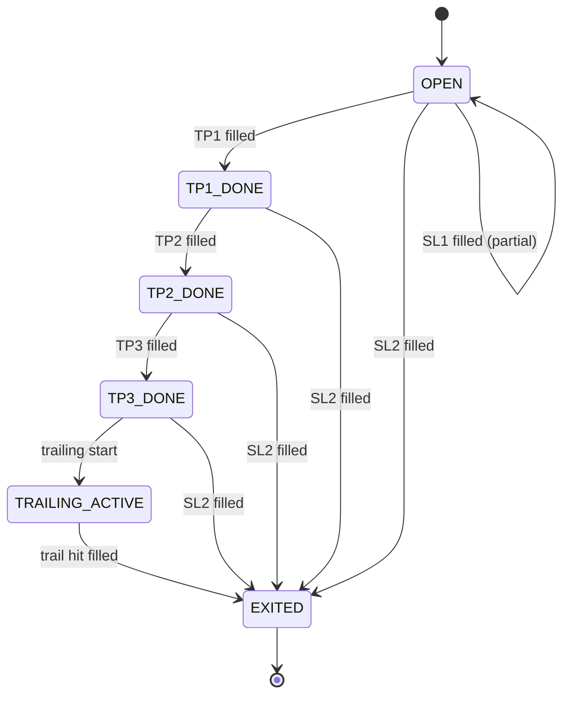
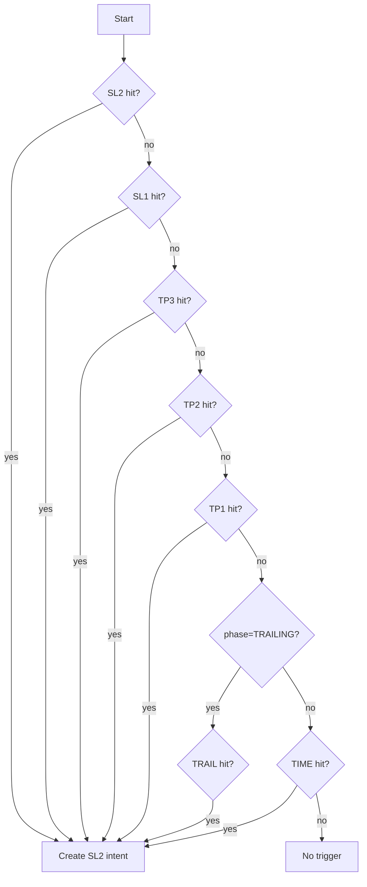

# Exit Engine 모듈 설계

> 자동청산 (손절/익절/트레일링/시간청산)

---

## 📐 Runtime Map (이 문서 범위)

```
┌──────────────────────────────────────────────────────────────┐
│                        Quant Runtime                          │
├──────────────────┬───────────────────────┬───────────────────┤
│ PriceSync         │ >>> Exit Engine <<<   │ Execution Service  │
│ (WS/REST/Naver)   │ (FSM + Idempotency)   │ (KIS Orders/Fills) │
└─────────┬────────┴──────────┬────────────┴─────────┬─────────┘
          │                   │                      │
          ▼                   ▼                      ▼
  market.prices_best     trade.positions_*        trade.orders_*
  market.freshness  ---> trade.position_state     trade.fills_*
                         trade.order_intents
          │                   │                      │
          └───────────────────┴──────────────────────┴──► Monitoring
```

---

## 🎯 모듈 책임 (SSOT)

### 이 모듈이 소유하는 것 (유일한 소유자)

✅ **데이터:**
- `trade.positions` - 포지션 마스터
- `trade.position_state` - Exit FSM 상태
- `trade.order_intents` (EXIT_* 타입) - 청산 의도

✅ **로직:**
- Exit 상태 머신 (FSM) 전이
- 트리거 조건 판정 (SL/TP/TRAIL)
- HWM/StopFloor 계산
- 청산 주문 의도 생성 (멱등)

### 다른 모듈과의 경계

❌ **Exit Engine이 하지 않는 것:**
- 현재가 결정 → PriceSync
- 주문 제출 → Execution
- 재진입 판단 → Reentry Engine

❌ **Exit Engine이 접근하지 않는 것:**
- `market.*` 테이블 쓰기 (읽기만)
- `trade.orders/fills` 쓰기 (읽기만)
- `trade.reentry_candidates` 쓰기 (읽기만)

✅ **Exit Engine이 읽을 수 있는 것:**
- `market.prices_best` (현재가)
- `market.freshness` (안전 게이트)
- `trade.fills` (체결 확인)

---

## 🔌 Public Interface

### 1. 외부 제공 인터페이스

#### Output: order_intents (청산 의도)

```sql
-- Execution이 읽어서 주문 제출
INSERT INTO trade.order_intents (
    intent_id,
    position_id,
    symbol,
    intent_type,    -- EXIT_PARTIAL | EXIT_FULL
    qty,
    order_type,     -- MKT | LMT
    limit_price,
    reason_code,    -- SL1 | SL2 | TP1 | TP2 | TP3 | TRAIL
    action_key,     -- {position_id}:SL1 (UNIQUE)
    status          -- NEW
) VALUES (...);
```

**계약 (Contract):**
- `action_key`는 unique (멱등성 보장)
- `intent_type`은 EXIT_PARTIAL 또는 EXIT_FULL만
- `status=NEW`로 생성
- `qty`는 포지션 잔량 이하

#### Output: reentry_candidates (재진입 후보 생성)

```sql
-- Reentry Engine이 읽어서 후보 관리
INSERT INTO trade.reentry_candidates (
    candidate_id,
    symbol,
    origin_position_id,
    exit_reason,        -- SL1 | SL2 | TRAIL | TP | TIME
    exit_ts,
    exit_price,
    cooldown_until,     -- exit_ts + cooldown_period
    state,              -- COOLDOWN
    max_reentries,
    reentry_count
) VALUES (...);
```

**계약:**
- 포지션이 CLOSED로 확정될 때만 생성
- `cooldown_until`은 반드시 미래 시각
- `state=COOLDOWN`로 시작

### 2. 외부 의존 인터페이스

#### Input: market.prices_best (PriceSync)

```sql
-- 현재가 조회
SELECT last_price FROM market.prices_best WHERE symbol = ?;
```

#### Input: market.freshness (PriceSync)

```sql
-- 안전 게이트
SELECT is_stale FROM market.freshness WHERE symbol = ?;
```

#### Input: trade.fills (Execution)

```sql
-- 체결 확인으로 상태 전이
SELECT qty, price FROM trade.fills
WHERE order_id IN (
    SELECT order_id FROM trade.orders WHERE intent_id = ?
);
```

---

## 📊 데이터 모델

### trade.positions (포지션 마스터)

**목적**: 보유 포지션 기본 정보

| 컬럼 | 타입 | 제약 | 설명 |
|------|------|------|------|
| position_id | UUID | PK | 포지션 고유 ID |
| account_id | TEXT | NOT NULL | 계좌 ID |
| symbol | TEXT | NOT NULL | 종목 코드 |
| side | TEXT | NOT NULL | LONG (숏은 추후) |
| qty | BIGINT | NOT NULL | 현재 수량 |
| avg_price | NUMERIC | NOT NULL | 평균 단가 |
| entry_ts | TIMESTAMPTZ | NOT NULL | 진입 시각 |
| status | TEXT | NOT NULL | OPEN/CLOSING/CLOSED |
| strategy_id | TEXT | NULL | 진입 전략 ID |
| updated_ts | TIMESTAMPTZ | NOT NULL | 마지막 갱신 |

**인덱스:**
```sql
INDEX idx_positions_open (account_id, status, symbol)
  WHERE status IN ('OPEN', 'CLOSING')
```

### trade.position_state (Exit FSM 상태)

**목적**: 청산 상태 머신 유지

| 컬럼 | 타입 | 제약 | 설명 |
|------|------|------|------|
| position_id | UUID | PK, FK | 포지션 ID |
| phase | TEXT | NOT NULL | OPEN/TP1_DONE/TP2_DONE/TP3_DONE/TRAILING_ACTIVE/EXITED |
| hwm_price | NUMERIC | NULL | High-Water Mark (최고가) |
| stop_floor_price | NUMERIC | NULL | Stop Floor (손절 바닥) |
| atr | NUMERIC | NULL | ATR (일봉 기반, 캐시) |
| cooldown_until | TIMESTAMPTZ | NULL | 재진입 쿨다운 (Exit 후) |
| last_eval_ts | TIMESTAMPTZ | NULL | 마지막 평가 시각 |
| updated_ts | TIMESTAMPTZ | NOT NULL | 마지막 갱신 |

**FSM 상태:**



---

## 🔄 처리 흐름

### 1. 평가 루프 (Evaluation Loop)

```mermaid
flowchart TD
    A[Load OPEN positions] --> B[For each position]
    B --> C{price stale?}
    C -->|yes| D[Fail-Closed Policy]
    D --> X[Skip or Conservative Exit]
    C -->|no| E[Compute pnl/ret/hwm]
    E --> F[Check triggers by priority]
    F --> G{Any trigger hit?}
    G -->|no| H[Update state metrics]
    G -->|yes| I[Create order_intent]
    I --> J{Insert success?}
    J -->|yes| K[Intent created]
    J -->|no| L[Already exists (idempotent)]
    K --> H
    L --> H
```

**Fail-Closed 정책 (stale 시):**

| 정책 | 설명 | 권장 |
|------|------|------|
| **보수** | stale이면 청산도 보류 | 초기 운영 |
| **리스크** | stale 지속(60s+) 시 강제 청산 | 안정화 후 |

### 2. 트리거 우선순위

**우선순위 (높음 → 낮음):**

```
1. SL2 (전량 손절) - 가장 위험
2. SL1 (부분 손절)
3. TP3 (익절 3단계)
4. TP2 (익절 2단계)
5. TP1 (익절 1단계)
6. TRAIL (트레일링, TRAILING_ACTIVE 상태에서만)
7. TIME EXIT (최대 보유기간)
```

**트리거 체크 순서:**



### 3. 멱등성 구현 (Idempotency)

**action_key 컨벤션:**

| 트리거 | action_key 패턴 | 예시 |
|--------|----------------|------|
| SL1 | `{position_id}:SL1` | `a1b2c3-...:SL1` |
| SL2 | `{position_id}:SL2` | `a1b2c3-...:SL2` |
| TP1 | `{position_id}:TP1` | `a1b2c3-...:TP1` |
| TP2 | `{position_id}:TP2` | `a1b2c3-...:TP2` |
| TP3 | `{position_id}:TP3` | `a1b2c3-...:TP3` |
| TRAIL | `{position_id}:TRAIL` | `a1b2c3-...:TRAIL` |

**DB 강제:**

```sql
CREATE UNIQUE INDEX uq_order_intents_action_key
ON trade.order_intents (action_key);
```

**애플리케이션 처리:**

```
try {
    INSERT INTO trade.order_intents (action_key, ...) VALUES (...);
} catch (UniqueViolationError) {
    // 이미 존재 → 정상 흐름 (no-op)
}
```

### 4. 수량 계산 (부분 청산)

**규칙 (예시):**

| 트리거 | 수량 | 계산 |
|--------|------|------|
| SL1 | 50% | `ceil(remaining_qty * 0.5)` |
| SL2 | 100% | `remaining_qty` |
| TP1 | 25% | `ceil(original_qty * 0.25)` |
| TP2 | 25% | `ceil(original_qty * 0.25)` |
| TP3 | 20% | `ceil(original_qty * 0.20)` |
| TRAIL | 잔량 | `remaining_qty` |

**잔량 추적:**

```sql
-- 현재 잔량 계산
SELECT p.qty -
       COALESCE(SUM(f.qty), 0) AS remaining_qty
FROM trade.positions p
LEFT JOIN trade.order_intents i ON p.position_id = i.position_id
    AND i.intent_type LIKE 'EXIT_%'
LEFT JOIN trade.orders o ON i.intent_id = o.intent_id
LEFT JOIN trade.fills f ON o.order_id = f.order_id
WHERE p.position_id = ?
GROUP BY p.qty;
```

---

## 🎲 청산 룰 상세 설정

### 설정 구조 (ExitRulesConfig)

```go
type ExitRulesConfig struct {
    // 1. HARD_STOP (하드 손절)
    HardStopPercent    float64  // -3.0% (기본값)

    // 2. GAP_DOWN (갭 하락 손절)
    GapDownPercent     float64  // -3.0% (장 시작 시 갭 기준)
    GapDownCheckWindow int      // 30초 (장 시작 후 체크 시간)

    // 3. SCALE_OUT (단계적 익절)
    ScaleOutLevels     []ScaleOutLevel
    // 예: [{+10%, 50%}, {+18%, 20%}]

    // 4. ATR_TRAILING (ATR 기반 트레일링)
    ATRPeriod          int      // 14일 (ATR 계산 기간)
    ATRMultiplier      float64  // 2.0배
    TrailingATRMin     float64  // 5.0% (최소 트레일 거리)
    TrailingActivation float64  // 10.0% (트레일 시작 수익률)

    // 5. BREAK_EVEN (손익분기점 보호)
    BreakEvenTrigger   float64  // +3.0% (최고점 도달 조건)
    BreakEvenBuffer    float64  // +1.0% (보호 수익률)

    // 6. TIME_EXIT (시간 기반 청산)
    TimeExitDays1      int      // 8일 (1차 기준)
    TimeExitMinProfit1 float64  // +3.0% (1차 최소 수익)
    TimeExitDays2      int      // 15일 (2차 기준)
    TimeExitHWMStale   int      // 3일 (HWM 미갱신 기간)

    // 7. MANUAL (수동 청산)
    ManualEnabled      bool     // true (수동 청산 허용 여부)
}

type ScaleOutLevel struct {
    ProfitPercent float64  // 수익률 조건
    ExitPercent   float64  // 청산 비율
}
```

### 1. HARD_STOP (하드 손절)

**목적**: 급격한 손실 방지

| 파라미터 | 기본값 | 설명 |
|----------|--------|------|
| HardStopPercent | -3.0% | 손절 수익률 |

**조건:**
```go
if current_pnl_pct <= config.HardStopPercent {
    create_intent("HARD_STOP", qty=remaining_qty, order_type="MKT")
}
```

**수량:** 잔량 100%
**주문 타입:** 시장가 (즉시 체결)

### 2. GAP_DOWN (갭 하락 손절)

**목적**: 장 시작 시 급락 대응

| 파라미터 | 기본값 | 설명 |
|----------|--------|------|
| GapDownPercent | -3.0% | 갭 하락 비율 |
| GapDownCheckWindow | 30초 | 장 시작 후 체크 시간 |

**조건:**
```go
if is_market_open() && time_since_open() <= config.GapDownCheckWindow {
    gap_pct := (current_price - prev_close) / prev_close
    if gap_pct <= config.GapDownPercent {
        create_intent("GAP_DOWN", qty=remaining_qty, order_type="MKT")
    }
}
```

**수량:** 잔량 100%
**주문 타입:** 시장가
**체크 시점:** 장 시작 후 30초 이내

### 3. SCALE_OUT (단계적 익절)

**목적**: 수익 실현 + 추가 상승 기회 유지

| 파라미터 | 기본값 | 설명 |
|----------|--------|------|
| ScaleOutLevels | [{+10%, 50%}, {+18%, 20%}] | 익절 단계 |

**조건:**
```go
for level in config.ScaleOutLevels {
    if current_pnl_pct >= level.ProfitPercent {
        exit_qty := original_qty * level.ExitPercent
        create_intent(f"SCALE_OUT_{level.ProfitPercent}",
                     qty=exit_qty,
                     order_type="LMT",
                     limit_price=current_price * 0.998)  // 0.2% 슬리피지
    }
}
```

**수량 예시:**
- Level 1 (+10%): 원본 수량의 50%
- Level 2 (+18%): 원본 수량의 20%
- 잔량 30%는 트레일링으로 전환

**주문 타입:** 지정가 (0.2% 슬리피지 허용)

### 4. ATR_TRAILING (ATR 기반 트레일링)

**목적**: 추세 유지하며 수익 최대화

| 파라미터 | 기본값 | 설명 |
|----------|--------|------|
| ATRPeriod | 14일 | ATR 계산 기간 |
| ATRMultiplier | 2.0배 | ATR 배수 |
| TrailingATRMin | 5.0% | 최소 트레일 거리 |
| TrailingActivation | 10.0% | 트레일 시작 수익률 |

**조건:**
```go
// 트레일링 활성화 조건
if current_pnl_pct >= config.TrailingActivation && phase != TRAILING_ACTIVE {
    phase = TRAILING_ACTIVE
    hwm_price = current_price
}

// 트레일링 체크 (TRAILING_ACTIVE 상태에서만)
if phase == TRAILING_ACTIVE {
    atr_distance := position_state.atr * config.ATRMultiplier
    min_distance := hwm_price * (config.TrailingATRMin / 100.0)

    trail_threshold := hwm_price - max(atr_distance, min_distance)

    if current_price <= trail_threshold {
        create_intent("ATR_TRAIL", qty=remaining_qty, order_type="MKT")
    }

    // HWM 갱신
    if current_price > hwm_price {
        hwm_price = current_price
        stop_floor_price = trail_threshold
    }
}
```

**수량:** 잔량 100%
**주문 타입:** 시장가
**최소 보호:** HWM 대비 5% 하락까지 허용

### 5. BREAK_EVEN (손익분기점 보호)

**목적**: 수익 나왔다가 손실 전환 방지

| 파라미터 | 기본값 | 설명 |
|----------|--------|------|
| BreakEvenTrigger | +3.0% | 최고점 도달 조건 |
| BreakEvenBuffer | +1.0% | 보호 수익률 |

**조건:**
```go
// HWM이 +3% 도달한 적 있으면
if hwm_pnl_pct >= config.BreakEvenTrigger {
    breakeven_threshold := avg_price * (1 + config.BreakEvenBuffer/100.0)

    if current_price <= breakeven_threshold {
        create_intent("BREAK_EVEN", qty=remaining_qty, order_type="MKT")
    }
}
```

**수량:** 잔량 100%
**주문 타입:** 시장가
**시나리오:** 최고점 +3% 도달 → 현재가 +1% 이하로 하락 시 청산

### 6. TIME_EXIT (시간 기반 청산)

**목적**: 장기 체류 방지

| 파라미터 | 기본값 | 설명 |
|----------|--------|------|
| TimeExitDays1 | 8일 | 1차 시간 기준 |
| TimeExitMinProfit1 | +3.0% | 1차 최소 수익 |
| TimeExitDays2 | 15일 | 2차 시간 기준 |
| TimeExitHWMStale | 3일 | HWM 미갱신 기간 |

**조건 1 (수익 부족):**
```go
holding_days := days_since(entry_ts)

if holding_days >= config.TimeExitDays1 && current_pnl_pct < config.TimeExitMinProfit1 {
    create_intent("TIME_EXIT_PROFIT", qty=remaining_qty, order_type="MKT")
}
```

**조건 2 (HWM 정체):**
```go
hwm_stale_days := days_since(last_hwm_update_ts)

if holding_days >= config.TimeExitDays2 && hwm_stale_days >= config.TimeExitHWMStale {
    create_intent("TIME_EXIT_STALE", qty=remaining_qty, order_type="MKT")
}
```

**수량:** 잔량 100%
**주문 타입:** 시장가
**시나리오:**
- 8일 보유 + 수익률 3% 미만 → 청산
- 15일 보유 + 최고점 3일간 미갱신 → 청산

### 7. MANUAL (수동 청산)

**목적**: 사용자 직접 개입

| 파라미터 | 기본값 | 설명 |
|----------|--------|------|
| ManualEnabled | true | 수동 청산 허용 |

**조건:**
```go
// API 또는 UI에서 사용자가 청산 요청
if user_requests_manual_exit(position_id, qty, reason) {
    if config.ManualEnabled {
        create_intent("MANUAL",
                     qty=min(qty, remaining_qty),
                     order_type=user_order_type,
                     limit_price=user_limit_price)
    }
}
```

**수량:** 사용자 지정 (잔량 이하)
**주문 타입:** 사용자 선택 (MKT/LMT)
**우선순위:** 자동 룰보다 낮음 (HARD_STOP, GAP_DOWN 우선)

---

### Exit Rules 우선순위 (최종 정리)

**평가 순서 (높음 → 낮음):**

| 순위 | Rule | 조건 | 수량 | 타입 |
|------|------|------|------|------|
| 1 | HARD_STOP | <= -3.0% | 100% | MKT |
| 2 | GAP_DOWN | 장 시작 갭 <= -3.0% | 100% | MKT |
| 3 | SCALE_OUT (L2) | >= +18.0% | 20% | LMT |
| 4 | SCALE_OUT (L1) | >= +10.0% | 50% | LMT |
| 5 | ATR_TRAILING | HWM - ATR×2.0 | 100% | MKT |
| 6 | BREAK_EVEN | HWM +3% 도달 후 +1% 하락 | 100% | MKT |
| 7 | TIME_EXIT | 8일 + <3% 또는 15일 + HWM정체 | 100% | MKT |
| 8 | MANUAL | 사용자 요청 | 가변 | 가변 |

**중요:**
- 한 평가 사이클에 하나의 rule만 실행
- 높은 우선순위 rule이 먼저 체크됨
- Intent 생성 후 다음 사이클까지 대기

---

### Exit Signal 모니터링 (60초 간격)

**목적**: 청산 트리거 감지 및 기록

```sql
CREATE TABLE IF NOT EXISTS trade.exit_signals (
    signal_id UUID PRIMARY KEY,
    position_id UUID NOT NULL REFERENCES trade.positions(position_id),
    ts TIMESTAMPTZ NOT NULL,
    rule_name TEXT NOT NULL,  -- HARD_STOP | GAP_DOWN | SCALE_OUT | ...
    triggered BOOLEAN NOT NULL,
    reason TEXT,
    current_price NUMERIC NOT NULL,
    hwm_price NUMERIC,
    stop_floor_price NUMERIC,
    current_pnl_pct FLOAT NOT NULL,
    intent_id UUID,  -- 생성된 intent (있으면)
    created_ts TIMESTAMPTZ NOT NULL DEFAULT NOW()
);

CREATE INDEX idx_exit_signals_position_ts
ON trade.exit_signals (position_id, ts DESC);
```

**모니터링 루프:**
```go
func MonitorExitSignals(ctx context.Context) {
    ticker := time.NewTicker(60 * time.Second)
    defer ticker.Stop()

    for {
        select {
        case <-ticker.C:
            positions := loadOpenPositions()

            for _, pos := range positions {
                // 모든 rule 평가 (우선순위 순서)
                for _, rule := range exitRules {
                    triggered, reason := rule.Check(pos)

                    // Signal 기록 (트리거 여부 무관)
                    insertExitSignal(pos.ID, rule.Name, triggered, reason, ...)

                    // 트리거되면 intent 생성 후 중단
                    if triggered {
                        intentID := createIntent(pos.ID, rule.Name, ...)
                        updateExitSignal(signalID, intentID)
                        break  // 한 사이클에 하나만
                    }
                }
            }
        case <-ctx.Done():
            return
        }
    }
}
```

**이점:**
- 모든 평가 결과 추적 (디버깅)
- 트리거 직전 상황 분석
- 백테스트 데이터로 활용

---

## 🚨 에러 처리

### 1. 가격 Stale

**증상**: `market.freshness.is_stale = true`

**대응:**
- **보수**: 모든 트리거 평가 중단
- **리스크**: stale 60초 이상 지속 시 강제 청산 (정책 선택)

### 2. 체결 지연

**증상**: intent=ACK인데 fills 없음이 장시간

**대응:**
- 주기적 reconcile로 fills 재조회
- timeout 초과 시 알람

### 3. 부분 체결

**증상**: 주문 수량 < 체결 수량

**대응:**
- 잔량 기준으로 다음 트리거 재계산
- 부분 체결도 intent 상태 PARTIAL로 관리

---

## 🛡️ 운영 안정성 (v10 문제 해결)

### 1. 프로세스 중복 실행 방지

**v10 문제**: 메모리에 남아있거나 이전 프로세스가 kill되지 않아 중복 처리 발생

#### Leader Election (PostgreSQL Advisory Lock)

**목적**: 하나의 Exit Engine 인스턴스만 실행 보장

```sql
-- Advisory lock 테이블
CREATE TABLE IF NOT EXISTS system.process_locks (
    lock_name    TEXT PRIMARY KEY,
    instance_id  TEXT NOT NULL,
    acquired_ts  TIMESTAMPTZ NOT NULL,
    heartbeat_ts TIMESTAMPTZ NOT NULL,
    host         TEXT NOT NULL,
    pid          INT NOT NULL
);

CREATE INDEX idx_process_locks_heartbeat ON system.process_locks (heartbeat_ts DESC);
```

**Leader Election 구현:**

```go
const (
    LockName = "exit_engine_leader"
    LockID = 1001  // 고정 advisory lock ID
    HeartbeatInterval = 5 * time.Second
    HeartbeatTimeout = 15 * time.Second
)

func AcquireLeadership(ctx context.Context, db *pgxpool.Pool) (bool, error) {
    instanceID := fmt.Sprintf("%s-%d", hostname, os.Getpid())

    // 1. PostgreSQL Advisory Lock 시도
    var acquired bool
    err := db.QueryRow(ctx, "SELECT pg_try_advisory_lock($1)", LockID).Scan(&acquired)
    if err != nil || !acquired {
        return false, err
    }

    // 2. 메타데이터 기록
    _, err = db.Exec(ctx, `
        INSERT INTO system.process_locks (lock_name, instance_id, acquired_ts, heartbeat_ts, host, pid)
        VALUES ($1, $2, NOW(), NOW(), $3, $4)
        ON CONFLICT (lock_name) DO UPDATE
        SET instance_id = EXCLUDED.instance_id,
            acquired_ts = EXCLUDED.acquired_ts,
            heartbeat_ts = EXCLUDED.heartbeat_ts,
            host = EXCLUDED.host,
            pid = EXCLUDED.pid
    `, LockName, instanceID, hostname, os.Getpid())

    if err != nil {
        // Lock 획득 실패 시 advisory lock 해제
        db.Exec(ctx, "SELECT pg_advisory_unlock($1)", LockID)
        return false, err
    }

    // 3. Heartbeat 시작
    go maintainHeartbeat(ctx, db, instanceID)

    return true, nil
}

func maintainHeartbeat(ctx context.Context, db *pgxpool.Pool, instanceID string) {
    ticker := time.NewTicker(HeartbeatInterval)
    defer ticker.Stop()

    for {
        select {
        case <-ticker.C:
            _, err := db.Exec(ctx, `
                UPDATE system.process_locks
                SET heartbeat_ts = NOW()
                WHERE lock_name = $1 AND instance_id = $2
            `, LockName, instanceID)

            if err != nil {
                log.Error("heartbeat update failed", "error", err)
                // Advisory lock은 연결 종료 시 자동 해제됨
            }

        case <-ctx.Done():
            // Graceful shutdown
            releaseLeadership(db, instanceID)
            return
        }
    }
}

func releaseLeadership(db *pgxpool.Pool, instanceID string) {
    ctx := context.Background()

    // 1. Advisory lock 해제
    db.Exec(ctx, "SELECT pg_advisory_unlock($1)", LockID)

    // 2. 메타데이터 삭제
    db.Exec(ctx, "DELETE FROM system.process_locks WHERE lock_name = $1 AND instance_id = $2",
        LockName, instanceID)
}
```

**Stale Leader 감지 (다른 인스턴스가 실행):**

```go
func detectStaleLeader(ctx context.Context, db *pgxpool.Pool) {
    ticker := time.NewTicker(30 * time.Second)
    defer ticker.Stop()

    for {
        select {
        case <-ticker.C:
            var lastHeartbeat time.Time
            err := db.QueryRow(ctx, `
                SELECT heartbeat_ts FROM system.process_locks
                WHERE lock_name = $1
            `, LockName).Scan(&lastHeartbeat)

            if err == nil {
                staleDuration := time.Since(lastHeartbeat)
                if staleDuration > HeartbeatTimeout {
                    log.Warn("stale leader detected",
                        "last_heartbeat", lastHeartbeat,
                        "stale_duration", staleDuration)

                    // Advisory lock 강제 해제 (관리자 권한 필요)
                    // 또는 알람 발송 후 수동 개입
                }
            }

        case <-ctx.Done():
            return
        }
    }
}
```

#### Graceful Shutdown

**목적**: 평가 중인 작업 완료 후 종료

```go
func (e *ExitEngine) Run(ctx context.Context) error {
    // Leader election
    isLeader, err := AcquireLeadership(ctx, e.db)
    if err != nil || !isLeader {
        return fmt.Errorf("failed to acquire leadership: %w", err)
    }
    defer releaseLeadership(e.db, e.instanceID)

    // Evaluation loop
    ticker := time.NewTicker(5 * time.Second)
    defer ticker.Stop()

    // Graceful shutdown channel
    shutdownCh := make(chan os.Signal, 1)
    signal.Notify(shutdownCh, syscall.SIGINT, syscall.SIGTERM)

    for {
        select {
        case <-ticker.C:
            // 평가 작업 시작
            evalCtx, cancel := context.WithTimeout(ctx, 30*time.Second)
            e.evaluatePositions(evalCtx)
            cancel()

        case <-shutdownCh:
            log.Info("graceful shutdown initiated")

            // 진행 중인 평가 완료 대기 (최대 60초)
            shutdownCtx, cancel := context.WithTimeout(context.Background(), 60*time.Second)
            defer cancel()

            e.waitForInFlightEvaluations(shutdownCtx)

            log.Info("graceful shutdown completed")
            return nil

        case <-ctx.Done():
            return ctx.Err()
        }
    }
}

func (e *ExitEngine) waitForInFlightEvaluations(ctx context.Context) {
    e.wg.Wait()  // WaitGroup으로 진행 중인 평가 대기
}
```

#### 중복 실행 감지 알람

**모니터링:**

```sql
-- 중복 실행 감지 쿼리 (모니터링 도구에서 주기 실행)
SELECT
    lock_name,
    COUNT(*) AS instance_count,
    array_agg(instance_id) AS instances,
    array_agg(heartbeat_ts) AS heartbeats
FROM system.process_locks
WHERE lock_name = 'exit_engine_leader'
GROUP BY lock_name
HAVING COUNT(*) > 1;  -- 1개보다 많으면 중복 실행
```

---

### 2. 평단가 변경 감지 및 재계산

**v10 문제**: Exit 평가 중 추가 매수 발생 시 평단가 변경을 반영하지 못함

#### 낙관적 잠금 (Optimistic Locking)

**positions 테이블에 version 추가:**

```sql
ALTER TABLE trade.positions
ADD COLUMN version INT NOT NULL DEFAULT 1;

-- Version 증가 트리거
CREATE OR REPLACE FUNCTION increment_position_version()
RETURNS TRIGGER AS $$
BEGIN
    IF NEW.avg_price != OLD.avg_price OR NEW.qty != OLD.qty THEN
        NEW.version = OLD.version + 1;
        NEW.updated_ts = NOW();
    END IF;
    RETURN NEW;
END;
$$ LANGUAGE plpgsql;

CREATE TRIGGER trg_positions_version
BEFORE UPDATE ON trade.positions
FOR EACH ROW
EXECUTE FUNCTION increment_position_version();
```

#### Exit 평가 시 평단가 검증

**평가 시작 시 snapshot:**

```go
type PositionSnapshot struct {
    PositionID UUID
    Symbol     string
    Qty        int64
    AvgPrice   decimal.Decimal
    Version    int  // 낙관적 잠금
}

func (e *ExitEngine) evaluatePosition(ctx context.Context, pos Position) error {
    // 1. 평가 시작 시 snapshot
    snapshot := PositionSnapshot{
        PositionID: pos.PositionID,
        Symbol:     pos.Symbol,
        Qty:        pos.Qty,
        AvgPrice:   pos.AvgPrice,
        Version:    pos.Version,
    }

    // 2. 현재가 조회
    currentPrice, err := e.priceSync.GetBestPrice(ctx, pos.Symbol)
    if err != nil {
        return fmt.Errorf("price fetch failed: %w", err)
    }

    // 3. 트리거 평가 (snapshot 기준)
    trigger, qty := e.evaluateTriggers(snapshot, currentPrice)
    if trigger == nil {
        return nil  // 트리거 없음
    }

    // 4. Intent 생성 전 version 재확인
    var latestVersion int
    var latestAvgPrice decimal.Decimal
    var latestQty int64

    err = e.db.QueryRow(ctx, `
        SELECT version, avg_price, qty FROM trade.positions
        WHERE position_id = $1
    `, snapshot.PositionID).Scan(&latestVersion, &latestAvgPrice, &latestQty)

    if err != nil {
        return fmt.Errorf("version check failed: %w", err)
    }

    // 5. Version 변경 감지
    if latestVersion != snapshot.Version {
        log.Warn("position changed during evaluation",
            "position_id", snapshot.PositionID,
            "old_version", snapshot.Version,
            "new_version", latestVersion,
            "old_avg_price", snapshot.AvgPrice,
            "new_avg_price", latestAvgPrice)

        // 변경된 포지션으로 재평가
        updatedPos := Position{
            PositionID: snapshot.PositionID,
            Symbol:     snapshot.Symbol,
            Qty:        latestQty,
            AvgPrice:   latestAvgPrice,
            Version:    latestVersion,
        }

        return e.evaluatePosition(ctx, updatedPos)  // 재귀 (최대 3회)
    }

    // 6. Intent 생성 (version 일치)
    err = e.createIntent(ctx, snapshot, trigger, qty)
    if err != nil {
        return fmt.Errorf("intent creation failed: %w", err)
    }

    return nil
}
```

#### 재평가 제한 (무한 루프 방지)

```go
func (e *ExitEngine) evaluatePositionWithRetry(ctx context.Context, pos Position, attempt int) error {
    const maxAttempts = 3

    if attempt >= maxAttempts {
        log.Error("max evaluation attempts reached",
            "position_id", pos.PositionID,
            "attempts", attempt)
        return fmt.Errorf("evaluation abandoned after %d attempts", maxAttempts)
    }

    err := e.evaluatePosition(ctx, pos)
    if errors.Is(err, ErrPositionChanged) {
        // Version 변경 감지 시 재시도
        return e.evaluatePositionWithRetry(ctx, pos, attempt+1)
    }

    return err
}
```

#### 평단가 변경 알람

```go
func (e *ExitEngine) alertAvgPriceChange(old, new PositionSnapshot) {
    priceDiff := new.AvgPrice.Sub(old.AvgPrice)
    priceDiffPct := priceDiff.Div(old.AvgPrice).Mul(decimal.NewFromInt(100))

    if priceDiffPct.Abs().GreaterThan(decimal.NewFromFloat(1.0)) {
        // 1% 이상 변경 시 알람
        e.alerter.Send(Alert{
            Level:   "WARNING",
            Message: "Avg price changed significantly during exit evaluation",
            Data: map[string]interface{}{
                "position_id":     new.PositionID,
                "symbol":          new.Symbol,
                "old_avg_price":   old.AvgPrice,
                "new_avg_price":   new.AvgPrice,
                "diff_pct":        priceDiffPct,
                "old_version":     old.Version,
                "new_version":     new.Version,
            },
        })
    }
}
```

---

### 3. Price Sync 장애 대응 (Fail-Safe)

**v10 문제**: Price sync가 되지 않아 청산 평가 불가

#### Fail-Closed 정책 (보수적 청산 중단)

**원칙**: 가격 신뢰 불가 시 청산 중단 (손실 방지)

```go
func (e *ExitEngine) evaluatePositions(ctx context.Context) {
    positions := e.loadOpenPositions(ctx)

    for _, pos := range positions {
        // 1. 가격 신선도 체크 (BLOCKER)
        freshness, err := e.priceSync.GetFreshness(ctx, pos.Symbol)
        if err != nil {
            log.Error("freshness check failed", "symbol", pos.Symbol, "error", err)
            continue  // 평가 건너뛰기
        }

        if freshness.IsStale {
            log.Warn("price stale, skipping evaluation",
                "symbol", pos.Symbol,
                "reason", freshness.StaleReason,
                "stale_duration", time.Since(freshness.BestTs))

            // Stale 경고 기록
            e.recordStalePriceWarning(ctx, pos.PositionID, freshness)
            continue  // 평가 건너뛰기
        }

        // 2. 현재가 조회
        currentPrice, err := e.priceSync.GetBestPrice(ctx, pos.Symbol)
        if err != nil {
            log.Error("price fetch failed", "symbol", pos.Symbol, "error", err)
            continue  // 평가 건너뛰기
        }

        // 3. 트리거 평가 진행
        e.evaluatePosition(ctx, pos, currentPrice)
    }
}
```

#### Emergency Exit (강제 청산 조건)

**극단적 상황에서만 활성화 (관리자 승인 필요):**

```go
type EmergencyExitConfig struct {
    Enabled          bool
    StaleThreshold   time.Duration  // 60초 (기본값)
    LossThreshold    float64        // -5.0% (손실 임계값)
    ManualApproval   bool           // true (관리자 승인 필수)
}

func (e *ExitEngine) checkEmergencyExit(ctx context.Context, pos Position, freshness Freshness) bool {
    if !e.emergencyConfig.Enabled {
        return false
    }

    staleDuration := time.Since(freshness.BestTs)

    // 조건 1: Stale 지속 시간 초과
    if staleDuration < e.emergencyConfig.StaleThreshold {
        return false
    }

    // 조건 2: 손실 상태 (보수적 청산)
    lastKnownPrice := freshness.LastPrice
    pnlPct := (lastKnownPrice - pos.AvgPrice) / pos.AvgPrice * 100

    if pnlPct > e.emergencyConfig.LossThreshold {
        return false  // 이익 상태면 청산 안 함
    }

    // 조건 3: 수동 승인 확인
    if e.emergencyConfig.ManualApproval {
        approved := e.checkManualApproval(ctx, pos.PositionID)
        if !approved {
            log.Warn("emergency exit requires manual approval",
                "position_id", pos.PositionID,
                "stale_duration", staleDuration,
                "pnl_pct", pnlPct)
            return false
        }
    }

    log.Error("EMERGENCY EXIT triggered",
        "position_id", pos.PositionID,
        "symbol", pos.Symbol,
        "stale_duration", staleDuration,
        "pnl_pct", pnlPct)

    return true
}
```

#### Price Sync 장애 알람 (즉시 통보)

```sql
-- 알람 조건 체크 (모니터링 도구에서 1분마다 실행)
SELECT
    symbol,
    is_stale,
    stale_reason,
    EXTRACT(EPOCH FROM (NOW() - best_ts)) AS stale_seconds,
    last_ws_ts,
    last_rest_ts,
    last_naver_ts
FROM market.freshness
WHERE is_stale = true
  AND EXTRACT(EPOCH FROM (NOW() - best_ts)) > 30  -- 30초 이상 stale
ORDER BY best_ts ASC;
```

**알람 트리거:**

```go
func (e *ExitEngine) monitorPriceSyncHealth(ctx context.Context) {
    ticker := time.NewTicker(30 * time.Second)
    defer ticker.Stop()

    for {
        select {
        case <-ticker.C:
            var staleSymbols []StalePriceInfo
            rows, err := e.db.Query(ctx, `
                SELECT symbol, stale_reason, best_ts
                FROM market.freshness
                WHERE is_stale = true
                  AND EXTRACT(EPOCH FROM (NOW() - best_ts)) > 30
            `)
            if err != nil {
                log.Error("price health check failed", "error", err)
                continue
            }

            for rows.Next() {
                var info StalePriceInfo
                rows.Scan(&info.Symbol, &info.Reason, &info.LastTs)
                staleSymbols = append(staleSymbols, info)
            }
            rows.Close()

            if len(staleSymbols) > 0 {
                e.alerter.Send(Alert{
                    Level:   "CRITICAL",
                    Message: fmt.Sprintf("Price sync stale for %d symbols", len(staleSymbols)),
                    Data: map[string]interface{}{
                        "stale_symbols": staleSymbols,
                        "count":         len(staleSymbols),
                    },
                })
            }

        case <-ctx.Done():
            return
        }
    }
}
```

---

## 🔒 SSOT 규칙 (금지 패턴)

### ❌ 절대 금지

1. **Exit Engine에서 현재가 계산**
   ```
   ❌ Exit에서 prices_ticks 집계
   ❌ Exit에서 best price 재계산

   ✅ prices_best만 조회
   ```

2. **Exit Engine에서 주문 API 직접 호출**
   ```
   ❌ Exit에서 KIS API 직접 호출
   ❌ Exit에서 orders 테이블 직접 쓰기

   ✅ order_intents만 생성
   ```

3. **Exit Engine에서 재진입 로직**
   ```
   ❌ Exit에서 재진입 판단
   ❌ Exit에서 reentry_candidates 상태 변경

   ✅ candidates 생성만 (COOLDOWN 상태로)
   ```

### ✅ 허용된 패턴

1. **PriceSync 데이터 읽기**
   ```sql
   SELECT last_price FROM market.prices_best WHERE symbol = ?;
   SELECT is_stale FROM market.freshness WHERE symbol = ?;
   ```

2. **Execution 데이터 읽기 (체결 확인)**
   ```sql
   SELECT * FROM trade.fills WHERE order_id = ?;
   SELECT status FROM trade.orders WHERE intent_id = ?;
   ```

3. **Reentry Candidate 생성 (쓰기)**
   ```sql
   INSERT INTO trade.reentry_candidates (...) VALUES (...);
   ```

---

## 📏 성능 고려사항

### 1. 평가 주기 최적화

**초기**: 1~5초 (보유 종목만)
**최적화**: 10~30초 (안정화 후)

### 2. 인덱스 최적화

```sql
-- 빠른 OPEN 포지션 조회
CREATE INDEX idx_positions_open
ON trade.positions (account_id, status, symbol)
WHERE status = 'OPEN';

-- 빠른 intent 중복 체크
CREATE UNIQUE INDEX uq_order_intents_action_key
ON trade.order_intents (action_key);
```

### 3. ATR 캐시

**문제**: 매 평가마다 ATR 계산은 비효율

**해결**:
- 일봉 기반 ATR을 별도 테이블에 캐시
- 1일 1회 또는 장 종료 후 재계산
- position_state에 복사하여 사용

---

## 🧪 테스트 전략

### 1. 단위 테스트

- 트리거 조건 판정 (SL/TP/TRAIL)
- 멱등성 (동일 트리거 2회 평가 시 intent 1개)
- 수량 계산 (부분 청산)
- FSM 상태 전이

### 2. 통합 테스트

- PriceSync stale → 평가 중단
- Execution fills → 상태 전이 확인
- 여러 트리거 동시 충족 시 우선순위

### 3. E2E 테스트

- 실제 포지션 진입 → 청산 전체 흐름
- WS 단절 → REST fallback → 청산 계속
- 부분 체결 → 잔량 기준 다음 트리거

---

## 📊 설계 완료 기준

- [ ] 입력/출력 인터페이스 명확히 정의
- [ ] 데이터 모델 (positions/state) 완성
- [ ] Exit FSM 상태 전이 정의
- [ ] 트리거 우선순위 정의
- [ ] 멱등성 규칙 (action_key) 정의
- [ ] 수량 계산 로직 정의
- [ ] Fail-Closed 정책 정의
- [ ] SSOT 규칙 (소유권/금지) 명시
- [ ] 에러 처리 시나리오 정의

---

## 🔗 관련 문서

- [architecture/system-overview.md](../architecture/system-overview.md) - 전체 시스템
- [price-sync.md](./price-sync.md) - PriceSync (Exit 의존)
- [reentry-engine.md](./reentry-engine.md) - Reentry Engine
- [database/schema.md](../database/schema.md) - DB 스키마

---

**Module Owner**: Exit Engine
**Dependencies**: PriceSync (읽기), Execution (읽기)
**Consumers**: Execution (order_intents), Reentry (candidates)
**Version**: v14.0.0-design
**Last Updated**: 2026-01-13
