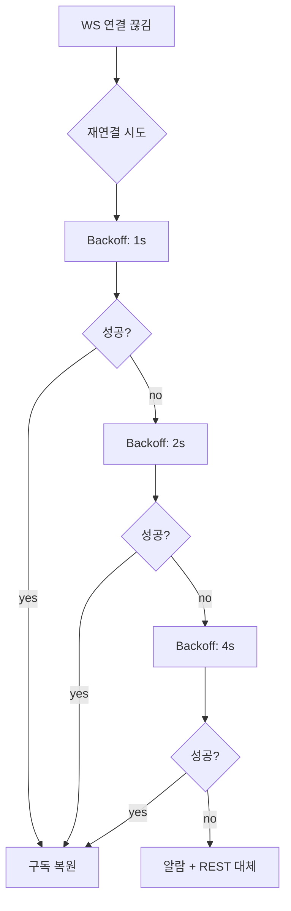
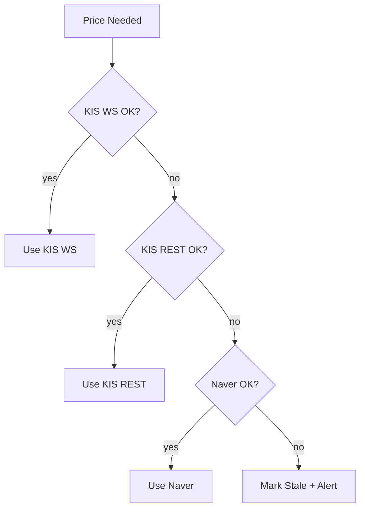

# 외부 API 연동 설계

> KIS API (WebSocket/REST) 및 Naver 금융 API 연동

---

## 📐 API Map

```
┌─────────────────────────────────────────────────────────┐
│                    External APIs                         │
├───────────────────┬──────────────────┬──────────────────┤
│ KIS WebSocket     │ KIS REST API     │ Naver Finance    │
│ (실시간 시세/체결)  │ (주문/잔고/시세)   │ (백업 시세)       │
└─────────┬─────────┴────────┬─────────┴─────────┬────────┘
          │                  │                   │
          ▼                  ▼                   ▼
    PriceSync           Execution           PriceSync
    (시세 수신)          (주문/체결)          (Fallback)
```

---

## 🎯 API 역할 정의

### 1. KIS WebSocket

**용도**: 실시간 데이터 수신
- 실시간 시세 (최대 40종목)
- 실시간 체결 (보유 종목)
- 실시간 호가 (선택)

**소유자**: PriceSync, Execution

### 2. KIS REST API

**용도**: 주문/조회 작업
- 주문 제출/취소/조회
- 잔고/포지션 조회
- 시세 조회 (WebSocket 보완)

**소유자**: Execution, PriceSync

### 3. Naver Finance API

**용도**: 백업 시세
- KIS 장애 시 시세 백업
- 비정기 시세 조회

**소유자**: PriceSync

---

## 🔌 KIS WebSocket API

### 1. 연결 및 인증

**엔드포인트:**
```
wss://ops.koreainvestment.com:21000/tryitout/H0STCNT0
```

**인증 방식:**
```json
{
  "header": {
    "approval_key": "{{APPROVAL_KEY}}",
    "custtype": "P",
    "tr_type": "1",
    "content-type": "utf-8"
  },
  "body": {
    "input": {
      "tr_id": "H0STCNT0",
      "tr_key": "005930"
    }
  }
}
```

**Approval Key 발급:**
```http
POST https://openapi.koreainvestment.com:9443/oauth2/Approval
Content-Type: application/json

{
  "grant_type": "client_credentials",
  "appkey": "{{APP_KEY}}",
  "secretkey": "{{APP_SECRET}}"
}
```

### 2. 실시간 시세 구독

**TR ID**: `H0STCNT0` (실시간 체결가)

**구독 요청:**
```json
{
  "header": {
    "approval_key": "...",
    "tr_type": "1"
  },
  "body": {
    "input": {
      "tr_id": "H0STCNT0",
      "tr_key": "005930"
    }
  }
}
```

**응답 (실시간):**
```json
{
  "header": {
    "tr_id": "H0STCNT0"
  },
  "body": {
    "rt_cd": "0",
    "msg_cd": "OPSP0000",
    "msg1": "정상처리",
    "output": {
      "MKSC_SHRN_ISCD": "005930",
      "STCK_CNTG_HOUR": "153000",
      "STCK_PRPR": "71600",
      "PRDY_VRSS": "400",
      "PRDY_VRSS_SIGN": "2",
      "CNTG_VOL": "100",
      "ACML_VOL": "15234567"
    }
  }
}
```

**데이터 매핑:**

| KIS 필드 | 의미 | DB 매핑 |
|---------|------|---------|
| MKSC_SHRN_ISCD | 종목코드 | symbol |
| STCK_CNTG_HOUR | 체결시각 | ts |
| STCK_PRPR | 현재가 | last_price |
| CNTG_VOL | 체결량 | volume |
| ACML_VOL | 누적거래량 | - |

### 3. 실시간 체결 구독

**TR ID**: `H0STCNI9` (실시간 체결 통보)

**구독 요청:**
```json
{
  "header": {
    "approval_key": "...",
    "tr_type": "1"
  },
  "body": {
    "input": {
      "tr_id": "H0STCNI9",
      "tr_key": "{{ACCOUNT_NO}}"
    }
  }
}
```

**응답 (체결 발생 시):**
```json
{
  "header": {
    "tr_id": "H0STCNI9"
  },
  "body": {
    "output": {
      "CANO": "12345678",
      "ACNT_PRDT_CD": "01",
      "ODNO": "0000123456",
      "STCK_SHRN_ISCD": "005930",
      "STCK_CNTG_QTY": "10",
      "STCK_CNTG_UNPR": "71600",
      "STCK_CNTG_AMT": "716000"
    }
  }
}
```

**데이터 매핑:**

| KIS 필드 | 의미 | DB 매핑 |
|---------|------|---------|
| ODNO | 주문번호 | order_id |
| STCK_SHRN_ISCD | 종목코드 | symbol |
| STCK_CNTG_QTY | 체결수량 | fills.qty |
| STCK_CNTG_UNPR | 체결단가 | fills.price |

### 4. 연결 관리

**재연결 정책:**



**Backoff 전략:**
- 1차: 1초
- 2차: 2초
- 3차: 4초
- 4차 이상: 8초 (최대)

**Heartbeat:**
- KIS는 ping/pong 지원 안 함
- 60초마다 dummy 구독으로 연결 확인

**구독 복원:**
```
재연결 성공 시:
1. 마지막 구독 리스트 복원
2. 40개 제한 준수
3. 우선순위 기반 재구독
```

---

## 🔌 KIS REST API

### 1. 인증

**Token 발급:**
```http
POST https://openapi.koreainvestment.com:9443/oauth2/tokenP
Content-Type: application/json

{
  "grant_type": "client_credentials",
  "appkey": "{{APP_KEY}}",
  "appsecret": "{{APP_SECRET}}"
}
```

**응답:**
```json
{
  "access_token": "eyJ0eXAi...",
  "token_type": "Bearer",
  "expires_in": 86400
}
```

**Token 갱신:**
- 유효기간: 24시간
- 만료 1시간 전 자동 갱신
- 실패 시 즉시 재발급

### 2. 주문 API

#### 2.1 현금 매수

**엔드포인트:**
```http
POST /uapi/domestic-stock/v1/trading/order-cash
```

**Request:**
```json
{
  "CANO": "12345678",
  "ACNT_PRDT_CD": "01",
  "PDNO": "005930",
  "ORD_DVSN": "01",
  "ORD_QTY": "10",
  "ORD_UNPR": "0"
}
```

**Request 필드:**

| 필드 | 값 | 설명 |
|------|---|------|
| ORD_DVSN | 01 | 시장가 |
| ORD_DVSN | 00 | 지정가 |
| ORD_QTY | N | 주문수량 |
| ORD_UNPR | 0 | 시장가 (지정가 시 가격) |

**Response:**
```json
{
  "rt_cd": "0",
  "msg_cd": "APBK0013",
  "msg1": "주문 전송 완료",
  "output": {
    "KRX_FWDG_ORD_ORGNO": "91252",
    "ODNO": "0000123456",
    "ORD_TMD": "151030"
  }
}
```

**매핑:**

| KIS 필드 | DB 매핑 |
|---------|---------|
| ODNO | orders.order_id |
| ORD_TMD | orders.submitted_ts |

#### 2.2 현금 매도

**엔드포인트:**
```http
POST /uapi/domestic-stock/v1/trading/order-cash
```

**Request:**
```json
{
  "CANO": "12345678",
  "ACNT_PRDT_CD": "01",
  "PDNO": "005930",
  "ORD_DVSN": "01",
  "ORD_QTY": "10",
  "ORD_UNPR": "0",
  "SLL_BUY_DVSN_CD": "02"
}
```

**필드 차이:**

| 필드 | 매수 | 매도 |
|------|------|------|
| SLL_BUY_DVSN_CD | 01 | 02 |

#### 2.3 주문 조회

**엔드포인트:**
```http
GET /uapi/domestic-stock/v1/trading/inquire-daily-ccld
```

**Query Parameters:**

| 파라미터 | 값 | 설명 |
|---------|---|------|
| CANO | 계좌번호 | - |
| ACNT_PRDT_CD | 상품코드 | 01 |
| INQR_STRT_DT | 조회시작일 | YYYYMMDD |
| INQR_END_DT | 조회종료일 | YYYYMMDD |
| ORD_GNO_BRNO | 주문번호 | 특정 주문 조회 |

**Response:**
```json
{
  "rt_cd": "0",
  "output1": [
    {
      "ORD_DT": "20260113",
      "ODNO": "0000123456",
      "PDNO": "005930",
      "ORD_QTY": "10",
      "TOT_CCLD_QTY": "10",
      "AVG_PRVS": "71600",
      "ORD_DVSN_NAME": "시장가"
    }
  ]
}
```

### 3. 시세 조회 API

#### 3.1 현재가 조회

**엔드포인트:**
```http
GET /uapi/domestic-stock/v1/quotations/inquire-price
```

**Query Parameters:**

| 파라미터 | 값 |
|---------|---|
| FID_COND_MRKT_DIV_CODE | J |
| FID_INPUT_ISCD | 005930 |

**Response:**
```json
{
  "rt_cd": "0",
  "output": {
    "stck_prpr": "71600",
    "stck_oprc": "71200",
    "stck_hgpr": "72000",
    "stck_lwpr": "71000",
    "acml_vol": "15234567"
  }
}
```

### 4. Rate Limit

**일일 한도:**

| API 종류 | 횟수/일 | 비고 |
|---------|---------|------|
| 주문 | 무제한 | 실질적 제한 있음 |
| 시세 조회 | 1,000 | 계좌당 |
| 잔고 조회 | 무제한 | - |

**초당 한도:**

| API 종류 | 횟수/초 | 비고 |
|---------|---------|------|
| 주문 | 20 | 계좌당 |
| 시세 조회 | 20 | 계좌당 |

**Rate Limit 초과 시:**
```json
{
  "rt_cd": "1",
  "msg_cd": "EGW00123",
  "msg1": "초당 거래건수를 초과하였습니다"
}
```

**대응:**
- 429 응답 시 Exponential Backoff
- 1일 한도 초과 시 알람 + 대체 소스 (Naver)

---

## 🔌 Naver Finance API

### 1. 시세 조회

**엔드포인트:**
```
https://polling.finance.naver.com/api/realtime/domestic/stock/{symbol}
```

**Example:**
```http
GET https://polling.finance.naver.com/api/realtime/domestic/stock/005930
```

**Response:**
```json
{
  "datas": [
    {
      "symbolCode": "005930",
      "stockName": "삼성전자",
      "closePrice": "71600",
      "compareToPreviousClosePrice": "400",
      "fluctuationsRatio": "0.56",
      "accumulatedTradingVolume": "15234567",
      "accumulatedTradingValue": "1089123456789"
    }
  ]
}
```

**데이터 매핑:**

| Naver 필드 | DB 매핑 |
|-----------|---------|
| symbolCode | symbol |
| closePrice | last_price |
| accumulatedTradingVolume | volume |
| accumulatedTradingValue | trade_value |

### 2. Rate Limit

**제한**: 공식 문서 없음 (추정)
- 초당 10~20회 (보수적)
- IP별 제한 가능

**대응:**
- Tier2 폴링으로만 사용 (30~120초)
- KIS 장애 시에만 빈도 증가
- 403/429 시 즉시 중단

### 3. 에러 처리

**일반 에러:**
```json
{
  "resultCode": "failure",
  "message": "Invalid symbol"
}
```

**대응:**
- 404: symbol 검증 실패 → skip
- 5xx: 재시도 (최대 2회)
- Timeout: 10초 타임아웃

---

## 🚨 통합 에러 처리

### 1. API 장애 우선순위



### 2. 장애 감지

**KIS WS 장애:**
- 연결 끊김 3회 이상
- Heartbeat 실패 2회 이상
- 구독 복원 실패

**KIS REST 장애:**
- 5xx 응답 연속 3회
- Timeout 연속 2회
- Rate Limit 초과 지속

**Naver 장애:**
- 5xx 응답 연속 3회
- Timeout 연속 2회

### 3. 알람 정책

| 장애 | 레벨 | 알람 |
|------|------|------|
| KIS WS 단절 | Warning | Slack |
| KIS REST Rate Limit | Warning | Slack |
| KIS 전체 장애 | Critical | Slack + SMS |
| 모든 소스 장애 | Critical | Slack + SMS + 거래 중단 |

---

## 🔒 보안 고려사항

### 1. 인증 정보 관리

**저장:**
```
환경 변수 또는 Secret Manager
- KIS_APP_KEY
- KIS_APP_SECRET
- KIS_ACCOUNT_NO
- KIS_ACCOUNT_PRODUCT_CD
```

**금지:**
- 코드 내 하드코딩
- 로그 출력
- DB 평문 저장

### 2. Token 관리

**KIS Access Token:**
- 메모리 캐시 (24시간)
- 만료 1시간 전 자동 갱신
- 프로세스 재시작 시 재발급

**KIS Approval Key (WS):**
- 메모리 캐시
- 연결마다 재발급

### 3. API 응답 로깅

**로그 대상:**
- 주문 요청/응답 (전체)
- 에러 응답 (전체)
- 시세 조회 (샘플링 1%)

**제외 대상:**
- Token 문자열
- 계좌번호 (마스킹)
- 인증 헤더

---

## 📊 설계 완료 기준

- [ ] KIS WS 연결/구독/재연결 정의
- [ ] KIS REST 주문/조회 API 정의
- [ ] Naver 시세 조회 정의
- [ ] Rate Limit 정책 정의
- [ ] 에러 처리 및 Fallback 정의
- [ ] 인증/보안 정책 정의
- [ ] 데이터 매핑 정의

---

## 🔗 관련 문서

- [price-sync.md](./price-sync.md) - PriceSync (KIS/Naver 사용)
- [execution-service.md](./execution-service.md) - Execution (KIS 주문 사용)
- [system-overview.md](../architecture/system-overview.md) - 전체 시스템

---

**Module Owner**: Infrastructure
**Dependencies**: None (외부 서비스)
**Version**: v14.0.0-design
**Last Updated**: 2026-01-13
