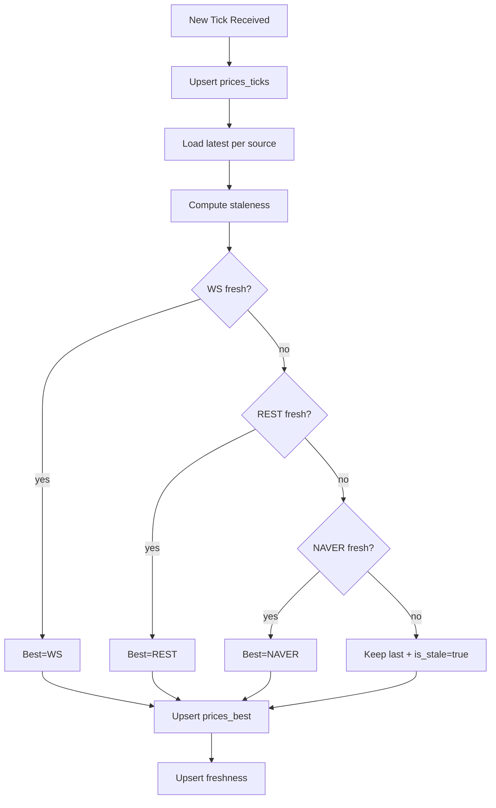
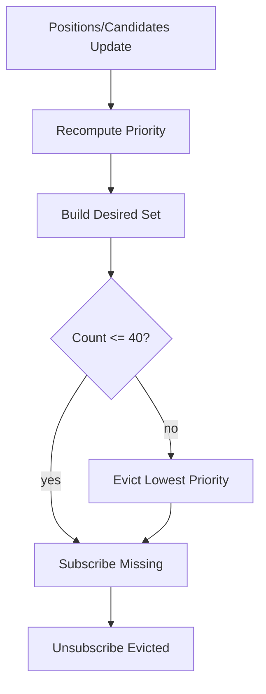
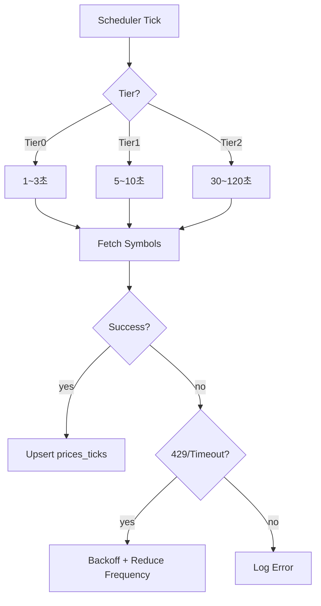
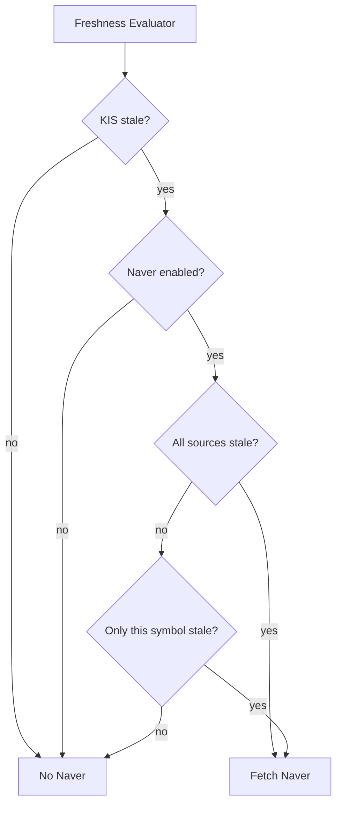

# PriceSync 모듈 설계

> 현재가 동기화 (KIS WebSocket / REST API / Naver Backup)

---

## 📐 Runtime Map (이 문서 범위)

```
┌──────────────────────────────────────────────────────────────┐
│                        Quant Runtime                          │
├──────────────────┬───────────────────────┬───────────────────┤
│ >>> PriceSync <<< │ Strategy Engine       │ Execution Service  │
│ (WS/REST/Naver)   │ (Exit/Reentry/Risk)   │ (KIS Orders/Fills) │
└─────────┬────────┴──────────┬────────────┴─────────┬─────────┘
          │                   │                      │
          ▼                   ▼                      ▼
  market.prices_*      trade.positions_*        trade.orders_*
  market.freshness     trade.actions_*          trade.fills_*
          │
          └────────────────────────────────────────────► Monitoring
```

---

## 🎯 모듈 책임 (SSOT)

### 이 모듈이 소유하는 것 (유일한 소유자)

✅ **데이터:**
- `market.prices_ticks` - 원본 가격 이벤트
- `market.prices_best` - 심볼별 최선가 캐시
- `market.freshness` - 심볼별 신선도 메타

✅ **로직:**
- Best Price 선택 알고리즘
- Freshness 계산
- WS 구독 관리 (40 제한)
- REST 폴링 스케줄
- Naver Fallback 트리거

### 다른 모듈과의 경계

❌ **PriceSync가 하지 않는 것:**
- 포지션 관리 → Exit Engine
- 주문 제출 → Execution
- 트레이딩 판단 → Strategy

❌ **PriceSync가 접근하지 않는 것:**
- `trade.*` 테이블 (읽기만 가능, 쓰기 금지)

---

## 🔌 Public Interface

### 1. 외부 제공 인터페이스

#### Output: prices_best (심볼별 최선가)

```sql
-- 전략이 조회하는 테이블
SELECT
    symbol,
    ts,
    source,        -- KIS_WS | KIS_REST | NAVER
    last_price,
    bid,
    ask,
    freshness_ms,  -- 신선도 (ms)
    quality_score  -- 0~100 (높을수록 좋음)
FROM market.prices_best
WHERE symbol = ?;
```

**계약 (Contract):**
- `prices_best`는 항상 최신 상태 유지
- `freshness_ms`는 정확히 계산됨
- `is_stale` 플래그는 신뢰 가능

#### Output: freshness (신선도 메타)

```sql
-- 전략이 안전 게이트로 사용
SELECT
    symbol,
    last_ws_ts,
    last_rest_ts,
    last_naver_ts,
    is_stale,      -- boolean
    stale_reason   -- 'WS_TIMEOUT' | 'ALL_SOURCES_STALE' 등
FROM market.freshness
WHERE symbol = ?;
```

### 2. 외부 의존 인터페이스

❌ **없음** (PriceSync는 최하위 모듈)

---

## 📊 데이터 모델

### market.prices_ticks (원본 이벤트)

**목적**: 감사/리플레이용 원본 데이터

| 컬럼 | 타입 | 제약 | 설명 |
|------|------|------|------|
| ts | TIMESTAMPTZ | NOT NULL | 이벤트 시각 |
| symbol | TEXT | NOT NULL | 종목 코드 |
| source | TEXT | NOT NULL | KIS_WS/KIS_REST/NAVER |
| last_price | NUMERIC | NOT NULL | 현재가 |
| bid | NUMERIC | NULL | 매수호가 |
| ask | NUMERIC | NULL | 매도호가 |
| volume | BIGINT | NULL | 거래량 |
| trade_value | NUMERIC | NULL | 거래대금 |

**인덱스:**
```sql
PRIMARY KEY (symbol, ts, source)
INDEX idx_prices_ticks_ts (ts DESC)
INDEX idx_prices_ticks_symbol_ts (symbol, ts DESC)
```

### market.prices_best (전략용 캐시)

**목적**: 심볼별 "현재 사용해야 하는 가격" (1행)

| 컬럼 | 타입 | 제약 | 설명 |
|------|------|------|------|
| symbol | TEXT | PK | 종목 코드 |
| ts | TIMESTAMPTZ | NOT NULL | Best 가격의 시각 |
| source | TEXT | NOT NULL | 선택된 소스 |
| last_price | NUMERIC | NOT NULL | 최선 가격 |
| bid | NUMERIC | NULL | 매수호가 |
| ask | NUMERIC | NULL | 매도호가 |
| freshness_ms | BIGINT | NOT NULL | 지연 시간 (ms) |
| quality_score | INT | NOT NULL | 품질 점수 (0~100) |
| updated_ts | TIMESTAMPTZ | NOT NULL | 마지막 갱신 시각 |

### market.freshness (신선도 메타)

**목적**: 소스별 최신 시각 + stale 판정

| 컬럼 | 타입 | 제약 | 설명 |
|------|------|------|------|
| symbol | TEXT | PK | 종목 코드 |
| last_ws_ts | TIMESTAMPTZ | NULL | WS 최종 수신 시각 |
| last_rest_ts | TIMESTAMPTZ | NULL | REST 최종 수신 시각 |
| last_naver_ts | TIMESTAMPTZ | NULL | Naver 최종 수신 시각 |
| best_ts | TIMESTAMPTZ | NULL | Best 가격 시각 |
| is_stale | BOOLEAN | NOT NULL | Stale 여부 |
| stale_reason | TEXT | NULL | Stale 사유 |
| updated_ts | TIMESTAMPTZ | NOT NULL | 마지막 갱신 시각 |

### market.sync_jobs (동기화 작업 큐)

**목적**: PostgreSQL 기반 job queue (동시 처리 안전)

| 컬럼 | 타입 | 제약 | 설명 |
|------|------|------|------|
| id | SERIAL | PK | Job ID |
| symbol | TEXT | NOT NULL | 종목 코드 |
| source | TEXT | NOT NULL | KIS_REST / NAVER |
| priority | INT | NOT NULL | 우선순위 (높을수록 먼저) |
| status | TEXT | NOT NULL | PENDING / RUNNING / DONE / FAILED |
| worker_id | TEXT | NULL | 처리 중인 워커 ID |
| attempts | INT | NOT NULL DEFAULT 0 | 재시도 횟수 |
| last_error | TEXT | NULL | 마지막 에러 메시지 |
| created_ts | TIMESTAMPTZ | NOT NULL | 생성 시각 |
| started_ts | TIMESTAMPTZ | NULL | 시작 시각 |
| completed_ts | TIMESTAMPTZ | NULL | 완료 시각 |

**인덱스:**
```sql
PRIMARY KEY (id)
INDEX idx_sync_jobs_status_priority (status, priority DESC)
INDEX idx_sync_jobs_symbol (symbol)
```

**Job 처리 패턴 (FOR UPDATE SKIP LOCKED):**
```sql
-- Worker가 job 획득
BEGIN;
SELECT id, symbol, source FROM market.sync_jobs
WHERE status = 'PENDING'
ORDER BY priority DESC, created_ts ASC
LIMIT 1
FOR UPDATE SKIP LOCKED;

-- 획득한 job 상태 변경
UPDATE market.sync_jobs
SET status = 'RUNNING', worker_id = ?, started_ts = NOW()
WHERE id = ?;

COMMIT;

-- 작업 완료 후
UPDATE market.sync_jobs
SET status = 'DONE', completed_ts = NOW()
WHERE id = ?;
```

### market.discrepancies (가격 불일치 추적)

**목적**: KIS vs Naver 가격 차이 모니터링

| 컬럼 | 타입 | 제약 | 설명 |
|------|------|------|------|
| id | SERIAL | PK | ID |
| symbol | TEXT | NOT NULL | 종목 코드 |
| ts | TIMESTAMPTZ | NOT NULL | 발생 시각 |
| kis_price | BIGINT | NOT NULL | KIS 가격 |
| naver_price | BIGINT | NOT NULL | Naver 가격 |
| diff_pct | FLOAT | NOT NULL | 차이 % |
| kis_source | TEXT | NOT NULL | KIS_WS / KIS_REST |
| severity | TEXT | NOT NULL | LOW / MEDIUM / HIGH |

**인덱스:**
```sql
PRIMARY KEY (id)
INDEX idx_discrepancies_symbol_ts (symbol, ts DESC)
INDEX idx_discrepancies_severity (severity, ts DESC)
```

**불일치 기준:**

| Severity | 차이 % | 조치 |
|----------|--------|------|
| LOW | 0.1% ~ 0.5% | 로그만 |
| MEDIUM | 0.5% ~ 1.0% | 경고 + Naver 비활성화 고려 |
| HIGH | > 1.0% | 경고 + Naver 즉시 비활성화 |

---

## 🔄 처리 흐름

### 1. Best Price 선택 로직



**우선순위 (신선도 통과 전제):**
1. WS (최우선)
2. REST
3. NAVER
4. 모두 stale → 기존 유지 + `is_stale=true`

**신선도 임계값 (권장):**

| Source | 장중 | 장전/장후 |
|--------|------|----------|
| WS | 2,000ms | 10,000ms |
| REST | 10,000ms | 30,000ms |
| NAVER | 30,000ms | 60,000ms |

### 2. WS Subscription Manager (40 제한)



**동적 우선순위 계산 알고리즘:**

```go
func calculatePriority(symbol string, portfolio Portfolio, brain BrainState) int {
    score := 0

    // P0: 보유 포지션 (절대 보호)
    if portfolio.HasPosition(symbol) {
        score += 10000

        // 청산 진행 중이면 추가 점수
        if portfolio.IsClosing(symbol) {
            score += 5000
        }
    }

    // P1: Trailing 활성 (절대 보호)
    if portfolio.IsTrailingActive(symbol) {
        score += 8000
    }

    // P2: Reentry 후보 (보호)
    if brain.IsReentryCandidate(symbol) {
        state := brain.GetReentryState(symbol)
        if state == "READY" {
            score += 5000  // 진입 준비 완료
        } else if state == "WATCH" {
            score += 3000  // 관찰 중
        }
    }

    // P3: Brain intent (의도가 높을수록)
    intent := brain.GetIntent(symbol)
    if intent != nil {
        score += int(intent.Score * 30)  // 0~100 → 0~3000
    }

    // P4: 당일 랭킹 (상위일수록)
    rank := brain.GetRank(symbol)
    if rank > 0 && rank <= 200 {
        score += 200 - rank  // 1위 = 199점, 200위 = 0점
    }

    return score
}
```

**우선순위 등급:**

| Priority | Score Range | 대상 | 보호 |
|----------|-------------|------|------|
| P0 | 10000+ | OPEN/CLOSING 보유 종목 | 절대 보호 |
| P1 | 8000~9999 | TRAILING_ACTIVE 포지션 | 절대 보호 |
| P2 | 3000~7999 | Reentry WATCH/READY 후보 | 보호 |
| P3 | 1~2999 | Brain intent 또는 랭킹 상위 | 해지 가능 |
| P4 | 0 | 기타 | 우선 해지 |

**재계산 트리거:**
- 포지션 상태 변경 (진입/청산)
- Reentry 후보 상태 변경 (WATCH/READY)
- Brain intent 업데이트 (매 분석 사이클)
- 수동 watchlist 변경

**교체 정책:**
- 40 초과 시 score 낮은 순서대로 해지
- P0/P1 (score 8000+)은 절대 해지 금지

### 3. REST Poller (Tiering)



**Tier 정의:**

| Tier | 주기 | 대상 | 수량 |
|------|------|------|------|
| Tier0 | 1~3초 | WS 보완 (WS 끊김 시 승격) | ~40 |
| Tier1 | 5~10초 | 관심 종목 | ~100 |
| Tier2 | 30~120초 | 전체 유니버스 | ~1000 |

### 4. Naver Fallback (장애 대응)

**트리거 조건:**



**조건:**
- A: WS+REST 모두 stale (예: > 10s)
- B: KIS 장애 상태 (연속 timeout/5xx)
- C: 특정 심볼만 가격 공백

---

## 🚨 에러 처리

### 1. WS 단절

**증상**: 연결 끊김, 재연결 실패

**대응:**
1. 즉시 Tier0 REST를 해당 심볼에 대해 고빈도(1~2초)로 승격
2. WS 재연결 시도 (exponential backoff)
3. 재연결 성공 시 Tier0 REST 원복

### 2. REST Rate Limit (429)

**증상**: 429 Too Many Requests

**대응:**
1. Tier2 주기 증가 (예: 60s → 120s)
2. Tier1 일부 심볼을 Tier2로 강등
3. Backoff 적용 (exponential)
4. Naver를 일부 심볼에 대해 활성화

### 3. Naver 장애

**증상**: Naver API timeout/5xx

**대응:**
1. Naver를 비활성화
2. KIS REST만으로 커버
3. 불가피하게 stale인 심볼은 is_stale=true 유지

---

## 🔒 SSOT 규칙 (금지 패턴)

### ❌ 절대 금지

1. **다른 모듈에서 market.* 테이블 쓰기**
   ```sql
   -- Exit Engine에서 절대 금지
   UPDATE market.prices_best SET last_price = ...
   ```

2. **PriceSync에서 trade.* 테이블 쓰기**
   ```sql
   -- PriceSync에서 절대 금지
   UPDATE trade.positions SET status = ...
   ```

3. **가격 계산 로직 중복**
   ```
   ❌ Exit Engine에서 best price 재계산
   ❌ Reentry Engine에서 freshness 재계산

   ✅ prices_best/freshness 테이블만 조회
   ```

### ✅ 허용된 패턴

1. **PriceSync → Strategy 인터페이스**
   ```sql
   -- Strategy는 읽기만
   SELECT * FROM market.prices_best WHERE symbol = ?;
   SELECT * FROM market.freshness WHERE symbol = ?;
   ```

2. **WS 구독 대상 결정 시 trade.positions 읽기**
   ```sql
   -- 구독 대상 결정 목적으로 읽기만
   SELECT symbol FROM trade.positions WHERE status = 'OPEN';
   SELECT symbol FROM trade.reentry_candidates WHERE state IN ('WATCH', 'READY');
   ```

---

## 📏 성능 고려사항

### 1. prices_ticks 파티셔닝 (TimescaleDB)

**문제**: 틱 데이터는 급속 증가 (1일 수백만 행)

**해결**: TimescaleDB hypertable + 자동 압축/retention

```sql
-- Hypertable 생성 (시계열 최적화)
SELECT create_hypertable(
    'market.prices_ticks',
    'ts',
    chunk_time_interval => INTERVAL '1 day'
);

-- 자동 압축 정책 (7일 이후)
ALTER TABLE market.prices_ticks SET (
    timescaledb.compress,
    timescaledb.compress_segmentby = 'symbol',
    timescaledb.compress_orderby = 'ts DESC'
);

SELECT add_compression_policy(
    'market.prices_ticks',
    INTERVAL '7 days'
);

-- 자동 삭제 정책 (30일 이후)
SELECT add_retention_policy(
    'market.prices_ticks',
    INTERVAL '30 days'
);

-- Continuous Aggregate (1분 봉)
CREATE MATERIALIZED VIEW market.prices_1m
WITH (timescaledb.continuous) AS
SELECT
    time_bucket('1 minute', ts) AS bucket,
    symbol,
    source,
    FIRST(last_price, ts) AS open,
    MAX(last_price) AS high,
    MIN(last_price) AS low,
    LAST(last_price, ts) AS close,
    SUM(volume) AS volume
FROM market.prices_ticks
GROUP BY bucket, symbol, source;

-- Continuous Aggregate 자동 갱신
SELECT add_continuous_aggregate_policy(
    'market.prices_1m',
    start_offset => INTERVAL '1 hour',
    end_offset => INTERVAL '1 minute',
    schedule_interval => INTERVAL '1 minute'
);
```

**이점:**
- 쿼리 속도 10~100배 향상 (압축 후)
- 자동 파티셔닝 (chunk 단위)
- 자동 데이터 정리 (retention policy)
- Continuous Aggregate로 실시간 집계

### 2. prices_best 캐시 전략

**목적**: 전략이 빠르게 조회

**구현**:
- 심볼별 1행 유지 (UPSERT)
- 인덱스: PK(symbol)만으로 충분
- 메모리 캐시 추가 고려 (Redis, 선택)

### 3. Freshness 계산 최적화

**문제**: 매 틱마다 계산하면 부하

**해결**:
- prices_best 갱신 시에만 freshness 계산
- 또는 1초 단위 배치 갱신

---

## 🧪 테스트 전략

### 1. 단위 테스트

- Best Price 선택 로직 (WS/REST/Naver 우선순위)
- Freshness 계산 (stale 판정)
- WS 구독 우선순위 산정

### 2. 통합 테스트

- WS 단절 → REST fallback 전환
- REST 429 → backoff + Naver 활성화
- 모든 소스 stale → is_stale=true 설정

### 3. E2E 테스트

- 실제 KIS WS 연결
- 실제 KIS REST 호출
- Naver API 호출 (rate limit 주의)

---

## 📊 설계 완료 기준

- [ ] 입력/출력 인터페이스 명확히 정의
- [ ] 데이터 모델 (3개 테이블) 완성
- [ ] Best Price 선택 로직 정의
- [ ] WS 구독 관리 정책 정의
- [ ] REST Tiering 전략 정의
- [ ] Naver Fallback 트리거 정의
- [ ] SSOT 규칙 (소유권/금지) 명시
- [ ] 에러 처리 시나리오 정의
- [ ] 성능 고려사항 검토

---

## 🔗 관련 문서

- [architecture/system-overview.md](../architecture/system-overview.md) - 전체 시스템
- [exit-engine.md](./exit-engine.md) - Exit Engine (PriceSync 사용자)
- [reentry-engine.md](./reentry-engine.md) - Reentry Engine (PriceSync 사용자)
- [database/schema.md](../database/schema.md) - DB 스키마

---

**Module Owner**: PriceSync
**Dependencies**: None (최하위 모듈)
**Version**: v14.0.0-design
**Last Updated**: 2026-01-13
