# PriceSync 모듈 설계

> 현재가 동기화 (KIS WebSocket / REST API / Naver Backup)

---

## 📐 Runtime Map (이 문서 범위)

```
┌──────────────────────────────────────────────────────────────┐
│                        Quant Runtime                          │
├──────────────────┬───────────────────────┬───────────────────┤
│ >>> PriceSync <<< │ Strategy Engine       │ Execution Service  │
│ (WS/REST/Naver)   │ (Exit/Reentry/Risk)   │ (KIS Orders/Fills) │
└─────────┬────────┴──────────┬────────────┴─────────┬─────────┘
          │                   │                      │
          ▼                   ▼                      ▼
  market.prices_*      trade.positions_*        trade.orders_*
  market.freshness     trade.actions_*          trade.fills_*
          │
          └────────────────────────────────────────────► Monitoring
```

---

## 🎯 모듈 책임 (SSOT)

### 이 모듈이 소유하는 것 (유일한 소유자)

✅ **데이터:**
- `market.prices_ticks` - 원본 가격 이벤트
- `market.prices_best` - 심볼별 최선가 캐시
- `market.freshness` - 심볼별 신선도 메타

✅ **로직:**
- Best Price 선택 알고리즘
- Freshness 계산
- WS 구독 관리 (40 제한)
- REST 폴링 스케줄
- Naver Fallback 트리거

### 다른 모듈과의 경계

❌ **PriceSync가 하지 않는 것:**
- 포지션 관리 → Exit Engine
- 주문 제출 → Execution
- 트레이딩 판단 → Strategy

❌ **PriceSync가 접근하지 않는 것:**
- `trade.*` 테이블 (읽기만 가능, 쓰기 금지)

---

## 🔌 Public Interface

### 1. 외부 제공 인터페이스

#### Output: prices_best (심볼별 최선가)

```sql
-- 전략이 조회하는 테이블
SELECT
    symbol,
    ts,
    source,        -- KIS_WS | KIS_REST | NAVER
    last_price,
    bid,
    ask,
    freshness_ms,  -- 신선도 (ms)
    quality_score  -- 0~100 (높을수록 좋음)
FROM market.prices_best
WHERE symbol = ?;
```

**계약 (Contract):**
- `prices_best`는 항상 최신 상태 유지
- `freshness_ms`는 정확히 계산됨
- `is_stale` 플래그는 신뢰 가능

#### Output: freshness (신선도 메타)

```sql
-- 전략이 안전 게이트로 사용
SELECT
    symbol,
    last_ws_ts,
    last_rest_ts,
    last_naver_ts,
    is_stale,      -- boolean
    stale_reason   -- 'WS_TIMEOUT' | 'ALL_SOURCES_STALE' 등
FROM market.freshness
WHERE symbol = ?;
```

### 2. 외부 의존 인터페이스

❌ **없음** (PriceSync는 최하위 모듈)

---

## 📊 데이터 모델

### market.prices_ticks (원본 이벤트)

**목적**: 감사/리플레이용 원본 데이터

| 컬럼 | 타입 | 제약 | 설명 |
|------|------|------|------|
| ts | TIMESTAMPTZ | NOT NULL | 이벤트 시각 |
| symbol | TEXT | NOT NULL | 종목 코드 |
| source | TEXT | NOT NULL | KIS_WS/KIS_REST/NAVER |
| last_price | NUMERIC | NOT NULL | 현재가 |
| bid | NUMERIC | NULL | 매수호가 |
| ask | NUMERIC | NULL | 매도호가 |
| volume | BIGINT | NULL | 거래량 |
| trade_value | NUMERIC | NULL | 거래대금 |

**인덱스:**
```sql
PRIMARY KEY (symbol, ts, source)
INDEX idx_prices_ticks_ts (ts DESC)
INDEX idx_prices_ticks_symbol_ts (symbol, ts DESC)
```

### market.prices_best (전략용 캐시)

**목적**: 심볼별 "현재 사용해야 하는 가격" (1행)

| 컬럼 | 타입 | 제약 | 설명 |
|------|------|------|------|
| symbol | TEXT | PK | 종목 코드 |
| ts | TIMESTAMPTZ | NOT NULL | Best 가격의 시각 |
| source | TEXT | NOT NULL | 선택된 소스 |
| last_price | NUMERIC | NOT NULL | 최선 가격 |
| bid | NUMERIC | NULL | 매수호가 |
| ask | NUMERIC | NULL | 매도호가 |
| freshness_ms | BIGINT | NOT NULL | 지연 시간 (ms) |
| quality_score | INT | NOT NULL | 품질 점수 (0~100) |
| updated_ts | TIMESTAMPTZ | NOT NULL | 마지막 갱신 시각 |

### market.freshness (신선도 메타)

**목적**: 소스별 최신 시각 + stale 판정

| 컬럼 | 타입 | 제약 | 설명 |
|------|------|------|------|
| symbol | TEXT | PK | 종목 코드 |
| last_ws_ts | TIMESTAMPTZ | NULL | WS 최종 수신 시각 |
| last_rest_ts | TIMESTAMPTZ | NULL | REST 최종 수신 시각 |
| last_naver_ts | TIMESTAMPTZ | NULL | Naver 최종 수신 시각 |
| best_ts | TIMESTAMPTZ | NULL | Best 가격 시각 |
| is_stale | BOOLEAN | NOT NULL | Stale 여부 |
| stale_reason | TEXT | NULL | Stale 사유 |
| updated_ts | TIMESTAMPTZ | NOT NULL | 마지막 갱신 시각 |

### market.sync_jobs (동기화 작업 큐)

**목적**: PostgreSQL 기반 job queue (동시 처리 안전)

| 컬럼 | 타입 | 제약 | 설명 |
|------|------|------|------|
| id | SERIAL | PK | Job ID |
| symbol | TEXT | NOT NULL | 종목 코드 |
| source | TEXT | NOT NULL | KIS_REST / NAVER |
| priority | INT | NOT NULL | 우선순위 (높을수록 먼저) |
| status | TEXT | NOT NULL | PENDING / RUNNING / DONE / FAILED |
| worker_id | TEXT | NULL | 처리 중인 워커 ID |
| attempts | INT | NOT NULL DEFAULT 0 | 재시도 횟수 |
| last_error | TEXT | NULL | 마지막 에러 메시지 |
| created_ts | TIMESTAMPTZ | NOT NULL | 생성 시각 |
| started_ts | TIMESTAMPTZ | NULL | 시작 시각 |
| completed_ts | TIMESTAMPTZ | NULL | 완료 시각 |

**인덱스:**
```sql
PRIMARY KEY (id)
INDEX idx_sync_jobs_status_priority (status, priority DESC)
INDEX idx_sync_jobs_symbol (symbol)
```

**Job 처리 패턴 (FOR UPDATE SKIP LOCKED):**
```sql
-- Worker가 job 획득
BEGIN;
SELECT id, symbol, source FROM market.sync_jobs
WHERE status = 'PENDING'
ORDER BY priority DESC, created_ts ASC
LIMIT 1
FOR UPDATE SKIP LOCKED;

-- 획득한 job 상태 변경
UPDATE market.sync_jobs
SET status = 'RUNNING', worker_id = ?, started_ts = NOW()
WHERE id = ?;

COMMIT;

-- 작업 완료 후
UPDATE market.sync_jobs
SET status = 'DONE', completed_ts = NOW()
WHERE id = ?;
```

### market.discrepancies (가격 불일치 추적)

**목적**: KIS vs Naver 가격 차이 모니터링

| 컬럼 | 타입 | 제약 | 설명 |
|------|------|------|------|
| id | SERIAL | PK | ID |
| symbol | TEXT | NOT NULL | 종목 코드 |
| ts | TIMESTAMPTZ | NOT NULL | 발생 시각 |
| kis_price | BIGINT | NOT NULL | KIS 가격 |
| naver_price | BIGINT | NOT NULL | Naver 가격 |
| diff_pct | FLOAT | NOT NULL | 차이 % |
| kis_source | TEXT | NOT NULL | KIS_WS / KIS_REST |
| severity | TEXT | NOT NULL | LOW / MEDIUM / HIGH |

**인덱스:**
```sql
PRIMARY KEY (id)
INDEX idx_discrepancies_symbol_ts (symbol, ts DESC)
INDEX idx_discrepancies_severity (severity, ts DESC)
```

**불일치 기준:**

| Severity | 차이 % | 조치 |
|----------|--------|------|
| LOW | 0.1% ~ 0.5% | 로그만 |
| MEDIUM | 0.5% ~ 1.0% | 경고 + Naver 비활성화 고려 |
| HIGH | > 1.0% | 경고 + Naver 즉시 비활성화 |

---

## 🔄 처리 흐름

### 1. Best Price 선택 로직


**우선순위 (신선도 통과 전제):**
1. WS (최우선)
2. REST
3. NAVER
4. 모두 stale → 기존 유지 + `is_stale=true`

**신선도 임계값 (권장):**

| Source | 장중 | 장전/장후 |
|--------|------|----------|
| WS | 2,000ms | 10,000ms |
| REST | 10,000ms | 30,000ms |
| NAVER | 30,000ms | 60,000ms |

### 2. WS Subscription Manager (40 제한) - v10 개선 적용 ✨

#### PriorityManager 모듈 (v10에서 검증됨)

**책임**:
- 시스템 내 모든 종목의 우선순위 실시간 계산
- WS 40개 구독 대상 동적 선정
- REST Tier 할당 자동화

**Repository 인터페이스**:

```go
// PriorityManager가 사용하는 외부 데이터 소스
type PriorityManagerDeps struct {
    PositionRepo  PositionRepository   // trade.positions
    OrderRepo     OrderRepository      // trade.orders (활성 주문)
    WatchlistRepo WatchlistRepository  // user.watchlist (관심 종목)
    SystemRepo    SystemRepository     // system.priority_config (지수 등)
}

type PositionRepository interface {
    GetOpenPositions(ctx context.Context) ([]Position, error)
    GetClosingPositions(ctx context.Context) ([]Position, error)
}

type OrderRepository interface {
    GetActiveOrderSymbols(ctx context.Context) ([]string, error)
}

type WatchlistRepository interface {
    GetWatchlistSymbols(ctx context.Context, userID string) ([]string, error)
}

type SystemRepository interface {
    GetSystemSymbols(ctx context.Context) ([]string, error) // KOSPI200, KOSDAQ150 ETF
}
```

**동적 우선순위 계산 알고리즘** (v10 검증):

```go
type SymbolPriority struct {
    Symbol      string
    IsHolding   bool  // 보유 포지션
    IsClosing   bool  // 청산 진행 중
    IsOrder     bool  // 활성 주문
    IsWatchlist bool  // 관심 종목
    IsSystem    bool  // 시스템 필수 (지수 등)
    Score       int   // 최종 점수
}

func (pm *PriorityManager) CalculatePriority(symbol string) int {
    score := 0

    // P0: 보유 포지션 (최우선 - 절대 보호)
    if pm.isHolding(symbol) {
        score += 10000

        // 청산 진행 중이면 추가 점수
        if pm.isClosing(symbol) {
            score += 5000  // Total: 15000
        }
    }

    // P1: 활성 주문 (높은 우선순위)
    if pm.isOrder(symbol) {
        score += 5000
    }

    // P2: 관심 종목 (중간 우선순위)
    if pm.isWatchlist(symbol) {
        score += 1000
    }

    // P3: 시스템 필수 (지수 ETF 등)
    if pm.isSystem(symbol) {
        score += 500
    }

    return score
}
```

**우선순위 등급** (v10 기반 단순화):

| Priority | Score Range | 대상 | 보호 수준 | 용도 |
|----------|-------------|------|----------|------|
| P0 | 10000+ | OPEN 보유 포지션 | 절대 보호 | WS 구독 (최우선) |
| P0+ | 15000+ | CLOSING 청산 진행 중 | 절대 보호 | WS 구독 (긴급) |
| P1 | 5000~9999 | 활성 주문 종목 | 보호 | WS 구독 |
| P2 | 1000~4999 | 관심 종목 | 조건부 보호 | REST Tier0/1 |
| P3 | 500~999 | 시스템 필수 (지수) | 조건부 보호 | REST Tier1 |
| P4 | 0~499 | 기타 | 해지 가능 | REST Tier2 |

**구독 대상 선정 로직**:

```go
func (pm *PriorityManager) RefreshSubscriptions(ctx context.Context) error {
    // 1. 모든 종목 우선순위 계산
    allSymbols := pm.collectAllSymbols(ctx)
    priorities := make([]*SymbolPriority, 0, len(allSymbols))

    for _, symbol := range allSymbols {
        p := &SymbolPriority{
            Symbol:      symbol,
            IsHolding:   pm.isHolding(symbol),
            IsClosing:   pm.isClosing(symbol),
            IsOrder:     pm.isOrder(symbol),
            IsWatchlist: pm.isWatchlist(symbol),
            IsSystem:    pm.isSystem(symbol),
        }
        p.Score = pm.CalculatePriority(symbol)
        priorities = append(priorities, p)
    }

    // 2. Score 기준 정렬 (높은 순)
    sort.Slice(priorities, func(i, j int) bool {
        return priorities[i].Score > priorities[j].Score
    })

    // 3. WS 40개 선정
    wsSymbols := make([]string, 0, 40)
    for i := 0; i < len(priorities) && i < 40; i++ {
        wsSymbols = append(wsSymbols, priorities[i].Symbol)
    }

    // 4. REST Tier 할당
    tier0Symbols := []string{}  // 41~80위 (WS 백업)
    tier1Symbols := []string{}  // 81~180위
    tier2Symbols := []string{}  // 181위~

    for i := 40; i < len(priorities); i++ {
        if i < 80 {
            tier0Symbols = append(tier0Symbols, priorities[i].Symbol)
        } else if i < 180 {
            tier1Symbols = append(tier1Symbols, priorities[i].Symbol)
        } else {
            tier2Symbols = append(tier2Symbols, priorities[i].Symbol)
        }
    }

    // 5. Manager에 적용
    pm.manager.SetWSSubscriptions(wsSymbols)
    pm.manager.SetTier0Symbols(tier0Symbols)
    pm.manager.SetTier1Symbols(tier1Symbols)
    pm.manager.SetTier2Symbols(tier2Symbols)

    log.Info("Subscriptions refreshed",
        "ws_count", len(wsSymbols),
        "tier0_count", len(tier0Symbols),
        "tier1_count", len(tier1Symbols),
        "tier2_count", len(tier2Symbols))

    return nil
}
```

**재계산 트리거**:
1. **초기**: Runtime 시작 시 (필수)
2. **주기**: 5분마다 (백그라운드)
3. **이벤트**:
   - Position 상태 변경 (OPEN → CLOSING → CLOSED)
   - Order 생성/체결/취소
   - Watchlist 추가/제거

**교체 정책**:
- WS 40개 초과 시 score 낮은 순서대로 해지
- P0/P0+ (score 10000+)는 절대 해지 불가
- P1 (score 5000+)는 WS 구독 최대한 보호


### 3. REST Poller (Tiering)

```mermaid
flowchart TD
    A[Scheduler Tick] --> B{Tier?}
    B -->|Tier0| C[1~3초]
    B -->|Tier1| D[5~10초]
    B -->|Tier2| E[30~120초]
    C --> F[Fetch Symbols]
    D --> F
    E --> F
    F --> G{Success?}
    G -->|yes| H[Upsert prices_ticks]
    G -->|no| I{429/Timeout?}
    I -->|yes| J[Backoff + Reduce Frequency]
    I -->|no| K[Log Error]
```



**Tier 정의:**

| Tier | 주기 | 대상 | 수량 |
|------|------|------|------|
| Tier0 | 1~3초 | WS 보완 (WS 끊김 시 승격) | ~40 |
| Tier1 | 5~10초 | 관심 종목 | ~100 |
| Tier2 | 30~120초 | 전체 유니버스 | ~1000 |

### 4. Naver Fallback (장애 대응)

**트리거 조건:**


**조건:**
- A: WS+REST 모두 stale (예: > 10s)
- B: KIS 장애 상태 (연속 timeout/5xx)
- C: 특정 심볼만 가격 공백

---

## 🚨 에러 처리

### 1. WS 단절

**증상**: 연결 끊김, 재연결 실패

**대응:**
1. 즉시 Tier0 REST를 해당 심볼에 대해 고빈도(1~2초)로 승격
2. WS 재연결 시도 (exponential backoff)
3. 재연결 성공 시 Tier0 REST 원복

### 2. REST Rate Limit (429)

**증상**: 429 Too Many Requests

**대응:**
1. Tier2 주기 증가 (예: 60s → 120s)
2. Tier1 일부 심볼을 Tier2로 강등
3. Backoff 적용 (exponential)
4. Naver를 일부 심볼에 대해 활성화

### 3. Naver 장애

**증상**: Naver API timeout/5xx

**대응:**
1. Naver를 비활성화
2. KIS REST만으로 커버
3. 불가피하게 stale인 심볼은 is_stale=true 유지

---

## 🔒 SSOT 규칙 (금지 패턴)

### ❌ 절대 금지

1. **다른 모듈에서 market.* 테이블 쓰기**
   ```sql
   -- Exit Engine에서 절대 금지
   UPDATE market.prices_best SET last_price = ...
   ```

2. **PriceSync에서 trade.* 테이블 쓰기**
   ```sql
   -- PriceSync에서 절대 금지
   UPDATE trade.positions SET status = ...
   ```

3. **가격 계산 로직 중복**
   ```
   ❌ Exit Engine에서 best price 재계산
   ❌ Reentry Engine에서 freshness 재계산

   ✅ prices_best/freshness 테이블만 조회
   ```

### ✅ 허용된 패턴

1. **PriceSync → Strategy 인터페이스**
   ```sql
   -- Strategy는 읽기만
   SELECT * FROM market.prices_best WHERE symbol = ?;
   SELECT * FROM market.freshness WHERE symbol = ?;
   ```

2. **WS 구독 대상 결정 시 trade.positions 읽기**
   ```sql
   -- 구독 대상 결정 목적으로 읽기만
   SELECT symbol FROM trade.positions WHERE status = 'OPEN';
   SELECT symbol FROM trade.reentry_candidates WHERE state IN ('WATCH', 'READY');
   ```

---

## 📏 성능 고려사항

### 1. prices_ticks 파티셔닝 (TimescaleDB)

**문제**: 틱 데이터는 급속 증가 (1일 수백만 행)

**해결**: TimescaleDB hypertable + 자동 압축/retention

```sql
-- Hypertable 생성 (시계열 최적화)
SELECT create_hypertable(
    'market.prices_ticks',
    'ts',
    chunk_time_interval => INTERVAL '1 day'
);

-- 자동 압축 정책 (7일 이후)
ALTER TABLE market.prices_ticks SET (
    timescaledb.compress,
    timescaledb.compress_segmentby = 'symbol',
    timescaledb.compress_orderby = 'ts DESC'
);

SELECT add_compression_policy(
    'market.prices_ticks',
    INTERVAL '7 days'
);

-- 자동 삭제 정책 (30일 이후)
SELECT add_retention_policy(
    'market.prices_ticks',
    INTERVAL '30 days'
);

-- Continuous Aggregate (1분 봉)
CREATE MATERIALIZED VIEW market.prices_1m
WITH (timescaledb.continuous) AS
SELECT
    time_bucket('1 minute', ts) AS bucket,
    symbol,
    source,
    FIRST(last_price, ts) AS open,
    MAX(last_price) AS high,
    MIN(last_price) AS low,
    LAST(last_price, ts) AS close,
    SUM(volume) AS volume
FROM market.prices_ticks
GROUP BY bucket, symbol, source;

-- Continuous Aggregate 자동 갱신
SELECT add_continuous_aggregate_policy(
    'market.prices_1m',
    start_offset => INTERVAL '1 hour',
    end_offset => INTERVAL '1 minute',
    schedule_interval => INTERVAL '1 minute'
);
```

**이점:**
- 쿼리 속도 10~100배 향상 (압축 후)
- 자동 파티셔닝 (chunk 단위)
- 자동 데이터 정리 (retention policy)
- Continuous Aggregate로 실시간 집계

### 2. prices_best 캐시 전략

**목적**: 전략이 빠르게 조회

**구현**:
- 심볼별 1행 유지 (UPSERT)
- 인덱스: PK(symbol)만으로 충분
- 메모리 캐시 추가 고려 (Redis, 선택)

### 3. Freshness 계산 최적화

**문제**: 매 틱마다 계산하면 부하

**해결**:
- prices_best 갱신 시에만 freshness 계산
- 또는 1초 단위 배치 갱신

---

## 🛡️ 운영 안정성 (v10 문제 해결)

### 1. Price Sync 장애 감지 및 복구

**v10 문제**: Price sync가 정지되어 전략이 마비되는 상황 발생

#### 자동 감지 시스템

**Freshness 모니터링 (CRITICAL):**

```sql
-- 전체 시스템 가격 신선도 체크 (1분마다 실행)
CREATE OR REPLACE VIEW market.price_health AS
SELECT
    COUNT(*) AS total_symbols,
    COUNT(*) FILTER (WHERE is_stale = false) AS fresh_count,
    COUNT(*) FILTER (WHERE is_stale = true) AS stale_count,
    COUNT(*) FILTER (WHERE is_stale = true AND
                     EXTRACT(EPOCH FROM (NOW() - best_ts)) > 60) AS critical_stale_count,
    AVG(EXTRACT(EPOCH FROM (NOW() - best_ts))) AS avg_stale_seconds,
    MAX(EXTRACT(EPOCH FROM (NOW() - best_ts))) AS max_stale_seconds,
    MIN(best_ts) AS oldest_price_ts
FROM market.freshness
WHERE symbol IN (
    -- 활성 심볼만 (보유 포지션 + 관심 종목)
    SELECT DISTINCT symbol FROM trade.positions WHERE status = 'OPEN'
    UNION
    SELECT DISTINCT symbol FROM trade.reentry_candidates WHERE state IN ('WATCH', 'READY')
);
```

**알람 조건:**

```go
type PriceHealthStatus struct {
    TotalSymbols        int
    FreshCount          int
    StaleCount          int
    CriticalStaleCount  int  // 60초 이상 stale
    AvgStaleSeconds     float64
    MaxStaleSeconds     float64
    OldestPriceTs       time.Time
}

func (p *PriceSync) monitorHealth(ctx context.Context) {
    ticker := time.NewTicker(30 * time.Second)
    defer ticker.Stop()

    for {
        select {
        case <-ticker.C:
            var status PriceHealthStatus
            err := p.db.QueryRow(ctx, `SELECT * FROM market.price_health`).Scan(&status)
            if err != nil {
                log.Error("health check failed", "error", err)
                continue
            }

            // 알람 조건 1: 전체 심볼의 50% 이상 stale
            if status.StaleCount > status.TotalSymbols/2 {
                p.alerter.Send(Alert{
                    Level:   "CRITICAL",
                    Message: "Majority of symbols are stale",
                    Data:    status,
                })
            }

            // 알람 조건 2: Critical stale 존재 (60초 이상)
            if status.CriticalStaleCount > 0 {
                p.alerter.Send(Alert{
                    Level:   "CRITICAL",
                    Message: fmt.Sprintf("%d symbols critically stale (>60s)", status.CriticalStaleCount),
                    Data:    status,
                })
            }

            // 알람 조건 3: 평균 지연 30초 이상
            if status.AvgStaleSeconds > 30 {
                p.alerter.Send(Alert{
                    Level:   "WARNING",
                    Message: fmt.Sprintf("High average staleness: %.1fs", status.AvgStaleSeconds),
                    Data:    status,
                })
            }

        case <-ctx.Done():
            return
        }
    }
}
```

#### 소스별 장애 감지

**KIS WebSocket 장애:**

```go
type WSHealthMetrics struct {
    ConnectionState   string  // CONNECTED | DISCONNECTED | RECONNECTING
    LastMessageTs     time.Time
    MessageCount60s   int
    ReconnectAttempts int
    LastErrorTs       time.Time
    LastError         string
}

func (w *KISWebSocket) monitorConnection(ctx context.Context) {
    ticker := time.NewTicker(10 * time.Second)
    defer ticker.Stop()

    for {
        select {
        case <-ticker.C:
            metrics := w.getHealthMetrics()

            // 조건 1: 60초 이상 메시지 없음
            if time.Since(metrics.LastMessageTs) > 60*time.Second {
                log.Error("WS no messages for 60s", "last_message", metrics.LastMessageTs)

                // Tier0 REST로 승격
                w.upgradeToTier0REST(ctx)

                // 재연결 시도
                go w.reconnect(ctx)
            }

            // 조건 2: 재연결 3회 이상 실패
            if metrics.ReconnectAttempts >= 3 {
                log.Error("WS reconnect failed multiple times", "attempts", metrics.ReconnectAttempts)

                // Naver fallback 활성화
                w.enableNaverFallback(ctx)
            }

        case <-ctx.Done():
            return
        }
    }
}
```

**KIS REST API Rate Limit:**

```go
type RESTHealthMetrics struct {
    RequestCount60s   int
    Rate429Count60s   int
    Rate5xxCount60s   int
    AvgLatencyMs      float64
    CurrentTier       string  // Tier0 | Tier1 | Tier2
}

func (r *KISREST) monitorRateLimit(ctx context.Context) {
    ticker := time.NewTicker(10 * time.Second)
    defer ticker.Stop()

    for {
        select {
        case <-ticker.C:
            metrics := r.getHealthMetrics()

            // 조건 1: 429 비율 20% 이상
            if metrics.Rate429Count60s > metrics.RequestCount60s/5 {
                log.Warn("high 429 rate", "ratio", float64(metrics.Rate429Count60s)/float64(metrics.RequestCount60s))

                // Tier 강등 (주기 증가)
                r.downgradeTier(ctx)

                // Naver를 일부 심볼에 활성화
                r.enablePartialNaverFallback(ctx)
            }

            // 조건 2: 5xx 에러 연속 3회 이상
            if metrics.Rate5xxCount60s >= 3 {
                log.Error("KIS API server errors", "count", metrics.Rate5xxCount60s)

                // KIS 전체 비활성화 고려 (Naver로 전환)
                r.considerFullNaverFallback(ctx)
            }

        case <-ctx.Done():
            return
        }
    }
}
```

**Naver API 장애:**

```go
type NaverHealthMetrics struct {
    RequestCount60s  int
    TimeoutCount60s  int
    ErrorCount60s    int
    AvgLatencyMs     float64
}

func (n *NaverAPI) monitorHealth(ctx context.Context) {
    ticker := time.NewTicker(10 * time.Second)
    defer ticker.Stop()

    for {
        select {
        case <-ticker.C:
            metrics := n.getHealthMetrics()

            // 조건 1: 타임아웃 비율 50% 이상
            if metrics.TimeoutCount60s > metrics.RequestCount60s/2 {
                log.Error("Naver high timeout rate", "ratio", float64(metrics.TimeoutCount60s)/float64(metrics.RequestCount60s))

                // Naver 비활성화
                n.disable(ctx)

                // KIS만으로 커버
                log.Info("Naver disabled, relying on KIS only")
            }

        case <-ctx.Done():
            return
        }
    }
}
```

---

### 2. 자동 복구 전략

#### Failover 시나리오

**시나리오 1: WS 단절 → REST 승격**

```go
func (p *PriceSync) handleWSDisconnection(ctx context.Context) {
    // 1. 현재 WS 구독 심볼 조회
    wsSymbols := p.ws.GetSubscribedSymbols()

    // 2. Tier0 REST로 승격 (1~2초 주기)
    for _, symbol := range wsSymbols {
        p.rest.UpgradeToTier0(ctx, symbol)
    }

    // 3. WS 재연결 시도 (백그라운드)
    go func() {
        backoff := time.Second
        for i := 0; i < 10; i++ {
            err := p.ws.Reconnect(ctx)
            if err == nil {
                log.Info("WS reconnected successfully")

                // Tier0 REST 원복
                for _, symbol := range wsSymbols {
                    p.rest.DowngradeFromTier0(ctx, symbol)
                }
                return
            }

            log.Warn("WS reconnect failed", "attempt", i+1, "error", err)
            time.Sleep(backoff)
            backoff = min(backoff*2, 30*time.Second)  // exponential backoff
        }

        log.Error("WS reconnect abandoned after 10 attempts")
    }()
}
```

**시나리오 2: REST Rate Limit → Tier 강등 + Naver 활성화**

```go
func (p *PriceSync) handleRateLimit(ctx context.Context) {
    // 1. Tier2 주기 증가 (60s → 120s)
    p.rest.SetTier2Interval(120 * time.Second)

    // 2. Tier1 일부 심볼을 Tier2로 강등
    tier1Symbols := p.rest.GetTier1Symbols()
    toDowngrade := tier1Symbols[len(tier1Symbols)/2:]  // 하위 50%

    for _, symbol := range toDowngrade {
        p.rest.DowngradeTo Tier2(ctx, symbol)
    }

    // 3. Naver를 강등된 심볼에 활성화
    for _, symbol := range toDowngrade {
        p.naver.Enable(ctx, symbol)
    }

    log.Info("rate limit mitigation applied",
        "tier2_interval", "120s",
        "downgraded_symbols", len(toDowngrade),
        "naver_enabled_for", len(toDowngrade))
}
```

**시나리오 3: 전체 장애 → Emergency Mode**

```go
type EmergencyMode struct {
    Enabled      bool
    TriggeredTs  time.Time
    Reason       string
}

func (p *PriceSync) enterEmergencyMode(ctx context.Context, reason string) {
    p.emergencyMode = EmergencyMode{
        Enabled:     true,
        TriggeredTs: time.Now(),
        Reason:      reason,
    }

    log.Error("EMERGENCY MODE activated", "reason", reason)

    // 1. 모든 소스를 최소 주기로 폴링 시도
    p.rest.SetAllTier0(ctx)  // 모든 심볼을 Tier0 (1~2초)로
    p.naver.EnableAll(ctx)   // Naver도 활성화

    // 2. Exit Engine에 통보 (평가 중단 권고)
    p.notifyEmergency(ctx, "price_sync_emergency")

    // 3. 관리자 알람
    p.alerter.Send(Alert{
        Level:   "CRITICAL",
        Message: "PriceSync EMERGENCY MODE",
        Data: map[string]interface{}{
            "reason":       reason,
            "triggered_at": p.emergencyMode.TriggeredTs,
        },
    })

    // 4. 복구 모니터링 (5분 후 자동 해제 시도)
    time.AfterFunc(5*time.Minute, func() {
        p.tryExitEmergencyMode(ctx)
    })
}

func (p *PriceSync) tryExitEmergencyMode(ctx context.Context) {
    // 복구 조건 체크
    health := p.getHealthStatus(ctx)

    if health.StaleCount < health.TotalSymbols/10 {  // 10% 미만 stale
        p.emergencyMode.Enabled = false

        log.Info("EMERGENCY MODE deactivated", "duration", time.Since(p.emergencyMode.TriggeredTs))

        // Tier 원복
        p.rest.RestoreNormalTiers(ctx)
        p.naver.RestoreNormalState(ctx)

        // 통보 해제
        p.notifyEmergency(ctx, "price_sync_recovered")
    } else {
        log.Warn("emergency mode recovery failed, retrying in 5 minutes")
        time.AfterFunc(5*time.Minute, func() {
            p.tryExitEmergencyMode(ctx)
        })
    }
}
```

---

### 3. 모니터링 대시보드 (외부 도구 통합)

#### Metrics 출력 (Prometheus 형식)

```go
// Metrics 엔드포인트: /metrics
func (p *PriceSync) exposeMetrics() {
    // 소스별 가격 이벤트 수
    prometheus.NewCounterVec(
        prometheus.CounterOpts{
            Name: "price_sync_ticks_total",
            Help: "Total number of price ticks received",
        },
        []string{"source"},  // KIS_WS, KIS_REST, NAVER
    )

    // Stale 심볼 수
    prometheus.NewGaugeVec(
        prometheus.GaugeOpts{
            Name: "price_sync_stale_symbols",
            Help: "Number of symbols with stale prices",
        },
        []string{"severity"},  // NORMAL, WARNING, CRITICAL
    )

    // 소스별 레이턴시
    prometheus.NewHistogramVec(
        prometheus.HistogramOpts{
            Name:    "price_sync_latency_seconds",
            Help:    "Latency of price updates",
            Buckets: prometheus.DefBuckets,
        },
        []string{"source"},
    )

    // WS 연결 상태
    prometheus.NewGauge(
        prometheus.GaugeOpts{
            Name: "price_sync_ws_connected",
            Help: "1 if WS connected, 0 otherwise",
        },
    )
}
```

#### 알람 정책

| 조건 | Level | 조치 |
|------|-------|------|
| Stale 심볼 > 50% | CRITICAL | 즉시 개입 |
| Critical stale (>60s) 존재 | CRITICAL | 즉시 개입 |
| WS 60초 이상 단절 | WARNING | REST 승격 확인 |
| REST 429 비율 > 20% | WARNING | Tier 강등 확인 |
| 평균 지연 > 30초 | WARNING | 소스 상태 확인 |
| Naver 타임아웃 > 50% | WARNING | Naver 비활성화 확인 |

---

## 🧪 테스트 전략

### 1. 단위 테스트

- Best Price 선택 로직 (WS/REST/Naver 우선순위)
- Freshness 계산 (stale 판정)
- WS 구독 우선순위 산정

### 2. 통합 테스트

- WS 단절 → REST fallback 전환
- REST 429 → backoff + Naver 활성화
- 모든 소스 stale → is_stale=true 설정

### 3. E2E 테스트

- 실제 KIS WS 연결
- 실제 KIS REST 호출
- Naver API 호출 (rate limit 주의)

---

## 📊 설계 완료 기준

- [ ] 입력/출력 인터페이스 명확히 정의
- [ ] 데이터 모델 (3개 테이블) 완성
- [ ] Best Price 선택 로직 정의
- [ ] WS 구독 관리 정책 정의
- [ ] REST Tiering 전략 정의
- [ ] Naver Fallback 트리거 정의
- [ ] SSOT 규칙 (소유권/금지) 명시
- [ ] 에러 처리 시나리오 정의
- [ ] 성능 고려사항 검토

---

## 🔗 관련 문서

- [architecture/system-overview.md](../architecture/system-overview.md) - 전체 시스템
- [exit-engine.md](./exit-engine.md) - Exit Engine (PriceSync 사용자)
- [reentry-engine.md](./reentry-engine.md) - Reentry Engine (PriceSync 사용자)
- [database/schema.md](../database/schema.md) - DB 스키마

---

**Module Owner**: PriceSync
**Dependencies**: None (최하위 모듈)
**Version**: v14.0.0-design
**Last Updated**: 2026-01-13
