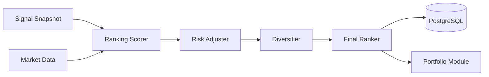

# Ranking 모듈 설계

> **작성일**: 2026-01-14
> **버전**: v14.0.0
> **작성자**: Claude (AI Assistant)
> **상태**: ✅ Ready

---

## 개요

Ranking 모듈은 **Signals**에서 생성된 매매 신호들을 종합 평가하여 최종 순위를 매기고 투자 우선순위를 결정하는 시스템입니다.

### 책임

- Signals 종합 평가 (팩터 + 리스크 + 다양성)
- 리스크 조정 점수 계산
- 포트폴리오 다양성 제약 적용
- 최종 순위 매기기 및 상위 종목 선정

### 위치

```
backend/
├── internal/
│   ├── domain/ranking/         # Domain Layer
│   │   ├── model.go            # RankedStock, RankingCriteria
│   │   ├── repository.go       # 인터페이스
│   │   └── errors.go
│   ├── infrastructure/postgres/ranking/  # Infrastructure Layer
│   │   └── ranking_repository.go
│   ├── service/ranking/        # Service Layer
│   │   ├── service.go          # Orchestration
│   │   ├── scorer.go           # 점수 계산
│   │   └── diversifier.go      # 다양성 제약
│   └── api/
│       ├── handlers/ranking/   # API Layer
│       │   └── ranking_handler.go
│       └── routes/
│           └── ranking_routes.go
```

### 의존성

#### Depends On
- **Signals Module**: 매매 신호 입력
- **Universe Module**: 종목 메타데이터
- **Market Data**: 리스크 데이터 (변동성, 유동성)
- **PostgreSQL**: 순위 저장소

#### Depended By
- **Portfolio Module**: 포트폴리오 구성 입력

---

## 데이터 흐름



1. Signals에서 매매 신호 수신
2. 각 신호에 리스크 조정 적용
3. 포트폴리오 다양성 제약 적용
4. 최종 점수 계산 및 순위 매기기
5. 상위 N개 선정 및 저장

---

## Domain Model

### RankedStock

```go
// RankedStock 순위가 매겨진 종목
type RankedStock struct {
    RankID      uuid.UUID   `json:"rank_id"`
    SnapshotID  string      `json:"snapshot_id"`   // Ranking Snapshot ID
    SignalID    uuid.UUID   `json:"signal_id"`     // 연관 Signal ID
    GeneratedAt time.Time   `json:"generated_at"`

    // 종목 정보
    Symbol      string      `json:"symbol"`
    Name        string      `json:"name"`
    Market      string      `json:"market"`
    Sector      string      `json:"sector"`

    // 순위
    Rank        int         `json:"rank"`          // 최종 순위 (1-based)
    Selected    bool        `json:"selected"`      // 선정 여부

    // 종합 점수
    TotalScore  float64     `json:"total_score"`   // 0-100 (최종 점수)
    AlphaScore  float64     `json:"alpha_score"`   // Signals에서 받은 점수
    RiskScore   float64     `json:"risk_score"`    // 리스크 조정 점수
    Adjustment  float64     `json:"adjustment"`    // 다양성 조정값

    // 점수 분해
    Breakdown   RankingBreakdown `json:"breakdown"`

    // 선정/탈락 사유
    Reason      string      `json:"reason"`
}

// RankingBreakdown 점수 분해
type RankingBreakdown struct {
    // Signals 팩터 (from Signal)
    SignalStrength  float64 `json:"signal_strength"`  // 신호 강도
    SignalConviction float64 `json:"signal_conviction"` // 신호 신뢰도

    // 리스크 조정
    VolatilityRisk  float64 `json:"volatility_risk"`  // 변동성 리스크
    LiquidityRisk   float64 `json:"liquidity_risk"`   // 유동성 리스크
    ConcentrationRisk float64 `json:"concentration_risk"` // 집중도 리스크

    // 다양성 조정
    SectorPenalty   float64 `json:"sector_penalty"`   // 섹터 집중 페널티
    CorrelationPenalty float64 `json:"correlation_penalty"` // 상관관계 페널티
}
```

### RankingSnapshot

```go
// RankingSnapshot 특정 시점의 전체 순위 스냅샷
type RankingSnapshot struct {
    SnapshotID     string    `json:"snapshot_id"`     // YYYYMMDD-HHMM
    SignalID       string    `json:"signal_id"`       // 연관 Signal Snapshot
    GeneratedAt    time.Time `json:"generated_at"`

    TotalCount     int       `json:"total_count"`     // 평가된 총 종목 수
    SelectedCount  int       `json:"selected_count"`  // 선정된 종목 수

    Rankings       []RankedStock `json:"rankings"`    // 순위 목록

    // 통계
    Stats          RankingStats `json:"stats"`
}

// RankingStats 순위 통계
type RankingStats struct {
    AvgTotalScore   float64            `json:"avg_total_score"`
    AvgRiskScore    float64            `json:"avg_risk_score"`
    SectorDistribution map[string]int  `json:"sector_distribution"` // 섹터별 선정 수
    MarketDistribution map[string]int  `json:"market_distribution"` // 시장별 선정 수
}
```

### RankingCriteria

```go
// RankingCriteria 순위 산정 기준
type RankingCriteria struct {
    // 점수 계산
    AlphaWeight     float64 `json:"alpha_weight"`      // 0.70 (신호 강도)
    RiskWeight      float64 `json:"risk_weight"`       // 0.30 (리스크)

    // 리스크 임계값
    MaxVolatility   float64 `json:"max_volatility"`    // 60% (최대 변동성)
    MinLiquidity    float64 `json:"min_liquidity"`     // 10억 (최소 일평균 거래대금)

    // 다양성 제약
    MaxPerSector    int     `json:"max_per_sector"`    // 5 (섹터당 최대)
    MaxPerMarket    int     `json:"max_per_market"`    // 15 (시장당 최대)
    SectorPenalty   float64 `json:"sector_penalty"`    // 5.0 (섹터 중복 페널티)

    // 선정 기준
    MinTotalScore   float64 `json:"min_total_score"`   // 60.0 (최소 종합 점수)
    MaxSelections   int     `json:"max_selections"`    // 20 (최대 선정 수)
}

// DefaultRankingCriteria 기본 기준
func DefaultRankingCriteria() *RankingCriteria {
    return &RankingCriteria{
        AlphaWeight:     0.70,
        RiskWeight:      0.30,
        MaxVolatility:   60.0,
        MinLiquidity:    1_000_000_000, // 10억
        MaxPerSector:    5,
        MaxPerMarket:    15,
        SectorPenalty:   5.0,
        MinTotalScore:   60.0,
        MaxSelections:   20,
    }
}
```

---

## Repository 인터페이스

### RankingRepository

```go
// RankingRepository 순위 저장소
type RankingRepository interface {
    // 스냅샷 저장
    SaveSnapshot(ctx context.Context, snapshot *RankingSnapshot) error

    // 최신 스냅샷 조회
    GetLatestSnapshot(ctx context.Context) (*RankingSnapshot, error)

    // 특정 스냅샷 조회
    GetSnapshotByID(ctx context.Context, snapshotID string) (*RankingSnapshot, error)

    // 스냅샷 목록 (시간 범위)
    ListSnapshots(ctx context.Context, from, to time.Time) ([]*RankingSnapshot, error)

    // 특정 종목의 순위 조회
    GetRankedStock(ctx context.Context, snapshotID, symbol string) (*RankedStock, error)

    // 선정된 종목만 조회
    GetSelectedStocks(ctx context.Context, snapshotID string) ([]RankedStock, error)
}
```

### SignalReader

```go
// SignalReader Signals 데이터 Reader
type SignalReader interface {
    // 최신 Signal 스냅샷 조회
    GetLatestSnapshot(ctx context.Context) (*signals.SignalSnapshot, error)

    // 특정 Signal 스냅샷 조회
    GetSnapshot(ctx context.Context, snapshotID string) (*signals.SignalSnapshot, error)
}
```

### RiskDataReader

```go
// RiskDataReader 리스크 데이터 Reader
type RiskDataReader interface {
    // 변동성 데이터 조회 (60일 표준편차)
    GetVolatility(ctx context.Context, symbol string) (float64, error)

    // 유동성 데이터 조회 (일평균 거래대금)
    GetLiquidity(ctx context.Context, symbol string) (float64, error)

    // 배치 리스크 데이터 조회
    GetBatchRiskData(ctx context.Context, symbols []string) (map[string]*RiskData, error)
}

// RiskData 리스크 데이터
type RiskData struct {
    Symbol      string  `json:"symbol"`
    Volatility  float64 `json:"volatility"`   // 60일 변동성 (%)
    Liquidity   float64 `json:"liquidity"`    // 일평균 거래대금 (원)
    Beta        float64 `json:"beta"`         // 시장 베타
}
```

---

## Service Layer

### Service 구조

```go
// Service Ranking 서비스
type Service struct {
    ctx context.Context

    // Repositories
    rankingRepo   ranking.RankingRepository

    // External readers
    signalReader  ranking.SignalReader
    riskReader    ranking.RiskDataReader

    // Config
    criteria      *ranking.RankingCriteria

    // Cache
    latestSnapshot *ranking.RankingSnapshot
}

// NewService 새 서비스 생성
func NewService(
    ctx context.Context,
    rankingRepo ranking.RankingRepository,
    signalReader ranking.SignalReader,
    riskReader ranking.RiskDataReader,
) *Service {
    return &Service{
        ctx:          ctx,
        rankingRepo:  rankingRepo,
        signalReader: signalReader,
        riskReader:   riskReader,
        criteria:     ranking.DefaultRankingCriteria(),
    }
}
```

### 주요 메서드

```go
// Start 서비스 시작
func (s *Service) Start() error {
    log.Info().Msg("Starting Ranking service")

    // Load latest snapshot on startup
    snapshot, err := s.rankingRepo.GetLatestSnapshot(s.ctx)
    if err != nil {
        log.Warn().Err(err).Msg("No existing snapshot")
    } else {
        s.latestSnapshot = snapshot
        log.Info().
            Str("snapshot_id", snapshot.SnapshotID).
            Int("selected_count", snapshot.SelectedCount).
            Msg("Loaded latest ranking snapshot")
    }

    // Start background ranking generation (1시간 주기)
    go s.rankingLoop()

    log.Info().Msg("Ranking service started")
    return nil
}

// rankingLoop 주기적 순위 생성
func (s *Service) rankingLoop() {
    ticker := time.NewTicker(1 * time.Hour)
    defer ticker.Stop()

    for {
        select {
        case <-ticker.C:
            if err := s.GenerateRankings(s.ctx); err != nil {
                log.Error().Err(err).Msg("Failed to generate rankings")
            }
        case <-s.ctx.Done():
            log.Info().Msg("Ranking loop stopped")
            return
        }
    }
}

// GenerateRankings 순위 생성
func (s *Service) GenerateRankings(ctx context.Context) error {
    log.Info().Msg("Generating rankings")

    // 1. Get latest Signals
    signalSnapshot, err := s.signalReader.GetLatestSnapshot(ctx)
    if err != nil {
        return fmt.Errorf("get signals: %w", err)
    }

    // BUY 신호만 처리 (SELL 제외)
    buySignals := make([]signals.Signal, 0)
    for _, signal := range signalSnapshot.BuySignals {
        buySignals = append(buySignals, signal)
    }

    if len(buySignals) == 0 {
        log.Info().Msg("No buy signals to rank")
        return nil
    }

    // 2. Get risk data
    symbols := make([]string, len(buySignals))
    for i, signal := range buySignals {
        symbols[i] = signal.Symbol
    }
    riskData, err := s.riskReader.GetBatchRiskData(ctx, symbols)
    if err != nil {
        return fmt.Errorf("get risk data: %w", err)
    }

    // 3. Score each signal
    rankedStocks := make([]ranking.RankedStock, 0, len(buySignals))
    for _, signal := range buySignals {
        ranked := s.scoreSignal(signal, riskData[signal.Symbol])
        rankedStocks = append(rankedStocks, ranked)
    }

    // 4. Apply diversity constraints
    rankedStocks = s.applyDiversityConstraints(rankedStocks)

    // 5. Sort and rank
    rankedStocks = s.sortAndRank(rankedStocks)

    // 6. Select top N
    selectedStocks := s.selectTopStocks(rankedStocks)

    // 7. Build snapshot
    snapshot := s.buildSnapshot(signalSnapshot.SnapshotID, rankedStocks, selectedStocks)

    // 8. Save snapshot
    if err := s.rankingRepo.SaveSnapshot(ctx, snapshot); err != nil {
        return fmt.Errorf("save snapshot: %w", err)
    }

    // 9. Update cache
    s.latestSnapshot = snapshot

    log.Info().
        Str("snapshot_id", snapshot.SnapshotID).
        Int("total_count", snapshot.TotalCount).
        Int("selected_count", snapshot.SelectedCount).
        Msg("Rankings generated")

    return nil
}

// GetLatestSnapshot 최신 스냅샷 조회
func (s *Service) GetLatestSnapshot() (*ranking.RankingSnapshot, error) {
    if s.latestSnapshot != nil {
        return s.latestSnapshot, nil
    }
    return s.rankingRepo.GetLatestSnapshot(s.ctx)
}

// GetSnapshot 특정 스냅샷 조회
func (s *Service) GetSnapshot(snapshotID string) (*ranking.RankingSnapshot, error) {
    return s.rankingRepo.GetSnapshotByID(s.ctx, snapshotID)
}

// GetSelectedStocks 선정된 종목만 조회
func (s *Service) GetSelectedStocks(snapshotID string) ([]ranking.RankedStock, error) {
    return s.rankingRepo.GetSelectedStocks(s.ctx, snapshotID)
}
```

---

## Scorer (점수 계산)

```go
// scoreSignal 신호 점수화
func (s *Service) scoreSignal(signal signals.Signal, risk *ranking.RiskData) ranking.RankedStock {
    // 1. Alpha Score (from Signal)
    alphaScore := float64(signal.Strength)

    // 2. Risk Score 계산
    riskScore := s.calculateRiskScore(risk)

    // 3. Total Score = Alpha × αW + (100 - Risk) × βW
    // 예: Alpha 80점, Risk 30점 → Total = 80×0.7 + 70×0.3 = 56 + 21 = 77점
    totalScore := alphaScore*s.criteria.AlphaWeight +
                  (100.0-riskScore)*s.criteria.RiskWeight

    // 4. Breakdown 구성
    breakdown := ranking.RankingBreakdown{
        SignalStrength:    alphaScore,
        SignalConviction:  float64(signal.Conviction),
        VolatilityRisk:    0,
        LiquidityRisk:     0,
        ConcentrationRisk: 0,
        SectorPenalty:     0,
        CorrelationPenalty: 0,
    }

    if risk != nil {
        breakdown.VolatilityRisk = risk.Volatility
        breakdown.LiquidityRisk = s.calculateLiquidityRisk(risk.Liquidity)
    }

    ranked := ranking.RankedStock{
        RankID:      uuid.New(),
        SignalID:    signal.SignalID,
        GeneratedAt: time.Now(),
        Symbol:      signal.Symbol,
        Name:        signal.Name,
        Market:      signal.Market,
        TotalScore:  totalScore,
        AlphaScore:  alphaScore,
        RiskScore:   riskScore,
        Adjustment:  0, // 다양성 조정은 나중에 적용
        Breakdown:   breakdown,
        Selected:    false, // 선정은 나중에 결정
    }

    return ranked
}

// calculateRiskScore 리스크 점수 계산 (0-100, 높을수록 위험)
func (s *Service) calculateRiskScore(risk *ranking.RiskData) float64 {
    if risk == nil {
        return 50.0 // 기본값 (데이터 없음)
    }

    score := 0.0

    // 변동성 점수 (60% 가중치)
    // 0-20%: 0점, 20-40%: 30점, 40-60%: 60점, 60%+: 100점
    volScore := 0.0
    if risk.Volatility > 60.0 {
        volScore = 100.0
    } else if risk.Volatility > 40.0 {
        volScore = 60.0 + (risk.Volatility-40.0)*(40.0/20.0)
    } else if risk.Volatility > 20.0 {
        volScore = 30.0 + (risk.Volatility-20.0)*(30.0/20.0)
    } else {
        volScore = risk.Volatility * (30.0 / 20.0)
    }
    score += volScore * 0.6

    // 유동성 점수 (40% 가중치)
    // 100억+: 0점, 50-100억: 20점, 10-50억: 50점, 10억-: 100점
    liqScore := 0.0
    if risk.Liquidity >= 10_000_000_000 { // 100억 이상
        liqScore = 0.0
    } else if risk.Liquidity >= 5_000_000_000 { // 50-100억
        liqScore = 20.0
    } else if risk.Liquidity >= 1_000_000_000 { // 10-50억
        liqScore = 50.0
    } else {
        liqScore = 100.0
    }
    score += liqScore * 0.4

    return score
}

// calculateLiquidityRisk 유동성 리스크 점수
func (s *Service) calculateLiquidityRisk(liquidity float64) float64{
    if liquidity >= 10_000_000_000 { // 100억 이상
        return 0.0
    } else if liquidity >= 5_000_000_000 { // 50-100억
        return 20.0
    } else if liquidity >= 1_000_000_000 { // 10-50억
        return 50.0
    } else {
        return 100.0
    }
}
```

---

## Diversifier (다양성 제약)

```go
// applyDiversityConstraints 다양성 제약 적용
func (s *Service) applyDiversityConstraints(stocks []ranking.RankedStock) []ranking.RankedStock {
    // 섹터별 종목 수 카운트
    sectorCount := make(map[string]int)
    marketCount := make(map[string]int)

    for i := range stocks {
        stock := &stocks[i]

        // 섹터 페널티 계산
        if sectorCount[stock.Sector] >= s.criteria.MaxPerSector {
            // 섹터 한도 초과 시 페널티
            penalty := s.criteria.SectorPenalty * float64(sectorCount[stock.Sector]-s.criteria.MaxPerSector+1)
            stock.Adjustment -= penalty
            stock.TotalScore -= penalty
            stock.Breakdown.SectorPenalty = penalty
        }

        // 시장 페널티 계산
        if marketCount[stock.Market] >= s.criteria.MaxPerMarket {
            // 시장 한도 초과 시 큰 페널티
            penalty := s.criteria.SectorPenalty * 2.0 * float64(marketCount[stock.Market]-s.criteria.MaxPerMarket+1)
            stock.Adjustment -= penalty
            stock.TotalScore -= penalty
        }

        sectorCount[stock.Sector]++
        marketCount[stock.Market]++
    }

    return stocks
}

// sortAndRank 정렬 및 순위 매기기
func (s *Service) sortAndRank(stocks []ranking.RankedStock) []ranking.RankedStock {
    // TotalScore 내림차순 정렬
    sort.Slice(stocks, func(i, j int) bool {
        return stocks[i].TotalScore > stocks[j].TotalScore
    })

    // 순위 부여
    for i := range stocks {
        stocks[i].Rank = i + 1
    }

    return stocks
}

// selectTopStocks 상위 N개 선정
func (s *Service) selectTopStocks(stocks []ranking.RankedStock) []ranking.RankedStock {
    selected := make([]ranking.RankedStock, 0)

    for i := range stocks {
        stock := &stocks[i]

        // 리스크 필터링
        if stock.Breakdown.VolatilityRisk > s.criteria.MaxVolatility {
            stock.Reason = fmt.Sprintf("변동성 %.0f%% > 한도 %.0f%%",
                stock.Breakdown.VolatilityRisk, s.criteria.MaxVolatility)
            continue
        }

        if stock.Breakdown.LiquidityRisk >= 100.0 { // 10억 미만
            stock.Reason = "유동성 부족 (10억 미만)"
            continue
        }

        // 점수 필터링
        if stock.TotalScore < s.criteria.MinTotalScore {
            stock.Reason = fmt.Sprintf("종합 점수 %.0f < 기준 %.0f",
                stock.TotalScore, s.criteria.MinTotalScore)
            continue
        }

        // 선정
        stock.Selected = true
        stock.Reason = fmt.Sprintf("선정 (순위 %d, 점수 %.0f)", stock.Rank, stock.TotalScore)
        selected = append(selected, *stock)

        // 최대 선정 수 제한
        if len(selected) >= s.criteria.MaxSelections {
            break
        }
    }

    return selected
}

// buildSnapshot 스냅샷 구성
func (s *Service) buildSnapshot(
    signalID string,
    allRankings []ranking.RankedStock,
    selected []ranking.RankedStock,
) *ranking.RankingSnapshot {
    snapshotID := time.Now().Format("20060102-1504")

    // 통계 계산
    var totalScore, totalRisk float64
    sectorDist := make(map[string]int)
    marketDist := make(map[string]int)

    for _, stock := range selected {
        totalScore += stock.TotalScore
        totalRisk += stock.RiskScore
        sectorDist[stock.Sector]++
        marketDist[stock.Market]++
    }

    avgTotal := 0.0
    avgRisk := 0.0
    if len(selected) > 0 {
        avgTotal = totalScore / float64(len(selected))
        avgRisk = totalRisk / float64(len(selected))
    }

    snapshot := &ranking.RankingSnapshot{
        SnapshotID:    snapshotID,
        SignalID:      signalID,
        GeneratedAt:   time.Now(),
        TotalCount:    len(allRankings),
        SelectedCount: len(selected),
        Rankings:      allRankings, // 전체 순위 저장
        Stats: ranking.RankingStats{
            AvgTotalScore:      avgTotal,
            AvgRiskScore:       avgRisk,
            SectorDistribution: sectorDist,
            MarketDistribution: marketDist,
        },
    }

    return snapshot
}
```

---

## Database Schema

### ranking.snapshots

```sql
CREATE TABLE IF NOT EXISTS ranking.snapshots (
    snapshot_id      VARCHAR(20) PRIMARY KEY,      -- YYYYMMDD-HHMM
    signal_id        VARCHAR(20) NOT NULL,         -- 연관 Signal Snapshot
    generated_at     TIMESTAMP NOT NULL,

    total_count      INT NOT NULL,
    selected_count   INT NOT NULL,

    avg_total_score  DECIMAL(5,2),
    avg_risk_score   DECIMAL(5,2),

    rankings         JSONB NOT NULL,               -- 전체 순위 JSONB

    created_at       TIMESTAMP DEFAULT NOW(),

    CONSTRAINT fk_signal
        FOREIGN KEY (signal_id)
        REFERENCES signals.snapshots(snapshot_id)
);

CREATE INDEX idx_ranking_snapshots_generated
    ON ranking.snapshots(generated_at DESC);

CREATE INDEX idx_ranking_snapshots_signal
    ON ranking.snapshots(signal_id);
```

---

## API Endpoints

### GET /api/v1/ranking/latest

최신 순위 스냅샷 조회

**Response** (200 OK):
```json
{
  "snapshot_id": "20260114-1100",
  "signal_id": "20260114-1030",
  "generated_at": "2026-01-14T11:00:00Z",
  "total_count": 30,
  "selected_count": 20,
  "rankings": [
    {
      "rank_id": "uuid",
      "symbol": "005930",
      "name": "삼성전자",
      "market": "KOSPI",
      "sector": "전기전자",
      "rank": 1,
      "selected": true,
      "total_score": 82.5,
      "alpha_score": 85.0,
      "risk_score": 25.0,
      "adjustment": -2.5,
      "breakdown": {
        "signal_strength": 85.0,
        "signal_conviction": 75.0,
        "volatility_risk": 25.0,
        "liquidity_risk": 10.0,
        "sector_penalty": 2.5
      },
      "reason": "선정 (순위 1, 점수 83)"
    }
  ],
  "stats": {
    "avg_total_score": 75.5,
    "avg_risk_score": 28.3,
    "sector_distribution": {
      "전기전자": 5,
      "화학": 4,
      "자동차": 3
    },
    "market_distribution": {
      "KOSPI": 12,
      "KOSDAQ": 8
    }
  }
}
```

### GET /api/v1/ranking/snapshots

스냅샷 목록 조회

### GET /api/v1/ranking/snapshots/:snapshotId

특정 스냅샷 조회

### GET /api/v1/ranking/selected

최신 선정 종목만 조회

**Response** (200 OK):
```json
{
  "snapshot_id": "20260114-1100",
  "selected_count": 20,
  "stocks": [
    {
      "symbol": "005930",
      "name": "삼성전자",
      "rank": 1,
      "total_score": 82.5,
      "reason": "선정 (순위 1, 점수 83)"
    }
  ]
}
```

---

## Error Handling

### 도메인 에러

```go
// ErrSnapshotNotFound 스냅샷 없음
var ErrSnapshotNotFound = errors.New("ranking snapshot not found")

// ErrInvalidCriteria 잘못된 기준
var ErrInvalidCriteria = errors.New("invalid ranking criteria")

// ErrNoSignals 신호 없음
var ErrNoSignals = errors.New("no signals to rank")
```

---

## 점수 계산 예시

### 예시 1: 고점수 종목 (선정)

**입력**:
- Signal: Strength 85, Conviction 75
- Risk: Volatility 30%, Liquidity 150억

**계산**:
```
AlphaScore = 85
RiskScore = 30×0.6 + 0×0.4 = 18
TotalScore = 85×0.7 + (100-18)×0.3 = 59.5 + 24.6 = 84.1
```

**결과**: 선정 (84.1 ≥ 60.0)

### 예시 2: 고위험 종목 (탈락)

**입력**:
- Signal: Strength 80, Conviction 70
- Risk: Volatility 65%, Liquidity 200억

**계산**:
```
AlphaScore = 80
RiskScore = 100×0.6 + 0×0.4 = 60 (변동성 60% 초과)
TotalScore = 80×0.7 + (100-60)×0.3 = 56 + 12 = 68
```

**결과**: 탈락 (변동성 65% > 한도 60%)

### 예시 3: 저유동성 종목 (탈락)

**입력**:
- Signal: Strength 75, Conviction 65
- Risk: Volatility 35%, Liquidity 5억

**계산**:
```
AlphaScore = 75
LiquidityRisk = 100 (10억 미만)
RiskScore = 60×0.6 + 100×0.4 = 36 + 40 = 76
TotalScore = 75×0.7 + (100-76)×0.3 = 52.5 + 7.2 = 59.7
```

**결과**: 탈락 (유동성 5억 < 10억)

---

## v10 대비 개선사항

### 1. 명확한 책임 분리
- v10: Advisor에서 점수 계산 + AI Thesis + Vol Targeting 혼재
- v14: Ranking은 순위만 집중 (점수 계산 + 다양성 제약)

### 2. 투명한 점수 체계
- v10: Composite Score, Risk Adjustment 복잡
- v14: Alpha × 0.7 + (100 - Risk) × 0.3 명확한 공식

### 3. 리스크 기반 필터링
- v10: MDD Cap 추정치 사용
- v14: 실제 변동성 + 유동성 데이터 활용

### 4. 다양성 제약
- v10: 섹터 제약 없음
- v14: 섹터당 5개, 시장당 15개 제한

---

## 성능 고려사항

### 예상 처리량
- 입력 신호: 30개 (from Signals)
- 순위 생성 시간: 50-100ms
- 배치 처리: 1시간마다
- DB 저장: JSONB 직렬화

### 최적화 포인트

1. **배치 리스크 데이터 조회**: GetBatchRiskData로 일괄 조회
2. **캐싱**: 최신 스냅샷 메모리 캐싱
3. **병렬 처리**: 종목별 점수 계산 병렬 실행 가능

---

## 테스트 전략

### 단위 테스트
- [ ] Risk score calculation
- [ ] Diversity constraints
- [ ] Ranking logic
- [ ] Selection criteria

### 통합 테스트
- [ ] End-to-end ranking generation
- [ ] Signal → Ranking flow
- [ ] API endpoint responses

### 백테스트
- [ ] Ranking accuracy vs performance
- [ ] Risk filtering effectiveness
- [ ] Diversity constraint impact

---

## 마이그레이션 계획

### Phase 1: Schema 생성
```sql
-- 1. ranking 스키마 생성
CREATE SCHEMA IF NOT EXISTS ranking;

-- 2. snapshots 테이블
CREATE TABLE ranking.snapshots (...);
```

### Phase 2: Domain & Infrastructure
1. Domain models 구현
2. Repository 구현
3. 단위 테스트

### Phase 3: Service Layer
1. Scorer 구현
2. Diversifier 구현
3. Service 통합
4. 통합 테스트

### Phase 4: API Layer
1. Handlers 구현
2. Routes 등록
3. API 테스트

---

## 참고

- v10: `/Users/wonny/Dev/aegis/v10/backend/internal/brain/stage4_advisor.go`
- Signals: `docs/modules/signals.md`
- 설계 문서: `docs/modules/module-catalog.md`
