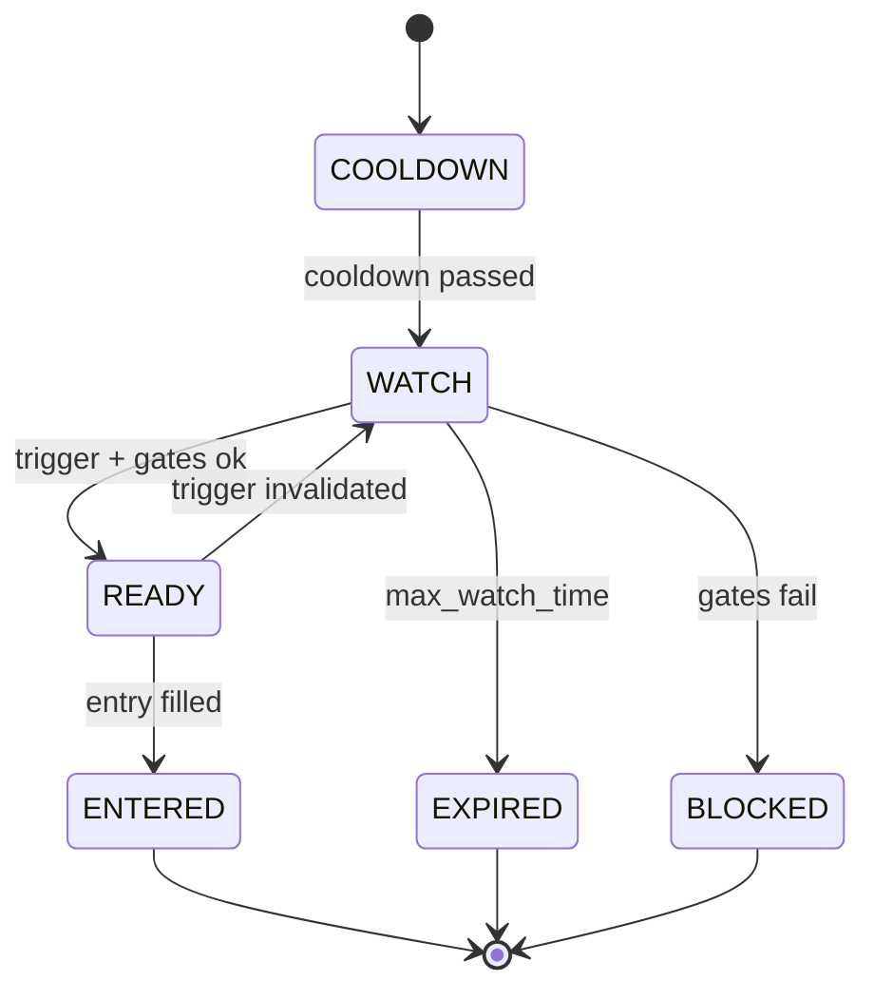
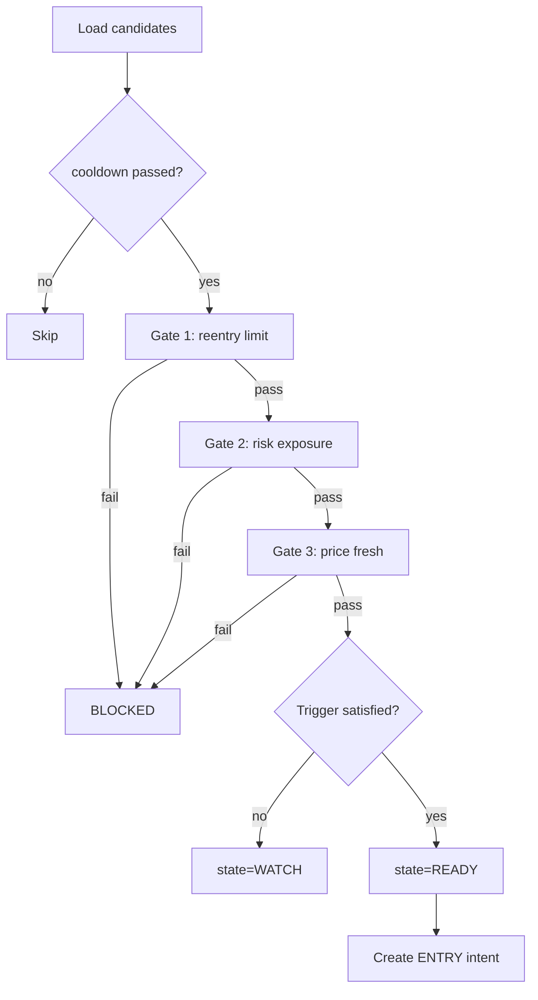

# Reentry Engine 모듈 설계

> 청산 후 재진입 전략

---

## 📐 Runtime Map (이 문서 범위)

```
┌──────────────────────────────────────────────────────────────┐
│                        Quant Runtime                          │
├──────────────────┬───────────────────────┬───────────────────┤
│ PriceSync         │ >>> Reentry Engine<<<│ Execution Service  │
│ (WS/REST/Naver)   │ (Candidates + Gates)  │ (KIS Orders/Fills) │
└─────────┬────────┴──────────┬────────────┴─────────┬─────────┘
          │                   │                      │
          ▼                   ▼                      ▼
  market.prices_best    trade.reentry_*         trade.orders_*
  market.freshness ---> trade.order_intents     trade.fills_*
                         (ENTRY type)
          │                   │                      │
          └───────────────────┴──────────────────────┴──► Monitoring
```

---

## 🎯 모듈 책임 (SSOT)

### 이 모듈이 소유하는 것 (유일한 소유자)

✅ **데이터:**
- `trade.reentry_candidates` - 재진입 후보 FSM
- `trade.order_intents` (ENTRY 타입) - 재진입 주문 의도

✅ **로직:**
- Reentry Candidate FSM 전이
- 쿨다운 관리
- 재진입 게이트 (리스크/횟수/신선도)
- 재진입 트리거 판정
- 포지션 사이징

### 다른 모듈과의 경계

❌ **Reentry Engine이 하지 않는 것:**
- 현재가 결정 → PriceSync
- 청산 로직 → Exit Engine
- 주문 제출 → Execution

❌ **Reentry Engine이 접근하지 않는 것:**
- `market.*` 테이블 쓰기 (읽기만)
- `trade.positions/position_state` 쓰기 (읽기만)

✅ **Reentry Engine이 읽을 수 있는 것:**
- `market.prices_best` (현재가)
- `market.freshness` (안전 게이트)
- `trade.positions` (포트 익스포저)

---

## 🔌 Public Interface

### 1. 외부 제공 인터페이스

#### Output: order_intents (재진입 의도)

```sql
INSERT INTO trade.order_intents (
    intent_id,
    candidate_id,
    position_id,    -- NULL (신규 진입)
    symbol,
    intent_type,    -- ENTRY
    qty,
    order_type,     -- MKT | LMT
    limit_price,
    reason_code,    -- REENTRY_REBOUND | REENTRY_BREAKOUT | REENTRY_CHASE
    action_key,     -- {candidate_id}:ENTRY:{n}
    status          -- NEW
) VALUES (...);
```

**계약:**
- `action_key`는 unique (멱등성)
- `intent_type=ENTRY`
- `candidate_id` 필수
- `position_id=NULL` (신규)

### 2. 외부 의존 인터페이스

#### Input: reentry_candidates (Exit Engine에서 생성)

```sql
-- Exit Engine이 생성한 후보 읽기
SELECT * FROM trade.reentry_candidates
WHERE state IN ('COOLDOWN', 'WATCH', 'READY')
ORDER BY cooldown_until;
```

---

## 📊 데이터 모델

### trade.reentry_candidates (FSM)

| 컬럼 | 타입 | 제약 | 설명 |
|------|------|------|------|
| candidate_id | UUID | PK | 후보 고유 ID |
| symbol | TEXT | NOT NULL | 종목 코드 |
| origin_position_id | UUID | NOT NULL | 원 포지션 ID |
| exit_reason | TEXT | NOT NULL | SL1/SL2/TRAIL/TP/TIME |
| exit_ts | TIMESTAMPTZ | NOT NULL | 청산 시각 |
| exit_price | NUMERIC | NOT NULL | 청산 가격 |
| cooldown_until | TIMESTAMPTZ | NOT NULL | 쿨다운 종료 시각 |
| state | TEXT | NOT NULL | FSM 상태 |
| max_reentries | INT | NOT NULL | 최대 재진입 횟수 |
| reentry_count | INT | NOT NULL | 현재 재진입 횟수 |
| last_eval_ts | TIMESTAMPTZ | NULL | 마지막 평가 시각 |
| updated_ts | TIMESTAMPTZ | NOT NULL | 마지막 갱신 |

**FSM 상태:**



---

## 🔄 처리 흐름

### 1. 평가 루프



### 2. 재진입 게이트 (Risk Gates)

| Gate | 조건 | 실패 시 |
|------|------|--------|
| **G1** | cooldown 통과 | COOLDOWN 유지 |
| **G2** | symbol 재진입 횟수 < max | BLOCKED |
| **G3** | portfolio 익스포저 < 한도 | BLOCKED |
| **G4** | 일 손실 < 한도 | BLOCKED |
| **G5** | price freshness OK | BLOCKED |

### 3. 재진입 트리거 (Exit Reason별)

#### A. SL(손절) 후 Re-buy

**조건:**
- `price >= exit_price * (1 + rebound_pct)`
- 최근 스윙 하이 돌파 (선택)
- 거래대금 최소 기준

**파라미터:**
- rebound_pct = 2% (권장)

#### B. TRAIL 후 Chase

**조건:**
- `price >= prior_hwm` (재돌파)
- 돌파 여유: `ATR * k` 또는 n%

**파라미터:**
- k = 0.5 (ATR 배수)

#### C. TP 후 재진입

**조건:**
- 랭킹/모멘텀 유지
- 변동성 리스크 필터

**권장:** 초기에는 비활성화

### 4. 멱등성 (action_key)

**패턴:**
```
{candidate_id}:ENTRY:1  (1차 재진입)
{candidate_id}:ENTRY:2  (2차 재진입, 허용 시)
```

---

## 🎲 재진입 룰 (예시 설정)

### 쿨다운

| Exit Reason | Cooldown | 설명 |
|-------------|----------|------|
| SL1/SL2 | 30~60분 | 손절 후 충분한 관망 |
| TRAIL | 15~30분 | 트레일 후 짧게 |
| TP | 10~15분 | 익절 후 빠르게 |

### 횟수 제한

| 기간 | 최대 횟수 |
|------|----------|
| 동일 심볼/일 | 2회 |
| 동일 심볼/주 | 3회 |

### 포지션 사이징

| 회차 | 사이즈 |
|------|--------|
| 1차 재진입 | 원 포지션의 60% |
| 2차 재진입 | 원 포지션의 40% |

---

## 🚨 에러 처리

### 1. 게이트 실패

**증상**: 여러 게이트 중 하나 실패

**대응:**
- state = BLOCKED
- stale_reason 기록
- 알람 (선택)

### 2. 쿨다운 재설정

**증상**: candidate 생성 후 상황 변화

**대응:**
- cooldown_until 재계산 (정책)
- 또는 EXPIRED 처리

---

## 🔒 SSOT 규칙 (금지 패턴)

### ❌ 절대 금지

1. **Reentry Engine에서 청산 로직**
   ```
   ❌ Reentry에서 Exit 트리거 판단
   ❌ Reentry에서 position_state 변경

   ✅ candidates만 관리
   ```

2. **Reentry Engine에서 주문 API 직접 호출**
   ```
   ❌ Reentry에서 KIS API 직접 호출

   ✅ order_intents만 생성
   ```

---

## 📊 설계 완료 기준

- [ ] FSM 상태 전이 정의
- [ ] 재진입 게이트 정의
- [ ] 트리거 조건 정의 (Exit Reason별)
- [ ] 멱등성 규칙 정의
- [ ] 포지션 사이징 정의
- [ ] SSOT 규칙 명시

---

**Module Owner**: Reentry Engine
**Dependencies**: PriceSync (읽기), Exit (후보 생성)
**Version**: v14.0.0-design
**Last Updated**: 2026-01-13
