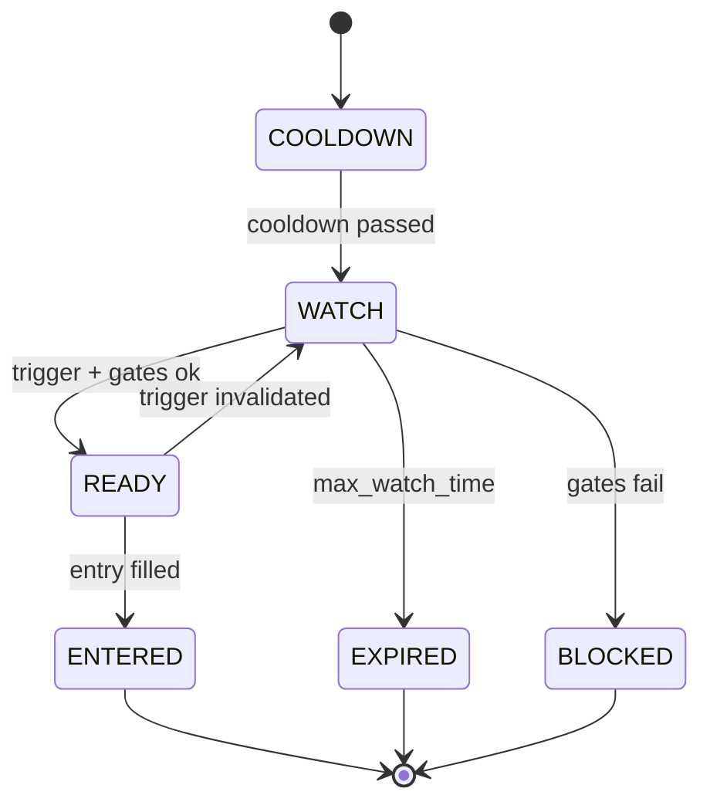
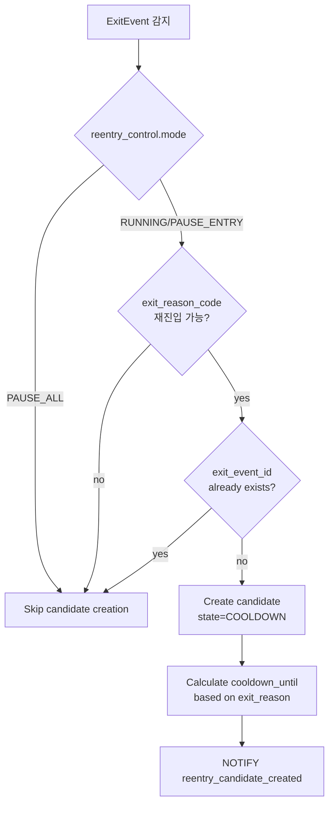

# Reentry Engine 모듈 설계

> 청산 후 재진입 전략

---

## 📐 Runtime Map (이 문서 범위)

```
┌──────────────────────────────────────────────────────────────┐
│                        Quant Runtime                          │
├──────────────────┬───────────────────────┬───────────────────┤
│ PriceSync         │ >>> Reentry Engine<<<│ Execution Service  │
│ (WS/REST/Naver)   │ (Candidates + Gates)  │ (KIS Orders/Fills) │
└─────────┬────────┴──────────┬────────────┴─────────┬─────────┘
          │                   │                      │
          ▼                   ▼                      ▼
  market.prices_best    trade.reentry_*         trade.orders_*
  market.freshness ---> trade.order_intents     trade.fills_*
                         (ENTRY type)
          │                   │                      │
          └───────────────────┴──────────────────────┴──► Monitoring
```

---

## 🎯 모듈 책임 (SSOT)

### 이 모듈이 소유하는 것 (유일한 소유자)

✅ **데이터:**
- `trade.reentry_candidates` - 재진입 후보 FSM
- `trade.reentry_control` - 전역 제어
- `trade.order_intents` (ENTRY 타입) - 재진입 주문 의도

✅ **로직:**
- **ExitEvent 소비** (SSOT 입력)
- Reentry Candidate FSM 전이
- 쿨다운 관리
- 재진입 게이트 (리스크/횟수/신선도)
- 재진입 트리거 판정
- 포지션 사이징
- **Control Gate** (전역 제어 체크)

### 다른 모듈과의 경계

❌ **Reentry Engine이 하지 않는 것:**
- 현재가 결정 → PriceSync
- 청산 로직 → Exit Engine
- **ExitEvent 생성** → Execution (holdings 확정 후)
- 주문 제출 → Execution

❌ **Reentry Engine이 접근하지 않는 것:**
- `market.*` 테이블 쓰기 (읽기만)
- `trade.positions/position_state` 쓰기 (읽기만)
- `trade.exit_events` 쓰기 (읽기만) **← 중요: Execution만 생성**

✅ **Reentry Engine이 읽을 수 있는 것:**
- `market.prices_best` (현재가)
- `market.freshness` (안전 게이트)
- `trade.positions` (포트 익스포저)
- **`trade.exit_events` (재진입 후보 생성 트리거) ← SSOT 입력**

---

## 🔌 Public Interface

### 1. 외부 제공 인터페이스

#### Output: order_intents (재진입 의도)

```sql
INSERT INTO trade.order_intents (
    intent_id,
    candidate_id,
    position_id,    -- NULL (신규 진입)
    symbol,
    intent_type,    -- ENTRY
    qty,
    order_type,     -- MKT | LMT
    limit_price,
    reason_code,    -- REENTRY_REBOUND | REENTRY_BREAKOUT | REENTRY_CHASE
    action_key,     -- {candidate_id}:ENTRY:{n}
    status          -- NEW
) VALUES (...);
```

**계약:**
- `action_key`는 unique (멱등성)
- `intent_type=ENTRY`
- `candidate_id` 필수
- `position_id=NULL` (신규)

### 2. 외부 의존 인터페이스

#### Input: exit_events (Execution에서 생성, SSOT)

```sql
-- Execution이 생성한 ExitEvent 읽기 (재진입 후보 생성 트리거)
SELECT * FROM trade.exit_events
WHERE exit_ts >= now() - INTERVAL '24 hours'
  AND exit_reason_code IN ('SL1', 'SL2', 'TRAIL', 'TP1', 'TP2', 'TP3')
ORDER BY exit_ts DESC;
```

**계약:**
- ExitEvent는 Execution만 생성 (holdings qty=0 확인 후)
- `exit_event_id`는 unique (멱등성 보장)
- `exit_reason_code`로 재진입 전략 분기
- `source` 필드로 자동/수동/브로커 구분

---

## 📊 데이터 모델

### trade.reentry_candidates (FSM)

| 컬럼 | 타입 | 제약 | 설명 |
|------|------|------|------|
| candidate_id | UUID | PK | 후보 고유 ID |
| exit_event_id | UUID | UNIQUE, FK | ExitEvent 참조 (SSOT) |
| symbol | TEXT | NOT NULL | 종목 코드 |
| origin_position_id | UUID | NOT NULL | 원 포지션 ID |
| exit_reason_code | TEXT | NOT NULL | SL1/SL2/TRAIL/TP/TIME |
| exit_ts | TIMESTAMPTZ | NOT NULL | 청산 시각 |
| exit_price | NUMERIC | NOT NULL | 청산 가격 |
| exit_profile_id | TEXT | NULL | 적용된 Exit 프로파일 |
| cooldown_until | TIMESTAMPTZ | NOT NULL | 쿨다운 종료 시각 |
| state | TEXT | NOT NULL | FSM 상태 |
| max_reentries | INT | NOT NULL | 최대 재진입 횟수 |
| reentry_count | INT | NOT NULL | 현재 재진입 횟수 |
| reentry_profile_id | TEXT | NULL | 재진입 프로파일 |
| last_eval_ts | TIMESTAMPTZ | NULL | 마지막 평가 시각 |
| updated_ts | TIMESTAMPTZ | NOT NULL | 마지막 갱신 |

**멱등성 보장:**
- `exit_event_id` UNIQUE 제약으로 동일 ExitEvent에서 중복 후보 생성 방지

### trade.reentry_control (전역 제어)

| 컬럼 | 타입 | 제약 | 설명 |
|------|------|------|------|
| id | INT | PK, CHECK(id=1) | 단일 행 보장 |
| mode | TEXT | NOT NULL | RUNNING / PAUSE_ENTRY / PAUSE_ALL |
| reason | TEXT | NULL | 제어 사유 |
| updated_by | TEXT | NOT NULL | 변경자 |
| updated_ts | TIMESTAMPTZ | NOT NULL | 변경 시각 |

**제어 모드:**

| Mode | Candidate 생성 | ENTRY Intent 생성 | 설명 |
|------|----------------|-------------------|------|
| RUNNING | ✅ Allowed | ✅ Allowed | 정상 작동 |
| PAUSE_ENTRY | ✅ Allowed | ❌ Blocked | Candidate 추적만 (진입 차단) |
| PAUSE_ALL | ❌ Blocked | ❌ Blocked | 완전 정지 (긴급) |

**FSM 상태:**



---

## 🔄 처리 흐름

### 0. Candidate 생성 (ExitEvent 기반)



**트리거:**
- PostgreSQL LISTEN/NOTIFY on `exit_event_created` 채널
- 또는 주기적 폴링 (fallback)

### 1. 평가 루프 (Control Gate 포함)

```mermaid
flowchart TD
    START[Start Evaluation Cycle] --> GATE1[Load reentry_control.mode]
    GATE1 --> GATE2{mode == PAUSE_ALL?}
    GATE2 -->|yes| SKIP[Skip all processing]
    GATE2 -->|no| LOAD[Load candidates<br/>state IN (COOLDOWN,WATCH,READY)]

    LOAD --> LOOP[For each candidate]
    LOOP --> B{cooldown passed?}
    B -->|no| C[Skip]
    B -->|yes| D[Gate 1: reentry limit]
    D -->|fail| E[state=BLOCKED]
    D -->|pass| F[Gate 2: risk exposure]
    F -->|fail| E
    F -->|pass| G[Gate 3: price fresh]
    G -->|fail| E
    G -->|pass| H{Trigger satisfied?}
    H -->|no| I[state=WATCH]
    H -->|yes| J{reentry_control.mode<br/>== PAUSE_ENTRY?}
    J -->|yes| WATCH[state=READY<br/>but no intent]
    J -->|no| READY[state=READY]
    READY --> K[Create ENTRY intent]
```

### 2. 재진입 게이트 (Risk Gates) - 업데이트

**⚠️ 중요**: Gate 순서는 성능과 안전성을 위해 **반드시 G0부터 순차 평가**해야 합니다.

| Gate | 조건 | 실패 시 | 목적 |
|------|------|--------|------|
| **G0** | **Market Regime OK** | **BLOCKED** (또는 WATCH 유지) | **Whipsaw 차단 (최우선)** |
| **G0.5** | **Exit Reason Policy OK** | **BLOCKED** | **정책적 원천 차단** |
| **G1** | cooldown 통과 | COOLDOWN 유지 | 시간 게이트 |
| **G2** | symbol 재진입 횟수 < max | BLOCKED | 과도한 재진입 방지 |
| **G3** | portfolio 익스포저 < 한도 | BLOCKED | 집중 리스크 관리 |
| **G4** | 일 손실 < 한도 | BLOCKED | 일일 손실 제한 |
| **G5** | price freshness OK | BLOCKED | 데이터 안전성 |

#### G0: Market Regime Gate (최상단, 가장 중요)

**목적**: 하락장/패닉 시 whipsaw로 인한 손실 확대 방지

**데이터 소스**: `market.regime_snapshot` (읽기 전용)

**평가 로직**:
```go
// 1. Regime Snapshot 로드
snapshot := LoadLatestRegimeSnapshot()

// 2. Stale 체크 (Fail-Closed)
if now() - snapshot.asof_ts > 5분 {
    // 데이터가 오래되었거나 없음 = 시스템 이상
    regime = "RISK_OFF"  // 안전 모드
    log.Warn("regime snapshot stale, defaulting to RISK_OFF")
}

// 3. Profile 매칭
profile := GetReentryProfile(candidate.exit_reason_code, snapshot.regime)

// 4. 정책 적용
if !profile.allow_entry {
    candidate.state = "BLOCKED"
    candidate.blocked_reason = "Market regime does not allow reentry"
    candidate.blocked_gate = "G0"
    return FAIL
}

return PASS
```

**Fail-Closed 원칙**:
- Snapshot이 없거나 stale → `RISK_OFF`로 간주 → 대부분 재진입 차단
- 시스템 장애 시에도 손실 확대 방지

#### G0.5: Exit Reason Policy Gate

**목적**: SL/TRAIL/TP별 정책적 원천 차단

**평가 로직**:
```go
profile := GetReentryProfile(candidate.exit_reason_code, current_regime)

// Candidate 생성 단계에서 이미 allow_candidate=false면 생성 자체를 안 했겠지만
// Evaluation 시점에 다시 확인 (regime이 바뀔 수 있음)
if !profile.allow_candidate {
    candidate.state = "BLOCKED"
    candidate.blocked_reason = "Exit reason not allowed for reentry in current regime"
    candidate.blocked_gate = "G0.5"
    return FAIL
}

// Cooldown 재계산 (profile이 변경될 수 있음)
if profile.cooldown_minutes > remaining_cooldown {
    candidate.cooldown_until = exit_ts + profile.cooldown_minutes
}

return PASS
```

#### G1~G5: 기존 게이트

기존 게이트는 그대로 유지 (순서만 G0, G0.5 다음으로 밀림)

---

## 📊 Exit Reason × Regime 정책표

**목적**: 시장 국면에 따라 청산 사유별로 재진입 정책을 구조적으로 차별화

### 정책표 (기본 운영 권장값)

| Exit Reason | PANIC | RISK_OFF | NEUTRAL | RISK_ON | 운영 의도 |
|-------------|-------|----------|---------|---------|-----------|
| **SL1/SL2** (손절) | ❌ 금지 | ❌ 금지 | 🟡 조건부 (1회, 40%) | 🟡 조건부 (1회, 50%) | **Whipsaw 차단 핵심** |
| **TRAIL** (트레일) | ❌ 금지 | 🟡 극히 보수적 (30%) | 🟢 허용 (50%) | 🟢 적극 (60%, 2회) | 추세 복귀 포착 |
| **TP** (익절) | ❌ 금지 | ❌ 금지 | 🟡 조건부 | 🟢 허용 | 모멘텀 확장 |

**범례**:
- ❌ **금지**: `allow_entry=false`, max_reentries=0
- 🟡 **조건부**: `allow_entry=true`, 엄격한 트리거 조건, 횟수 제한
- 🟢 **허용**: `allow_entry=true`, 표준 트리거 조건

### Regime별 상세 정책

#### PANIC (패닉)

**상황**: 급락, 서킷 브레이커, VIX 급등, 시장 폭락

**정책**: 전면 차단 (시스템 생존 모드)

| Exit Reason | allow_entry | max_reentries | Cooldown | Size |
|-------------|-------------|---------------|----------|------|
| SL1/SL2 | ❌ false | 0 | N/A | N/A |
| TRAIL | ❌ false | 0 | N/A | N/A |
| TP | ❌ false | 0 | N/A | N/A |

**운영**:
- 모든 재진입 차단
- `reentry_control.mode = PAUSE_ALL` 고려
- 시장 안정 전까지 관망

#### RISK_OFF (하락장)

**상황**: 지수 MA 이탈, 하락 추세, 변동성 증가

**정책**: SL 차단 + TRAIL만 극히 보수적 허용

| Exit Reason | allow_entry | max_reentries | Cooldown | Size | 트리거 조건 |
|-------------|-------------|---------------|----------|------|------------|
| SL1/SL2 | ❌ false | 0 | 120분 | N/A | **차단** (Whipsaw 방지) |
| TRAIL | 🟡 true | 1 | 60분 | 30% | rebound_pct=5%, 구조적 돌파 필수 |
| TP | ❌ false | 0 | N/A | N/A | 차단 |

**핵심**:
- **SL 재진입 = 금지** (하락장 whipsaw 차단의 핵심)
- TRAIL은 "추세 복귀 확인"일 때만 극소량

#### NEUTRAL (중립장)

**상황**: 횡보, 박스권, 방향성 불명

**정책**: 선별적 허용 (보수적 조건)

| Exit Reason | allow_entry | max_reentries | Cooldown | Size | 트리거 조건 |
|-------------|-------------|---------------|----------|------|------------|
| SL1/SL2 | 🟡 true | 1 | 60분 | 40% | rebound_pct=3%, 구조적 돌파 + 안정화 15분 |
| TRAIL | 🟢 true | 2 | 30분 | 50% | breakout_atr_k=0.5, 볼륨 확인 |
| TP | 🟡 true | 1 | 20분 | 40% | 모멘텀 유지 + 변동성 필터 |

**핵심**:
- SL은 "반전 확인" 조건 필수
- TRAIL은 표준 조건
- TP는 모멘텀 지속 시에만

#### RISK_ON (상승장)

**상황**: 지수 상승, MA 상회, 긍정 모멘텀

**정책**: TRAIL/TP 적극 + SL도 조건부 허용

| Exit Reason | allow_entry | max_reentries | Cooldown | Size | 트리거 조건 |
|-------------|-------------|---------------|----------|------|------------|
| SL1/SL2 | 🟡 true | 1 | 45분 | 50% | rebound_pct=2%, 구조적 돌파 권장 |
| TRAIL | 🟢 true | 2 | 15분 | 60% (1차), 40% (2차) | breakout_atr_k=0.5 |
| TP | 🟢 true | 2 | 10분 | 60% (1차), 40% (2차) | 모멘텀 유지 |

**핵심**:
- TRAIL/TP 재진입으로 수익 확장
- SL도 "빠른 반등"이면 재진입 가능
- 사이징 적극 (1차 60%)

### 정책 전환 시나리오

#### 시나리오 1: RISK_ON → RISK_OFF 급변

```
09:00  RISK_ON (정상 운영)
10:30  급락 → Regime Analyzer가 RISK_OFF 판정
10:31  G0 Gate가 새 스냅샷 로드
       → 기존 WATCH 상태 candidates 재평가
       → SL candidates: state=BLOCKED (정책 변경)
       → TRAIL candidates: 조건 강화 (size 30%로 축소)
10:32  신규 ExitEvent (SL1) 발생
       → Profile 매칭: risk_off_sl_block
       → allow_candidate=false
       → Candidate 생성 자체를 안 함 (또는 즉시 BLOCKED)
```

#### 시나리오 2: RISK_OFF → NEUTRAL 회복

```
14:00  RISK_OFF (SL 재진입 차단 중)
15:00  지수 회복 → Regime Analyzer가 NEUTRAL 판정
15:01  G0 Gate가 새 스냅샷 로드
       → 기존 BLOCKED candidates 재평가
       → SL candidates: 여전히 조건부 (하지만 allow_entry=true)
       → state=WATCH로 전환 가능 (조건 충족 시)
```

### 3. 재진입 트리거 (Exit Reason별)

#### A. SL(손절) 후 Re-buy

**조건:**
- `price >= exit_price * (1 + rebound_pct)`
- 최근 스윙 하이 돌파 (선택)
- 거래대금 최소 기준

**파라미터:**
- rebound_pct = 2% (권장)

#### B. TRAIL 후 Chase

**조건:**
- `price >= prior_hwm` (재돌파)
- 돌파 여유: `ATR * k` 또는 n%

**파라미터:**
- k = 0.5 (ATR 배수)

#### C. TP 후 재진입

**조건:**
- 랭킹/모멘텀 유지
- 변동성 리스크 필터

**권장:** 초기에는 비활성화

### 4. 멱등성 (action_key)

**패턴:**
```
{candidate_id}:ENTRY:1  (1차 재진입)
{candidate_id}:ENTRY:2  (2차 재진입, 허용 시)
```

---

## 🎲 재진입 룰 (예시 설정)

### 쿨다운

| Exit Reason | Cooldown | 설명 |
|-------------|----------|------|
| SL1/SL2 | 30~60분 | 손절 후 충분한 관망 |
| TRAIL | 15~30분 | 트레일 후 짧게 |
| TP | 10~15분 | 익절 후 빠르게 |

### 횟수 제한

| 기간 | 최대 횟수 |
|------|----------|
| 동일 심볼/일 | 2회 |
| 동일 심볼/주 | 3회 |

### 포지션 사이징

| 회차 | 사이즈 |
|------|--------|
| 1차 재진입 | 원 포지션의 60% |
| 2차 재진입 | 원 포지션의 40% |

---

## 🚨 에러 처리

### 1. 게이트 실패

**증상**: 여러 게이트 중 하나 실패

**대응:**
- state = BLOCKED
- stale_reason 기록
- 알람 (선택)

### 2. 쿨다운 재설정

**증상**: candidate 생성 후 상황 변화

**대응:**
- cooldown_until 재계산 (정책)
- 또는 EXPIRED 처리

---

## 🎛️ Reentry Control (전역 제어)

### 제어 모드 상세

| Mode | 동작 | 사용 시점 |
|------|------|----------|
| **RUNNING** | 정상 작동 | 일반 운영 |
| **PAUSE_ENTRY** | Candidate 생성 O, Intent 생성 X | 단기 시장 불안정 시 관찰만 |
| **PAUSE_ALL** | 모든 작업 정지 | 긴급 상황 또는 시스템 점검 |

### 운영 시나리오

#### 시나리오 1: 시장 급변동 시 재진입 일시 정지

```
상황: VIX 급등, 시장 변동성 과도
조치: mode = PAUSE_ENTRY
효과: 청산된 포지션은 추적하되 신규 재진입은 차단
복구: 변동성 안정 후 mode = RUNNING
```

#### 시나리오 2: 시스템 점검

```
상황: DB 백업, 인프라 점검
조치: mode = PAUSE_ALL
효과: 모든 Reentry 로직 정지
복구: 점검 완료 후 mode = RUNNING
```

#### 시나리오 3: Exit는 정지, Reentry는 작동

```
상황: Exit Engine PAUSE_ALL, 하지만 수동 청산은 발생
효과:
  - Exit Engine: 자동 청산 정지
  - Execution: 수동 청산 시 ExitEvent 생성
  - Reentry Engine: ExitEvent 기반으로 정상 작동
결과: Exit 정지 중에도 수동 청산 후 재진입 가능
```

### API 설계 (예시)

```
GET  /api/v1/reentry/control
  → 현재 제어 상태 조회

POST /api/v1/reentry/control
  Body: {
    "mode": "PAUSE_ENTRY",
    "reason": "High market volatility"
  }
  → 제어 모드 변경

GET  /api/v1/reentry/candidates
  Query: state, symbol, limit
  → Candidate 목록 조회

GET  /api/v1/reentry/candidates/{candidate_id}
  → 특정 Candidate 상세 조회

POST /api/v1/reentry/candidates/{candidate_id}/force-expire
  → Candidate 강제 만료 (관리자 기능)
```

### 실시간 전파 (LISTEN/NOTIFY)

```sql
-- Control 변경 시
NOTIFY reentry_control_changed, '{"mode":"PAUSE_ENTRY","updated_by":"admin"}';

-- ExitEvent 생성 시 (Execution에서)
NOTIFY exit_event_created, '{"exit_event_id":"...","symbol":"..."}';

-- Candidate 생성 시
NOTIFY reentry_candidate_created, '{"candidate_id":"...","symbol":"..."}';
```

**Reentry Engine은 다음 채널을 구독:**
- `exit_event_created` (Candidate 생성 트리거)
- `reentry_control_changed` (즉시 모드 변경 반영)

---

## 🛡️ 운영 안전장치 (Operational Safety)

### 핵심 원칙: Fail-Closed

**"의심스러우면 차단, 확실할 때만 허용"**

Reentry Engine은 **손실 확대 위험**이 크므로, 모든 불확실성은 "재진입 차단" 방향으로 해석합니다.

### 안전장치 체크리스트

#### 1. Market Regime Snapshot Staleness

**문제**: Regime Analyzer 장애 → Stale 데이터

**대응**:
```go
if now() - snapshot.asof_ts > 5분 {
    regime = "RISK_OFF"  // Fail-closed
    log.Warn("regime snapshot stale, blocking reentry")
}
```

**모니터링**:
- Alert: `regime_snapshot_stale_minutes > 5`
- Dashboard: Regime snapshot 최신성 타임라인

#### 2. Reentry Control Override

**문제**: 긴급 상황 시 수동 차단 필요

**대응**:
```sql
-- 즉시 모든 재진입 차단
UPDATE trade.reentry_control
SET mode = 'PAUSE_ALL', reason = 'Emergency stop', updated_by = 'admin'
WHERE id = 1;
```

**복구**:
```sql
-- 안전 확인 후 재개
UPDATE trade.reentry_control
SET mode = 'RUNNING', reason = 'Market stabilized', updated_by = 'admin'
WHERE id = 1;
```

#### 3. Loss-Triggered Cooldown 확대

**문제**: 연속 손절 → 손실 루프

**대응**:
```go
// SL 후 재진입 시 cooldown 동적 확대
if exit_reason_code == "SL1" || exit_reason_code == "SL2" {
    recent_losses := CountRecentLosses(symbol, 24시간)

    if recent_losses >= 2 {
        // 당일 재진입 금지
        cooldown_minutes = 1440  // 24시간
        log.Warn("symbol has 2+ recent losses, extending cooldown to 24h")
    } else if recent_losses == 1 {
        // 쿨다운 2배 확대
        cooldown_minutes *= 2
    }
}
```

#### 4. Symbol-Level 재진입 차단

**문제**: 특정 종목에서 반복 손실

**대응**:
```sql
-- 특정 종목 재진입 완전 차단
INSERT INTO trade.reentry_blacklist (symbol, reason, until_ts)
VALUES ('005930', 'Repeated losses', now() + INTERVAL '7 days');

-- Candidate 생성 시 체크
SELECT 1 FROM trade.reentry_blacklist
WHERE symbol = ? AND until_ts > now();
-- 존재하면 Candidate 생성 안 함
```

#### 5. Daily Loss Limit (Global)

**문제**: 일일 손실 한도 초과

**대응**:
```go
// G4 Gate에서 체크
daily_loss := CalculateDailyPnL()

if daily_loss < -5% {  // 예: -5% 한도
    log.Warn("daily loss limit exceeded, blocking all reentry")
    return BLOCKED
}
```

#### 6. Profile Override (긴급 조정)

**문제**: Profile 변경이 필요하나 재배포 불가

**대응**:
```sql
-- 기존 profile 비활성화
UPDATE trade.reentry_profiles
SET is_active = false
WHERE exit_reason_code = 'SL1' AND regime = 'RISK_OFF';

-- 더 보수적인 profile 활성화
UPDATE trade.reentry_profiles
SET is_active = true, priority = 100
WHERE profile_id = 'risk_off_sl_block_strict';
```

### 운영 권장 설정 (초기)

#### 시장 개장 직후 (09:00~09:30)

```sql
-- 변동성 큰 시간대: 보수적 운영
UPDATE trade.reentry_control
SET mode = 'PAUSE_ENTRY', reason = 'Market opening volatility'
WHERE id = 1;
```

#### 일반 장중 (09:30~15:00)

```sql
-- 정상 운영 (단, Regime Gate가 자동 제어)
UPDATE trade.reentry_control
SET mode = 'RUNNING', reason = 'Normal hours'
WHERE id = 1;
```

#### 장 마감 임박 (14:50~15:30)

```sql
-- 재진입 차단 (청산 집중)
UPDATE trade.reentry_control
SET mode = 'PAUSE_ENTRY', reason = 'Market closing soon'
WHERE id = 1;
```

### 모니터링 대시보드 (필수 지표)

| 지표 | Alert 기준 | 조치 |
|------|-----------|------|
| **regime_snapshot_age** | > 5분 | Regime Analyzer 점검 |
| **reentry_success_rate** | < 30% | Profile 조정 필요 |
| **avg_holding_time_after_reentry** | < 10분 | 너무 빠른 재청산 → Profile 강화 |
| **SL_reentry_whipsaw_rate** | > 50% | RISK_OFF 시 SL 차단 강화 |
| **daily_reentry_count** | > 20회 | 과도한 재진입 → 전역 제한 |
| **blocked_by_regime_pct** | > 80% | Regime 판정 너무 보수적 |

### 긴급 대응 플레이북

#### 상황 1: 재진입 손실 급증

```
증상: 재진입 후 연속 손절, 손실률 증가
조치:
1. mode = PAUSE_ALL (즉시 차단)
2. 최근 24시간 reentry candidates 분석
3. 문제 exit_reason_code 식별
4. 해당 Profile 비활성화
5. 시장 안정 후 재개
```

#### 상황 2: Regime Snapshot Stale

```
증상: regime_snapshot_age > 5분, 알람 발생
조치:
1. Reentry는 자동으로 RISK_OFF 간주 (fail-closed)
2. Regime Analyzer 프로세스 점검
3. 복구 후 Snapshot 정상화 확인
4. Reentry 자동 재개 (코드 변경 불필요)
```

#### 상황 3: 시장 급변 (RISK_ON → PANIC)

```
증상: 지수 급락, 서킷 브레이커
조치:
1. Regime Analyzer가 자동으로 PANIC 판정
2. G0 Gate가 자동으로 모든 재진입 차단
3. 필요 시 수동으로 mode = PAUSE_ALL
4. 시장 안정 후 RISK_OFF → NEUTRAL 회복 대기
5. Regime이 NEUTRAL 전환 시 자동 재개
```

---

## 🔒 SSOT 규칙 (금지 패턴)

### ❌ 절대 금지

1. **Reentry Engine에서 청산 로직**
   ```
   ❌ Reentry에서 Exit 트리거 판단
   ❌ Reentry에서 position_state 변경

   ✅ candidates만 관리
   ```

2. **Reentry Engine에서 주문 API 직접 호출**
   ```
   ❌ Reentry에서 KIS API 직접 호출

   ✅ order_intents만 생성
   ```

---

## 📊 설계 완료 기준

- [x] FSM 상태 전이 정의
- [x] ExitEvent 기반 입력 정의 (Execution SSOT)
- [x] Reentry Control 전역 제어 정의
- [x] Control Gate 추가 (PAUSE_ENTRY, PAUSE_ALL)
- [x] 재진입 게이트 정의
- [x] 트리거 조건 정의 (Exit Reason별)
- [x] 멱등성 규칙 정의 (exit_event_id UNIQUE)
- [x] 포지션 사이징 정의
- [x] SSOT 규칙 명시
- [x] Exit/Reentry 디커플링 완료
- [x] **Market Regime Gate (G0) 추가** - Whipsaw 차단
- [x] **Exit Reason × Regime 정책표** - 국면별 재진입 정책
- [x] **trade.reentry_profiles 테이블** - 레짐별 정책 관리
- [x] **market.regime_snapshot 참조** - 시장 국면 데이터 소스
- [x] **운영 안전장치** - Fail-Closed 원칙, 긴급 대응 플레이북

---

**Module Owner**: Reentry Engine
**Dependencies**: PriceSync (읽기), Exit (후보 생성)
**Version**: v14.0.0-design
**Last Updated**: 2026-01-13
