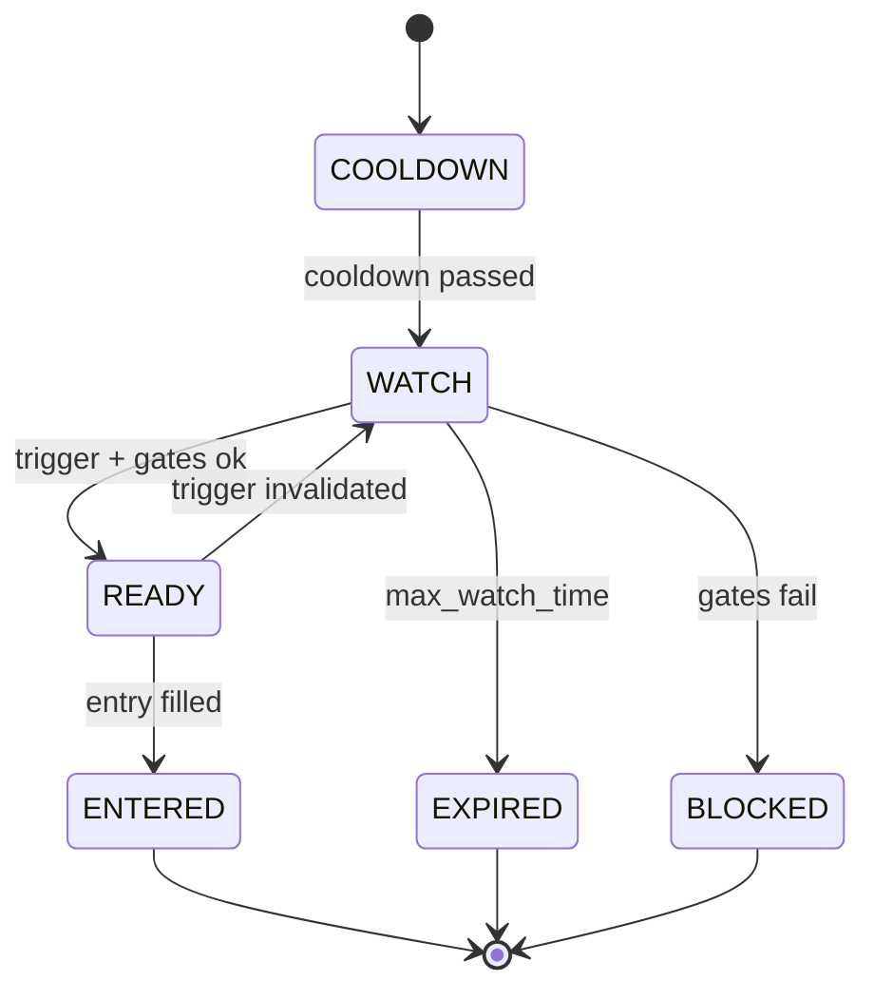
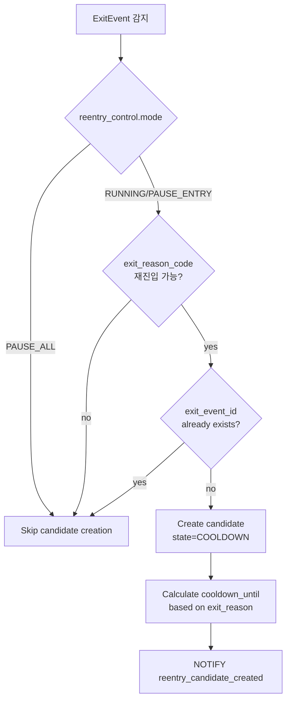

# Reentry Engine 모듈 설계

> 청산 후 재진입 전략

---

## 📐 Runtime Map (이 문서 범위)

```
┌──────────────────────────────────────────────────────────────┐
│                        Quant Runtime                          │
├──────────────────┬───────────────────────┬───────────────────┤
│ PriceSync         │ >>> Reentry Engine<<<│ Execution Service  │
│ (WS/REST/Naver)   │ (Candidates + Gates)  │ (KIS Orders/Fills) │
└─────────┬────────┴──────────┬────────────┴─────────┬─────────┘
          │                   │                      │
          ▼                   ▼                      ▼
  market.prices_best    trade.reentry_*         trade.orders_*
  market.freshness ---> trade.order_intents     trade.fills_*
                         (ENTRY type)
          │                   │                      │
          └───────────────────┴──────────────────────┴──► Monitoring
```

---

## 🎯 모듈 책임 (SSOT)

### 이 모듈이 소유하는 것 (유일한 소유자)

✅ **데이터:**
- `trade.reentry_candidates` - 재진입 후보 FSM
- `trade.reentry_control` - 전역 제어
- `trade.order_intents` (ENTRY 타입) - 재진입 주문 의도

✅ **로직:**
- **ExitEvent 소비** (SSOT 입력)
- Reentry Candidate FSM 전이
- 쿨다운 관리
- 재진입 게이트 (리스크/횟수/신선도)
- 재진입 트리거 판정
- 포지션 사이징
- **Control Gate** (전역 제어 체크)

### 다른 모듈과의 경계

❌ **Reentry Engine이 하지 않는 것:**
- 현재가 결정 → PriceSync
- 청산 로직 → Exit Engine
- **ExitEvent 생성** → Execution (holdings 확정 후)
- 주문 제출 → Execution

❌ **Reentry Engine이 접근하지 않는 것:**
- `market.*` 테이블 쓰기 (읽기만)
- `trade.positions/position_state` 쓰기 (읽기만)
- `trade.exit_events` 쓰기 (읽기만) **← 중요: Execution만 생성**

✅ **Reentry Engine이 읽을 수 있는 것:**
- `market.prices_best` (현재가)
- `market.freshness` (안전 게이트)
- `trade.positions` (포트 익스포저)
- **`trade.exit_events` (재진입 후보 생성 트리거) ← SSOT 입력**

---

## 🔌 Public Interface

### 1. 외부 제공 인터페이스

#### Output: order_intents (재진입 의도)

```sql
INSERT INTO trade.order_intents (
    intent_id,
    candidate_id,
    position_id,    -- NULL (신규 진입)
    symbol,
    intent_type,    -- ENTRY
    qty,
    order_type,     -- MKT | LMT
    limit_price,
    reason_code,    -- REENTRY_REBOUND | REENTRY_BREAKOUT | REENTRY_CHASE
    action_key,     -- {candidate_id}:ENTRY:{n}
    status          -- NEW
) VALUES (...);
```

**계약:**
- `action_key`는 unique (멱등성)
- `intent_type=ENTRY`
- `candidate_id` 필수
- `position_id=NULL` (신규)

### 2. 외부 의존 인터페이스

#### Input: exit_events (Execution에서 생성, SSOT)

```sql
-- Execution이 생성한 ExitEvent 읽기 (재진입 후보 생성 트리거)
SELECT * FROM trade.exit_events
WHERE exit_ts >= now() - INTERVAL '24 hours'
  AND exit_reason_code IN ('SL1', 'SL2', 'TRAIL', 'TP1', 'TP2', 'TP3')
ORDER BY exit_ts DESC;
```

**계약:**
- ExitEvent는 Execution만 생성 (holdings qty=0 확인 후)
- `exit_event_id`는 unique (멱등성 보장)
- `exit_reason_code`로 재진입 전략 분기
- `source` 필드로 자동/수동/브로커 구분

---

## 📊 데이터 모델

### trade.reentry_candidates (FSM)

| 컬럼 | 타입 | 제약 | 설명 |
|------|------|------|------|
| candidate_id | UUID | PK | 후보 고유 ID |
| exit_event_id | UUID | UNIQUE, FK | ExitEvent 참조 (SSOT) |
| symbol | TEXT | NOT NULL | 종목 코드 |
| origin_position_id | UUID | NOT NULL | 원 포지션 ID |
| exit_reason_code | TEXT | NOT NULL | SL1/SL2/TRAIL/TP/TIME |
| exit_ts | TIMESTAMPTZ | NOT NULL | 청산 시각 |
| exit_price | NUMERIC | NOT NULL | 청산 가격 |
| exit_profile_id | TEXT | NULL | 적용된 Exit 프로파일 |
| cooldown_until | TIMESTAMPTZ | NOT NULL | 쿨다운 종료 시각 |
| state | TEXT | NOT NULL | FSM 상태 |
| max_reentries | INT | NOT NULL | 최대 재진입 횟수 |
| reentry_count | INT | NOT NULL | 현재 재진입 횟수 |
| reentry_profile_id | TEXT | NULL | 재진입 프로파일 |
| last_eval_ts | TIMESTAMPTZ | NULL | 마지막 평가 시각 |
| updated_ts | TIMESTAMPTZ | NOT NULL | 마지막 갱신 |

**멱등성 보장:**
- `exit_event_id` UNIQUE 제약으로 동일 ExitEvent에서 중복 후보 생성 방지

### trade.reentry_control (전역 제어)

| 컬럼 | 타입 | 제약 | 설명 |
|------|------|------|------|
| id | INT | PK, CHECK(id=1) | 단일 행 보장 |
| mode | TEXT | NOT NULL | RUNNING / PAUSE_ENTRY / PAUSE_ALL |
| reason | TEXT | NULL | 제어 사유 |
| updated_by | TEXT | NOT NULL | 변경자 |
| updated_ts | TIMESTAMPTZ | NOT NULL | 변경 시각 |

**제어 모드:**

| Mode | Candidate 생성 | ENTRY Intent 생성 | 설명 |
|------|----------------|-------------------|------|
| RUNNING | ✅ Allowed | ✅ Allowed | 정상 작동 |
| PAUSE_ENTRY | ✅ Allowed | ❌ Blocked | Candidate 추적만 (진입 차단) |
| PAUSE_ALL | ❌ Blocked | ❌ Blocked | 완전 정지 (긴급) |

**FSM 상태:**



---

## 🔄 처리 흐름

### 0. Candidate 생성 (ExitEvent 기반)



**트리거:**
- PostgreSQL LISTEN/NOTIFY on `exit_event_created` 채널
- 또는 주기적 폴링 (fallback)

### 1. 평가 루프 (Control Gate 포함)

```mermaid
flowchart TD
    START[Start Evaluation Cycle] --> GATE1[Load reentry_control.mode]
    GATE1 --> GATE2{mode == PAUSE_ALL?}
    GATE2 -->|yes| SKIP[Skip all processing]
    GATE2 -->|no| LOAD[Load candidates<br/>state IN (COOLDOWN,WATCH,READY)]

    LOAD --> LOOP[For each candidate]
    LOOP --> B{cooldown passed?}
    B -->|no| C[Skip]
    B -->|yes| D[Gate 1: reentry limit]
    D -->|fail| E[state=BLOCKED]
    D -->|pass| F[Gate 2: risk exposure]
    F -->|fail| E
    F -->|pass| G[Gate 3: price fresh]
    G -->|fail| E
    G -->|pass| H{Trigger satisfied?}
    H -->|no| I[state=WATCH]
    H -->|yes| J{reentry_control.mode<br/>== PAUSE_ENTRY?}
    J -->|yes| WATCH[state=READY<br/>but no intent]
    J -->|no| READY[state=READY]
    READY --> K[Create ENTRY intent]
```

### 2. 재진입 게이트 (Risk Gates)

| Gate | 조건 | 실패 시 |
|------|------|--------|
| **G1** | cooldown 통과 | COOLDOWN 유지 |
| **G2** | symbol 재진입 횟수 < max | BLOCKED |
| **G3** | portfolio 익스포저 < 한도 | BLOCKED |
| **G4** | 일 손실 < 한도 | BLOCKED |
| **G5** | price freshness OK | BLOCKED |

### 3. 재진입 트리거 (Exit Reason별)

#### A. SL(손절) 후 Re-buy

**조건:**
- `price >= exit_price * (1 + rebound_pct)`
- 최근 스윙 하이 돌파 (선택)
- 거래대금 최소 기준

**파라미터:**
- rebound_pct = 2% (권장)

#### B. TRAIL 후 Chase

**조건:**
- `price >= prior_hwm` (재돌파)
- 돌파 여유: `ATR * k` 또는 n%

**파라미터:**
- k = 0.5 (ATR 배수)

#### C. TP 후 재진입

**조건:**
- 랭킹/모멘텀 유지
- 변동성 리스크 필터

**권장:** 초기에는 비활성화

### 4. 멱등성 (action_key)

**패턴:**
```
{candidate_id}:ENTRY:1  (1차 재진입)
{candidate_id}:ENTRY:2  (2차 재진입, 허용 시)
```

---

## 🎲 재진입 룰 (예시 설정)

### 쿨다운

| Exit Reason | Cooldown | 설명 |
|-------------|----------|------|
| SL1/SL2 | 30~60분 | 손절 후 충분한 관망 |
| TRAIL | 15~30분 | 트레일 후 짧게 |
| TP | 10~15분 | 익절 후 빠르게 |

### 횟수 제한

| 기간 | 최대 횟수 |
|------|----------|
| 동일 심볼/일 | 2회 |
| 동일 심볼/주 | 3회 |

### 포지션 사이징

| 회차 | 사이즈 |
|------|--------|
| 1차 재진입 | 원 포지션의 60% |
| 2차 재진입 | 원 포지션의 40% |

---

## 🚨 에러 처리

### 1. 게이트 실패

**증상**: 여러 게이트 중 하나 실패

**대응:**
- state = BLOCKED
- stale_reason 기록
- 알람 (선택)

### 2. 쿨다운 재설정

**증상**: candidate 생성 후 상황 변화

**대응:**
- cooldown_until 재계산 (정책)
- 또는 EXPIRED 처리

---

## 🎛️ Reentry Control (전역 제어)

### 제어 모드 상세

| Mode | 동작 | 사용 시점 |
|------|------|----------|
| **RUNNING** | 정상 작동 | 일반 운영 |
| **PAUSE_ENTRY** | Candidate 생성 O, Intent 생성 X | 단기 시장 불안정 시 관찰만 |
| **PAUSE_ALL** | 모든 작업 정지 | 긴급 상황 또는 시스템 점검 |

### 운영 시나리오

#### 시나리오 1: 시장 급변동 시 재진입 일시 정지

```
상황: VIX 급등, 시장 변동성 과도
조치: mode = PAUSE_ENTRY
효과: 청산된 포지션은 추적하되 신규 재진입은 차단
복구: 변동성 안정 후 mode = RUNNING
```

#### 시나리오 2: 시스템 점검

```
상황: DB 백업, 인프라 점검
조치: mode = PAUSE_ALL
효과: 모든 Reentry 로직 정지
복구: 점검 완료 후 mode = RUNNING
```

#### 시나리오 3: Exit는 정지, Reentry는 작동

```
상황: Exit Engine PAUSE_ALL, 하지만 수동 청산은 발생
효과:
  - Exit Engine: 자동 청산 정지
  - Execution: 수동 청산 시 ExitEvent 생성
  - Reentry Engine: ExitEvent 기반으로 정상 작동
결과: Exit 정지 중에도 수동 청산 후 재진입 가능
```

### API 설계 (예시)

```
GET  /api/v1/reentry/control
  → 현재 제어 상태 조회

POST /api/v1/reentry/control
  Body: {
    "mode": "PAUSE_ENTRY",
    "reason": "High market volatility"
  }
  → 제어 모드 변경

GET  /api/v1/reentry/candidates
  Query: state, symbol, limit
  → Candidate 목록 조회

GET  /api/v1/reentry/candidates/{candidate_id}
  → 특정 Candidate 상세 조회

POST /api/v1/reentry/candidates/{candidate_id}/force-expire
  → Candidate 강제 만료 (관리자 기능)
```

### 실시간 전파 (LISTEN/NOTIFY)

```sql
-- Control 변경 시
NOTIFY reentry_control_changed, '{"mode":"PAUSE_ENTRY","updated_by":"admin"}';

-- ExitEvent 생성 시 (Execution에서)
NOTIFY exit_event_created, '{"exit_event_id":"...","symbol":"..."}';

-- Candidate 생성 시
NOTIFY reentry_candidate_created, '{"candidate_id":"...","symbol":"..."}';
```

**Reentry Engine은 다음 채널을 구독:**
- `exit_event_created` (Candidate 생성 트리거)
- `reentry_control_changed` (즉시 모드 변경 반영)

---

## 🔒 SSOT 규칙 (금지 패턴)

### ❌ 절대 금지

1. **Reentry Engine에서 청산 로직**
   ```
   ❌ Reentry에서 Exit 트리거 판단
   ❌ Reentry에서 position_state 변경

   ✅ candidates만 관리
   ```

2. **Reentry Engine에서 주문 API 직접 호출**
   ```
   ❌ Reentry에서 KIS API 직접 호출

   ✅ order_intents만 생성
   ```

---

## 📊 설계 완료 기준

- [x] FSM 상태 전이 정의
- [x] ExitEvent 기반 입력 정의 (Execution SSOT)
- [x] Reentry Control 전역 제어 정의
- [x] Control Gate 추가 (PAUSE_ENTRY, PAUSE_ALL)
- [x] 재진입 게이트 정의
- [x] 트리거 조건 정의 (Exit Reason별)
- [x] 멱등성 규칙 정의 (exit_event_id UNIQUE)
- [x] 포지션 사이징 정의
- [x] SSOT 규칙 명시
- [x] Exit/Reentry 디커플링 완료

---

**Module Owner**: Reentry Engine
**Dependencies**: PriceSync (읽기), Exit (후보 생성)
**Version**: v14.0.0-design
**Last Updated**: 2026-01-13
