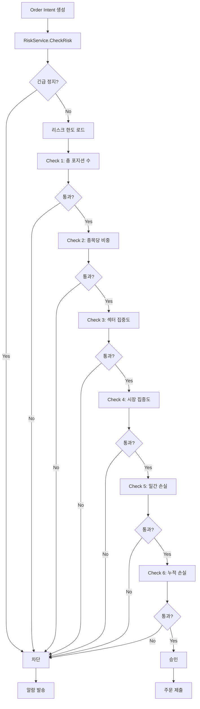
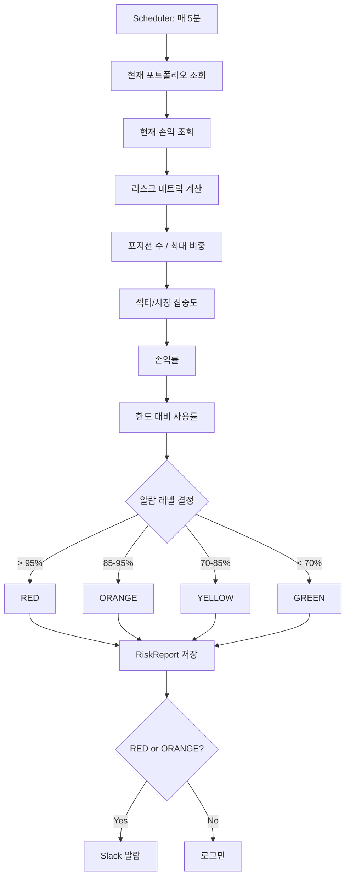

# Risk Management 모듈 설계

> **목적**: 포트폴리오 리스크를 실시간으로 감시하고, 리스크 한도 초과 시 주문을 차단합니다.

**Last Updated**: 2026-01-14

---

## 📋 개요

### 책임 (Responsibility)
- 포지션 한도 검증 (종목당, 전체)
- 손실 한도 검증 (일간, 누적)
- 섹터/시장 집중도 검증
- 주문 승인/거부 결정
- 리스크 현황 모니터링

### 위치 (Location)
```
backend/internal/control/risk/
├── service.go        # 리스크 검증 로직
├── types.go          # 도메인 모델
├── repository.go     # DB 접근
└── handler.go        # HTTP 핸들러
```

### 의존성 (Dependencies)
- `strategy.portfolio` (PortfolioService) - 현재 포트폴리오 조회
- `execution` (ExecutionService) - 주문 정보 조회
- `monitoring` (MonitoringService) - 알람 발송
- `infra.database` (Repository) - 리스크 설정/보고 저장

### v10과의 차이점
| 항목 | v10 | v14 |
|------|-----|-----|
| **검증 시점** | 주문 전 (사전 검증) | 주문 전 (동일) |
| **검증 범위** | 단일 주문 | 단일 주문 + 포트폴리오 전체 |
| **실패 정책** | Fail-Open (경고만) | **Fail-Closed (차단)** |
| **설정 관리** | 하드코딩 | DB 저장 (동적 변경) |
| **복잡도** | 낮음 | 중간 (명확한 한도 체계) |

---

## 🎯 핵심 설계 결정

### 1. Fail-Closed 원칙
```
리스크 한도 초과 시 = 주문 차단

이유:
- 예상치 못한 손실 방지
- 시스템 신뢰성 확보
- 운영 안정성 우선
```

### 2. 리스크 한도 계층
```
Level 1: 종목당 한도 (Single Position Limit)
Level 2: 섹터/시장 한도 (Concentration Limit)
Level 3: 포트폴리오 전체 한도 (Portfolio Limit)
Level 4: 손실 한도 (Loss Limit)

검증 순서: Level 1 → Level 2 → Level 3 → Level 4
하나라도 실패 시 즉시 차단
```

### 3. 손실 한도 (Loss Limit)
```
일간 손실 한도: -3% (전체 자산 대비)
누적 손실 한도: -10% (월간 기준)

근거:
- 일간 -3%: 급격한 시장 변동 대응
- 월간 -10%: 장기 손실 누적 방지
- 한도 도달 시: 신규 진입 차단, 청산은 허용
```

---

## 📐 도메인 모델

### RiskLimits
```go
// RiskLimits 리스크 한도 설정
type RiskLimits struct {
    ID                  uuid.UUID       `json:"id"`
    ProfileName         string          `json:"profile_name"`       // 프로필명 (DEFAULT, CONSERVATIVE, AGGRESSIVE)

    // 포지션 한도
    MaxTotalPositions   int             `json:"max_total_positions"` // 최대 보유 종목 수 (예: 15)
    MaxSingleWeight     float64         `json:"max_single_weight"`   // 종목당 최대 비중 (%) (예: 15%)

    // 집중도 한도
    MaxSectorWeight     float64         `json:"max_sector_weight"`   // 섹터당 최대 비중 (%) (예: 40%)
    MaxMarketWeight     float64         `json:"max_market_weight"`   // 시장당 최대 비중 (%) (예: 100% KOSPI or 30% KOSDAQ)

    // 손실 한도
    MaxDailyLossPct     float64         `json:"max_daily_loss_pct"`  // 일간 최대 손실 (%) (예: -3%)
    MaxTotalLossPct     float64         `json:"max_total_loss_pct"`  // 누적 최대 손실 (%) (예: -10%)

    // 메타
    ActiveFrom          time.Time       `json:"active_from"`
    ActiveTo            *time.Time      `json:"active_to,omitempty"`
    CreatedAt           time.Time       `json:"created_at"`
    UpdatedAt           time.Time       `json:"updated_at"`
}

// 기본 프로필
const (
    DefaultMaxTotalPositions = 15
    DefaultMaxSingleWeight   = 15.0  // 15%
    DefaultMaxSectorWeight   = 40.0  // 40%
    DefaultMaxMarketWeight   = 100.0 // 100%
    DefaultMaxDailyLossPct   = -3.0  // -3%
    DefaultMaxTotalLossPct   = -10.0 // -10%
)
```

### RiskCheckRequest
```go
// RiskCheckRequest 리스크 검증 요청
type RiskCheckRequest struct {
    // 주문 정보
    OrderIntent     OrderIntent     `json:"order_intent"`

    // 현재 포트폴리오
    Portfolio       Portfolio       `json:"portfolio"`

    // 현재 손익
    CurrentPnL      PnLSnapshot     `json:"current_pnl"`
}

// OrderIntent 주문 의도
type OrderIntent struct {
    Symbol          string          `json:"symbol"`
    IntentType      string          `json:"intent_type"`    // ENTRY, EXIT_PARTIAL, EXIT_FULL
    Qty             int64           `json:"qty"`
    EstimatedValue  float64         `json:"estimated_value"` // 예상 주문 금액
}
```

### RiskCheckResult
```go
// RiskCheckResult 리스크 검증 결과
type RiskCheckResult struct {
    Approved        bool                `json:"approved"`           // 승인 여부
    Checks          []RiskCheck         `json:"checks"`             // 개별 검증 결과
    FailedCheck     *RiskCheck          `json:"failed_check,omitempty"` // 실패한 검증 (첫 번째)
    Message         string              `json:"message"`            // 사유 메시지
    CheckedAt       time.Time           `json:"checked_at"`
}

// RiskCheck 개별 리스크 검증
type RiskCheck struct {
    CheckType       RiskCheckType   `json:"check_type"`
    Passed          bool            `json:"passed"`
    CurrentValue    float64         `json:"current_value"`
    LimitValue      float64         `json:"limit_value"`
    Message         string          `json:"message"`
}

// RiskCheckType 리스크 검증 유형
type RiskCheckType string

const (
    CheckTotalPositions     RiskCheckType = "TOTAL_POSITIONS"
    CheckSingleWeight       RiskCheckType = "SINGLE_WEIGHT"
    CheckSectorWeight       RiskCheckType = "SECTOR_WEIGHT"
    CheckMarketWeight       RiskCheckType = "MARKET_WEIGHT"
    CheckDailyLoss          RiskCheckType = "DAILY_LOSS"
    CheckTotalLoss          RiskCheckType = "TOTAL_LOSS"
)
```

### RiskReport
```go
// RiskReport 리스크 현황 보고
type RiskReport struct {
    ID                  uuid.UUID           `json:"id"`
    ReportDate          time.Time           `json:"report_date"`

    // 포지션 현황
    TotalPositions      int                 `json:"total_positions"`
    MaxSingleWeight     float64             `json:"max_single_weight"`     // 최대 종목 비중

    // 집중도 현황
    SectorWeights       map[string]float64  `json:"sector_weights"`        // 섹터별 비중
    MarketWeights       map[string]float64  `json:"market_weights"`        // 시장별 비중

    // 손익 현황
    DailyPnLPct         float64             `json:"daily_pnl_pct"`         // 일간 손익률 (%)
    TotalPnLPct         float64             `json:"total_pnl_pct"`         // 누적 손익률 (%)

    // 한도 대비 사용률
    PositionUsage       float64             `json:"position_usage"`        // 포지션 한도 사용률 (%)
    LossBufferPct       float64             `json:"loss_buffer_pct"`       // 손실 버퍼 (%)

    // 알람 레벨
    AlertLevel          AlertLevel          `json:"alert_level"`

    CreatedAt           time.Time           `json:"created_at"`
}

// AlertLevel 알람 레벨
type AlertLevel string

const (
    AlertLevelGreen     AlertLevel = "GREEN"    // 정상 (< 70% 사용률)
    AlertLevelYellow    AlertLevel = "YELLOW"   // 주의 (70-85%)
    AlertLevelOrange    AlertLevel = "ORANGE"   // 경고 (85-95%)
    AlertLevelRed       AlertLevel = "RED"      // 위험 (> 95%)
)
```

---

## 🔧 Service Layer

### RiskService Interface
```go
// RiskService 리스크 관리 서비스
type RiskService interface {
    // CheckRisk 주문 리스크 검증
    CheckRisk(ctx context.Context, req RiskCheckRequest) (RiskCheckResult, error)

    // GetCurrentLimits 현재 활성 리스크 한도 조회
    GetCurrentLimits(ctx context.Context) (RiskLimits, error)

    // UpdateLimits 리스크 한도 업데이트 (운영자)
    UpdateLimits(ctx context.Context, limits RiskLimits) error

    // GetRiskReport 리스크 현황 보고서 생성
    GetRiskReport(ctx context.Context) (RiskReport, error)

    // IsEmergencyStop 긴급 정지 상태 확인
    IsEmergencyStop(ctx context.Context) (bool, error)

    // SetEmergencyStop 긴급 정지 설정 (수동)
    SetEmergencyStop(ctx context.Context, enabled bool, reason string) error
}
```

### 구현 예시
```go
type riskService struct {
    limitsRepo      RiskLimitsRepository
    portfolioSvc    PortfolioService
    executionSvc    ExecutionService
    monitor         MonitoringService
}

// CheckRisk 리스크 검증
func (s *riskService) CheckRisk(ctx context.Context, req RiskCheckRequest) (RiskCheckResult, error) {
    // 1. 긴급 정지 확인
    if emergencyStop, _ := s.IsEmergencyStop(ctx); emergencyStop {
        return RiskCheckResult{
            Approved: false,
            Message:  "Emergency stop activated - all new orders blocked",
        }, nil
    }

    // 2. 현재 리스크 한도 로드
    limits, err := s.GetCurrentLimits(ctx)
    if err != nil {
        return RiskCheckResult{Approved: false}, fmt.Errorf("load limits: %w", err)
    }

    // 3. 개별 검증 실행
    checks := []RiskCheck{}

    // Check 1: 총 포지션 수
    check := s.checkTotalPositions(req, limits)
    checks = append(checks, check)
    if !check.Passed {
        return s.failResult(checks, check), nil
    }

    // Check 2: 종목당 비중
    check = s.checkSingleWeight(req, limits)
    checks = append(checks, check)
    if !check.Passed {
        return s.failResult(checks, check), nil
    }

    // Check 3: 섹터 집중도
    check = s.checkSectorWeight(req, limits)
    checks = append(checks, check)
    if !check.Passed {
        return s.failResult(checks, check), nil
    }

    // Check 4: 시장 집중도
    check = s.checkMarketWeight(req, limits)
    checks = append(checks, check)
    if !check.Passed {
        return s.failResult(checks, check), nil
    }

    // Check 5: 일간 손실 한도
    check = s.checkDailyLoss(req, limits)
    checks = append(checks, check)
    if !check.Passed {
        return s.failResult(checks, check), nil
    }

    // Check 6: 누적 손실 한도
    check = s.checkTotalLoss(req, limits)
    checks = append(checks, check)
    if !check.Passed {
        return s.failResult(checks, check), nil
    }

    // 모든 검증 통과
    return RiskCheckResult{
        Approved:  true,
        Checks:    checks,
        Message:   "All risk checks passed",
        CheckedAt: time.Now(),
    }, nil
}

// checkTotalPositions 총 포지션 수 검증
func (s *riskService) checkTotalPositions(req RiskCheckRequest, limits RiskLimits) RiskCheck {
    currentPositions := len(req.Portfolio.Holdings)

    // EXIT는 포지션 수를 줄이므로 통과
    if req.OrderIntent.IntentType == "EXIT_FULL" || req.OrderIntent.IntentType == "EXIT_PARTIAL" {
        return RiskCheck{
            CheckType:    CheckTotalPositions,
            Passed:       true,
            CurrentValue: float64(currentPositions),
            LimitValue:   float64(limits.MaxTotalPositions),
            Message:      "Exit order - position count check skipped",
        }
    }

    // ENTRY: 새 종목인 경우 포지션 수 증가
    isNewPosition := !s.hasPosition(req.Portfolio, req.OrderIntent.Symbol)
    futurePositions := currentPositions
    if isNewPosition {
        futurePositions++
    }

    passed := futurePositions <= limits.MaxTotalPositions
    message := fmt.Sprintf("Position count: %d/%d", futurePositions, limits.MaxTotalPositions)
    if !passed {
        message = fmt.Sprintf("Exceeds max positions: %d > %d", futurePositions, limits.MaxTotalPositions)
    }

    return RiskCheck{
        CheckType:    CheckTotalPositions,
        Passed:       passed,
        CurrentValue: float64(futurePositions),
        LimitValue:   float64(limits.MaxTotalPositions),
        Message:      message,
    }
}

// checkSingleWeight 종목당 비중 검증
func (s *riskService) checkSingleWeight(req RiskCheckRequest, limits RiskLimits) RiskCheck {
    // 포트폴리오 총 가치
    totalValue := s.calculateTotalValue(req.Portfolio)

    // 주문 후 해당 종목의 예상 비중
    existingValue := s.getPositionValue(req.Portfolio, req.OrderIntent.Symbol)
    futureValue := existingValue

    if req.OrderIntent.IntentType == "ENTRY" {
        futureValue += req.OrderIntent.EstimatedValue
    } else if req.OrderIntent.IntentType == "EXIT_FULL" {
        futureValue = 0
    } else if req.OrderIntent.IntentType == "EXIT_PARTIAL" {
        futureValue -= req.OrderIntent.EstimatedValue
    }

    futureWeight := (futureValue / totalValue) * 100
    passed := futureWeight <= limits.MaxSingleWeight

    message := fmt.Sprintf("Position weight: %.2f%%/%.2f%%", futureWeight, limits.MaxSingleWeight)
    if !passed {
        message = fmt.Sprintf("Exceeds max single weight: %.2f%% > %.2f%%", futureWeight, limits.MaxSingleWeight)
    }

    return RiskCheck{
        CheckType:    CheckSingleWeight,
        Passed:       passed,
        CurrentValue: futureWeight,
        LimitValue:   limits.MaxSingleWeight,
        Message:      message,
    }
}

// checkDailyLoss 일간 손실 한도 검증
func (s *riskService) checkDailyLoss(req RiskCheckRequest, limits RiskLimits) RiskCheck {
    dailyPnLPct := req.CurrentPnL.DailyPnLPct

    // ENTRY만 차단 (EXIT는 손실 확정이므로 허용)
    if req.OrderIntent.IntentType != "ENTRY" {
        return RiskCheck{
            CheckType:    CheckDailyLoss,
            Passed:       true,
            CurrentValue: dailyPnLPct,
            LimitValue:   limits.MaxDailyLossPct,
            Message:      "Exit order - daily loss check skipped",
        }
    }

    passed := dailyPnLPct >= limits.MaxDailyLossPct
    message := fmt.Sprintf("Daily P&L: %.2f%%/%.2f%%", dailyPnLPct, limits.MaxDailyLossPct)
    if !passed {
        message = fmt.Sprintf("Daily loss limit exceeded: %.2f%% < %.2f%%", dailyPnLPct, limits.MaxDailyLossPct)
    }

    return RiskCheck{
        CheckType:    CheckDailyLoss,
        Passed:       passed,
        CurrentValue: dailyPnLPct,
        LimitValue:   limits.MaxDailyLossPct,
        Message:      message,
    }
}

// failResult 실패 결과 생성
func (s *riskService) failResult(checks []RiskCheck, failedCheck RiskCheck) RiskCheckResult {
    return RiskCheckResult{
        Approved:    false,
        Checks:      checks,
        FailedCheck: &failedCheck,
        Message:     fmt.Sprintf("Risk check failed: %s - %s", failedCheck.CheckType, failedCheck.Message),
        CheckedAt:   time.Now(),
    }
}
```

---

## 🔄 처리 흐름

### 1. 주문 리스크 검증 흐름


### 2. 리스크 보고서 생성 흐름


---

## 🗄️ 데이터베이스 스키마

### control.risk_limits
```sql
CREATE TABLE control.risk_limits (
    id                      UUID PRIMARY KEY DEFAULT gen_random_uuid(),
    profile_name            VARCHAR(50) NOT NULL,

    -- 포지션 한도
    max_total_positions     INTEGER NOT NULL DEFAULT 15,
    max_single_weight       NUMERIC(5,2) NOT NULL DEFAULT 15.00,

    -- 집중도 한도
    max_sector_weight       NUMERIC(5,2) NOT NULL DEFAULT 40.00,
    max_market_weight       NUMERIC(5,2) NOT NULL DEFAULT 100.00,

    -- 손실 한도
    max_daily_loss_pct      NUMERIC(5,2) NOT NULL DEFAULT -3.00,
    max_total_loss_pct      NUMERIC(5,2) NOT NULL DEFAULT -10.00,

    -- 활성 기간
    active_from             TIMESTAMPTZ NOT NULL DEFAULT NOW(),
    active_to               TIMESTAMPTZ,

    -- 메타
    created_at              TIMESTAMPTZ NOT NULL DEFAULT NOW(),
    updated_at              TIMESTAMPTZ NOT NULL DEFAULT NOW(),

    CONSTRAINT chk_single_weight CHECK (max_single_weight > 0 AND max_single_weight <= 100),
    CONSTRAINT chk_sector_weight CHECK (max_sector_weight > 0 AND max_sector_weight <= 100),
    CONSTRAINT chk_market_weight CHECK (max_market_weight > 0 AND max_market_weight <= 100),
    CONSTRAINT chk_daily_loss CHECK (max_daily_loss_pct < 0),
    CONSTRAINT chk_total_loss CHECK (max_total_loss_pct < 0)
);

CREATE INDEX idx_risk_limits_active ON control.risk_limits (active_from, active_to)
    WHERE active_to IS NULL OR active_to > NOW();

COMMENT ON TABLE control.risk_limits IS '리스크 한도 설정';
COMMENT ON COLUMN control.risk_limits.profile_name IS '프로필명 (DEFAULT, CONSERVATIVE, AGGRESSIVE)';
COMMENT ON COLUMN control.risk_limits.max_single_weight IS '종목당 최대 비중 (%)';
COMMENT ON COLUMN control.risk_limits.max_daily_loss_pct IS '일간 최대 손실률 (음수)';
```

### control.risk_reports
```sql
CREATE TABLE control.risk_reports (
    id                      UUID PRIMARY KEY DEFAULT gen_random_uuid(),
    report_date             TIMESTAMPTZ NOT NULL,

    -- 포지션 현황
    total_positions         INTEGER NOT NULL,
    max_single_weight       NUMERIC(5,2) NOT NULL,

    -- 집중도 현황
    sector_weights          JSONB NOT NULL DEFAULT '{}',  -- {"IT": 35.5, "Finance": 25.0}
    market_weights          JSONB NOT NULL DEFAULT '{}',  -- {"KOSPI": 70.0, "KOSDAQ": 30.0}

    -- 손익 현황
    daily_pnl_pct           NUMERIC(8,4) NOT NULL,
    total_pnl_pct           NUMERIC(8,4) NOT NULL,

    -- 한도 대비 사용률
    position_usage          NUMERIC(5,2) NOT NULL,  -- 포지션 수 사용률 (%)
    loss_buffer_pct         NUMERIC(5,2) NOT NULL,  -- 손실 버퍼 (%)

    -- 알람
    alert_level             VARCHAR(20) NOT NULL,   -- GREEN, YELLOW, ORANGE, RED

    created_at              TIMESTAMPTZ NOT NULL DEFAULT NOW(),

    CONSTRAINT chk_alert_level CHECK (alert_level IN ('GREEN', 'YELLOW', 'ORANGE', 'RED'))
);

CREATE INDEX idx_risk_reports_date ON control.risk_reports (report_date DESC);
CREATE INDEX idx_risk_reports_alert ON control.risk_reports (alert_level, report_date DESC)
    WHERE alert_level IN ('ORANGE', 'RED');

COMMENT ON TABLE control.risk_reports IS '리스크 현황 보고서';
COMMENT ON COLUMN control.risk_reports.position_usage IS '포지션 한도 사용률 (%)';
COMMENT ON COLUMN control.risk_reports.loss_buffer_pct IS '손실 한도까지 남은 버퍼 (%)';
```

### control.emergency_stop
```sql
CREATE TABLE control.emergency_stop (
    id                      UUID PRIMARY KEY DEFAULT gen_random_uuid(),
    enabled                 BOOLEAN NOT NULL DEFAULT FALSE,
    reason                  TEXT,
    enabled_at              TIMESTAMPTZ,
    enabled_by              VARCHAR(100),
    disabled_at             TIMESTAMPTZ,
    created_at              TIMESTAMPTZ NOT NULL DEFAULT NOW()
);

-- 최신 1건만 유지 (Singleton)
CREATE UNIQUE INDEX idx_emergency_stop_singleton ON control.emergency_stop ((1));

COMMENT ON TABLE control.emergency_stop IS '긴급 정지 상태 (Singleton)';
COMMENT ON COLUMN control.emergency_stop.enabled IS '긴급 정지 활성화 여부';
```

---

## 🚨 에러 처리

### 1. 리스크 한도 초과
**증상**: 주문이 리스크 한도를 초과함

**대응**:
1. 주문 즉시 차단 (Fail-Closed)
2. Slack 알람 발송 (WARNING)
3. 차단 사유 로그 기록
4. 사용자에게 에러 응답

**예시**:
```json
{
  "error": {
    "code": "RISK_LIMIT_EXCEEDED",
    "message": "Exceeds max single weight: 18.5% > 15.0%",
    "details": {
      "check_type": "SINGLE_WEIGHT",
      "current_value": 18.5,
      "limit_value": 15.0
    }
  }
}
```

### 2. 긴급 정지 활성화
**증상**: Emergency Stop이 활성화됨

**대응**:
1. 모든 신규 주문 차단
2. 기존 포지션 청산은 허용
3. Slack 알람 발송 (CRITICAL)
4. 운영자 개입 대기

### 3. 리스크 한도 설정 오류
**증상**: 리스크 한도 값이 잘못됨 (음수, 범위 초과 등)

**대응**:
1. DB 제약 조건으로 방지 (CHECK)
2. API 입력 검증
3. 기본값(DEFAULT) 사용

---

## 📊 모니터링

### 1. 리스크 메트릭
```promql
# 포지션 수 사용률
risk_position_usage_pct{profile="DEFAULT"} > 85

# 종목당 최대 비중
risk_max_single_weight_pct{profile="DEFAULT"} > 12

# 일간 손익률
risk_daily_pnl_pct{profile="DEFAULT"} < -2

# 손실 버퍼
risk_loss_buffer_pct{profile="DEFAULT"} < 20
```

### 2. 차단 카운터
```promql
# 리스크 차단 건수
rate(risk_checks_rejected_total[5m]) by (check_type)

# 차단 사유별 분포
risk_checks_rejected_total{check_type="SINGLE_WEIGHT"}
risk_checks_rejected_total{check_type="DAILY_LOSS"}
```

### 3. 알람 레벨 분포
```promql
# 알람 레벨 분포
risk_alert_level{level="RED"} == 1
risk_alert_level{level="ORANGE"} == 1
```

### 4. Slack 알람 조건
| 조건 | 알람 레벨 | 메시지 |
|------|----------|--------|
| 포지션 사용률 > 95% | CRITICAL | Position limit almost reached: 14/15 |
| 일간 손실 < -2.5% | WARNING | Daily loss approaching limit: -2.5%/-3.0% |
| 리스크 차단 발생 | WARNING | Risk check rejected: SINGLE_WEIGHT exceeded |
| Emergency Stop 활성화 | CRITICAL | Emergency stop activated: [reason] |

---

## 🧪 테스트 전략

### 1. 단위 테스트
- 각 리스크 검증 함수 (checkTotalPositions, checkSingleWeight 등)
- 한도 계산 로직
- 알람 레벨 결정 로직

### 2. 통합 테스트
- 주문 → 리스크 검증 → 차단 흐름
- 리스크 보고서 생성
- Emergency Stop 동작

### 3. 시나리오 테스트
- 포지션 수 한도 초과 시나리오
- 일간 손실 한도 초과 시나리오
- 섹터 집중도 초과 시나리오
- Emergency Stop 활성화 시나리오

---

## 📋 설계 완료 기준

- [x] 리스크 한도 체계 정의 (4 Levels)
- [x] 도메인 모델 정의 (RiskLimits, RiskCheckResult, RiskReport)
- [x] Service Interface 정의
- [x] 검증 흐름 정의 (Fail-Closed)
- [x] 데이터베이스 스키마 (3 tables)
- [x] 에러 처리 정책
- [x] 모니터링 메트릭

---

## 🔗 관련 문서

- [system-overview.md](../architecture/system-overview.md) - 전체 시스템 아키텍처
- [portfolio.md](./portfolio.md) - Portfolio 모듈 (리스크 검증 대상)
- [execution-service.md](./execution-service.md) - Execution Service (주문 제출)
- [monitoring.md](./monitoring.md) - Monitoring 모듈 (알람 발송)
- [schema.md](../database/schema.md) - 데이터베이스 스키마

---

**Module Owner**: Risk Management
**Dependencies**: Portfolio, Execution, Monitoring
**Version**: v14.0.0-design
**Last Updated**: 2026-01-14
