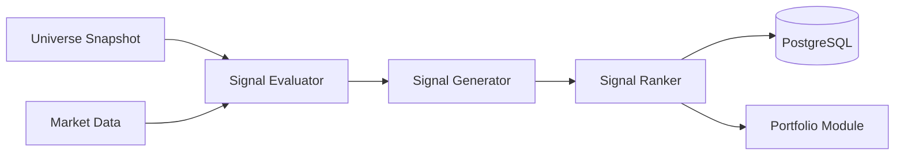

# Signals 모듈 설계

> **작성일**: 2026-01-14
> **버전**: v14.0.0
> **작성자**: Claude (AI Assistant)
> **상태**: ✅ Ready

---

## 개요

Signals 모듈은 **Universe Selection**에서 선정된 종목들을 평가하여 매매 신호를 생성하는 시스템입니다.

### 책임

- Universe 종목에 대한 팩터 기반 평가
- 매매 신호 생성 (BUY, SELL, HOLD)
- 신호 강도 및 신뢰도 계산
- 종목 순위 매기기

### 위치

```
backend/
├── internal/
│   ├── domain/signals/         # Domain Layer
│   │   ├── model.go            # Signal, Factor, Criteria
│   │   ├── repository.go       # 인터페이스
│   │   └── errors.go
│   ├── infrastructure/postgres/signals/  # Infrastructure Layer
│   │   ├── signal_repository.go
│   │   └── factor_repository.go
│   ├── service/signals/        # Service Layer
│   │   ├── service.go          # Orchestration
│   │   ├── evaluator.go        # Factor 평가
│   │   └── ranker.go           # 순위 계산
│   └── api/
│       ├── handlers/signals/   # API Layer
│       │   └── signal_handler.go
│       └── routes/
│           └── signal_routes.go
```

### 의존성

#### Depends On
- **Universe Module**: 분석 대상 종목 목록
- **Market Data**: 가격/거래량 데이터
- **PostgreSQL**: 신호 저장소

#### Depended By
- **Portfolio Module**: 매수/매도 의사결정
- **Risk Management**: 리스크 평가

---

## 데이터 흐름



1. Universe에서 종목 목록 수신
2. 각 종목에 대해 팩터 평가 (Momentum, Quality, Value, Technical)
3. 팩터 점수를 종합하여 Signal 생성
4. 신호 강도 및 신뢰도 계산
5. 순위 매기기 및 저장

---

## Domain Model

### Signal

```go
// Signal 매매 신호
type Signal struct {
    SignalID    uuid.UUID   `json:"signal_id"`
    SnapshotID  string      `json:"snapshot_id"`  // Universe Snapshot ID
    GeneratedAt time.Time   `json:"generated_at"`

    // 종목 정보
    Symbol      string      `json:"symbol"`
    Name        string      `json:"name"`
    Market      string      `json:"market"`       // KOSPI, KOSDAQ

    // 신호
    SignalType  SignalType  `json:"signal_type"`  // BUY, SELL, HOLD
    Strength    int         `json:"strength"`     // 0-100 (신호 강도)
    Conviction  int         `json:"conviction"`   // 0-100 (신뢰도)

    // 팩터 점수
    Factors     SignalBreakdown `json:"factors"`

    // 순위
    Rank        int         `json:"rank"`

    // 근거
    Reasons     []string    `json:"reasons"`      // 신호 생성 근거
}

// SignalType 신호 타입
type SignalType string

const (
    SignalBuy  SignalType = "BUY"
    SignalSell SignalType = "SELL"
    SignalHold SignalType = "HOLD"
)

// SignalBreakdown 팩터별 점수 분해
type SignalBreakdown struct {
    Momentum  FactorScore `json:"momentum"`   // 모멘텀 팩터
    Quality   FactorScore `json:"quality"`    // 품질 팩터
    Value     FactorScore `json:"value"`      // 가치 팩터
    Technical FactorScore `json:"technical"`  // 기술적 팩터
}

// FactorScore 개별 팩터 점수
type FactorScore struct {
    Score      float64  `json:"score"`       // 0-100
    Weight     float64  `json:"weight"`      // 가중치
    Triggered  bool     `json:"triggered"`   // 트리거 여부
    Indicators []string `json:"indicators"`  // 사용된 지표
}
```

### SignalSnapshot

```go
// SignalSnapshot 특정 시점의 전체 신호 스냅샷
type SignalSnapshot struct {
    SnapshotID     string    `json:"snapshot_id"`     // YYYYMMDD-HHMM
    UniverseID     string    `json:"universe_id"`     // 연관 Universe Snapshot
    GeneratedAt    time.Time `json:"generated_at"`

    TotalCount     int       `json:"total_count"`
    BuySignals     []Signal  `json:"buy_signals"`
    SellSignals    []Signal  `json:"sell_signals"`

    // 통계
    Stats          SignalStats `json:"stats"`
}

// SignalStats 신호 통계
type SignalStats struct {
    AvgStrength    float64 `json:"avg_strength"`
    AvgConviction  float64 `json:"avg_conviction"`
    BuyCount       int     `json:"buy_count"`
    SellCount      int     `json:"sell_count"`
    HoldCount      int     `json:"hold_count"`
}
```

### SignalCriteria

```go
// SignalCriteria 신호 생성 기준
type SignalCriteria struct {
    // 팩터 가중치 (합계 1.0)
    MomentumWeight  float64 `json:"momentum_weight"`   // 0.35
    QualityWeight   float64 `json:"quality_weight"`    // 0.25
    ValueWeight     float64 `json:"value_weight"`      // 0.20
    TechnicalWeight float64 `json:"technical_weight"`  // 0.20

    // 신호 임계값
    BuyThreshold    int     `json:"buy_threshold"`     // 65 (65점 이상 BUY)
    SellThreshold   int     `json:"sell_threshold"`    // 35 (35점 이하 SELL)

    // 필터링
    MinConviction   int     `json:"min_conviction"`    // 50 (최소 신뢰도)
    MaxSignals      int     `json:"max_signals"`       // 30 (최대 신호 수)
}

// DefaultSignalCriteria 기본 기준
func DefaultSignalCriteria() *SignalCriteria {
    return &SignalCriteria{
        MomentumWeight:  0.35,
        QualityWeight:   0.25,
        ValueWeight:     0.20,
        TechnicalWeight: 0.20,
        BuyThreshold:    65,
        SellThreshold:   35,
        MinConviction:   50,
        MaxSignals:      30,
    }
}
```

---

## Repository 인터페이스

### SignalRepository

```go
// SignalRepository 신호 저장소
type SignalRepository interface {
    // 스냅샷 저장
    SaveSnapshot(ctx context.Context, snapshot *SignalSnapshot) error

    // 최신 스냅샷 조회
    GetLatestSnapshot(ctx context.Context) (*SignalSnapshot, error)

    // 특정 스냅샷 조회
    GetSnapshotByID(ctx context.Context, snapshotID string) (*SignalSnapshot, error)

    // 스냅샷 목록 (시간 범위)
    ListSnapshots(ctx context.Context, from, to time.Time) ([]*SignalSnapshot, error)

    // 특정 종목의 신호 조회
    GetSignalBySymbol(ctx context.Context, snapshotID, symbol string) (*Signal, error)
}
```

### FactorRepository

```go
// FactorRepository 팩터 데이터 저장소
type FactorRepository interface {
    // 모멘텀 데이터 조회
    GetMomentumFactors(ctx context.Context, symbol string) (*MomentumFactors, error)

    // 품질 데이터 조회
    GetQualityFactors(ctx context.Context, symbol string) (*QualityFactors, error)

    // 가치 데이터 조회
    GetValueFactors(ctx context.Context, symbol string) (*ValueFactors, error)

    // 기술적 지표 조회
    GetTechnicalFactors(ctx context.Context, symbol string) (*TechnicalFactors, error)
}

// MomentumFactors 모멘텀 팩터
type MomentumFactors struct {
    Symbol          string  `json:"symbol"`
    Return5D        float64 `json:"return_5d"`        // 5일 수익률
    Return20D       float64 `json:"return_20d"`       // 20일 수익률
    Return60D       float64 `json:"return_60d"`       // 60일 수익률
    RelativeStrength float64 `json:"relative_strength"` // 상대강도
    VolumeGrowth    float64 `json:"volume_growth"`    // 거래량 증가율
}

// QualityFactors 품질 팩터
type QualityFactors struct {
    Symbol       string  `json:"symbol"`
    ROE          float64 `json:"roe"`           // 자기자본이익률
    ROA          float64 `json:"roa"`           // 총자산이익률
    DebtRatio    float64 `json:"debt_ratio"`    // 부채비율
    CurrentRatio float64 `json:"current_ratio"` // 유동비율
}

// ValueFactors 가치 팩터
type ValueFactors struct {
    Symbol      string  `json:"symbol"`
    PER         float64 `json:"per"`          // 주가수익비율
    PBR         float64 `json:"pbr"`          // 주가순자산비율
    PSR         float64 `json:"psr"`          // 주가매출비율
    DividendYield float64 `json:"dividend_yield"` // 배당수익률
}

// TechnicalFactors 기술적 팩터
type TechnicalFactors struct {
    Symbol       string  `json:"symbol"`
    RSI          float64 `json:"rsi"`           // 상대강도지수
    MACD         float64 `json:"macd"`          // MACD
    MACDSignal   float64 `json:"macd_signal"`   // MACD 시그널
    BollingerPos float64 `json:"bollinger_pos"` // 볼린저밴드 위치 (0-1)
}
```

### UniverseReader

```go
// UniverseReader Universe 데이터 Reader
type UniverseReader interface {
    // 최신 Universe 스냅샷 조회
    GetLatestSnapshot(ctx context.Context) (*universe.UniverseSnapshot, error)

    // 특정 Universe 스냅샷 조회
    GetSnapshot(ctx context.Context, snapshotID string) (*universe.UniverseSnapshot, error)
}
```

---

## Service Layer

### Service 구조

```go
// Service Signals 서비스
type Service struct {
    ctx context.Context

    // Repositories
    signalRepo   signals.SignalRepository
    factorRepo   signals.FactorRepository

    // External readers
    universeReader signals.UniverseReader

    // Config
    criteria     *signals.SignalCriteria

    // Cache
    latestSnapshot *signals.SignalSnapshot
}

// NewService 새 서비스 생성
func NewService(
    ctx context.Context,
    signalRepo signals.SignalRepository,
    factorRepo signals.FactorRepository,
    universeReader signals.UniverseReader,
) *Service {
    return &Service{
        ctx:            ctx,
        signalRepo:     signalRepo,
        factorRepo:     factorRepo,
        universeReader: universeReader,
        criteria:       signals.DefaultSignalCriteria(),
    }
}
```

### 주요 메서드

```go
// Start 서비스 시작
func (s *Service) Start() error {
    log.Info().Msg("Starting Signals service")

    // Load latest snapshot on startup
    snapshot, err := s.signalRepo.GetLatestSnapshot(s.ctx)
    if err != nil {
        log.Warn().Err(err).Msg("No existing snapshot")
    } else {
        s.latestSnapshot = snapshot
        log.Info().
            Str("snapshot_id", snapshot.SnapshotID).
            Int("total_count", snapshot.TotalCount).
            Msg("Loaded latest signal snapshot")
    }

    // Start background signal generation (1시간 주기)
    go s.signalLoop()

    log.Info().Msg("Signals service started")
    return nil
}

// signalLoop 주기적 신호 생성
func (s *Service) signalLoop() {
    ticker := time.NewTicker(1 * time.Hour)
    defer ticker.Stop()

    for {
        select {
        case <-ticker.C:
            if err := s.GenerateSignals(s.ctx); err != nil {
                log.Error().Err(err).Msg("Failed to generate signals")
            }
        case <-s.ctx.Done():
            log.Info().Msg("Signal loop stopped")
            return
        }
    }
}

// GenerateSignals 신호 생성
func (s *Service) GenerateSignals(ctx context.Context) error {
    log.Info().Msg("Generating signals")

    // 1. Get latest Universe
    universeSnapshot, err := s.universeReader.GetLatestSnapshot(ctx)
    if err != nil {
        return fmt.Errorf("get universe: %w", err)
    }

    // 2. Collect all symbols
    symbols := s.collectSymbols(universeSnapshot)

    // 3. Evaluate each symbol
    signals := make([]signals.Signal, 0, len(symbols))
    for _, symbol := range symbols {
        signal, err := s.evaluateSymbol(ctx, symbol)
        if err != nil {
            log.Warn().Err(err).Str("symbol", symbol).Msg("Failed to evaluate")
            continue
        }
        signals = append(signals, signal)
    }

    // 4. Rank signals
    rankedSignals := s.rankSignals(signals)

    // 5. Filter top signals
    filteredSignals := s.filterSignals(rankedSignals)

    // 6. Build snapshot
    snapshot := s.buildSnapshot(universeSnapshot.SnapshotID, filteredSignals)

    // 7. Save snapshot
    if err := s.signalRepo.SaveSnapshot(ctx, snapshot); err != nil {
        return fmt.Errorf("save snapshot: %w", err)
    }

    // 8. Update cache
    s.latestSnapshot = snapshot

    log.Info().
        Str("snapshot_id", snapshot.SnapshotID).
        Int("total_count", snapshot.TotalCount).
        Int("buy_count", snapshot.Stats.BuyCount).
        Int("sell_count", snapshot.Stats.SellCount).
        Msg("Signals generated")

    return nil
}

// GetLatestSnapshot 최신 스냅샷 조회
func (s *Service) GetLatestSnapshot() (*signals.SignalSnapshot, error) {
    if s.latestSnapshot != nil {
        return s.latestSnapshot, nil
    }
    return s.signalRepo.GetLatestSnapshot(s.ctx)
}

// GetSnapshot 특정 스냅샷 조회
func (s *Service) GetSnapshot(snapshotID string) (*signals.SignalSnapshot, error) {
    return s.signalRepo.GetSnapshotByID(s.ctx, snapshotID)
}

// ListSnapshots 스냅샷 목록
func (s *Service) ListSnapshots(from, to time.Time) ([]*signals.SignalSnapshot, error) {
    return s.signalRepo.ListSnapshots(s.ctx, from, to)
}

// GetSignalBySymbol 특정 종목 신호 조회
func (s *Service) GetSignalBySymbol(snapshotID, symbol string) (*signals.Signal, error) {
    return s.signalRepo.GetSignalBySymbol(s.ctx, snapshotID, symbol)
}
```

---

## Evaluator (팩터 평가)

```go
// evaluateSymbol 종목 평가
func (s *Service) evaluateSymbol(ctx context.Context, symbol string) (signals.Signal, error) {
    // 1. Get factor data
    momentum, err := s.factorRepo.GetMomentumFactors(ctx, symbol)
    if err != nil {
        return signals.Signal{}, fmt.Errorf("get momentum: %w", err)
    }

    quality, err := s.factorRepo.GetQualityFactors(ctx, symbol)
    if err != nil {
        return signals.Signal{}, fmt.Errorf("get quality: %w", err)
    }

    value, err := s.factorRepo.GetValueFactors(ctx, symbol)
    if err != nil {
        return signals.Signal{}, fmt.Errorf("get value: %w", err)
    }

    technical, err := s.factorRepo.GetTechnicalFactors(ctx, symbol)
    if err != nil {
        return signals.Signal{}, fmt.Errorf("get technical: %w", err)
    }

    // 2. Evaluate each factor
    momentumScore := s.evaluateMomentum(momentum)
    qualityScore := s.evaluateQuality(quality)
    valueScore := s.evaluateValue(value)
    technicalScore := s.evaluateTechnical(technical)

    // 3. Calculate total score (weighted sum)
    totalScore :=
        momentumScore.Score * s.criteria.MomentumWeight +
        qualityScore.Score * s.criteria.QualityWeight +
        valueScore.Score * s.criteria.ValueWeight +
        technicalScore.Score * s.criteria.TechnicalWeight

    // 4. Determine signal type
    signalType := s.determineSignalType(totalScore)

    // 5. Calculate conviction
    conviction := s.calculateConviction(momentumScore, qualityScore, valueScore, technicalScore)

    // 6. Generate reasons
    reasons := s.generateReasons(momentumScore, qualityScore, valueScore, technicalScore)

    signal := signals.Signal{
        SignalID:    uuid.New(),
        GeneratedAt: time.Now(),
        Symbol:      symbol,
        SignalType:  signalType,
        Strength:    int(totalScore),
        Conviction:  conviction,
        Factors: signals.SignalBreakdown{
            Momentum:  momentumScore,
            Quality:   qualityScore,
            Value:     valueScore,
            Technical: technicalScore,
        },
        Reasons: reasons,
    }

    return signal, nil
}

// evaluateMomentum 모멘텀 평가
func (s *Service) evaluateMomentum(factors *signals.MomentumFactors) signals.FactorScore {
    score := 0.0
    triggered := false
    indicators := []string{}

    // 5일 수익률 (30% 가중치)
    if factors.Return5D > 0.05 { // 5% 이상
        score += 30.0
        triggered = true
        indicators = append(indicators, "5D_RETURN_HIGH")
    } else if factors.Return5D > 0.02 {
        score += 15.0
        indicators = append(indicators, "5D_RETURN_MID")
    }

    // 20일 수익률 (30% 가중치)
    if factors.Return20D > 0.10 { // 10% 이상
        score += 30.0
        triggered = true
        indicators = append(indicators, "20D_RETURN_HIGH")
    } else if factors.Return20D > 0.05 {
        score += 15.0
        indicators = append(indicators, "20D_RETURN_MID")
    }

    // 상대강도 (20% 가중치)
    if factors.RelativeStrength > 70 {
        score += 20.0
        triggered = true
        indicators = append(indicators, "RS_STRONG")
    } else if factors.RelativeStrength > 50 {
        score += 10.0
        indicators = append(indicators, "RS_MID")
    }

    // 거래량 증가 (20% 가중치)
    if factors.VolumeGrowth > 2.0 { // 2배 이상
        score += 20.0
        triggered = true
        indicators = append(indicators, "VOLUME_SURGE")
    } else if factors.VolumeGrowth > 1.5 {
        score += 10.0
        indicators = append(indicators, "VOLUME_HIGH")
    }

    return signals.FactorScore{
        Score:      score,
        Weight:     s.criteria.MomentumWeight,
        Triggered:  triggered,
        Indicators: indicators,
    }
}

// evaluateQuality 품질 평가
func (s *Service) evaluateQuality(factors *signals.QualityFactors) signals.FactorScore {
    score := 0.0
    triggered := false
    indicators := []string{}

    // ROE (40% 가중치)
    if factors.ROE > 15.0 {
        score += 40.0
        triggered = true
        indicators = append(indicators, "ROE_HIGH")
    } else if factors.ROE > 10.0 {
        score += 20.0
        indicators = append(indicators, "ROE_MID")
    }

    // 부채비율 (30% 가중치)
    if factors.DebtRatio < 50.0 { // 50% 미만
        score += 30.0
        triggered = true
        indicators = append(indicators, "DEBT_LOW")
    } else if factors.DebtRatio < 100.0 {
        score += 15.0
        indicators = append(indicators, "DEBT_MID")
    }

    // 유동비율 (30% 가중치)
    if factors.CurrentRatio > 200.0 { // 200% 이상
        score += 30.0
        triggered = true
        indicators = append(indicators, "LIQUIDITY_HIGH")
    } else if factors.CurrentRatio > 150.0 {
        score += 15.0
        indicators = append(indicators, "LIQUIDITY_MID")
    }

    return signals.FactorScore{
        Score:      score,
        Weight:     s.criteria.QualityWeight,
        Triggered:  triggered,
        Indicators: indicators,
    }
}

// evaluateValue 가치 평가
func (s *Service) evaluateValue(factors *signals.ValueFactors) signals.FactorScore {
    score := 0.0
    triggered := false
    indicators := []string{}

    // PER (50% 가중치)
    if factors.PER > 0 && factors.PER < 10.0 {
        score += 50.0
        triggered = true
        indicators = append(indicators, "PER_UNDERVALUED")
    } else if factors.PER > 0 && factors.PER < 15.0 {
        score += 25.0
        indicators = append(indicators, "PER_FAIR")
    }

    // PBR (30% 가중치)
    if factors.PBR > 0 && factors.PBR < 1.0 {
        score += 30.0
        triggered = true
        indicators = append(indicators, "PBR_UNDERVALUED")
    } else if factors.PBR > 0 && factors.PBR < 1.5 {
        score += 15.0
        indicators = append(indicators, "PBR_FAIR")
    }

    // 배당수익률 (20% 가중치)
    if factors.DividendYield > 3.0 { // 3% 이상
        score += 20.0
        triggered = true
        indicators = append(indicators, "DIVIDEND_HIGH")
    } else if factors.DividendYield > 2.0 {
        score += 10.0
        indicators = append(indicators, "DIVIDEND_MID")
    }

    return signals.FactorScore{
        Score:      score,
        Weight:     s.criteria.ValueWeight,
        Triggered:  triggered,
        Indicators: indicators,
    }
}

// evaluateTechnical 기술적 평가
func (s *Service) evaluateTechnical(factors *signals.TechnicalFactors) signals.FactorScore {
    score := 0.0
    triggered := false
    indicators := []string{}

    // RSI (40% 가중치)
    if factors.RSI < 30 { // 과매도
        score += 40.0
        triggered = true
        indicators = append(indicators, "RSI_OVERSOLD")
    } else if factors.RSI > 70 { // 과매수
        score -= 40.0 // 부정적 신호
        indicators = append(indicators, "RSI_OVERBOUGHT")
    }

    // MACD (40% 가중치)
    if factors.MACD > factors.MACDSignal && factors.MACD > 0 {
        score += 40.0
        triggered = true
        indicators = append(indicators, "MACD_BULLISH")
    } else if factors.MACD < factors.MACDSignal && factors.MACD < 0 {
        score -= 40.0
        indicators = append(indicators, "MACD_BEARISH")
    }

    // 볼린저밴드 위치 (20% 가중치)
    if factors.BollingerPos < 0.2 { // 하단 근접
        score += 20.0
        triggered = true
        indicators = append(indicators, "BB_LOWER")
    } else if factors.BollingerPos > 0.8 { // 상단 근접
        score -= 20.0
        indicators = append(indicators, "BB_UPPER")
    }

    // 점수 클램프 (0-100)
    if score < 0 {
        score = 0
    }
    if score > 100 {
        score = 100
    }

    return signals.FactorScore{
        Score:      score,
        Weight:     s.criteria.TechnicalWeight,
        Triggered:  triggered,
        Indicators: indicators,
    }
}

// determineSignalType 신호 타입 결정
func (s *Service) determineSignalType(totalScore float64) signals.SignalType {
    if totalScore >= float64(s.criteria.BuyThreshold) {
        return signals.SignalBuy
    }
    if totalScore <= float64(s.criteria.SellThreshold) {
        return signals.SignalSell
    }
    return signals.SignalHold
}

// calculateConviction 신뢰도 계산
func (s *Service) calculateConviction(
    momentum, quality, value, technical signals.FactorScore,
) int {
    // 트리거된 팩터 수
    triggered := 0
    if momentum.Triggered {
        triggered++
    }
    if quality.Triggered {
        triggered++
    }
    if value.Triggered {
        triggered++
    }
    if technical.Triggered {
        triggered++
    }

    // 신뢰도 = 트리거된 팩터 수 / 전체 팩터 수 × 100
    conviction := (triggered * 100) / 4

    return conviction
}

// generateReasons 신호 근거 생성
func (s *Service) generateReasons(
    momentum, quality, value, technical signals.FactorScore,
) []string {
    reasons := []string{}

    if momentum.Triggered {
        reasons = append(reasons, fmt.Sprintf("모멘텀 강함 (%.0f점)", momentum.Score))
    }
    if quality.Triggered {
        reasons = append(reasons, fmt.Sprintf("품질 우수 (%.0f점)", quality.Score))
    }
    if value.Triggered {
        reasons = append(reasons, fmt.Sprintf("가치 저평가 (%.0f점)", value.Score))
    }
    if technical.Triggered {
        reasons = append(reasons, fmt.Sprintf("기술적 매수 (%.0f점)", technical.Score))
    }

    return reasons
}
```

---

## Ranker (순위 매기기)

```go
// rankSignals 신호 순위 매기기
func (s *Service) rankSignals(signals []signals.Signal) []signals.Signal {
    // 1. Sort by strength (descending)
    sort.Slice(signals, func(i, j int) bool {
        // 먼저 강도로 정렬
        if signals[i].Strength != signals[j].Strength {
            return signals[i].Strength > signals[j].Strength
        }
        // 강도가 같으면 신뢰도로 정렬
        return signals[i].Conviction > signals[j].Conviction
    })

    // 2. Assign ranks
    for i := range signals {
        signals[i].Rank = i + 1
    }

    return signals
}

// filterSignals 상위 신호만 필터링
func (s *Service) filterSignals(signals []signals.Signal) []signals.Signal {
    filtered := make([]signals.Signal, 0)

    for _, signal := range signals {
        // 신뢰도 필터
        if signal.Conviction < s.criteria.MinConviction {
            continue
        }

        // HOLD 신호 제외
        if signal.SignalType == signals.SignalHold {
            continue
        }

        filtered = append(filtered, signal)

        // 최대 신호 수 제한
        if len(filtered) >= s.criteria.MaxSignals {
            break
        }
    }

    return filtered
}
```

---

## Database Schema

### signals.snapshots

```sql
CREATE TABLE IF NOT EXISTS signals.snapshots (
    snapshot_id      VARCHAR(20) PRIMARY KEY,      -- YYYYMMDD-HHMM
    universe_id      VARCHAR(20) NOT NULL,          -- 연관 Universe ID
    generated_at     TIMESTAMP NOT NULL,

    total_count      INT NOT NULL,
    buy_count        INT NOT NULL,
    sell_count       INT NOT NULL,
    hold_count       INT NOT NULL,

    avg_strength     DECIMAL(5,2),
    avg_conviction   DECIMAL(5,2),

    signals          JSONB NOT NULL,                -- 전체 신호 JSONB

    created_at       TIMESTAMP DEFAULT NOW(),

    CONSTRAINT fk_universe
        FOREIGN KEY (universe_id)
        REFERENCES market.universe_snapshots(snapshot_id)
);

CREATE INDEX idx_signals_snapshots_generated
    ON signals.snapshots(generated_at DESC);

CREATE INDEX idx_signals_snapshots_universe
    ON signals.snapshots(universe_id);
```

### signals.factors

```sql
CREATE TABLE IF NOT EXISTS signals.factors (
    factor_id        UUID PRIMARY KEY DEFAULT gen_random_uuid(),
    symbol           VARCHAR(10) NOT NULL,
    factor_type      VARCHAR(20) NOT NULL,          -- momentum, quality, value, technical
    factor_data      JSONB NOT NULL,
    calculated_at    TIMESTAMP NOT NULL,

    created_at       TIMESTAMP DEFAULT NOW(),
    updated_at       TIMESTAMP DEFAULT NOW(),

    CONSTRAINT uq_symbol_factor_time
        UNIQUE (symbol, factor_type, calculated_at)
);

CREATE INDEX idx_signals_factors_symbol
    ON signals.factors(symbol);

CREATE INDEX idx_signals_factors_type
    ON signals.factors(factor_type);

CREATE INDEX idx_signals_factors_calculated
    ON signals.factors(calculated_at DESC);
```

---

## API Endpoints

### GET /api/v1/signals/latest

최신 신호 스냅샷 조회

**Response** (200 OK):
```json
{
  "snapshot_id": "20260114-1030",
  "universe_id": "20260114-1000",
  "generated_at": "2026-01-14T10:30:00Z",
  "total_count": 30,
  "buy_signals": [
    {
      "signal_id": "uuid",
      "symbol": "005930",
      "name": "삼성전자",
      "signal_type": "BUY",
      "strength": 78,
      "conviction": 75,
      "rank": 1,
      "factors": {
        "momentum": {
          "score": 85,
          "weight": 0.35,
          "triggered": true,
          "indicators": ["5D_RETURN_HIGH", "RS_STRONG"]
        },
        "quality": {
          "score": 70,
          "weight": 0.25,
          "triggered": true,
          "indicators": ["ROE_HIGH", "DEBT_LOW"]
        },
        "value": {
          "score": 60,
          "weight": 0.20,
          "triggered": false,
          "indicators": ["PER_FAIR"]
        },
        "technical": {
          "score": 80,
          "weight": 0.20,
          "triggered": true,
          "indicators": ["MACD_BULLISH", "BB_LOWER"]
        }
      },
      "reasons": [
        "모멘텀 강함 (85점)",
        "품질 우수 (70점)",
        "기술적 매수 (80점)"
      ]
    }
  ],
  "sell_signals": [],
  "stats": {
    "avg_strength": 72.5,
    "avg_conviction": 68.3,
    "buy_count": 25,
    "sell_count": 5,
    "hold_count": 120
  }
}
```

### GET /api/v1/signals/snapshots

스냅샷 목록 조회

**Query Parameters**:
- `from`: 시작 시간 (RFC3339)
- `to`: 종료 시간 (RFC3339)

**Response** (200 OK):
```json
{
  "snapshots": [
    {
      "snapshot_id": "20260114-1030",
      "universe_id": "20260114-1000",
      "generated_at": "2026-01-14T10:30:00Z",
      "total_count": 30,
      "stats": {
        "buy_count": 25,
        "sell_count": 5
      }
    }
  ],
  "count": 1
}
```

### GET /api/v1/signals/snapshots/:snapshotId

특정 스냅샷 조회

**Response**: 최신 스냅샷과 동일

### GET /api/v1/signals/symbols/:symbol

특정 종목의 최신 신호 조회

**Response** (200 OK):
```json
{
  "signal_id": "uuid",
  "snapshot_id": "20260114-1030",
  "symbol": "005930",
  "name": "삼성전자",
  "signal_type": "BUY",
  "strength": 78,
  "conviction": 75,
  "rank": 1,
  "factors": { ... },
  "reasons": [ ... ]
}
```

---

## Error Handling

### 도메인 에러

```go
// ErrSnapshotNotFound 스냅샷 없음
var ErrSnapshotNotFound = errors.New("signal snapshot not found")

// ErrInvalidCriteria 잘못된 기준
var ErrInvalidCriteria = errors.New("invalid signal criteria")

// ErrFactorDataMissing 팩터 데이터 없음
var ErrFactorDataMissing = errors.New("factor data missing")
```

### HTTP 에러 응답

- **404 Not Found**: 스냅샷/신호 없음
- **400 Bad Request**: 잘못된 파라미터
- **500 Internal Server Error**: 서버 에러

---

## v10 대비 개선사항

### 1. 단순화
- v10: Stage 0-7 복잡한 파이프라인 (Data Quality → Regime → Scout → EventRisk → Advisor → Controller → Gate)
- v14: 팩터 기반 신호 생성으로 단순화

### 2. 명확한 팩터 구조
- v10: ScoutCandidate에 Factor[], Conviction, EvidenceCount 혼재
- v14: 4개 팩터(Momentum, Quality, Value, Technical)로 명확히 분리

### 3. 투명한 점수 계산
- v10: AI Thesis, Composite Score, Risk Adjustment 등 복잡한 조정
- v14: 가중 합계 기반 명확한 점수 계산

### 4. 실시간성 개선
- v10: AI 호출로 인한 지연
- v14: 규칙 기반 즉시 계산

---

## 성능 고려사항

### 예상 처리량
- Universe 종목 수: 200-300개
- 신호 생성 시간: 200-300ms (1개당 1ms)
- 배치 처리: 1시간마다
- DB 저장: JSONB 직렬화

### 최적화 포인트

1. **배치 처리**: 팩터 데이터 일괄 조회
2. **캐싱**: 최신 스냅샷 메모리 캐싱
3. **인덱싱**: symbol, generated_at 인덱스
4. **병렬 처리**: 종목별 평가 goroutine 병렬 실행

```go
// 병렬 평가 예시
var wg sync.WaitGroup
signalsChan := make(chan signals.Signal, len(symbols))

for _, symbol := range symbols {
    wg.Add(1)
    go func(sym string) {
        defer wg.Done()
        signal, err := s.evaluateSymbol(ctx, sym)
        if err == nil {
            signalsChan <- signal
        }
    }(symbol)
}

wg.Wait()
close(signalsChan)

// Collect results
signals := make([]signals.Signal, 0)
for signal := range signalsChan {
    signals = append(signals, signal)
}
```

---

## 테스트 전략

### 단위 테스트
- [ ] Factor evaluation (Momentum, Quality, Value, Technical)
- [ ] Signal type determination (BUY/SELL/HOLD)
- [ ] Conviction calculation
- [ ] Ranking logic

### 통합 테스트
- [ ] End-to-end signal generation
- [ ] Repository integration
- [ ] API endpoint responses

### 백테스트
- [ ] Historical signal accuracy
- [ ] Conviction correlation with performance
- [ ] Factor contribution analysis

---

## 마이그레이션 계획

### Phase 1: Schema 생성
```sql
-- 1. signals 스키마 생성
CREATE SCHEMA IF NOT EXISTS signals;

-- 2. snapshots 테이블
CREATE TABLE signals.snapshots (...);

-- 3. factors 테이블
CREATE TABLE signals.factors (...);
```

### Phase 2: Domain & Infrastructure
1. Domain models 구현
2. Repository 구현
3. 단위 테스트

### Phase 3: Service Layer
1. Evaluator 구현
2. Ranker 구현
3. Service 통합
4. 통합 테스트

### Phase 4: API Layer
1. Handlers 구현
2. Routes 등록
3. API 테스트

---

## 참고

- v10: `/Users/wonny/Dev/aegis/v10/backend/internal/brain/`
- v13: (해당 없음)
- 설계 문서: `docs/modules/module-catalog.md`
