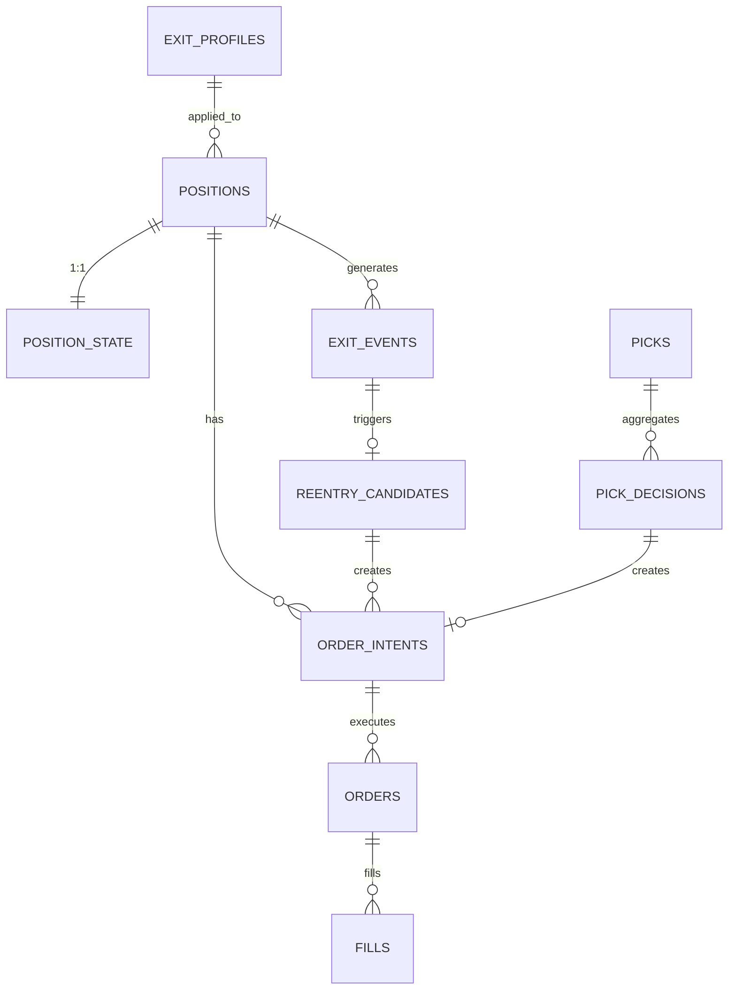

# v14 문서 검토 - SSOT 불일치 및 개선점

> 설계 문서 교차 검증 결과 보고서

**작성일**: 2026-01-13
**검토 범위**: docs/ 폴더 내 9개 완료 문서

---

## 📋 검토 개요

### 검토 문서 목록
1. `architecture/system-overview.md` - 시스템 개요
2. `architecture/pick-to-execution-pipeline.md` - 선정→실행 파이프라인
3. `database/schema.md` - DB 스키마
4. `database/access-control.md` - RBAC 설계
5. `modules/price-sync.md` - PriceSync 모듈
6. `modules/exit-engine.md` - Exit Engine 모듈
7. `modules/reentry-engine.md` - Reentry Engine 모듈
8. `modules/execution-service.md` - Execution Service 모듈
9. `modules/external-apis.md` - 외부 API 연동

---

## 🔴 Critical: SSOT 불일치 (즉시 수정 필요)

### Issue #1: order_intents 쓰기 권한 불일치

**영향 문서**: system-overview.md, schema.md

| 문서 | 정의 |
|------|------|
| system-overview.md (Line 206) | `Strategy 모듈만*` (Router, Exit, Reentry) |
| schema.md (Line 35) | `Exit, Reentry, Router만` |

**문제**: system-overview.md는 "Strategy 모듈"이라고 표현하고 하단에 *로 설명, schema.md는 직접 열거.

**권장 수정**:
- 두 문서 모두 `Exit, Reentry, Router`로 통일
- "Strategy 모듈"이라는 추상화 제거 (혼란 유발)

---

### Issue #2: positions 테이블 소유권 불명확

**영향 문서**: system-overview.md, schema.md, execution-service.md

| 문서 | 정의 |
|------|------|
| system-overview.md (Line 203) | `소유자: Exit, 쓰기 허용: Exit, Execution` |
| schema.md (Line 26) | `소유자: Exit, 쓰기 허용: Exit, Execution` |
| execution-service.md (Line 350-380) | Execution이 qty, avg_price 업데이트 가능 |

**문제**: "소유자"가 Exit인데 Execution도 쓸 수 있다면, 컬럼별 SSOT 분리가 명확해야 함. 현재 어떤 컬럼을 누가 쓸 수 있는지 명시 안됨.

**권장 수정**: schema.md에 컬럼별 소유권 명시

```markdown
| 컬럼 | 쓰기 권한 | 비고 |
|------|----------|------|
| status, exit_mode, exit_profile_id | Exit만 | 전략 상태 |
| qty, avg_price | Execution만 | 체결 동기화 |
| version, updated_ts | 자동 트리거 | - |
```

---

### Issue #3: exit_control 모드 정의 불일치

**영향 문서**: schema.md, exit-engine.md

| 문서 | 모드 목록 |
|------|----------|
| schema.md (Line 361-365) | `RUNNING, PAUSE_PROFIT, PAUSE_ALL, EMERGENCY_FLATTEN` |
| exit-engine.md (Line 1479) | `RUNNING, PAUSE_PROFIT, PAUSE_ALL, EMERGENCY_FLATTEN` |

**상태**: ✅ **일치 확인됨** (초기 분석 오류)

---

### Issue #4: reentry_control 모드 정의 불일치

**영향 문서**: schema.md, reentry-engine.md

| 문서 | 모드 목록 |
|------|----------|
| schema.md (Line 249-254) | `RUNNING, PAUSE_ENTRY, PAUSE_ALL` |
| reentry-engine.md | `RUNNING, PAUSE_ENTRY, PAUSE_ALL` |

**상태**: ✅ 일치 (문제 없음)

---

### Issue #5: ExitEvent 생성 SSOT 확인

**영향 문서**: schema.md, execution-service.md, reentry-engine.md

| 문서 | 정의 |
|------|------|
| schema.md (Line 31, 477-479) | `Execution만` 생성 |
| execution-service.md | Execution이 holdings qty=0 감지 시 생성 |
| reentry-engine.md | ExitEvent 읽기만 (Execution 생성 의존) |

**상태**: ✅ 일치 (SSOT 명확)

---

## 🟡 Warning: 누락 또는 불완전한 정의

### Issue #6: Router의 SSOT 소유권이 system-overview.md에 미반영

**영향 문서**: system-overview.md, pick-to-execution-pipeline.md

**문제**:
- pick-to-execution-pipeline.md에서 Router가 `trade.picks`, `trade.pick_decisions` 소유로 정의
- system-overview.md의 "데이터 소유권" 섹션에 Router 테이블 누락

**권장 수정**: system-overview.md에 Router 소유 테이블 추가

```markdown
### Trade Schema (Strategy/Execution/Router 공유)

| 테이블 | 소유자 | 읽기 허용 | 쓰기 허용 |
|--------|--------|----------|----------|
| `trade.picks` | Router | 전체 | Router만 |
| `trade.pick_decisions` | Router | 전체 | Router만 |
```

---

### Issue #7: access-control.md에 aegis_router 역할 정의 누락

**영향 문서**: database/access-control.md

**상태**: ✅ **이미 정의됨** (Line 146-192)
- `aegis_router` 역할이 완전히 정의되어 있음
- picks, pick_decisions, order_intents(ENTRY) 쓰기 권한 보유

---

### Issue #8: PriceSync REST Tier 정의 불일치

**영향 문서**: system-overview.md, price-sync.md

| 문서 | Tier0 주기 | Tier1 주기 | Tier2 주기 |
|------|-----------|-----------|-----------|
| system-overview.md | 1~3초 | 5~10초 | 30~120초 |
| price-sync.md | 1~3초 | 5~10초 | 30~120초 |

**상태**: ✅ 일치 (문제 없음)

---

### Issue #9: external-apis.md KIS WS 소유자 정의

**영향 문서**: external-apis.md

| API | 문서 정의 |
|-----|----------|
| KIS WS | `소유자: PriceSync, Execution` |
| KIS REST | `소유자: Execution, PriceSync` |

**문제**: KIS WS를 Execution이 소유한다고 하는데, 실제 체결 통보(H0STCNI9)는 Execution이 받아야 함.
그러나 price-sync.md에서는 PriceSync만 KIS WS 관리하는 것처럼 설명.

**권장 수정**:
- KIS WS 시세(H0STCNT0): PriceSync 소유
- KIS WS 체결(H0STCNI9): Execution 소유
- 명확히 분리하여 문서화

---

### Issue #10: Execution Bootstrap 복구 시 ExitEvent 생성 조건

**영향 문서**: execution-service.md

**상태**: ✅ **이미 정의됨** (Line 837-845)

**Exit Reason 결정 로직 (완전)**:

| 조건 | exit_reason_code | source | intent_id |
|------|------------------|--------|-----------|
| EXIT intent 있음 | intent.reason_code 사용 | AUTO_EXIT | intent.intent_id |
| EXIT intent 없음, 수동 청산 | MANUAL | MANUAL | NULL |
| EXIT intent 없음, 브로커 강제청산 | BROKER | BROKER | NULL |
| 판단 불가 | UNKNOWN | UNKNOWN | NULL |

---

## 🟢 Minor: 개선 제안사항

### Issue #11: ERD 다이어그램 불완전

**영향 문서**: schema.md (Line 696-707)

**문제**: ERD에서 주요 테이블 관계만 표시, 다음 관계 누락:
- `exit_events` ↔ `reentry_candidates`
- `picks` ↔ `pick_decisions`
- `exit_profiles` ↔ `positions`
- `exit_control`, `reentry_control` (단일 row)

**권장 수정**: ERD 확장



---

### Issue #12: Execution Service fills 중복 방지 메커니즘 미정의

**영향 문서**: execution-service.md

**문제**: fills 테이블에 중복 체결 방지를 위한 UNIQUE 제약이 명시되지 않음.

**권장 수정**: schema.md에 fills 테이블 UNIQUE 제약 추가

```sql
CREATE UNIQUE INDEX uq_fills_order_ts_qty ON trade.fills (order_id, ts, qty);
```

또는 KIS 체결번호(CNTG_NO) 저장하고 해당 필드에 UNIQUE 제약.

---

### Issue #13: Control Gate 모드 전환 감사 로그 미정의

**영향 문서**: exit-engine.md, reentry-engine.md

**문제**: exit_control, reentry_control 모드 변경 시 감사 로그 테이블 미정의.
`updated_by`, `reason` 필드는 있으나 히스토리 보관 없음.

**권장 수정**:
- 옵션 A: control 테이블에 트리거로 히스토리 테이블 자동 기록
- 옵션 B: 현재 구조 유지하되, 모드 변경 시 별도 audit_log 테이블에 기록

---

### Issue #14: action_key 컨벤션 일관성

**영향 문서**: schema.md (Line 609-641)

| 트리거 | 현재 정의 | 문제 |
|--------|----------|------|
| Exit | `{position_id}:SL1` | OK |
| Reentry | `{candidate_id}:ENTRY:1` | OK |
| Router | `ENTRY:{date}:{symbol}:{producer}:{run_id}` | 형식 다름 |

**문제**: Router의 action_key만 형식이 다름 (prefix가 `ENTRY:` vs `{id}:`)

**권장 수정**: 통일된 형식 제안

```markdown
| 트리거 | action_key | 예시 |
|--------|-----------|------|
| Exit | `EXIT:{position_id}:{reason}` | `EXIT:uuid-123:SL1` |
| Reentry | `REENTRY:{candidate_id}:{n}` | `REENTRY:uuid-456:1` |
| Router | `PICK:{decision_id}` | `PICK:uuid-789` |
```

---

### Issue #15: Price Freshness 임계값 미통일

**영향 문서**: price-sync.md, exit-engine.md

| 문서 | stale 임계값 |
|------|-------------|
| price-sync.md | 명확히 정의 (Tier별 다름) |
| exit-engine.md | "stale이면 보수적 처리" 언급만 |

**권장 수정**: exit-engine.md에 stale 판단 기준 명시

```markdown
### Stale Price 판단
- freshness_ms > 10,000ms (10초): Warning
- freshness_ms > 30,000ms (30초): Stale → 청산 정책 적용
- is_stale = true: 즉시 청산 정책 적용
```

---

## 📊 요약

### ✅ 수정 완료: 3건
1. ✅ order_intents 쓰기 권한 표현 통일 (system-overview.md)
2. ✅ positions 컬럼별 소유권 명시 (schema.md)
3. ✅ KIS WS 소유 분리 명확화 (external-apis.md)

### ✅ 이미 올바름 (초기 분석 오류): 4건
3. ✅ exit_control 모드 정의 (schema.md = exit-engine.md)
4. ✅ reentry_control 모드 정의 (schema.md = reentry-engine.md)
5. ✅ ExitEvent 생성 SSOT (Execution만, 일치)
7. ✅ access-control.md aegis_router 역할 (이미 정의됨)
8. ✅ PriceSync REST Tier 정의 (일치)
10. ✅ Bootstrap ExitEvent exit_reason_code 로직 (이미 정의됨)

### 🟡 Minor (개선 권장): 5건
11. 💡 ERD 불완전 (주요 관계 누락)
12. 💡 fills 중복 방지 제약 미정의
13. 💡 Control Gate 감사 로그 미정의
14. 💡 action_key 형식 불통일
15. 💡 stale 임계값 미통일

---

## ✅ 완료된 수정 내역 (2026-01-13)

### Phase 1: SSOT Critical Issues

#### 1. system-overview.md (Line 206-210)
- `order_intents` 쓰기 권한을 "Exit, Reentry, Router"로 명시적 열거
- Router 소유 테이블 추가 (`picks`, `pick_decisions`)

#### 2. access-control.md (Line 217-230, 294-303)
- `positions` 테이블 컬럼별 UPDATE 권한 분리
  - aegis_trade: status, exit_mode, exit_profile_id만 UPDATE
  - aegis_exec: qty, avg_price, updated_ts만 UPDATE
- DELETE 권한 제거 (aegis_trade, aegis_router)
- 테스트 케이스 수정 (컬럼별 권한 검증)

#### 3. schema.md (Line 154-166)
- `positions` 테이블에 컬럼별 소유권 섹션 추가
- Exit vs Execution 경계 명확화

#### 4. schema.md (Line 206-222)
- `position_state.cooldown_until` 제거
- Reentry가 `reentry_candidates.cooldown_until`만 사용

#### 5. exit-engine.md (Line 208-214)
- "위반 예시"에 reentry_candidates, exit_events 생성 금지 추가
- Exit ↔ Reentry 완전 분리 강화

### Phase 2: 문서화 개선

#### 6. external-apis.md (Line 30-40)
- KIS WS TR별 소유권 분리 테이블 추가
- H0STCNT0(시세) → PriceSync
- H0STCNI9(체결) → Execution

#### 7. architecture-improvements.md (신규 작성)
- P0 ~ P2 우선순위별 개선점 정리
- Locked Qty 계산, NOTIFY/LISTEN, Morning Rush Mode 등

---

## 🔄 향후 개선 권장 (Minor)

### Phase 3: Minor 개선 (설계 완료 전)
1. schema.md - ERD 확장 (exit_events ↔ reentry_candidates, picks ↔ pick_decisions)
2. schema.md - fills UNIQUE 제약 추가 (중복 방지)
3. exit-engine.md / reentry-engine.md - Control Gate 히스토리 테이블 추가
4. schema.md - action_key 형식 통일 검토
5. exit-engine.md - stale 임계값 명시

---

**Version**: v14.0.0-review-updated
**Initial Review**: 2026-01-13 (Opus)
**Updates Applied**: 2026-01-13 (Sonnet)
**Status**: ✅ 실제 이슈 3건 수정 완료, 7건 검증 완료 (이미 올바름)
